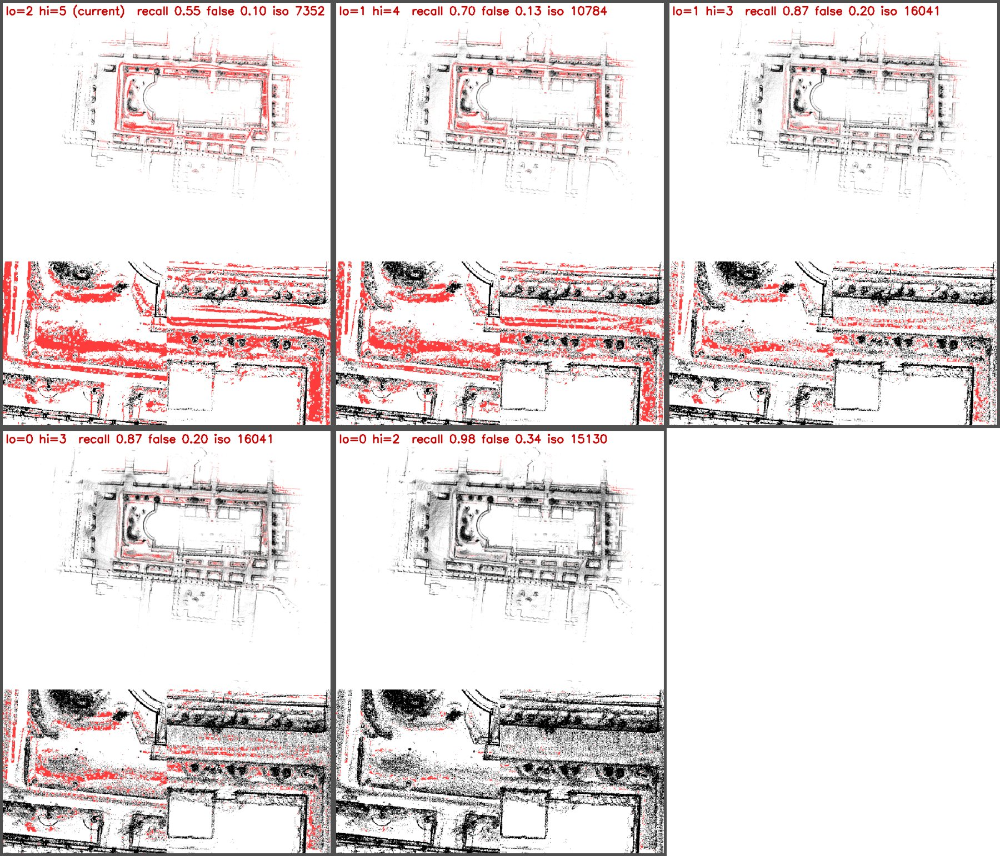
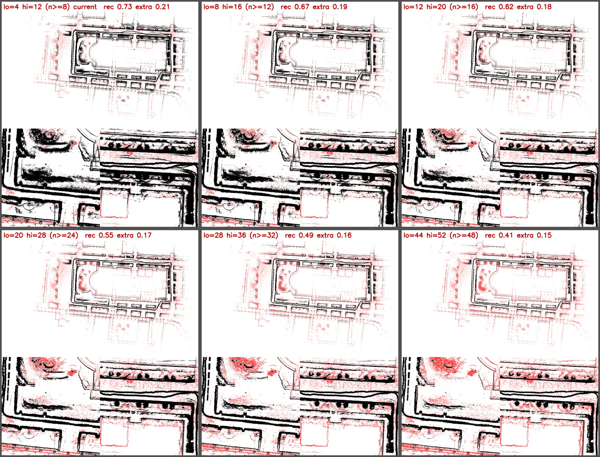
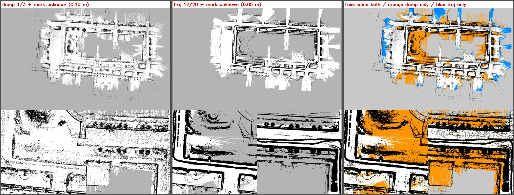
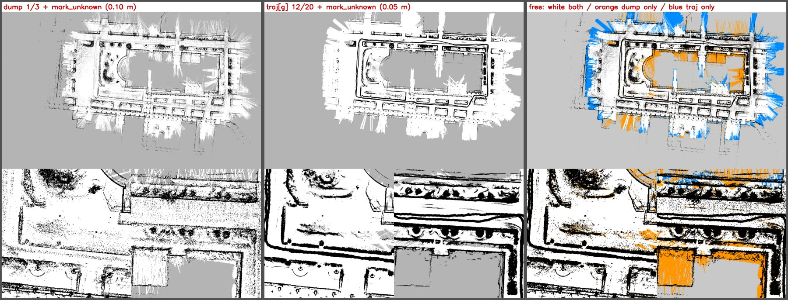
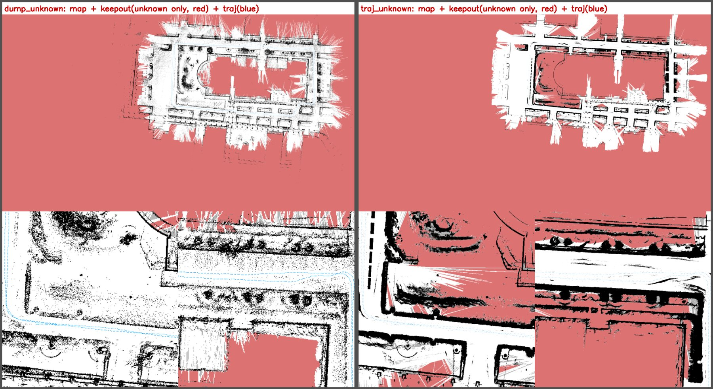

<!-- claude: 2026-10-02 作成 -->
# 2D 地図のしきい値比較・未観測マーク・keepout 生成 (2026-10-02)

対象: 5号館 `bags/raw/2026-09-180915_5goukan` + `bags/glim/2026-09-180915_5goukan_dump/filtered`。
元データ・スクリプトは git 管理外の `bags/exp/2026-10-02_dumpbase_threshold_sweep/`
(`sweep.py` / `sweep_traj.py` / `compare_unknown.py`)。

## 0. 既存地図の元設定 (再生成で画素 100% 一致を確認)

| 地図 | ツール | 設定 |
|---|---|---|
| dumpbase (`maps/2d/glim/2026-09-180915_dumpbase/nav2/map_base.pgm`) | glim_dump_to_2dmap | `-r 0.1` 3200×2048, sensor 帯 −0.25〜+0.95, しきい値 2/5 |
| traj 版 (`maps/2d/glim/2026-09-180915/nav2/map.pgm`) | glim_traj_to_2dmap | `-r 0.05` 5696×3392, ground 帯 0.3〜1.5, `--range_max 30 --deskew`, 4/12 |

2 つの帯はほぼ同じ。dump の sensor 帯の基準は **submap 原点の z** で、LiDAR の高さではない。dump の点から直接測った床は原点基準で中央値 −0.65 m (submap ごとに −0.79〜−0.43、10〜90%) なので、dumpbase の帯は**地上 ≈0.40〜1.60 m** (submap ごとに ±0.2 m 程度ぶれる)。traj 版 (地上 0.30〜1.50 m) との差は約 0.1 m。−0.25〜+0.95 は README の例 (08-14 旧車体で床 + 0.3〜1.5) と同じ値。
(当初、traj 側の LiDAR 基準の床 −0.81 m で換算して「地上 0.56〜1.76 m で traj 版より 0.26 m 高い」と誤認した。下の `traj[g]` はその誤認に基づいて作った版。)

## 1. しきい値 (濃さ) の比較

画素値 = 255 − 255·(n − lo)/(hi − lo) (n = 画素内の点数)。点数は整数なので、占有になるかどうかは「何点以上で黒くなるか」の段階でしか変わらない。

dump 版。灰黒は地図本体、赤は「traj 版 (4/12) では占有なのに dump 版で取りこぼした所」。**1/3 (2 点以上で占有)** で、traj 版の壁を拾えた率が 0.55 → 0.87、誤検出は 0.10 → 0.20。0/2 (1 点以上) まで下げると道路面がゴマ塩になる。

traj 版。赤は「dump 版 1/3 では占有なのに traj 版に無い所」(道路上の赤は dump 版のノイズなので、traj 版に無いのはむしろ正常)。**12/20 (16 点以上)** で占有面積は 2449 → 1809 m² に減り、壁・縁石・幹は残って、芝や植え込み内部の塗りが消える。24 点以上で樹冠が欠け始める。

## 2. 未観測マーク (`--mark_unknown`)

各センサ位置から方位 0.5° ごとに「帯内の最近点 (障害物)」と「全点の最遠点」の手前までを空きとして扇形を塗り、どこからも見えていない画素を灰 180 (map_server で unknown) にする。traj 版はスキャンごとの実姿勢を、dump 版は submap 内のスキャン姿勢 (10 個に 1 個) を視点にする近似。

右端の差分図は、白 = 両方で空き / 橙 = dump 版だけ空き / 青 = traj 版だけ空き。上は traj 版の元の帯 (地上 0.30〜1.50)、下の `traj[g]` は地上 0.56〜1.76 (dumpbase より高い帯。0 節の誤認に基づく版)。両方で空きの面積は 5,944 m² (上) / 7,669 m² (下)、dump 版だけ空きは 3,361 / 1,636 m²。traj 版の帯を上げると、低い植え込みで光線が止まらなくなり、dump 版の空きに近づく。ただし dump 版の帯はむしろ上に近いので、**食い違いの主因は帯の差ではなく、dump 版の近似 (0.3 m 間引きで歯抜けになった植え込み・壁を光線がすり抜ける、視点のずれ) とみられる** (未検証)。建物の区画が橙になるのも同じ理由とみられる。

## 3. keepout マスク (`tools/map_to_keepout`)

keepout = 未観測 − 1 m² 未満の未観測の塊 − 走行軌跡から 0.4 m 以内。壁は入れない (static_layer + inflation が担う。keepout の致命セルには inflation が付かない)。出力は `maps/2d/glim/2026-09-180915_{dump,traj}_unknown/{nav2,keep_out}/`。

赤が keepout、青が走行軌跡。traj 版は元の帯 (地上 0.30〜1.50、12/20) で作っている。通れる面積は dump 版 11,766 m²、traj 版 9,952 m²。

**走路が壁として焼き付く問題**: 元の traj 版では軌跡上の 94% が占有だった (dumpbase 2/5 では 2.8%、dump 版 1/3 では 23%、GIMP 手直し後はどちらも ≈0%)。センサ座標で見ると、真後ろ 1.5〜1.75 m・幅 0.4 m に約 6 割のスキャンで帯内の点があり、**ロボットの後ろを歩く操作者**と推定している (代替仮説: 車体に付随して動く別の物体。映像などでの確認はしていない)。`map_to_keepout --clean_map` は軌跡から 0.4 m 以内の壁・未観測を本体地図でも白に戻す。

## 未検証・注意

- AMCL・planner での優劣は検証していない (単発の再生は乱数で揺れるので、`tools/amcl_compare` で反復評価する)。
- 操作者が横を歩いた区間では、跡が軌跡 0.4 m の外に残る可能性がある。
- 本体地図の濃淡の灰 (lo〜hi 点) は map_server では不明扱いになる。`allow_unknown: false` にするとそこも通れなくなるので、未観測の禁止は keepout 側で行っている。
