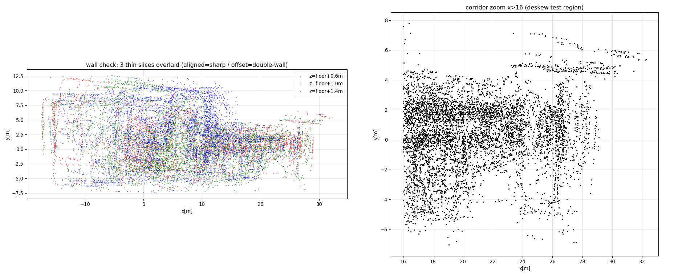
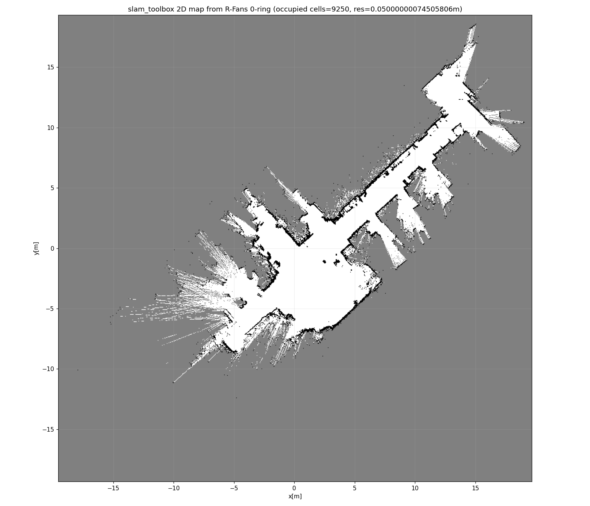
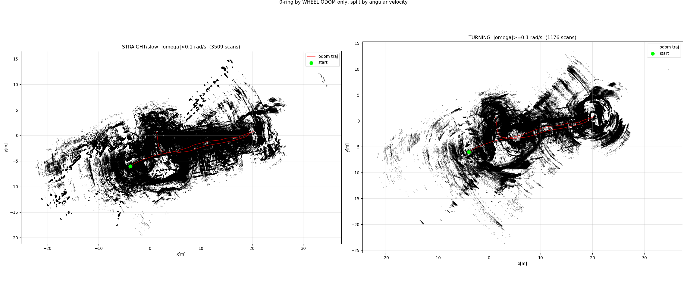
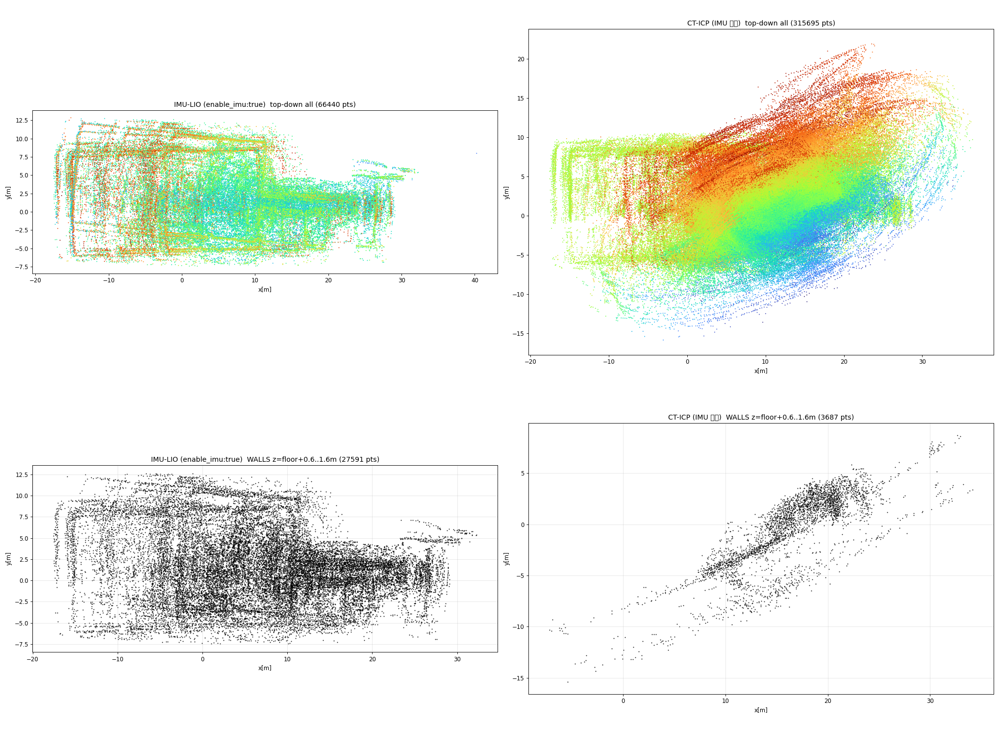
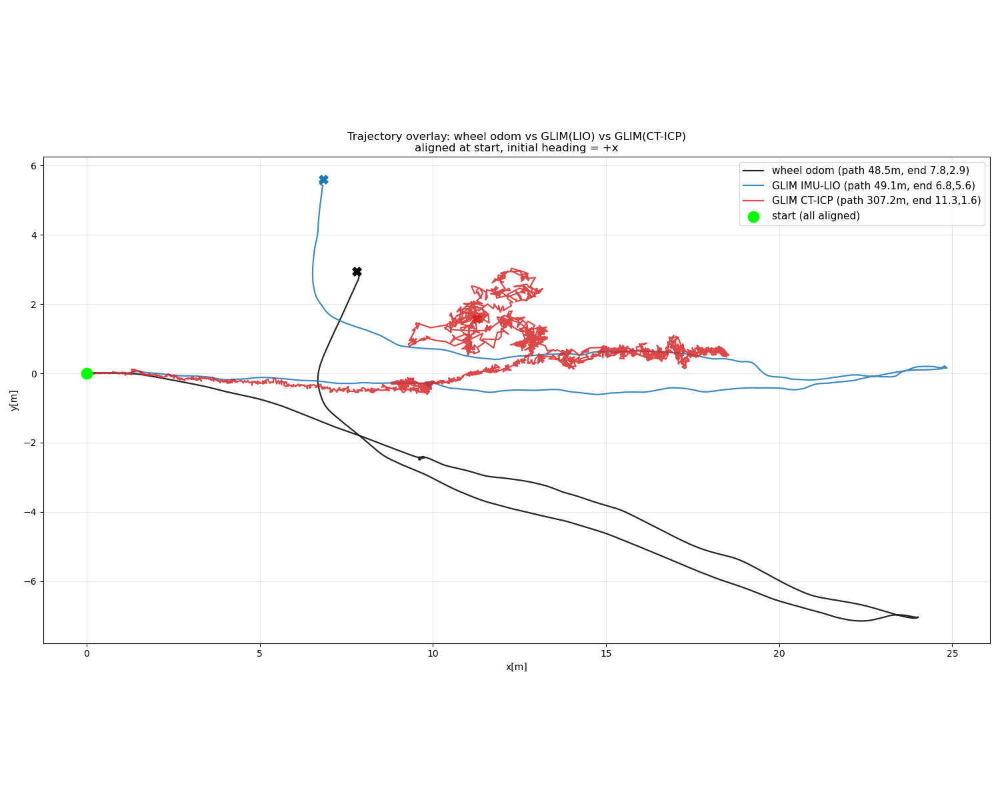

<!-- claude: 調査記録。2026-08-12 セッション。GLIM 3D+IMU の水平ドリフト原因切り分け。 -->
# GLIM (3D+IMU) の水平ドリフト — 原因切り分けと対策候補

- **ステータス: 調査完了・根本原因を特定 / 対策候補 3 (パラメータ調整) を 2026-08-13 に 2 ラウンド実験済み — 塗れ −34.5% の推奨設定 E11 を提示 (`2026-08-13_glim_param_tuning.md`)。根治は未達**
- 発覚: 2026-08-12 (9 号館 235 s bag `bags/9goukan/3d_imu/2026-08-12` の GLIM 評価中)
- 関連: PROJECT_STATE タイムライン 08-11 (GLIM LIO 切替) / 08-12 (5)〜(4)、
  `docs/text/timestamp/`(タイムスタンプ読本)、`docs/issue/2026-08-01_odometry_stop_wobble_zero_stamp_pairing.md`(車輪 odom stamp)

## 症状

GLIM を IMU あり LIO 構成 (`config_odometry_cpu` + `enable_imu:true`) で 9 号館の bag に
かけると、3D 地図が**水平方向に塗れる** — 壁が厚さ数 m の帯になり、廊下の内部が点で
埋まる。垂直方向 (床) は平ら (傾き 0.1°) で健全。



## 調査手法と結果

原因を「GLIM より上流 (R-Fans データ + 車輪 odom)」と「3D 固有 (IMU 経路 / deskew /
縮退)」のどちらかに切り分けるため、**今日の bag だけでオフライン**に段階検証した。

### 1. R-Fans 水平データは健全 (2D SLAM で証明)

`/sdk_could` の水平リング (laserid 7 = 仰角 −1°、+対称の 8) を抽出して LaserScan 化し、
slam_toolbox で 2D SLAM → **壁がシャープに閉じたきれいな地図**。占有 9,250 セル。
⇒ R-Fans の水平スキャン幾何・時刻整合は SLAM に足る品質。



odom prior を「車輪 yaw」から「IMU yaw」に替えても 2D 地図は同等 (占有 9,395)。
slam_toolbox は prior 選択に頑健で、データ品質の結論は変わらない。

### 2. デッドレコニング積み上げは判定に使えない (手法の限界)

0°リングを車輪 odom / IMU yaw で無補正に積むと、姿勢源に関わらず渦状に塗れる。
時刻オフセット掃引でも改善しない。**開ループ積分はスキャンマッチング補正が無く、
データ品質を判定できない**ことを確認 (下図は車輪 odom 版)。回転時 (その場旋回) が
最悪化するのは、車輪オドメトリがその場回転でタイヤをスクラブして yaw が狂うため
(GLIM は車輪 odom を使わないので GLIM とは別件)。



### 3. IMU なし GLIM (CT-ICP) は LIO より悪化 → IMU 経路は無罪

同じ bag を CT-ICP (`config_odometry_ct` + `enable_imu:false`) で実行して比較:



- **IMU-LIO (左)**: 床は平ら・矩形を保つ・水平は塗れる。
- **CT-ICP (右)**: z が対角に大きく傾き (pitch ドリフト=重力基準喪失)、壁が対角に
  流れて矩形が崩壊 = **より悪い**。

⇒ 事前仮説「T_lidar_imu 外部パラメータ / IMU プリインテグレーションが主犯」は**棄却**。
IMU を外すと悪化する = IMU は重力・姿勢を有益に支えている (T_lidar_imu も致命的には
狂っていない)。

### 4. 軌跡の重ね比較 — LIO は距離正確、CT-ICP はフロントエンド破綻

車輪 odom / GLIM-LIO / GLIM-CT の軌跡を開始点=原点・初期進行方向=+x で揃えて重ねた:



- **車輪 odom**: path 48.5 m (滑らかだが向きはスクラブで曲がる疑い)。
- **GLIM IMU-LIO**: path **49.1 m** — 車輪と 1% 差で**走行距離は正確**。滑らか。
- **GLIM CT-ICP**: path **307 m** — 実距離の 6 倍のジッタ。LiDAR 単独フロントエンドが
  この環境 (特徴の少ない廊下) で破綻している。

## 結論 (根本原因)

```
なぜ 2D は解けて GLIM(LIO) は塗れるのか
├── 2D slam_toolbox = スキャンマッチング + 【車輪オドメトリ】prior + 3 自由度
│   └── 廊下で縮退する「前進方向」を車輪が直接アンカー → きれいに解ける
└── GLIM(LIO) = スキャンマッチング + IMU、【車輪 odom 不使用】、6 自由度
    └── IMU は向き・重力は支えるが「廊下をどれだけ進んだか」は測れない
        → 特徴の少ない環境で残差ドリフト (パスが重ならず壁が塗れる)
        走行距離自体は 1% 精度で正確 = 破綻ではなく「moderate な残差ドリフト」
```

主犯は **GLIM(LIO) が車輪オドメトリを使わないこと × 環境の特徴の乏しさ (縮退寄り)**。
R-Fans データ品質・T_lidar_imu・deskew・IMU 経路はいずれも無罪。CT-ICP の破綻は
「IMU が必須」であることの裏付け。

## 対策候補 (効果順)

1. **GLIM に車輪オドメトリを融合する** (最有力)。前進方向を直接拘束でき、縮退に最も効く。
   ⚠️ **GLIM 標準 ROS ノード (glim_ros2) は odom を publish するだけで購読しない** →
   config 一発では不可。拡張モジュールか C++ API 実装が必要
   (`config_global_mapping_pose_graph.json` に `odom_factor_stddev` はあるが topic 入力
   経路は未確認)。中規模の実装タスク。
2. **撮り直しで再評価** (追加実装ゼロで最速)。特徴の多い場所・低速・その場 360° 旋回
   なし・ループ有りで録り、良環境で GLIM を再評価。良ければ「廊下が縮退環境だった」で
   確定し、運用は「良環境で地図化 / 廊下は車輪 odom 融合」に。
   → **同環境 (9 号館) での取り直しでは改善せず** (2026-08-13 ユーザ報告)。
   「特徴の多い別環境 (屋外)」での評価は未実施。
3. GLIM の縮退・グローバル最適化パラメータ調整 (submap 数・ループ検出閾値など)。
   → **2026-08-13 に 2 ラウンド掃引実験済み** (`2026-08-13_glim_param_tuning.md`)。
   推奨 E11 = 分解能の屋内スケール化 (ivox 0.5 + downsample 0.5 + global voxel 0.25)
   + submap 内部最適化 ON + 照合サンプル率 0.5 で**水平塗れ −34.5%**・path 長は
   車輪 odom と一致。マルチ解像度 voxelmap・明示ループ検出・点数増し系は効果なし/悪化。
   残差ドリフトは残るため根治ではない。
4. **R-Fans の斜め置き (tilted mount, ロール方向 20〜45°)** — 2026-08-13 発案・未検証。
   水平置きだと 16 ビームの横縞 (間隔 ≈ 距離×tan2°) を直進中なぞり続けるだけで
   縞間の壁が埋まらないが、斜め置きは移動が実質の首振りになり面が埋まる
   (プッシュブルーム原理)。**壁面カバー率向上と同時に、斜めリングが天井梁・床目地など
   進行方向と交差する構造を毎スキャン拾うため、along-track 縮退と z 沈みの両方に
   効く可能性がある**。代償: 前方最大レンジ減 (実害小: アンカーは近傍構造)・
   水平リング抽出診断 (laserid 7/8 → 2D SLAM) が不可に・**URDF rfans 姿勢 +
   `T_lidar_imu` の再計算必須**。検証手順: 治具で ~30° 傾け → URDF/config 更新 →
   同じ 9 号館廊下で bag 取得 → E11/E12 設定 + 同じ解析パイプライン (occ30cm) で
   水平置きと直接比較。Nav2 の /scan は UTM-30LX 担当なので運用影響なし。

## 生成物 (すべて git 管理外の作業ディレクトリ、本 doc の画像は docs にコピー済み)

- 2D SLAM 地図: `maps/rfans2d_slam.png` / `maps/rfans2d_slam_imuyaw.png`
- GLIM 地図比較: `bags/9goukan/3d_imu/_glim_lio_vs_cticp.png`
- 軌跡重ね: `maps/traj_overlay.png`
- GLIM 点群: `bags/9goukan/3d_imu/2026-08-12_glim_map.ply` (LIO) /
  `2026-08-12_cticp_map.ply` (CT-ICP)
- 解析スクリプト: セッション scratchpad (ring_probe / odom_accum / offset_sweep /
  hybrid_accum / pc2scan / imu_odom_tf / mapgrab / compare_maps / traj_overlay)

## 再現メモ (2D SLAM オフライン)

main で `ros2 bag play <bag> --clock` + PointCloud2→LaserScan 変換ノード
(laserid 7/8 → /scan, frame=rfans) + `static_transform_publisher base_link→rfans`、
slamtoolbox コンテナで `async_slam_toolbox_node` を lifecycle configure/activate、
全ノード `use_sim_time:=true`。⚠️ `bags/` は root 所有でホスト Write 不可 →
スクリプトは `docker exec -i … python3 -` か `docker cp` 経由。
