<!-- claude: 実験記録。2026-08-13 セッション。GLIM 水平ドリフトへのパラメータ掃引。 -->
# GLIM パラメータ掃引実験 — 水平ドリフト対策候補 3 の検証

- **ステータス: 実験完了 (2 ラウンド・計 12 run) / 推奨 = E11 (塗れ −34.5%)。repo config は未変更 — 反映はユーザ判断**
- 実施: 2026-08-13 (9 号館 235 s bag `bags/9goukan/3d_imu/2026-08-12` でオフライン)
- 親 issue: `docs/issue/2026-08-12_glim_horizontal_drift.md` (対策候補 3「パラメータ調整」の実行)

## 目的

車輪 odom 融合 (候補 1) は実装コストが高く、撮り直し (候補 2) は同環境では改善しなかった。
残る候補 3 = GLIM のパラメータ調整で、**屋外向け既定値のままの分解能系パラメータを
屋内廊下向けに 1 要素ずつ変えて効果を定量化**する。

## ベースラインの記録

実験開始時点の config 一式 (= git `3f82cf0` の `ros2_ws_glim/config/`) を
`img/2026-08-13_glim_param_tuning/config_baseline/` にスナップショット保存した。
実験はコンテナ内 `/tmp/exp/EN/config` に生成した変異 config を `glim_rosbag` の
`config_path` に渡す方式で、**リポジトリの config は一切変更していない**。

## 手法

- 実行: glim コンテナ内で `ros2 run glim_ros glim_rosbag <bag> --ros-args -p config_path:=<変異config> -p auto_quit:=true -p dump_path:=<out> -p playback_speed:=1.0`
  (viewer 系 extension は全 run 無効 = headless。負荷配慮で直列・`nice -n 10`・`num_threads: 2` 維持)
- 評価: dump の submap (`points_compact.bin` = float32 xyz) を `T_world_origin` で
  world 変換して地図を再構成し、床 +0.3〜1.5 m の水平スライスで指標を計算
- **主指標 `occ30cm`**: スライスの 0.3 m 格子トップビュー占有セル数。submap 点群は
  0.3 m 格子間引き済みなので、シャープな壁 = 線状に少なく、塗れた壁 = 帯状に多くなる。
  少ないほど良い。(5 cm 占有は点数にほぼ比例してしまい単独では使えない — 補助指標)
- パイプライン検証: 08-12 の online dump を同スクリプトで再構成し、issue の
  「復路が y+2 m ずれた水平塗れ」(occ30cm=4,723) を再現できることを確認済み

## 実験マトリクスと結果

変更は累積 (E4/E5 は最良だった E2 をベースに分岐)。

| Run | 変更内容 | occ30cm ↓ | occ5cm ↓ | path [m] | 床σ [cm] | 判定 |
|-----|---------|-----------|----------|----------|----------|------|
| E0 | ベースライン (現行 config) | 4,397 | 13,376 | 51.05 | 5.7 | 基準。水平塗れ再現 |
| E1 | preprocess: `downsample_resolution` 1.0→**0.5**, `distance_far_thresh` 100→**50** | 4,031 | 12,833 | 50.94 | 5.7 | 小幅改善 (−8%) |
| E2 | E1 + odometry: `ivox_resolution` 1.0→**0.5**, `ivox_min_dist` 0.1→**0.05** | **3,460** | **8,973** | **48.70** | 5.7 | **最良 (−21%)。path が車輪 odom (48.5 m) と一致** |
| E3 | E2 + global: `submap_voxelmap_levels` 1→3 | 3,773 | 10,492 | 48.71 | 5.6 | **悪化**。粗レベルの対応が壁をぼかす |
| E4 | E2 の preprocess を 0.5→0.25 に深掘り | 4,392 | 10,646 | 48.71 | 5.6 | **悪化**。0.5 が最適点 |
| E5 | E2 + global を pose_graph (明示ループ検出, `min_travel_dist` 10) に切替 | 3,429 | 9,169 | 48.67 | 5.7 | E2 と同等。**ループ検出は 1 件も発火せず** |

参考: 08-12 online run (同じベースライン config) = occ30cm 4,723。E0 との差 ~7% は
online/offline の実行差で、症状・指標とも整合。

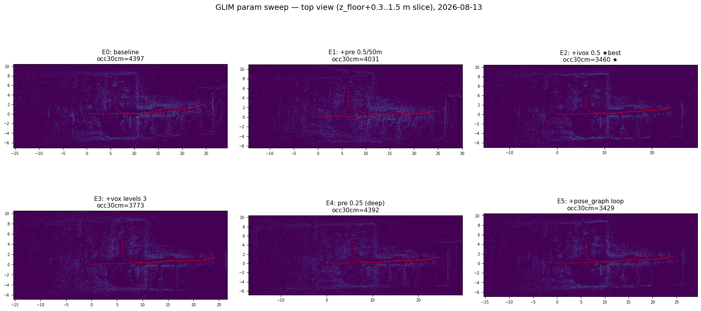

E0 (左上) では復路 (赤線) が奥で y+2 m ずれて壁が二重化しているのに対し、
E2 (右上 ★) では往路・復路がほぼ重なり壁の帯が細くなっている。

| E0 (ベースライン) | E2 (推奨) |
|---|---|
| 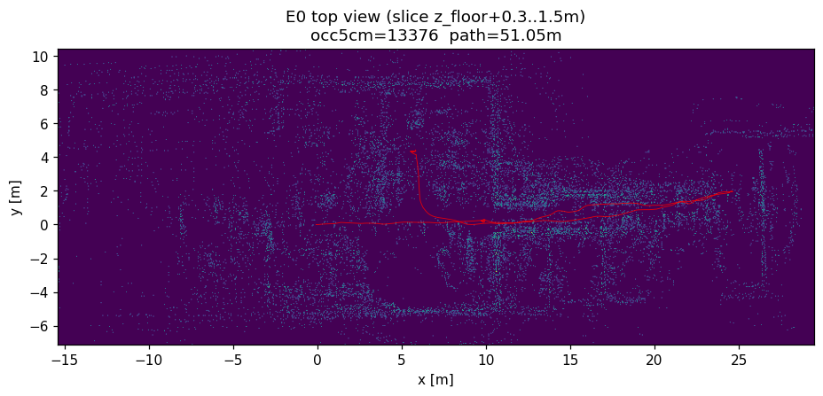 | 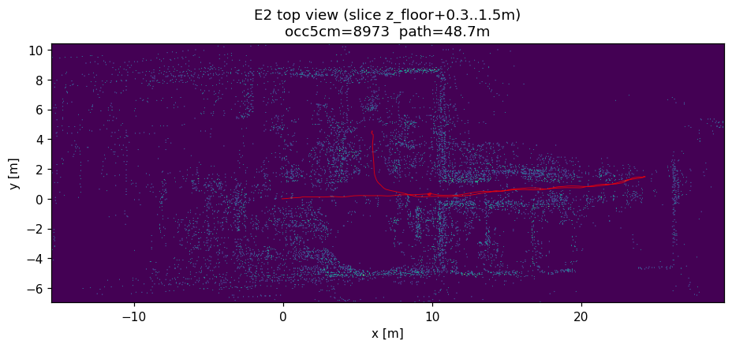 |

床は全 run で健全 (σ ≈ 5.6〜5.7 cm、E2 サイドビュー:
`img/2026-08-13_glim_param_tuning/E2_side.png`)。

## 結論

```
何が効いたか (occ30cm 基準)
├── ◎ ivox_resolution 1.0→0.5 + ivox_min_dist 0.1→0.05 (E2, 寄与最大)
│   └── 対応点探索の格子が屋内スケールになり、廊下の乏しい特徴
│       (ドア枠・柱) を正しく掴めるようになった → ドリフト自体が減少
├── ○ downsample_resolution 1.0→0.5 + far_thresh 50 (E1, 小幅)
│   └── 入力点群の形状情報が保たれ、上記の下地になる
├── × downsample 0.25 への深掘り (E4)
│   └── 細かすぎ。10,000 点の割当が近距離に偏り、遠方の壁アンカーが薄くなる
├── × submap_voxelmap_levels 3 (E3)
│   └── 粗い解像度レベルの対応が「引き戻し」でなく「ぼかし」に働いた
└── × pose_graph 明示ループ検出 (E5)
    └── submap 3 個 / 直線往復ではループ候補の幾何条件を満たさず不発
```

- 第 1 ラウンドの結論 = **E2** (塗れ −21%)。→ **第 2 ラウンド (下記) で E11 = E2 + 組み立て側 3 変更が −34.5% に更新**。
- ただし**縮退由来の残差ドリフトは残る** (壁の二重化が完全には消えない)。
  廊下環境での根治は依然として親 issue の候補 1 (車輪 odom 融合) か
  「特徴の多い環境 (屋外) で使う」の運用回避。E2/E11 はその前提を変えない改善。

## 第 2 ラウンド — 全パラメータの再帰監査から追加候補を掃引 (E6〜E11)

`docs/text/glim/04_parameters.md` (全 15 config の全キー棚卸し) を土台に、未検証で
メカニズム的に効きうるパラメータを監査 → **E2 をベースに 1 変数ずつ** 5 run + 組み合わせ 1 run。

| Run | 変更 (E2 に対して) | occ30cm ↓ | path [m] | 判定 |
|-----|-------------------|-----------|----------|------|
| E2 | (第 1 ラウンド最良 = 基準) | 3,460 | 48.70 | 基準 |
| E6 | sub_mapping: `enable_optimization` false→**true** (submap 内部再最適化 ON) | 3,339 | 48.7 | 改善 −3.5% |
| E7 | global: `submap_voxel_resolution` 0.5→**0.25** (照合ボクセルの屋内スケール化) | 3,270 | 48.7 | 改善 −5.5% |
| E8 | global: `randomsampling_rate` 0.2→**0.5** (照合に使う点を 2 割→5 割) | 3,172 | 48.7 | 改善 −8.3% (単発最良) |
| E9 | odometry: `target_downsampling_rate` 0.1→0.2 (iVox 地図への投入率倍化) | 4,066 | 48.7 | **悪化** — 古い点が濃く残りずれた対応を引きずる |
| E10 | preprocess: `random_downsample_target` 10000→20000 (入力点数倍化) | (2,886) | 47.04 | **比較不能** — submap 1 個・地図点数半減のレジーム変化。数値は密度低下の効果が混入 |
| **E11** | **E2 + E6 + E7 + E8 の合算** | **2,880** | **49.08** | **最良 −16.8% (対 E0 −34.5%)**。正常レジーム (submap 3 個・点数 50k) を維持 |

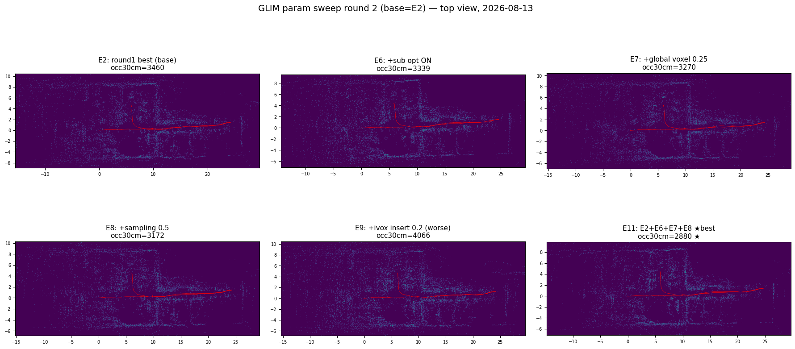

第 2 ラウンドの発見: 第 1 ラウンド (E2) が「**ドリフトを減らす**」(odometry 側) の改善
だったのに対し、第 2 ラウンドの勝者 3 つはすべて「**ずれた submap を組み立て直す**」
(sub/global mapping 側) の改善。両者は独立に効き、合算 (E11) がそのまま積み上がった。
一方で「点を増やす/濃くする」系 (E9, E10) は逆効果か比較不能で、**点の量より
照合の解像度・使用率が効く**という一貫した傾向。

## 見送った候補と理由 (監査の記録)

- `imu_acc/gyro_noise` 系 — IMU は回転・重力を有効に支えており (E0 ログの検証出力)、
  触ると重力整合を壊すリスクが利得を上回る
- `min_implicit_loop_overlap` ↓ — 偽拘束リスク。E7/E8 で引き戻しが十分効いたため不要
- `smoother_lag` / `max_iterations` / `k_correspondences` — 二次的。E11 で頭打ちを
  確認してから検討する枠
- GPU 版限定機能 (距離適応ボクセル・`full_connection_window_size`) — この環境は
  GPU .so 不在で使用不可

## 推奨 config diff = E11 (repo 未反映 — 適用はユーザ判断)

```diff
--- ros2_ws_glim/config/config_preprocess.json
-    "distance_far_thresh": 100.0,
+    "distance_far_thresh": 50.0,
-    "downsample_resolution": 1.0,
+    "downsample_resolution": 0.5,

--- ros2_ws_glim/config/config_odometry_cpu.json
-    "ivox_resolution": 1.0,
+    "ivox_resolution": 0.5,
-    "ivox_min_dist": 0.1,
+    "ivox_min_dist": 0.05,

--- ros2_ws_glim/config/config_sub_mapping_cpu.json
-    "enable_optimization": false,
+    "enable_optimization": true,

--- ros2_ws_glim/config/config_global_mapping_cpu.json
-    "randomsampling_rate": 0.2,
+    "randomsampling_rate": 0.5,
-    "submap_voxel_resolution": 0.5,
+    "submap_voxel_resolution": 0.25,
```

⚠️ 適用時の注意: `distance_far_thresh 50` と `downsample 0.5` は**屋内向けの値**。
屋外 (つくば本番) で使う場合、遠距離の建物を切り捨てる可能性があるので
`distance_far_thresh` は 100 に戻すか環境別 config を分けること。
処理負荷は E2 でも実時間再生で問題なし (CPU 2 スレッド維持)。

## 視点別ギャラリー — 3D 透視図と断面 (全 run)

各 run について `EN_3d.png` (3D 透視図 ×2 方位 + 正面断面 y-z + 側面断面 x-z、高さで
色付け・赤線=軌跡) を `img/2026-08-13_glim_param_tuning/` に生成した。トップビューが
「水平の塗れ」を見る図であるのに対し、**正面断面は壁の二重化が縦線の本数で、側面断面は
床・天井の整合が層の厚みで**読める。

### E0 (ベースライン) vs E11 (最終推奨)

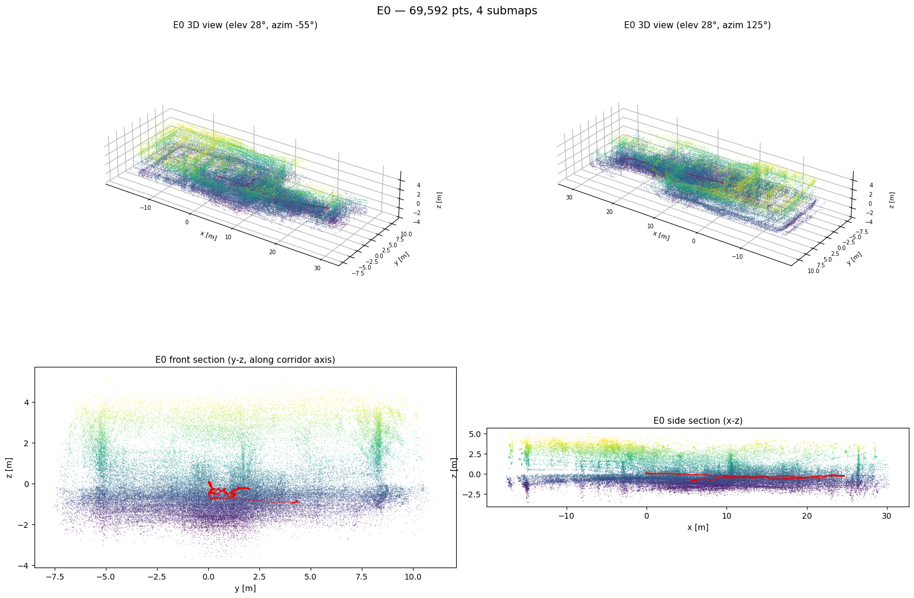
*E0 — ベースライン (現行 config)。occ30cm 4,397。壁・柱の輪郭が霞み、正面断面では
壁が幅広の帯になっている。*

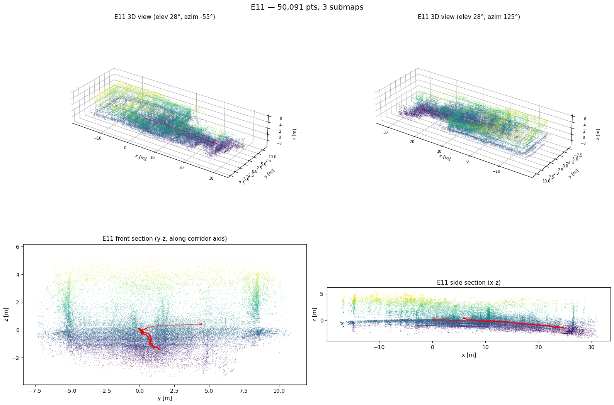
*E11 — 最終推奨 (E2+E6+E7+E8)。occ30cm 2,880 (−34.5%)。天井の梁格子・柱の縦線が
明瞭に分離。側面断面の z 沈み (後述) は残る。*

### 第 1 ラウンド (E1〜E5)

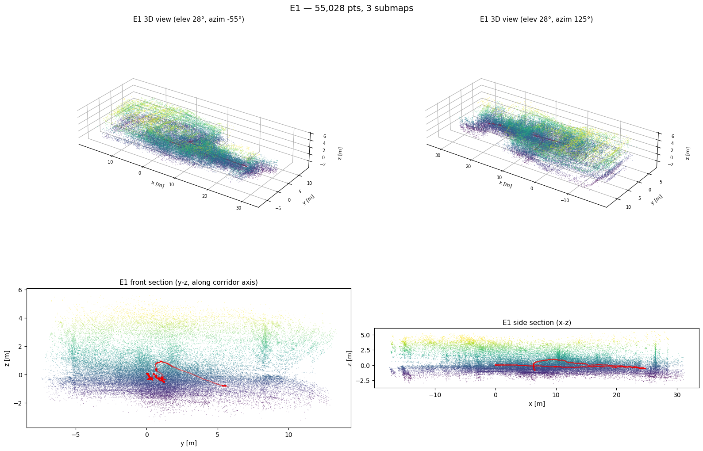
*E1 — preprocess 0.5 m / far 50 m。occ30cm 4,031 (小幅改善)。E0 より入力の形状情報が
増えたが、照合側が粗いままなので輪郭はまだ霞む。*


*E2 — E1 + ivox 0.5 / min_dist 0.05。occ30cm 3,460 (R1 最良)。柱・ドア枠が立ち上がり、
正面断面の壁の縦線が締まり始める。*

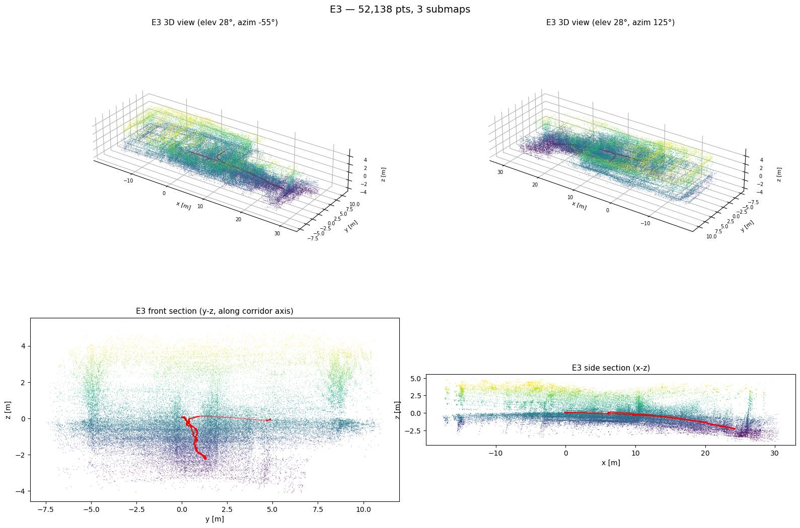
*E3 — E2 + submap_voxelmap_levels 3。occ30cm 3,773 (悪化)。粗い解像度レベルの対応が
壁を再びぼかす方向に働いた。*

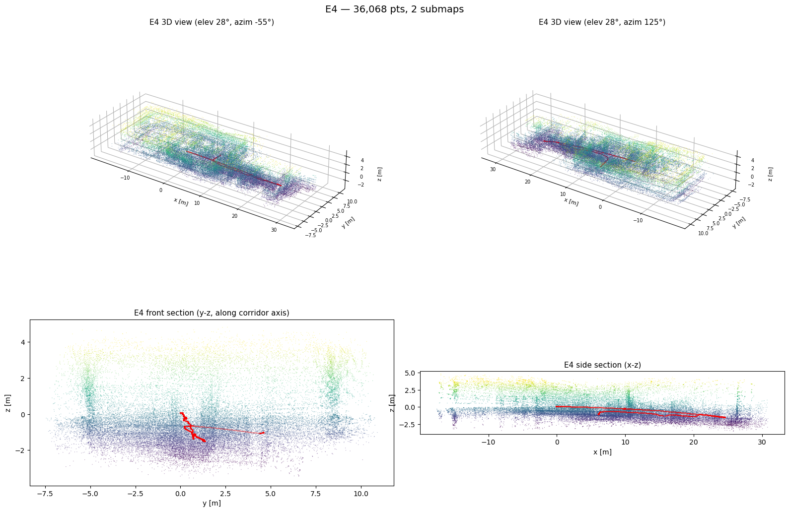
*E4 — E2 の preprocess を 0.25 m に深掘り。occ30cm 4,392 (悪化)。1 万点の割当が近距離に
偏り、遠方の壁アンカーが薄れて輪郭が崩れる。*


*E5 — E2 + pose_graph 明示ループ検出 (min_travel_dist 10)。occ30cm 3,429 (E2 と同等)。
ループ検出は 1 件も発火せず、見た目も E2 とほぼ同じ。*

### 第 2 ラウンド (E6〜E10)

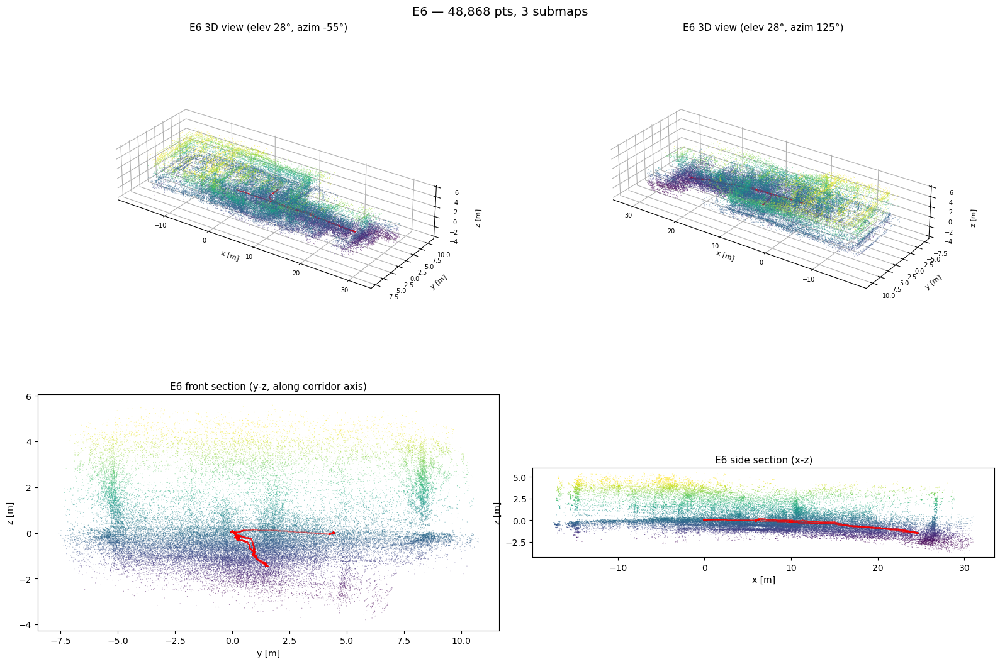
*E6 — E2 + sub_mapping enable_optimization ON。occ30cm 3,339 (−3.5%)。submap 内部の
keyframe 整合が取り直され、壁の帯がわずかに薄くなる。*


*E7 — E2 + global submap_voxel_resolution 0.25。occ30cm 3,270 (−5.5%)。submap 間照合の
屋内スケール化で、再訪時の壁の重なりが改善。*

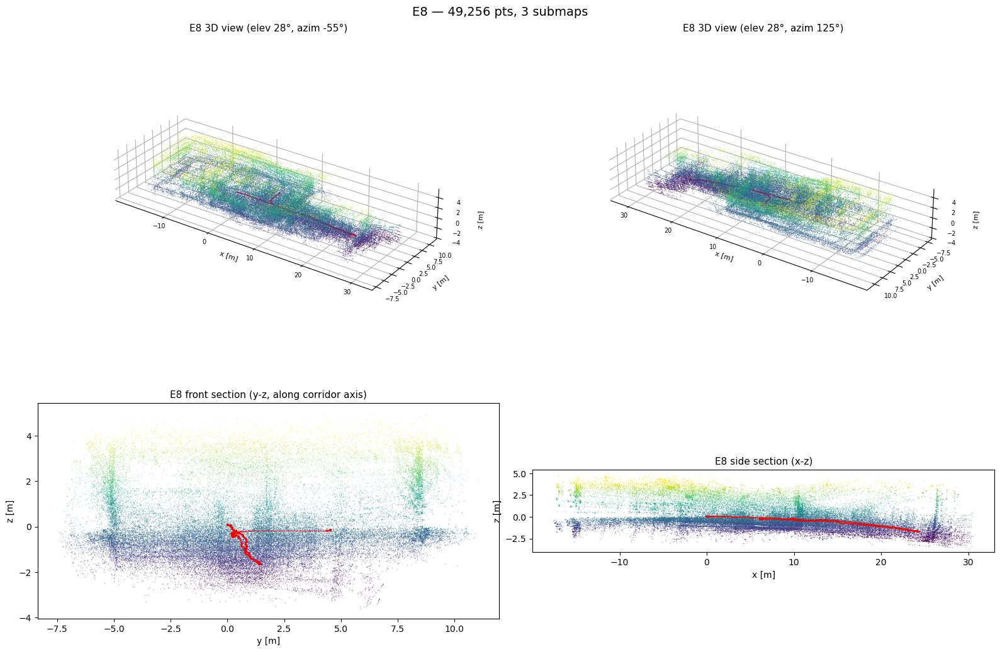
*E8 — E2 + global randomsampling_rate 0.5。occ30cm 3,172 (単発最良 −8.3%)。照合に使う
点が 2 割→5 割になり、submap 間の引き戻しが強く効く。*

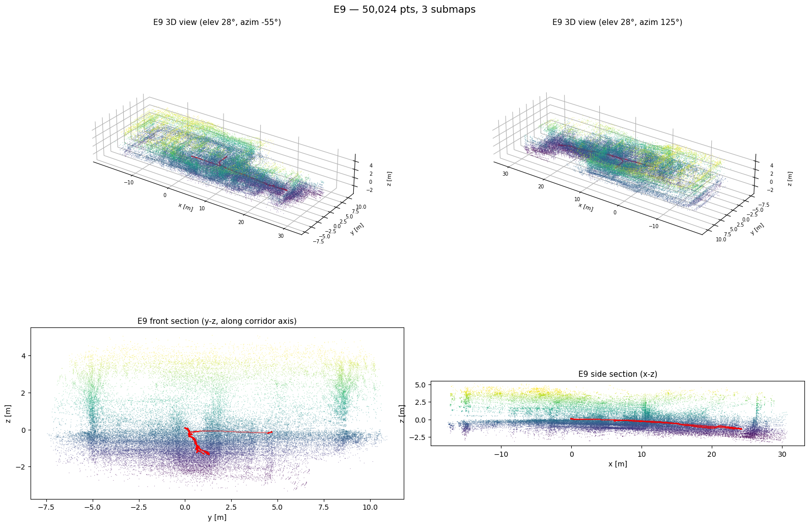
*E9 — E2 + target_downsampling_rate 0.2。occ30cm 4,066 (悪化)。iVox 地図に古い点が
濃く残り、ずれた対応を引きずって輪郭が二重化する。*

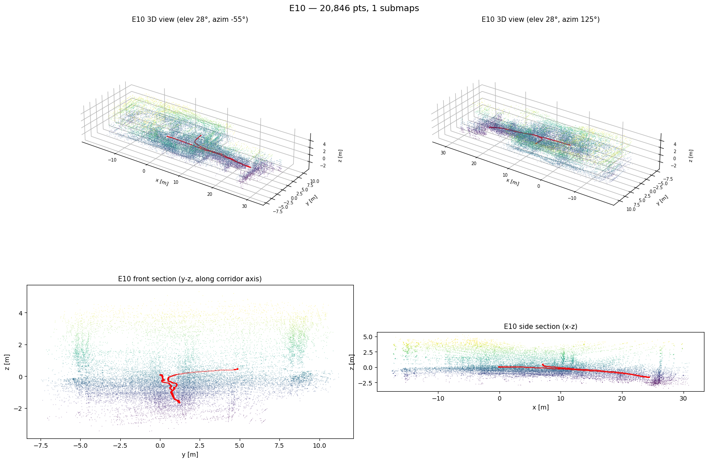
*E10 — E2 + random_downsample_target 20000。比較不能: submap が 1 個になり地図点数も
半減 (レジーム変化)。見た目が疎なのは密度低下で、シャープさの改善ではない。*

### E12 — 密な地図製品 (推定は E11 のまま、保存間引きだけ緩和)

これまでの図が粗く見えるのは、**submap 保存時の 0.3 m 格子間引き** (地図製品の設定) の
せいで、SLAM の品質でもセンサの限界でもない。E11 と同一の推定設定のまま
`submap_downsample_resolution` 0.3→**0.05** にした E12 で密な地図を出した:

- 地図点数 **50k → 147k (約 3 倍)**。path 49.06 m = E11 (49.08 m) と一致し**推定は不変**
- 密度の上限は「keyframe が保持する preprocess 済み点群 (10k 点/フレーム × 全 keyframe)」
  で決まる。それ以上は 16 ライン機の物理限界 (公式デモの Ouster 64/128 ラインとは
  入口で 5〜20 倍の差) — 経緯は本 doc の質疑 2026-08-13

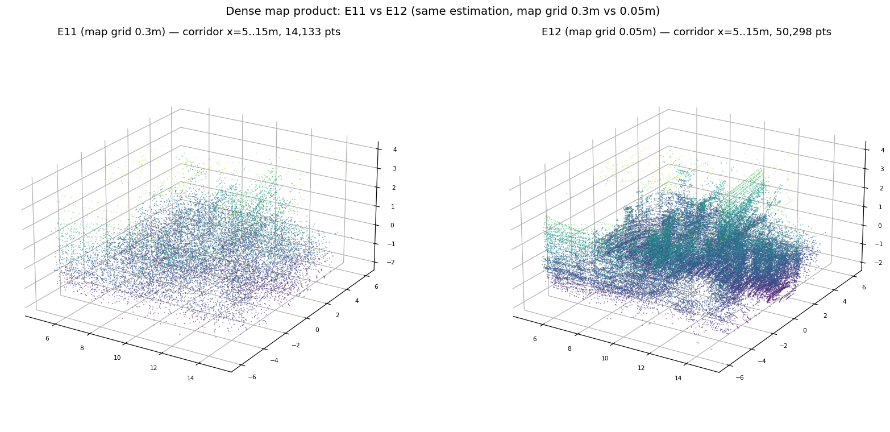
*廊下中央部 (x=5〜15 m) の切り出し比較。左 E11 (0.3 m 格子) は粉状で概形のみ。
右 E12 (0.05 m 格子) はスキャンライン・壁面・ドア奥の窪みまで判別できる。*

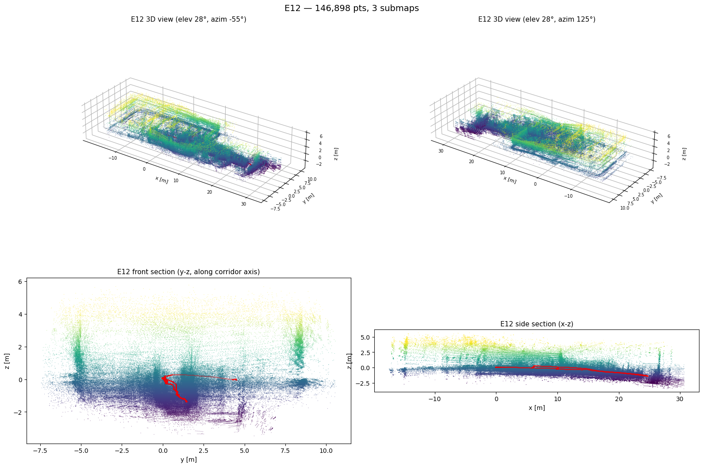
*E12 — 全景 (E11 と同じ 4 面構成)。147k 点。occ 系指標は密度が違うため E0〜E11 と
比較不能な点に注意 (幾何は E11 と同一)。*

- 密 PLY (外部ビューア用): `bags/9goukan/3d_imu/exp_2026-08-13/E12/E12_dense_map.ply`
- **運用ノート**: 地図を成果物として出すときだけ 0.05 に、通常の評価は 0.3 のままが
  無難 (dump サイズ・大域最適化の負荷が増えるため)

### 断面図から得た追加の観察 — z 方向 (高さ) ドリフト → 原因切り分けと E13 検証

側面断面 (x-z) で、**軌跡が廊下の奥 (x≈25 m) に向かって z 方向へ沈み (E11 で −1.4 m)、
床の帯も奥で同様に下がる**現象が全 run に共通して見える。指標 `floor_std` (床ピーク
±10 cm の σ) は局所的な床の薄さしか測っておらず、この大域傾斜を見逃していた。

**原因切り分け (2026-08-13、bag と dump のオフライン解析):**

```
z 沈みの容疑者と判定
├── ❌ IMU の取付傾き ......... 静止 8 s の平均加速度: 対重力 0.95°
├── ❌ LiDAR の取付傾き ....... 静止スキャンの床平面フィット: 対床 0.17°
├── ❌ IMU バイアス ........... 推定 0.001〜0.006 m/s² (0.03° 相当) で安定
├── ❌ 地図全体の剛体傾き ..... submap 姿勢の z 軸傾きは ≤1.5° と水平のまま、
│                              原点 z だけ -0.11→-0.95 m = 回転でなく並進ドリフト
├── △ IMU⇔LiDAR 相対ピッチ 0.94° (上 2 つの差、URDF は完全整列を仮定)
│   └── E13 で検証 → 寄与 ~0.4 m を確定 (下記)。ただし全量ではない
└── ⭕ 本体: z 並進の累積ドリフト。床に当たるのは半径 ~2.7 m の細いリングのみで
    レバーアームが短く、フレームあたり ~1 mm の系統誤差を飲み込む。
    復路が同じ z(x) をなぞるのは出来た地図への整合で拘束されるため (原因でなく結果)
```

図: `img/2026-08-13_glim_param_tuning/E11_zdrift.png` (z vs 累積距離 / z vs x 往復重ね /
IMU バイアス推移)。

**E13 = E11 + `T_lidar_imu` に実測 0.94° 補正を焼き込み** (q=(0.00824, −0.00027,
0.70707, 0.70710)) の結果:

| | E11 | E13 | 判定 |
|---|---|---|---|
| z 沈み (最深) | −1.42 m | **−1.02 m (−28%)** | 予測どおり ~0.4 m 減 → **相対ピッチ 0.94° の寄与を確定** |
| 周回閉じ誤差 z | +0.39 m | +0.23 m | 改善 |
| occ30cm (水平塗れ) | **2,880** | 3,409 (+18%) | **悪化** — 補正が水平方向の整合を崩す |

→ **E13 は不採用、推奨は E11 のまま**。外部パラメータの微傾きは z 沈みの実寄与として
確定したが、1 点静止 8 s の実測値をそのまま焼き込む粗い較正では水平が犠牲になる。
ちゃんと直すなら複数地点での静止データによる較正が必要。

残る z 沈み (~1.0 m) は **x≈13 m 以降の奥半分に局在**する (E13 の z(x) は手前半分が
ほぼ平ら)。⚠️ **要ユーザ確認: 廊下の奥半分に実際の下り勾配・スロープは無いか**
(あれば一部は実形状)。無ければ奥半分の特徴の乏しさ × 床リング拘束の弱さによる
縮退残差で、対策は斜め置き (親 issue 対策候補 4) が本命。

## 生成物

- 画像 (トップビュー `EN_topview.png` / 立体・断面 `EN_3d.png` / 比較図 ×2)・
  ベースライン config: `docs/issue/img/2026-08-13_glim_param_tuning/`
- 各 run の dump・指標 JSON: glim コンテナ `/tmp/exp/E{0..5}/` +
  `bags/9goukan/3d_imu/exp_2026-08-13/` (git 管理外, root 所有)
- 解析スクリプト: セッション scratchpad (`analyze_dump.py` / `extra_metrics.py` /
  `compare_runs.py` / `compare_runs2.py` / `render3d.py` / `make_config.py` + spec_E*.json)

## 再現メモ

```bash
# glim コンテナ内。変異 config を /tmp/exp/EN/config に用意して:
nice -n 10 ros2 run glim_ros glim_rosbag /bags/9goukan/3d_imu/2026-08-12 \
  --ros-args -p config_path:=/tmp/exp/EN/config \
  -p auto_quit:=true -p dump_path:=/tmp/exp/EN/dump -p playback_speed:=1.0
# 解析 (dump → 地図再構成 + 指標 + トップビュー PNG):
python3 /tmp/analyze_dump.py /tmp/exp/EN/dump <出力dir> EN
```
