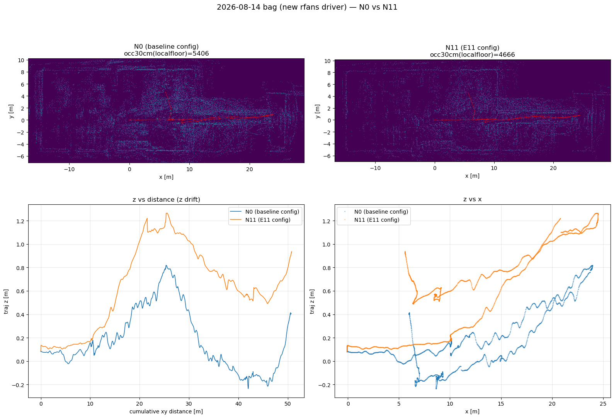
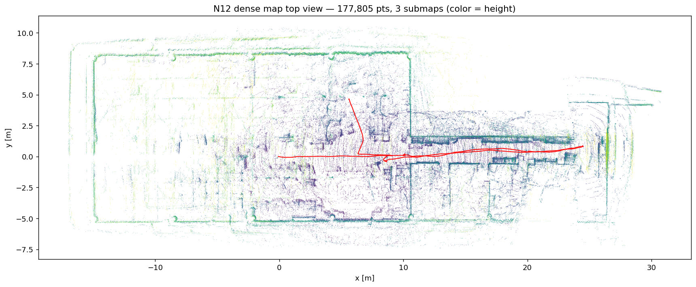
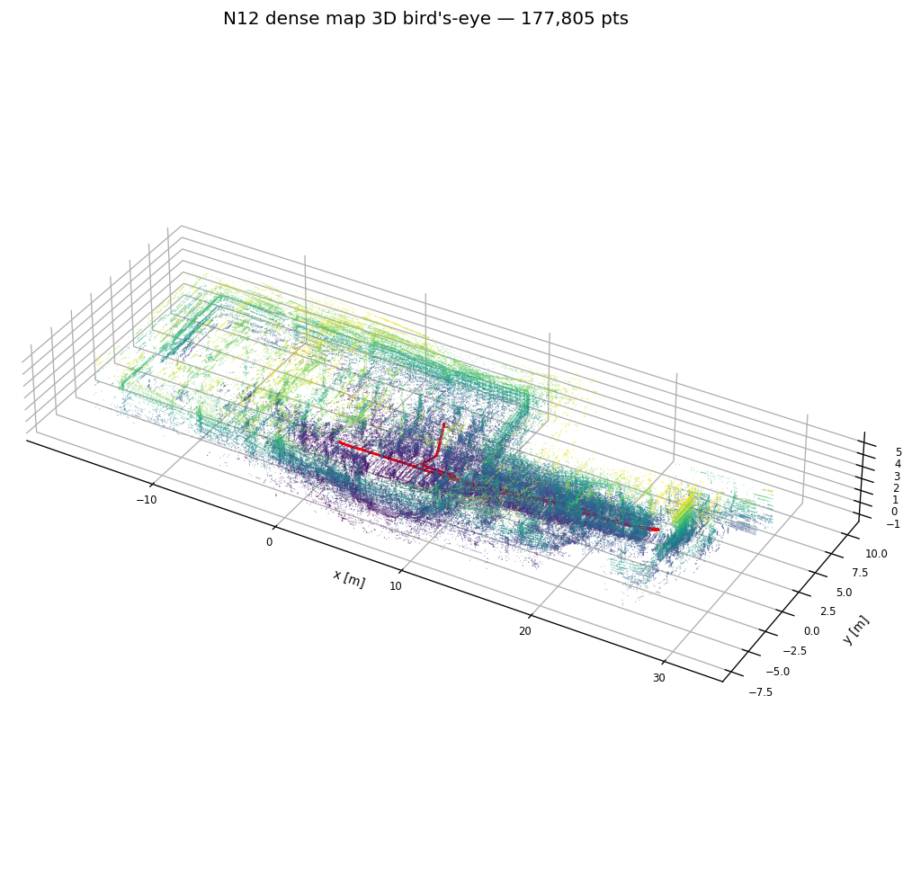

# R-Fans-16 ドライバ刷新 — 旧 StarROS2 の問題総括と新 surestar_rfans_ros2 への移行

- **ステータス (2026-08-14): 統合完了 — bringup/GLIM/scripts を新ドライバへ全面切替済み (実機検証込み)。残は縦角再較正のみ**
- 新リポジトリ: `YamamotoSoya/surestar_rfans_ros2` (submodule: `ros2_ws_main/src/drivers/surestar_rfans_ros2`)
- 旧リポジトリ: `YamamotoSoya/StarROS2` (当面参照用に残置)
- 関連: `docs/features/2026-06-13_rfans_driver_ros2_port.md` (旧移植)、`docs/text/timestamp/` 第5・8章、
  メモリ `rfans16-vangle-table-mismatch`

## 1. 背景 — 旧ドライバへの不信の内訳

旧 StarROS2 は「クローズドな SDK バイナリ (`libstar.so`) + 薄い ROS ラッパ」構成で、
点群計算の心臓部が見えなかった。2 ヶ月で踏んだ問題:

| 時期 | 事件 | 原因 (後に判明したもの含む) |
|------|------|------|
| 06-13 | 全点 z=0 の平面に潰れる | SDK が実機の名乗り (dataID) を知らず縦角を引けない → 0x37→0x57 書き換えハックで延命 |
| 06-13 | 点群が ~1 Hz しか出ない | 点ごとに spin_some する実装 (1.5 万回/スキャン) |
| 08-01 | 起動 90ms で無言死 (SIGABRT) | libstar.so が古い例外ランタイムを export しプロセスの例外処理を乗っ取る → LD_PRELOAD で延命 |
| 08-11 | header.stamp がスキャン末尾基準 | publish 時 now() を stamp にしていた → 巻き戻し修正 |
| 08-14 | 点群の半分の仰角が破壊 | エコー二重符号化 (lidarID 0..31) を SDK が知らず 16 要素表を配列外参照 → fold16 パッチ (revert 済み) |
| 未解決 | 縦角表が実測と合わない | カタログ表 ±15° vs 回転較正の実測 −22.6〜−9.6° |

**転機**: R-Fans-16 の箱から付属 USB を発見。フォルダ名「附赠U盘资料(_GM格式)V6K-16G」が
この個体の正確な素性 (GM フォーマット・V6K-16G) を初めて明かし、中に
**完全オープンソースの公式 ROS1 ドライバ (ROSDriver v2.3.18)** が入っていた。

## 2. 新旧比較表

| 観点 | 旧: StarROS2 (rfans_driver) | 新: surestar_rfans_ros2 |
|------|------|------|
| 点群計算 | クローズド `libstar.so` (無改造不可) | **全部ソース** (`bufferDecode.cpp` 2,261 行 + `calculation.cpp/h`) |
| 機種判別 | SDK 内部で不可視。「dataID 0x37」と誤報告 → 0x57 へ書き換えるハックが必須 | UDP 末尾の機種 ID バイトを直接 switch。**0x5C = V6K-16G を明示サポート** |
| エコー二重符号化 (lidarID 0..31) | 未対応 → 点群の半分が壊れる (fold16 を自前でリバースエンジニアリング) | **公式に折り畳み実装済み** (`laserid >= 16 ? -16 : そのまま`) |
| 点ごと時刻 | 無し → 後付けパッチで追加 | **標準装備** + パケット内で方位角も時間補間 (deskew の土台の質が違う) |
| メッセージ単位 | 50ms バッチ (1 回転が 2 通に分割, 20 Hz) | **角度で切る 1 回転 1 通** (10 Hz @rps10, SLAM 向き) |
| LD_PRELOAD | 必須 (例外ランタイム乗っ取り対策) | **不要** (バイナリ blob が無い) |
| 実行時チューニング | パラメータ (自前移植分のみ) | フィルタ 6 種 + `vangle_override` (較正受け口) |
| デバイス設定 | SDK 任せ (不可視) | rps / data_level / エコー種別をレジスタ書き込みで明示設定 |
| ノード構成 | driver_node 1 本 | driver_node (UDP→Packet msg) + calculation_node (→PointCloud2) の velodyne 型 2 段 |
| pcap 再生 | あり | あり (実機レス A/B の土台) |
| 履歴の出自 | ベンダ由来と改造が混在 | **pristine import (0dd574a) との diff = 改造の全記録** |

## 3. 「dataID 0x37」の謎の解明 (実測 2026-08-14)

実機 UDP パケット (1206 B) の末尾 2 バイトを raw ソケットで直接読んだ:

```
末尾 8 バイト: ... a7 ec 8f 0f | 5c 37
                └ 時刻 (µs) ┘   │  └ 末尾 1 個目 = 0x37 (gmReservedB)
                                └ 末尾 2 個目 = 0x5C (gmReservedA = 機種 ID) ★
```

- **機種 ID は 0x5C = V6K-16G**。実機は正しく名乗っていた。
- 旧 SDK の「dataID 0x37」は**隣のバイト (gmReservedB) の誤読**。
  0x37 は GM フォーマットのフレームフラグ由来 (`RFANS_GM_16_FLAG = 0x3732`)。
- つまり z=0 事件以来の 0x37→0x57 書き換えハックは「SDK の読み違いの外部補正」だった。

## 4. 移植と追加修正 (新リポジトリのコミット列)

```
0dd574a Import vendor ROSDriver v2.3.18 (pristine)   ← 無改造ベンダ素材
e0fc332 Normalize encoding (GBK→UTF-8, CRLF→LF)      ← 文字コードのみ
b0057e4 Port to ROS 2 Jazzy (rclcpp)                  ← 移植本体 (06-13 レシピ準拠)
28e8fd3 Fix time field / stamp anchor / mirrorid / 無データ退場
1cad3e2 Add vangle_override parameter                 ← 較正の受け口
```

移植後に発見・修正した 4 件 (すべて実機検証済み):

1. **per-point 時刻がデバイス絶対 µs の float32** だった (timestamp 読本の「float32 精度崩壊」
   パターン、~256 µs 量子化)。publish 時に「スキャン先頭からの相対秒」へ変換し、フィールド名も
   GLIM が認識する `time` へ変更 (実測: 0〜0.104 s / 1 回転)。
2. **header.stamp がスキャン末尾基準** (StarROS2 で 08-11 に踏んだのと同型)。実測スキャン幅で
   巻き戻してスキャン開始基準に (実測: now−stamp = 0.117 s ≈ 回転 0.104 + 転送)。
3. **mirrorid の PointField offset 誤記** (25 → 実体 28、ベンダバグ)。
4. **1 秒の無データで driver_node が終了する**ベンダループ → 実機モードは継続 (電源断・
   ケーブル抜けに耐える)。pcap 再生の EOF 終了は温存。

## 5. A/B 検証 — ビーム別の床の高さ (縦角の健全性指標)

方法: 静止シーンで 10 スキャン、水平距離 1〜6 m・z −1.2〜−0.25 の点をビーム別に集め、
床の中央値 z を出す。**縦角が正しければ全ビームが同じ床平面 (センサ高 −0.72 m) を指すはず**。

旧 = 健全時の bag (`bags/9goukan/3d_imu/online/rosbag/2026-08-12`)。新 = 実機ライブ (2026-08-14、別の部屋)。

| 物理ビーム | 旧: id n の床 z | 旧: 分身 id n+16 の床 z | 新: id n の床 z |
|-----------|---------------|----------------------|---------------|
| 0 | −0.691 | **−1.131** | −0.545 |
| 1 | −0.662 | **−1.067** | −0.466 |
| 2 | −0.633 | **−0.978** | −0.418 |
| 3 | −0.500 | −0.678 | −0.368 |
| 4 | −0.412 | −0.548 | −0.330 |
| 5 | −0.311 | −0.584 | −0.294 |
| 6 | −0.263 | −0.477 | −0.287 |

読み取れること:

1. **旧: 同一物理ビームの床が 2 つの高さに見える** (id0 −0.69 vs 分身 id16 −1.13)。
   床下 1.13 m は物理的に不可能 = **fold16 破壊 (配列外参照の壊れた仰角) の定量証拠**。
   点群の半分がこの壊れたグループだった。GLIM ドリフト (docs/issue/2026-08-12) の一因の疑いも継続。
2. **新: 分身グループが存在しない** (laserid 0..15 のみ)。公式実装の折り畳みで設計ごと解消。
3. **新旧共通: ビーム間で床が揃わない** (揃えば全行同じ値になるはず)。逆算した実ビーム角は
   最下段で −20° 前後 = カタログ表 (−15°) と系統的に不一致で、**08-14 回転較正の実測
   (−22.6〜−9.6°) と同傾向**。→ 縦角表の不一致は fold16 と独立の未解決問題として残る。
   対策の受け口として新ドライバに `vangle_override` パラメータを実装済み (既定は公式表)。
   **較正は新ドライバのきれいな出力でやり直してから値を入れること** (旧較正データは
   fold16 破壊込みの出力から導出しており汚染の可能性がある)。

### 付記: 旧ドライバの現況 (2026-08-14 ライブ)

同日の実機で旧ドライバは **1206 B ストリームをほぼ解読できない状態**
(`dataID=0x00, points=96` 警告、~1 Hz、188 点/msg = 正常の 1%) だった。新ドライバが
デバイスレジスタ (data_level 3 等) を書いた後の状態を旧 SDK が扱えない可能性がある。
⚠️ **新旧を切り替えるときはデバイスの電源を入れ直すのが安全** (レジスタ設定はフラッシュ
既定に戻る)。この脆さ自体も置き換え理由の一つ。

## 6. 使い方

```bash
# main コンテナ内 (ビルド後):
ros2 launch surestar_rfans_ros2 rfans_driver.launch.py
#   引数: model:=R-Fans-16 device_ip:=192.168.0.3 rps:=10 data_level:=3
#         frame_id:=rfans use_double_echo:=false
#   点群: /rfans_driver/rfans_points (PointCloud2, 1 回転 1 通)
#   実機レス: pcap:=/path/to.pcap read_once:=true

# フィルタの実行時調整 (旧 dynamic_reconfigure 相当):
ros2 param set /calculation_node max_range 50.0
# 実測縦角の適用 (較正後):
#   launch/params で vangle_override:="[-22.6, -21.0, ...]" (16 要素, laserid 順)
```

未移植 (ビルド除外のベンダツール): `dump_point_node` / `cloud_process` / `subscriber`。

## 7. 残タスク

1. ~~**bringup 統合**~~ (✅ 2026-08-14 同日完了): lidar_3d を新ドライバ 2 ノードに切替 (LD_PRELOAD 撤去)、
   点群 topic は **`/rfans_driver/rfans_points` に統一** (typo 由来の `/sdk_could` は廃止し、GLIM
   `config_ros.json` / scripts を追従)。params.yaml は `rfans_driver` + `rfans_calculation` の 2 セクション化
   (theta_remap 廃止)。旧 StarROS2 は **COLCON_IGNORE 化して参照専用で残置** (コンテナ内の旧
   build/install 残骸も削除済み)。実機検証: bringup_3d 経由で 10.1 Hz / frame `rfans` を確認。
2. **縦角再較正**: 新ドライバ出力でその場旋回較正を再実施 → `vangle_override` に反映。
   ~~床下ゴースト (08-14 の鏡面反射調査) の除去も preprocess 側で併せて検討~~
   → **床下ゴーストは新ドライバでほぼ消滅** (§8: 9.4% → 0.02%)。cropbox 対策 (E14) は不要になった。
3. **メーカー問い合わせ (任意)**: 「V6K-16G GM 格式」+ シリアルで正式な縦角表を請求
   (bkth@isurestar.com / sdk@isurestar.com)。
4. 屋外 (つくば想定) での GLIM 品質評価は刷新後の構成で実施。

## 8. 新ドライバ bag での GLIM 再評価 (2026-08-14, 9 号館 376 s bag)

新ドライバで録った初の bag `bags/9goukan/2d3d_imu/online/rosbag/2026-08-14_0448`
(376 s, /rfans_driver/rfans_points 10 Hz + /imu/data 100 Hz + /odom, 車輪 path 50.3 m) を
08-12/08-13 と同じパイプライン (glim_rosbag オフライン ×2 config + occ 指標 + 断面図) で評価した。

### 8-1. bag 生データの健全性 (旧ドライバ bag 08-12 との対比)

```
新ドライバ bag の生データ検査 (冒頭静止 20 スキャン)
├── ✅ laserid 0..15 のみ — fold16 分身 (id 16..31) は設計ごと消滅
├── ✅ per-point time 0〜0.100 s 相対秒 / stamp スキャン開始基準 (recv−stamp ≈ 0.100 s)
├── ✅ 30k 点/msg 全点 finite・10.0 Hz
├── ⭕ 床下ゴースト (z<−1.0) が 9.4% → 0.02% に消滅
│   └── 08-14 の生データ調査で「ワックス床の鏡面反射」と解釈した床下点群の
│       大部分は、実際は fold16 破壊 (配列外参照の壊れた仰角) だったと判明。
│       鏡面反射説は撤回に近い下方修正 (真の鏡面ゴーストは ≤0.02% 水準)
└── ⚠️ ビーム別床 z は依然 −0.67〜−0.27 と不揃い = 縦角表の系統誤差は残存 (残タスク 2)
```

### 8-2. GLIM 指標 (N0 = 現行 config, N11 = E11 推奨 config)

⚠️ 経路が 08-12 bag (直線廊下往復 48.5 m) と違い部屋・分岐込みのため、occ30cm の
絶対値は直接比較できない。z ドリフトで大域床ピークがずれるため、**局所床基準
occ30cm (xy 1 m 格子ごとに床を推定してスライス)** を補助指標に追加した。

| Run | occ30cm | occ30cm (局所床) | 密度正規化 [cells/m²] | path [m] | z ドリフト (奥端) |
|-----|---------|------------------|----------------------|----------|-------------------|
| 旧 bag online (08-12, 旧ドライバ) | 4,723 | 6,284 | 7.39 | 51.0 | **−1.4 m (沈む)** |
| N0 (新 bag × 現行 config) | 4,230 | 5,406 | 6.90 | 51.56 | **+0.8 m (浮く)** |
| N11 (新 bag × E11 config) | 3,195 | 4,666 | 5.99 | 51.19 | +1.1 m (浮く) |



```
読み取れること
├── ⭕ E11 設定の有効性は新ドライバでも再現 (局所床 occ30cm −14%, 壁の輪郭が明確に締まる)
├── ○ 同一 config 比較 (旧 online 7.39 → N0 6.90 cells/m²) で塗れ −7% 程度
│   └── fold16 破壊の除去は「改善はするが水平ドリフトの主因ではなかった」
│       = 08-12 の結論 (縮退 × 車輪 odom 不使用) は不変
├── ⭕ path 長は車輪 odom (50.3 m) と 1.8〜2.5% 差で引き続き正確
└── ⚠️ z ドリフトは残存だが符号が反転 (−1.4 沈む → +0.8〜1.1 浮く)・振幅は約半減
    ├── ゴースト消滅と同時に「沈み」が消えた = 床下ゴーストが z 沈みの主犯だった傍証
    └── 残る「浮き」は縦角表の系統誤差 (ビーム別床 ±0.3 m 不揃い) が最有力容疑
        → 縦角再較正 (残タスク 2) が z ドリフト対策を兼ねる
```

### 8-3. 密な地図 (N12 = N11 + 保存間引き 0.3→0.05 m, 08-13 の E12 相当)

推定設定は N11 のまま `submap_downsample_resolution` だけ緩和した地図製品版。
path 51.26 m = N11 (51.19 m) と一致し**推定は不変**、点数 50k → **178k (約 3.6 倍)**。


*上方ビュー (高さ色付け・赤線 = 軌跡)。y=0 の廊下を軸に両側の部屋群・突き当り
(x≈26 以降) まで、部屋の外周壁・什器の輪郭が判別できる。*


*3D 俯瞰。天井 (緑〜黄) と床 (紫) の 2 層の間に壁・柱が立つ。奥 (x 大) ほど
全体が持ち上がる z 浮き (§8-2) もこの図で読める。*

- 生成物: `bags/9goukan/2d3d_imu/offline/glim/exp_2026-08-14/{N0,N11,N12}/` (dump + 画像 + 指標)。
  `N_compare.png`・3D 4 面図は `docs/issue/img/2026-08-14_rfans_glim_eval/N{0,11}_3d.png`。
  密 PLY (外部ビューア用): `exp_2026-08-14/N12/N12_dense_map.ply`
- 解析スクリプト: セッション scratchpad (`bag_probe.py` / `floor_probe.py` /
  `local_floor_metrics.py` / `compare_n.py` / `render_dense.py` + 08-13 の `analyze_dump.py` 系を再利用)
