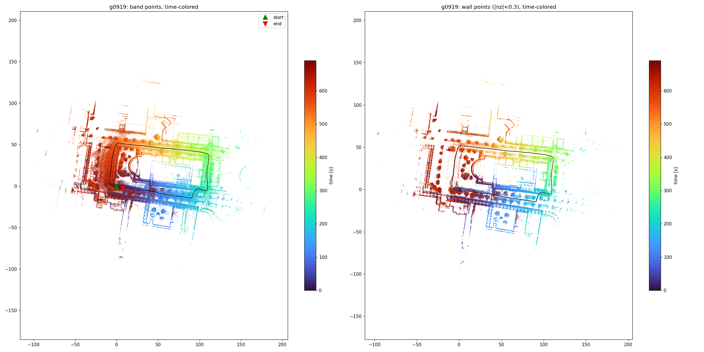
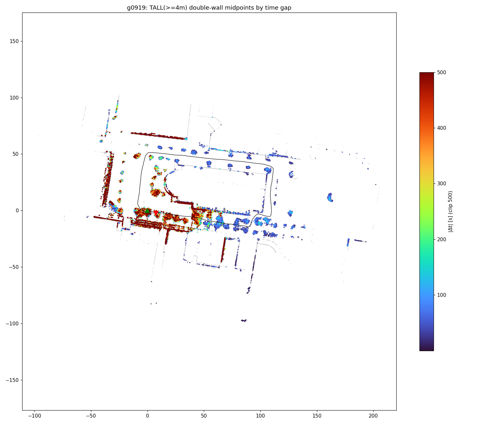
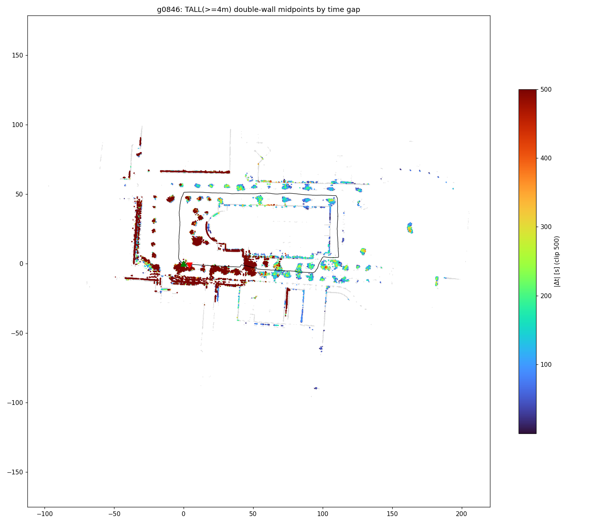
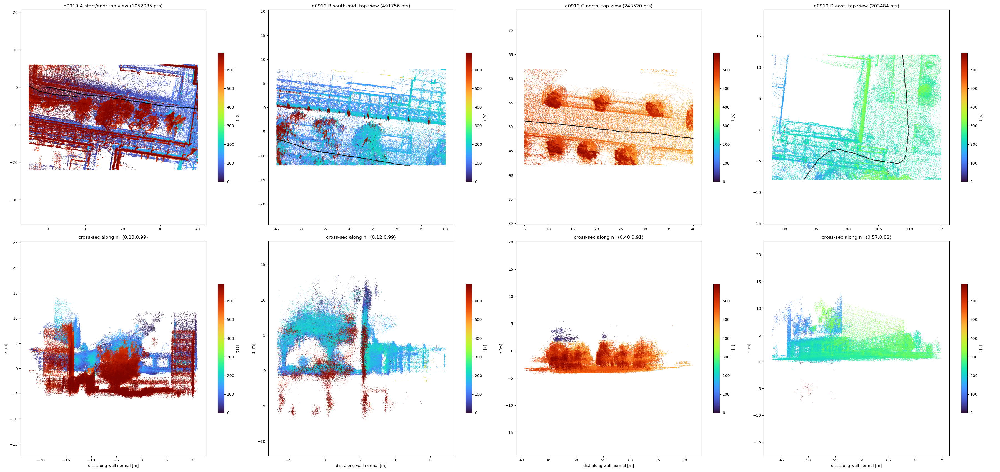
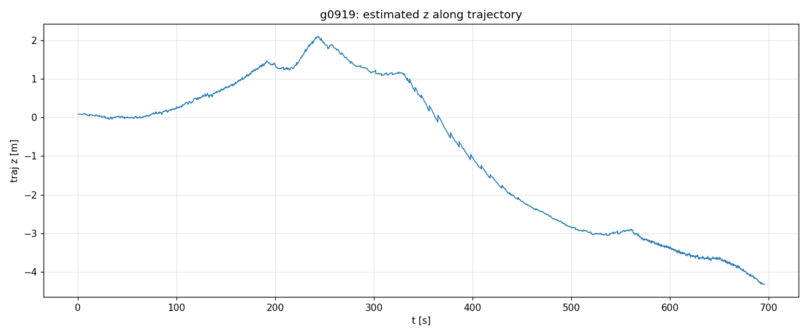
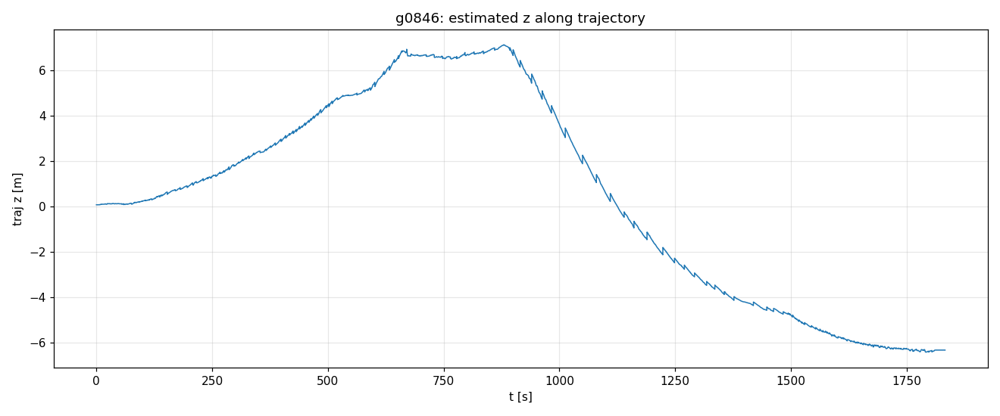

<!-- claude: 調査記録。2026-08-15 セッション。9 号館周回 bag の GLIM 地図で建物壁が 1〜2 m 二重化する問題。 -->
# 9 号館周回 bag — GLIM 地図の建物壁 1〜2 m 二重化の原因調査

- **ステータス: 原因特定済み (未対策) — 累積ドリフト + ループ閉合ゼロによる「往路 vs 周回終盤」の再訪ズレ**
- 対象: `bags/9goukan/2d3d_imu/online/rosbag/2026-08-14_0846` (0.2 m/s / 0.5 rad/s, 1833 s) と
  `2026-08-14_0919` (5 号館外一周, 0.5 m/s / 0.6 rad/s, 696 s) のオフライン GLIM dump
  (`bags/9goukan/2d3d_imu/offline/glim/2026-08-14_{0846,0919}_dump`)
- 症状: 地図全体の地形は良好だが、一部の建物壁が 1〜2 m 離れて 2 重に重なる。
  周回の最後にループクロージャで消せそうなズレも残る (ユーザ観察) — **両者は同一原因**
- 関連: `2026-08-12_glim_horizontal_drift.md` (廊下での二重化)、
  `2026-08-14_rfans_driver_renewal.md` §8 (z 浮きの縦角表容疑)、
  `2026-08-16_rfans_mount_angle_glim_z_collapse.md` (08-15 の取付角 45°/15° 実験 — z ドリフトが取付角の実測誤差で桁違いに増幅されることを実証)

## 結論の樹形図

```
建物壁の 1〜2 m 二重化
└── 原因: 周回 1 周分の累積ドリフトが補正されないまま、
    「序盤に見た壁」と「終盤にもう一度見た同じ壁」が別位置に置かれた
    ├── 証拠 1: 因子グラフにループ拘束が 1 本も無い
    │   ├── 0919: matching_cost (VGICP) 1,064 本すべてが submap 間隔 ≤15 の近傍のみ
    │   ├── 0846: 433 本すべて間隔 ≤10。始点↔終点 (submap 0↔222) は未接続
    │   └── GLIM の暗黙ループ閉合は「推定位置で submap ボクセルが 20% 以上重なる」
    │       ことが条件 (min_implicit_loop_overlap 0.2) — ドリフト後の推定位置が
    │       xy 数 m + z 数 m ずれているため重なり判定に届かず、一度も発火しなかった
    ├── 証拠 2: 一周後の始点-終点ギャップがそのまま残っている
    │   ├── 0919: xy 8.1 m + z −4.4 m (経路長 344 m = 3D 2.7%)
    │   └── 0846: xy 4.7 m + z −6.4 m (経路長 350 m。遅い 0.2 m/s の方が z は悪化
    │       — ドリフトは距離でなく時間でも積む。1833 s vs 696 s)
    ├── 証拠 3: 二重壁の空間分布が「始点と終盤の両方から見えた領域」に一致
    │   ├── 高さ 4 m 以上の壁セル同士で 0.7〜2.6 m 離れた平行ペアを全自動検出し、
    │   │   2 枚のシートの観測時刻差 Δt で色分け → Δt>500 s のペアが
    │   │   始点/終点の重複領域 (地図の西〜南西) にだけ濃く集中
    │   └── 重複領域の「後半地図 → 前半地図」最近傍変位の中央値:
    │       0919 = 3D 1.35 m (dz −0.78)、0846 = 3D 2.88 m (dz −2.52)
    │       → ユーザ観察の「1〜2 m」と定量一致
    └── 補足: Δt が小さい平行ペア (南辺の低い帯など) は生垣・柵・渡り廊下等の
        実在の平行構造で、二重化ではない (近距離の壁自体は 1 枚でシャープ)
```

ドリフトの中身は **z 成分が支配的** (0919 −1.3%、0846 −1.8% 勾配相当。実際の地形は
ほぼ平坦)。これは `2026-08-14_rfans_driver_renewal.md` §8-2 で確認済みの
「縦角表の系統誤差による z ドリフト」(屋内 376 s で +0.8 m) と同じ署名で、
屋外周回では 1 桁大きく積もる。z が 4〜6 m ずれると暗黙ループ閉合のボクセル重なりは
ほぼ確実に失われるため、**縦角誤差 → z ドリフト → ループ不発 → 二重壁**という連鎖。

なお両 dump とも config は現行 repo のベースライン (E11/N11 チューニング未適用:
downsample 1.0 / ivox 1.0 / randomsampling 0.2 等) で実行されている。

## 証拠画像


*0919 全体トップビュー (点を観測時刻で色分け、黒線=軌跡)。左=高さ帯全点、右=壁点のみ。
西側で前半 (青) と後半 (赤) の構造物がずれたまま共存している。*


*0919 — 高さ≥4 m の壁同士の二重ペア分布 (2 枚のシートの観測時刻差 Δt で色分け、灰=全壁セル)。
濃赤 (Δt>500 s) が始点/終点の重複領域 (西〜南西) にだけ集中 = 本症状そのものの地図。
青 (Δt 小) は生垣・柵など実在の平行構造。*


*0846 の同図。Δt>200 s のペアが 52% とさらに支配的 (撮影時間が長いぶんドリフトも大きい)。*


*0919 — ホットスポット 4 領域の拡大 (上段=トップビュー、下段=壁法線方向の垂直断面、時刻色分け)。
左端 A (始点/終点重複域) で青 (序盤) と赤 (終盤) の同一壁が水平 1〜2 m + 垂直 4 m ずれている。
C (北) は単一時刻のみ = 二重化なし、の対照例。*


*0919 — 軌跡 z の推移。ジャンプではなく滑らかな漂い (+2 m → −4.3 m) = 縮退やスリップでなく系統誤差の累積。*


*0846 — 同図。1833 s かけて −6.3 m まで沈む。*

## 解析手法 (再現用)

- dump の submap (`points_compact.bin` + `normals_compact.bin` + `T_world_origin`) を
  world 座標へ再構成。壁点 = 法線 |nz| < 0.3
- 二重壁検出: 壁点を 0.25 m 2D セルへ集約 → 法線方向 0.7〜2.6 m にある平行セル
  (変位・法線とも整合 >0.85) をペア化 → セル平均観測時刻の差 Δt で分類
- 高い壁限定 (z 幅 ≥4 m) で生垣・柵の大部分を除外。残る小 Δt ペアは断面図で実構造と確認
- スクリプト: セッション scratchpad (`overview.py` / `doublewall.py` / `tallwall.py` /
  `zoom.py` / `rangebias.py` / `mismatch.py`)。main コンテナ内 python3 で実行
  (`docker cp` で /tmp へ投入、bag は `/workspace/bags`)

## 対策候補 (未実施)

1. **縦角再較正 (本命・既存残タスク)**: 新ドライバ出力でその場旋回較正をやり直し
   `vangle_override` に反映。z ドリフトの根を絶つ = ループ重なり条件の回復にも効く
2. **明示ループ閉合を試す**: global mapping を pose_graph (ループ検出) に切替えて
   同じ bag をオフライン再実行。08-13 の E5 では廊下 (submap 3 個) で不発だったが、
   今回は submap 223 個の実周回でループ候補の幾何条件を満たしやすい。
   ただし z −4〜−6 m のままでは検出器側の距離ゲートに落ちる可能性あり → 候補 1 とセットが本筋
3. **config チューニング適用**: E11 系 (ivox 0.5 / randomsampling 0.5 /
   submap_voxel_resolution 0.25 / sub_mapping optimization ON) をドリフト低減に。
   ⚠️ `distance_far_thresh 50` と `downsample 0.5` は屋内向け — 屋外は far_thresh 100 を維持
4. **撮り方の工夫 (運用回避)**: 周回後に序盤の区間を 20〜30 m 重ねて歩き、
   重なり領域を厚くする (閉合が発火しない限り効果は限定的 — 候補 1/2 の補助)
