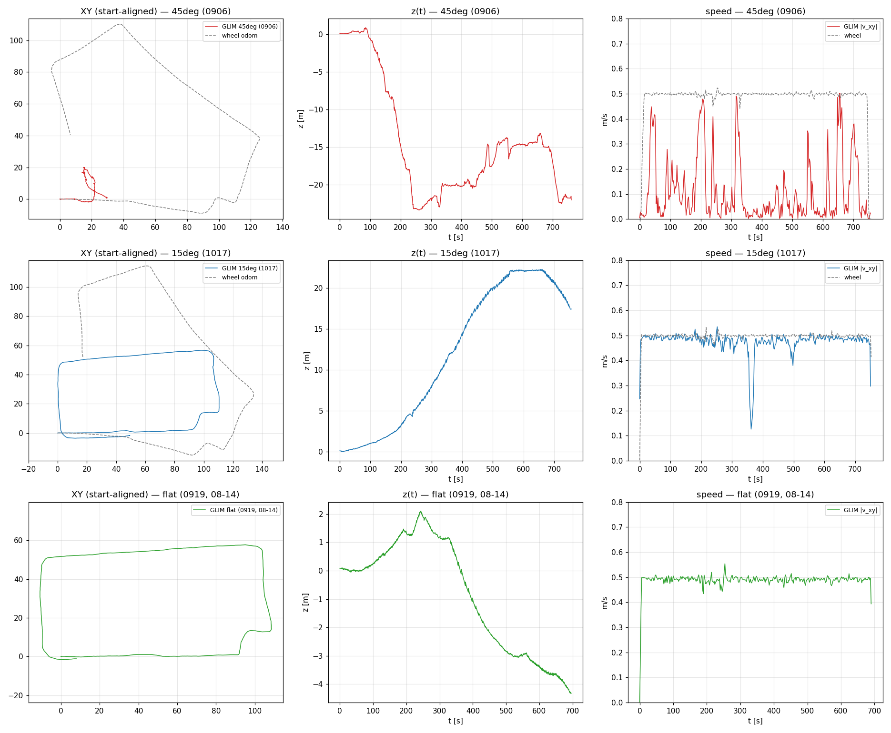
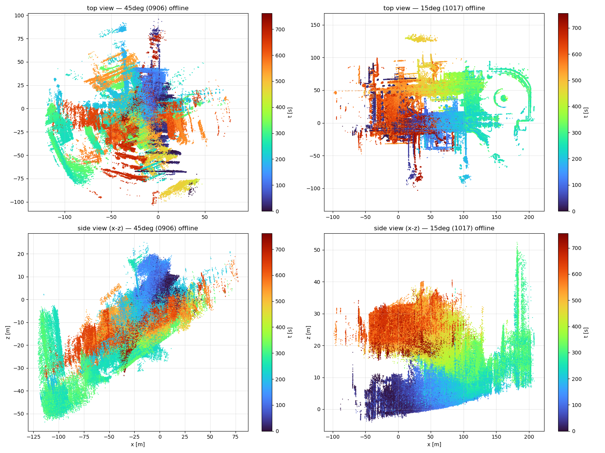
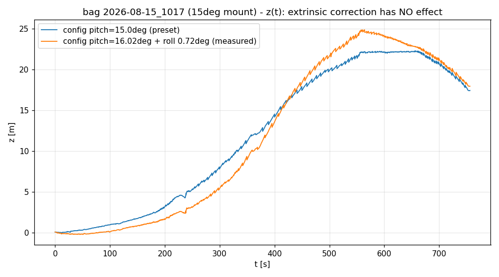

<!-- claude: 調査記録。2026-08-16 セッション。08-15 の取付角実験 bag (45°/15°) の GLIM 地図崩壊の原因調査。 -->
# R-Fans 取付角実験 (45°/15°) — GLIM 地図崩壊の原因調査

- **ステータス: 原因特定済み — 15° はセンサ内部の per-scan 系統誤差 (縦角表が本命) の z 投影が取付傾斜で増幅されて暴騰、45° は「近距離地面偏重による照合縮退」。extrinsic 角度誤差説は因果実験で棄却済み**
- 対象 bag: `bags/9goukan/2d3d_imu/online/rosbag/2026-08-15_{0906,0932,1017}` (5 号館外一周、0.5 m/s / 0.6 rad/s、各 ~760 s)
  - 0906 = 45° 取付 (URDF/GLIM 設定も 45°)
  - 0932 = 15° 取付・設定は 45° のまま (設定ミスマッチ回。ただし GLIM オフラインでは正しい 15° 設定で再実行可能 = 有効な 15° サンプル)
  - 1017 = 15° 取付・設定 15° — **オンラインで地図崩壊** (ユーザ報告)
- 関連: `2026-08-15_9goukan_building_wall_doubling.md` (z ドリフト→ループ不発→二重壁)、
  `2026-08-14_rfans_driver_renewal.md` §8 (縦角表の系統誤差)

## 結論の樹形図

```
取付角実験の GLIM 崩壊
├── ラベル検証 (bag の tf_static で実証)
│   ├── 0906/0932 = 45° URDF、1017 = 15° URDF — 記録時の設定切替ミスなし
│   └── プリセット (URDF rpy ↔ config_sensors の T_lidar_imu) も数値検算で完全一致 — 設定ファイル無罪
│
├── 15° 取付 (1017, 0932) — 「z 暴騰」型の崩壊
│   ├── 症状: 水平は健全 (経路長 = 車輪 odom +3%、建物輪郭も再現) だが
│   │   z が単調に +17〜25 m 上昇 (経路の +5〜7% 勾配相当) → 同じ場所が 2 高度に二重化して地図崩壊
│   ├── 再現性: 1017 (+17.3 m) と 0932 (+25.3 m) の独立 2 本で完全再現
│   ├── 棄却した仮説: 「実取付角 (実測 16〜17°) と設定角 (15.0°) の 1〜2° 差」が犯人
│   │   ├── 観測は本物: bag 冒頭の地面平面 RANSAC で 1017 = 16.0°、0932 = 16.7〜17.1°
│   │   │   (flat 取付の 0919 で同実測 1.0〜1.5° → 地面はほぼ水平、手法精度 ~1°)
│   │   └── 因果実験 (m16): T_lidar_imu を実測角 (pitch 16.02° + roll 0.72°) で作り直し
│   │       1017 を再実行 → z ドリフト +17.9 m で補正前 (+17.3 m) と変わらず = **効果ゼロ、棄却**
│   │       (理屈も整合: 静的な extrinsic 誤差は地図全体を一定角傾けるだけで、
│   │        スキャン毎に累積する z ドリフトは作れない)
│   └── 残る本命: センサ座標系に固定された per-scan 系統誤差 = **縦角表の系統誤差**
│       ├── flat でも −1.3% の z 沈みとして既知 (`2026-08-14_rfans_driver_renewal.md` §8-2)
│       ├── 取付を傾けると「どのビームがどの距離の地面/壁に当たるか」が変わり、
│       │   誤差の z 投影が増幅 (15°: +4.5〜6.5%)・符号反転 (45° ヨー180°: 沈み) する
│       └── 地面フィットの「+1〜2°」も縦角バイアス自身の混入と解釈できる
│           (flat で 0° でなく 1.0〜1.5° に見えるのがまさにそれ)
│
├── 45° 取付 (0906) — 「並進喪失」型の崩壊 (15° とは別の失敗モード)
│   ├── 症状: オフライン再実行で経路長 116 m (車輪 odom 369 m の 1/3)、z −22 m。
│   │   GLIM 推定速度が車輪 0.5 m/s に対し常時 0 付近へ脱落を繰り返す = スキャン照合が滑っている
│   │   (フレーム落ちなし = 再生速度の問題ではない。ユーザの前夜の中断 run でも 187 s で z −9 m と同傾向)
│   ├── 原因 1: 近距離地面偏重による照合縮退
│   │   ├── 45° 前傾は点の 54% が半径 ~2.6 m の地面に集中 (中央値レンジ 2.57 m vs 15° の 5.36 m)
│   │   └── preprocess の 1 m ボクセル間引き後の有効点: 45° = 1,064 個 (うち >20 m は 283)
│   │       vs 15° = 1,970 (>20 m 902) / flat = 2,170 (>20 m 1,159) — 遠方拘束が 1/4 に激減
│   └── 原因 2: 縦角系統誤差の z 投影 (ヨー 180° 取付なので 15° と逆符号 = 沈む方向) も併発
│       — ただし並進喪失の主因は縮退の方
│
└── 補足: ユーザ体感で「0906 (45°) は地図が出た」件
    └── オンライン dump は未保存で検証不能。オフライン同条件では 2 回とも崩壊しており、
        45° 構成が良かったという証拠は現状ない (RViz 追尾ビューでは崩壊が見えにくい点にも注意)
```

z ドリフトのまとめ (符号が取付ジオメトリで反転 = 誤差源がセンサ座標系に固定されていることの傍証):

| 取付 | ヨー | 地面フィット実測 − 設定ピッチ | z ドリフト |
|------|------|------------------------------|-----------|
| flat (0919) | 0° | +1.0〜1.5° | −4.4 m / 344 m (−1.3%) |
| 15° (1017) | 0° | +1.0° | +17.3 m / 384 m (+4.5%)。実測角補正 (m16) でも +17.9 m = 補正無効 |
| 15° (0932) | 0° | +1.7〜2.1° | +25.3 m / 389 m (+6.5%) |
| 45° (0906) | 180° | +2〜4° | −22 m (経路過小のため率は参考値) |

## 証拠画像


*3 構成の GLIM 軌跡 vs 車輪 odom。左列 XY: 45° は 30 m 四方に潰れ、15° は建物一周を再現 (車輪 odom の方が yaw ドリフトで歪んでいる — flat 0919 の GLIM と 15° の GLIM は同じ 110×57 m 形状で相互に整合)。中列 z(t): 45° は −22 m へ沈み、15° は +22 m へ単調上昇 → 終盤 560 s で頭打ち。右列速度: 45° は GLIM 速度が 0 付近へ脱落を繰り返す = 照合滑り、15° は車輪と一致。*


*再構成地図 (時刻色分け)。45° (左) はトップビューで壁が全方位に散乱 = 完全崩壊。15° (右) はトップビューの構造は良いが、側面図で序盤 (青, z≈0) と終盤 (赤, z≈+20〜30 m) の同じ環境が 2 層に分離 = 「map が崩壊した」の実体。*


*同一 bag (1017) を設定ピッチ 15.0° (青) と実測 16.02°+roll 0.72° (橙) で実行した z(t)。
両者はほぼ同一曲線で終点差 0.6 m — extrinsic の 1° 補正は累積 z ドリフトに効かない (仮説棄却の決定打)。*

## 再現・解析手順

- オフライン実行 (glim コンテナ):
  ```bash
  # config: /glim_config を /tmp/exp/<name>/config へコピーし、
  #   config_sensors.json をプリセットで差し替え + config_ros.json の viewer 系 extension を除去
  source /opt/ros/jazzy/setup.bash && source /root/ros2_ws/install/setup.bash
  ros2 run glim_ros glim_rosbag /workspace/bags/9goukan/2d3d_imu/online/rosbag/<bag> \
    --ros-args -p config_path:=/tmp/exp/<name>/config -p auto_quit:=true -p dump_path:=/tmp/exp/<name>/dump
  # ⚠️ glim コンテナ内の bag は /workspace/bags (先頭の /bags は過去の残骸ディレクトリで空)
  # ⚠️ playback_speed は ROS パラメータでは効かない (config_ros.json 側)。既定 100 でも
  #    throttling で自動待ちするためフレーム落ちなし (run.log の "throttling timeout" 0 件で確認)
  ```
- 取付角の実測 (地面平面 RANSAC): セッション scratchpad `mount_check.py` (main コンテナ、bag 冒頭 3 フレーム、r=1〜8 m、閾 5 cm)
- 地図再構成・図: `dump_to_npz.py` (glim コンテナ) → `compare_runs.py` / `map_views.py` (main コンテナ)
- dump 保存先: `bags/9goukan/2d3d_imu/offline/glim/exp_2026-08-16/` (m45=0906/45°設定, m15=1017/15°設定, m15b=0932/15°設定, m16=1017/実測16°補正)

## 対策 (優先順)

1. **縦角再較正が全ての前提 (既存の本命タスクの優先度がさらに上がった)**: flat の −1.3% も
   15° の +4.5〜6.5% も同じ根 (縦角表の系統誤差) で、取付を傾けるほど増幅される。
   新ドライバ出力でその場旋回較正をやり直し `vangle_override` へ反映するまで、
   **傾け取付での屋外周回評価は原理的に無駄** (角度実験を続けても縦角誤差の別投影を見るだけ)。
2. **45° 前傾は不採用**: 縦角以前に、近距離地面偏重 (有効ボクセル半減・>20 m 拘束 1/4) で
   照合が縮退し並進を失う。preprocess の距離適応間引き等の追加対策なしでは使えない。
3. **当面の運用は flat が最小被害** (−1.3%)。傾け取付を再評価するのは縦角較正の後。
4. extrinsic 角度の実測 (地面平面フィット) は累積ドリフトには効かないが、
   地図全体の傾き・URDF 整合のためには引き続き有用 (手法は本 doc の再現手順参照)。
