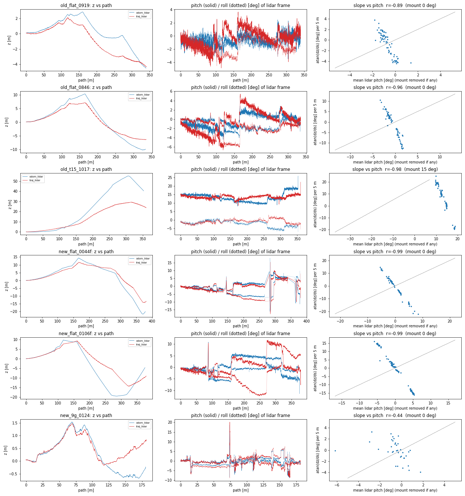
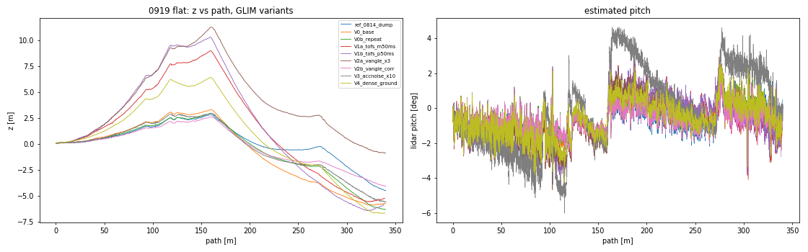
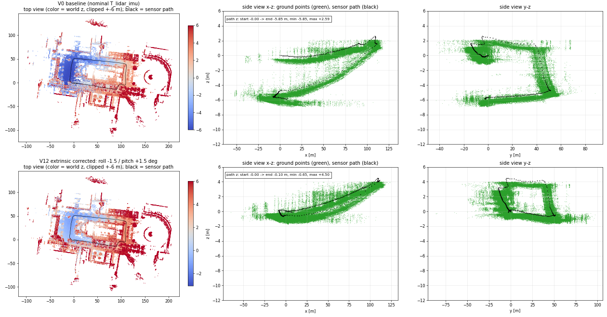
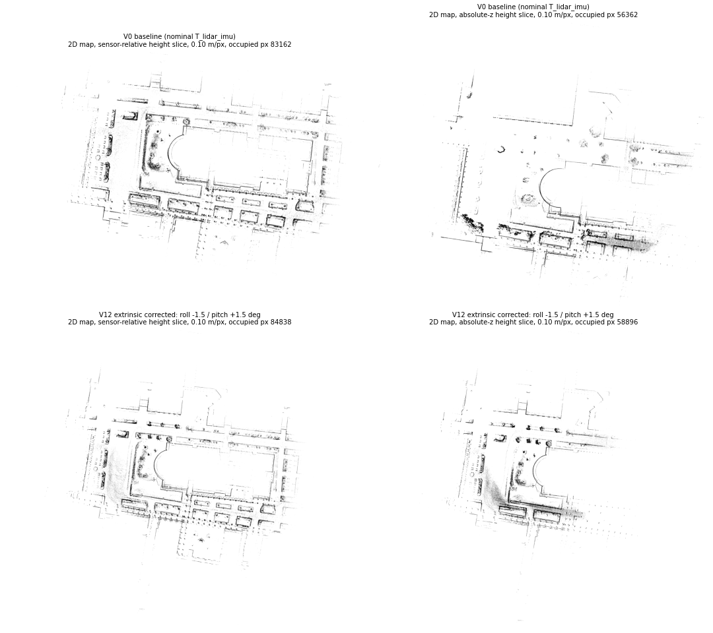

<!-- claude: 調査記録。2026-09-10 セッション。「GLIM の z ドリフトは R-Fans 縦角表の誤差が原因」という 08-14〜08-16 の結論を、否定する前提で再検証した。 -->
# GLIM z ドリフトの再検証 — 「縦角表の系統誤差が主犯」説は棄却

- **ステータス (2026-09-13): 調査完了 — critic 2 回査読 (§7) + 計 29 run。z ドリフトは 3 成分に分解できた。(1) 一定沈降 c ≈ −1° (z_end の主因) = LiDAR–IMU extrinsic の pitch ずれ **実測 0.9°** (静止較正 §9.3、c の約 1/3) + 縦角の地面リング偏り (odometry 段で −20%、global 後は縮む) + 未特定の残り。±1.5° の摂動合成で c が 0 になったのは過補正 (§9.3)。(2) heading 依存の世界固定傾き A ≈ 3° (rms/山谷の主因) = GLIM の登録幾何側 (地面密度 V4 で +54%、IMU 系 6 設定・初期化・extrinsic・縦角では不変、向きは開始姿勢に付随) — **SLAM 側の弱点、発生機構は未解明**。(3) 新車体の破綻 (A 13°、終点 pitch −11.5°) = BNO086 |g| +3% が主 (`acc_scale 0.9713` で A 8°・pitch +0.6°) + モータ脱落 −48 m + 未較正 extrinsic。縦角表は主犯ではない (旧結論の格下げ)。**bag は全て再利用可 (§8)**
- 査読: 初稿の「縦角棄却 = 確定」「旋回で submap の地面が傾いて作られ滑る」は critic subagent の反証 (§7) で**格下げ・撤回**。初稿の記述は履歴として §1〜§3 に残し、訂正箇所には ⚠️ を付けた
- 発端: ユーザ指摘「付属 USB に縦角の個体値が無いなら個体差は許容範囲のはず。縦角のせいと断定した資料が多すぎて判断が固定されている。縦角のせいでない前提で再検証せよ」
- 上書き対象: `2026-08-14_rfans_driver_renewal.md` §8 / `2026-08-15_9goukan_building_wall_doubling.md` / `2026-08-16_rfans_mount_angle_glim_z_collapse.md` の「縦角表が本命」「縦角再較正が全ての前提」という結論
- 実験一式: `bags/5goukan/2d3d_imu/offline/glim/exp_2026-09-10_adv/` (config・軌跡 txt・run.log・全スクリプト。frame dump は容量節約のため未保存)

## 結論の樹形図 (最終版 2026-09-13 — critic 2 回査読 + 29 run)

```
GLIM の z ドリフト = 3 成分  (直進区間の勾配 = c + A·cos(h−h₀)、R² 0.8〜0.9)
├── (1) 一定沈降 c ≈ −1°  → z_end (周回終点の高さ誤差) の主因         【入力側・確定寄り】
│   ├── LiDAR–IMU extrinsic の pitch ずれ: 静止較正で **実測 +0.9°** (旧車体、roll ≈0。§9.3)
│   │   実測値を入れると global 後 c −1.0 → −0.73、z_end −5.3 → −3.5 m = c の約 1/3
│   │   ⚠️ ±1.5° の摂動合成 (V12) で c が 0 になったのは過補正 (他要因の相殺)。較正値に使わない
│   ├── roll −1.5° で旋回時の pitch 跳び k が消えるが、静止較正では roll ≈0 → k は extrinsic でなく別機構 (deskew/時刻) を相殺していた
│   ├── 残り約半分の c は未特定 (候補: 残留時刻オフセット、登録側)
│   ├── 副: 縦角表の地面リング偏り (odometry 段で c/A −20%、global 後は消える。§2.2)
│   └── 副 (n=1): LiDAR stamp の残留時刻オフセット ≈ −15 ms (odometry A −16%)
├── (2) heading 依存の傾き A ≈ 3°  → rms・折れ線の山谷の主因            【SLAM 側・機構未解明】
│   ├── 動かないもの: IMU 系 GLIM 設定 (初期化モード/窓・bias noise・acc noise・threads)、extrinsic 回転、縦角 (global 後)
│   ├── 動くもの: 登録側設定 (地面密度 V4 で +54%)、入力の摂動全般 (時刻 ±50 ms・縦角外挿で 2 倍)、新車体 (13°)
│   ├── 向きは開始姿勢に付随 (新車体 0106f で同 heading 再訪の勾配が再現。旧車体は V6a 1 本で傍証)
│   ├── 直進内で勾配が単調変化 = 「旋回後の段差が直進中に緩和」する動的成分も混在
│   └── 残る仮説: 疎な屋外地面での z/ピッチ結合 (前方地面が地図に無い非対称) / 単一 CCW 周回の交絡 (CW 周回 bag で識別)
├── (3) 新車体だけの加算                                                   【入力側・確定】
│   ├── BNO086 |g| +3% (10.1 m/s²): acc_scale 0.9713 で A 13 → 8°、c −1.1 → −0.1、終点 pitch −11.5 → +0.6°
│   ├── モータ脱落 3 窓で z −48 m (0044)
│   └── T_lidar_imu が名目値のまま (IMU 再取付後未較正) → 残り A 8° の次の容疑
└── 棄却・格下げ: 縦角表が主犯 (08-14〜16 の結論)、実地形、IMU 軸取り違え、スレッド競合、初期化値の誤り

【critic 第 1 回査読後の版 — 履歴】
GLIM の z ドリフト (屋外周回で数 m〜数十 m)
├── 縦角表の系統誤差: 主犯ではない (信頼度: 本命〜確定寄り)。副次寄与 ≤30% は未確定 (n=1、§2.2)
├── z(s) の正体 = 単一の世界固定傾き A + 一定沈降 c   (直進区間フィット R² 0.77〜0.91)
│   ├── A ≈ 3° (旧 flat)、幾何/時刻の摂動で決定論的に 6〜7° に倍化、新車体で 13° (4 倍)
│   │   → 傾きの大きさは入力側 (ハード/較正) の誤差に依存。屋外の z/ピッチ観測性欠如は「増幅条件」
│   ├── 傾きは旋回前の最初の直進 92 m から存在 (+1.5〜+6 m) → 「旋回が傾きを作る」は撤回
│   ├── 角で折れるのは heading への投影 A·cos(h−h₀) が変わるだけ。周回で A は打ち消し z_end ≈ c × 経路長
│   └── A の発生源 (未特定): H1 初期重力整合 / extrinsic 回転、H2 残留時刻オフセット (±10〜20 ms 未走査)、H5 縦角の一部
├── 旋回時のピッチ跳びは「乱数的」ではなく符号がヨー方向にロック (8 run 44 事象で全一致、k≈+0.02〜0.06)
│   = 体固定の yaw→pitch 結合 (extrinsic roll 誤差 or 旋回中 deskew)。ただし IMU を緩めて跳びが 3 倍でも z 不変 → z の主因ではない
├── 実地形は平坦 (IMU 重力方向の直進区間平均: 全 heading で +0.6〜+1.1°、差 ±0.25°) → 地形説は棄却
├── xy の周回閉合誤差も 8.6〜9.6 m と z と同規模 → 「z 固有の問題」という枠組み自体を再考 (始終点同一かユーザ確認要)
└── 新車体 bag 固有の加算要因
    ├── モータ脱落 3 回 (各 5.3 s の点群欠落): 0044 の z −102 m のうち −48 m がこの窓 (確定)
    ├── BNO086 の |g| 9.84 → 10.09〜10.13 m/s² (+3%、スケール)。A が 13° に跳ねた候補 (acc_scale で検証可)
    └── 推定ピッチが終点で −11.4° / −11.5°、IMU 重力は 0.5° 以内 → 推定側の破綻

【初稿の樹形図 — 履歴として保持。⚠️ 印は §7 で訂正】
GLIM の z ドリフト (屋外周回で数 m〜数十 m)
├── ⚠️ 棄却: R-Fans 縦角表の系統誤差 (08-14〜08-16 の本命)  → 「主犯ではない」に格下げ (寄与ゼロは未確定)
│   ├── 因果実験 (0919 bag、点群を再投影して縦角だけ変えた)
│   │   ├── 実測値で補正 → z_end −4.1 m (無補正 −4.5 / −5.7 / −6.3) = 差なし
│   │   └── 誤差を 4 倍に悪化 → z_end −0.9 m、最大振れ +11 m = 4 倍にならず「形が入れ替わる」だけ
│   ├── ⚠️ 大きさの矛盾: 実測誤差 (≤0.5°) が作れる床の歪みは半径 8 m で 7 cm の前後対称な皿。
│   │   観測される勾配 (5〜15°、5 m 走って 1 m) には 2 桁足りない  → §7: 比較対象が不適切 (ピーク勾配 vs 平均沈降 c≈1°)、同オーダー
│   └── 符号の矛盾: センサ固定の誤差なら同じ取付で同じ向きに積もるはずだが、
│       全 flat bag で z は「上がって → 下がる」と途中で反転する (図 01)
├── 同じく効かない (感度なし): LiDAR–IMU 時刻オフセット ±50 ms / IMU 加速度ノイズ 10 倍 / 地面点密度 2 倍
│   └── いずれも z(s) の形 (折れ点位置) は不変、振幅だけ 2〜5 m の範囲で入れ替わる = 乱数的
├── ⚠️ 本命 (格上げ): SLAM 側の z/ピッチ観測性の問題  → §7: 「旋回が傾きを作る」は撤回。観測性欠如は増幅条件、傾き A は入力側誤差に比例
│   ├── z(s) は「角で傾きが変わる折れ線」— 折れ点 = ヨー旋回 (30〜90°) と一致
│   ├── 5 m 区間の勾配 atan(dz/ds) は推定ピッチと r = −0.9〜−0.99 で結合、利得 −3〜−4.5
│   │   └── IMU を緩めると利得 −1 (= 機体軸に沿って滑る) に変わり、z 自体は不変
│   │       → z の動きは scan matching が決め、IMU は姿勢の追従度合いを変えるだけ
│   ├── 屋内 (9 号館・天井あり) の新車体 bag では z ±1.5 m / 180 m で消える
│   └── 解釈: 旋回で submap の地面が数°傾いて作られ、以後の水平なスキャンがその傾いた
│       地面に沿って z を滑らせる。次の角で別の傾きに置き換わり折れ線になる
└── 新車体 bag 固有の加算要因 (縦角と無関係)
    ├── モータ脱落 3 回 (各 5.3 s の点群欠落): 0044 の z −102 m のうち −48 m がこの窓で発生
    │   └── フィルタ bag (欠落 3 区間を除去) でも欠落窓で −9.4 m、旋回中 −23 m → −0.5 m に減少
    ├── BNO086 の |g| が 9.84 → 10.09〜10.13 m/s² (+3%) に変化 (静止・ベクトル平均で確認 = 振動でなくスケール)
    └── 推定ピッチが終点で −11.4° (0044f) / −11.5° (0106f)。IMU 重力は始終点とも傾き 0.5° → 推定側の破綻
```

## 1. 全 bag の z ドリフト分解 (odom_lidar.txt、5 m 窓)

区間分類: gap = 軌跡の時刻飛び >0.5 s (点群欠落)、stat = 静止、turn = ヨー角速度 >0.15 rad/s、straight = その他。

| bag | 取付 | 経路 m | z_end | z_min / z_max | dz(gap) | dz(stat) | dz(turn) | dz(straight) | 終点ピッチ |
|---|---|---|---|---|---|---|---|---|---|
| 旧 flat 0846 | flat | 334 | −10.0 | −10.2 / **+10.3** | 0 | −0.03 | +0.09 | −10.0 | −2.7° |
| 旧 flat 0919 | flat | 340 | −4.6 | −4.5 / +2.9 | 0 | −0.01 | −0.13 | −4.4 | +0.5° |
| 旧 15° 1017 | tilted15 | 353 | +40.4 | −0.2 / **+55.1** | 0 | −0.01 | +2.9 | +37.5 | +25.9° (取付 15°) |
| 新 flat 0044 (生) | flat | 416 | −101.7 | −101.7 / +20.8 | **−48.0** | −0.09 | **−22.9** | −30.7 | +2.2° |
| 新 flat 0044f (欠落除去) | flat | 379 | −20.1 | −21.6 / +14.4 | −9.4 | +0.01 | −0.5 | −10.2 | **−11.4°** |
| 新 flat 0106f | flat | 375 | −4.7 | **−19.5** / +9.8 | +0.6 | 0 | +0.7 | −6.0 | **−11.5°** |
| 新 9号館 0124 (屋内) | flat | 180 | −0.3 | −0.7 / +1.5 | 0 | −0.03 | +0.10 | −0.36 | −1.9° |
| 新 9号館 0030 (屋内) | flat | 10 | −0.07 | 0.1 / 0.3 | 0 | 0 | 0 | −0.07 | −0.9° |

読み方:
- **z は単調でない**。0846 は +10 m まで上がってから −10 m へ、0106f は −19.5 m まで沈んでから −4.7 m へ戻る。センサ座標系に固定された誤差 (縦角表・取付角) は同じ走り方で同じ向きに積もるので、この反転は説明できない。
- **静止中は一切動かない** (IMU 単独のバイアス暴走ではない)。
- **屋内 (天井あり) では消える**。縦角誤差は床も天井も同じように歪めるので、天井の有無で 1 桁変わるのは「z を拘束する面が地面しか無い」観測性の問題を示す。
- 08-16 が「センサ座標系に固定された誤差の傍証」とした「ヨー 180° 取付で符号反転」は、45° 取付が同時に照合縮退を起こしており (同 doc 自身が認定)、符号比較として成立していない。


*左: 経路長に対する z (青 odom_lidar / 赤 traj_lidar)。中: LiDAR フレームの推定ピッチ (実線) とロール (点線) — 数°の階段状ジャンプが z の折れ点と一致。右: 5 m 区間の勾配 atan(dz/ds) vs 平均ピッチ — 屋外 bag は r = −0.89〜−0.99 で強く結合、屋内 0124 は r = −0.44 で弱い。*

### ピッチのジャンプは旋回で起きる

3 s 中央値で平滑した推定ピッチが 10 s 以内に 2° 以上変わった箇所と、その窓内のヨー変化:

| bag | ジャンプ (経路位置, Δpitch) と窓内ヨー変化 |
|---|---|
| 0919 | 270 m: +2.2° (ヨー +64°) |
| 0846 | 106 m: +2.0° (+31°) / 107 m: −2.4° (−62°) / 119 m: +2.1° (+89°) / 163 m: +2.1° (+64°) |
| 0106f | 11 件中 8 件がヨー 38〜85° の旋回窓、3 件は直進中 (−0.6° / −6.6° / +5.7°) |
| 0044f | 11 件中 7 件が旋回窓 (23〜87°)、4 件は直進中 |

## 2. 因果実験 — 0919 (旧車体 flat・10 Hz・|g| 正常・欠落なし) で GLIM を条件替え再実行

基準 config = 08-14 の dump に同梱された config (T_lidar_imu 旧車体値)。viewer 系 extension のみ除去。各 run 約 4 分 (3× 再生)。

| 変種 | 変更内容 | z_end | z_min / z_max | rms z | r(勾配,ピッチ) | 利得 |
|---|---|---|---|---|---|---|
| 08-14 原 dump | — | −4.50 | −4.5 / +2.9 | 1.79 | −0.89 | −3.3 |
| V0 基準 再実行 | 同一 config | −5.73 | −5.9 / +3.3 | 3.02 | −0.90 | −3.6 |
| V0b 基準 再々実行 | 同一 config | −6.31 | −6.3 / +3.0 | 2.58 | −0.90 | −3.4 |
| **V2b 縦角補正** | 点群を再投影し、09-02 実測値でリング 0〜5 の仰角を置換 | **−4.07** | −4.1 / +2.6 | 1.86 | −0.83 | −3.0 |
| **V2a 縦角 4 倍悪化** | 実測誤差の傾向を全リングに外挿し 3 倍加算 (最大 +1.65°) | **−0.86** | −0.9 / **+11.3** | 5.45 | −0.97 | −4.2 |
| V1a 時刻オフセット | points_time_offset −50 ms | −5.24 | −5.6 / +9.0 | 4.70 | −0.97 | −4.3 |
| V1b 時刻オフセット | points_time_offset +50 ms | −5.84 | −6.4 / +10.3 | 5.57 | −0.97 | −4.5 |
| V3 IMU 緩和 | imu_acc_noise 0.05 → 0.5 | −5.60 | −5.6 / +3.0 | 2.43 | −0.98 | **−1.0** |
| V4 地面密度 | preprocess downsample 1.0 → 0.5 + ivox 1.0 → 0.5 | −6.68 | −6.7 / +6.4 | 3.85 | −0.95 | −4.1 |
| V5 E11 | 08-13 推奨 tuning 一式 (V4 + submap 最適化 ON + global voxel 0.25 + sampling 0.5) | **未完** (§2.1) | — | — | — | — |

判定基準: 同一 config の 3 run で z_end が −4.5 / −5.7 / −6.3 とばらつく (**run 間ノイズ ≈ ±1 m、rms 1.8〜3.0**)。変種の効果はこれを超えて初めて意味を持つ。

- **縦角補正 (V2b) は基準 3 run の範囲内**。改善と言える差はない。⚠️ §7: 基準 3 run の SD 0.93 m に対し 1.3σ。1 run で棄却できるのは「寄与 40% 以上」だけで、≤30% の寄与は未確定 → §2.2 で追加 2 run。
- **縦角 4 倍悪化 (V2a) は「4 倍悪化」しない**。z_end はむしろ 0 に近づき、代わりに +11 m の山ができる。⚠️ §7 の訂正 2 点: ① V2a は未実測リング 6〜15 (壁・樹木側) に外挿値 +1.65° を加えた「別の誤差パターン」で、地面リング限定の ×4 ではない。② z_end は周回で打ち消される傾き A を見ておらず、rms 1.8〜3.0 → 5.45 (2 倍)・z_max 3 → 11 m と大きく応答している。「乱数的に入れ替わる」も誤りで、V1a/V1b/V2a/V4 は全て同じ向きに A を倍化する決定論的な感度 (`small overlap` 警告も 19〜25 → 35〜61 に連動)。
- V3 で利得が −3.6 → −1.0 に変わり z は不変 → z の滑りは scan matching 由来で、IMU の重みは「姿勢がその滑りにどこまで付いていくか」だけを変える。
- V4 (地面点を密に) も効かない → 単純な点密度の問題でもない。


*全変種で z(s) の折れ点 (≈95 / 120 / 160 / 270 m = 旋回位置) は共通。縦角補正 (V2b) は基準と重なり、4 倍悪化 (V2a) は時刻オフセット系と同じ「振幅入れ替え」パターン。*

### 2.1 V5 (E11) の結果 — 未完 (メモリ枯渇でホスト再起動)

E11 一式 (前処理 0.5 m + iVox 0.5 m + submap 内部最適化 ON + global voxel 0.25 + sampling 0.5) を 0919 屋外 340 m bag に適用したところ、GLIM のメモリ監視が **15.68 / 15.74 GB (99.6%)** を記録して再生速度 0.000x に落ち、その直後にホストが再起動 (21:11)。main / glim コンテナも巻き添えで停止した (再起動後に `docker compose up -d` で復旧済み)。08-13 の E11 評価は屋内 235 s bag だったので、屋外の長距離 bag では規模が違う。**E11 の z ドリフト効果は未評価**。再挑戦するなら global voxel 0.25 と sampling 0.5 を外した V4 + submap 最適化 ON のみに絞ること (V4 単体は 4 分・問題なく完走している)。

⚠️ この機械は 16 GB RAM。屋外長距離 bag で GLIM の解像度を上げる実験は、`config_ros` の memory_monitor 警告を run.log で見ながら 1 本ずつ行う。

### 2.2 追加 run (critic 推奨、§7) — 縦角補正 ×2 と時刻オフセット ±15 ms

指標は critic 推奨に従い z_end だけでなく、直進区間フィット slope = c + A·cos(h−h₀) の **A (世界固定傾き)・c (一定沈降)** と rms を並べる (`metrics_Ack.py`、critic の手法を移植し数値一致を確認)。

| 変種 | z_end | rms z | A [°] | c [°] | R² |
|---|---|---|---|---|---|
| 基準: 08-14 原 dump / V0 / V0b | −4.50 / −5.73 / −6.31 (平均 −5.5、SD 0.9) | 1.79 / 3.02 / 2.58 | 2.82 / 3.21 / 3.33 (平均 3.1) | −1.09 / −0.94 / −1.28 | 0.77〜0.89 |
| **縦角補正 ×3** (V2b / r2 / r3) | **−4.07 / −3.70 / −4.66 (平均 −4.1、SD 0.5)** | 1.86 / 1.56 / 1.89 | **2.48 / 2.51 / 2.54 (平均 2.5)** | −0.62 / −0.87 / −0.88 | 0.72〜0.80 |
| V1c points_time_offset −15 ms | −4.27 | 2.15 | **2.60** | −0.67 | 0.81 |
| V1d points_time_offset +15 ms | −4.44 | 2.62 | 3.24 | −1.08 | 0.80 |
| (参考) ±50 ms (V1a / V1b) | −5.24 / −5.84 | 4.70 / 5.57 | 6.06 / 6.66 | −0.76 / −1.08 | 0.90 / 0.91 |

**判定 (時刻オフセット)**: A(offset) は −50: 6.1 / −15: **2.6** / 0: 3.1 / +15: 3.2 / +50: 6.7 と**非対称**で、最小が −10〜−20 ms 付近にある可能性 (n=1、−2.4σ)。LiDAR 点の stamp が実時刻より 10〜20 ms 遅い残留オフセットの候補だが確定ではない。⚠️ 初稿で「毎スキャンの `does not cover` 警告 17.7 ms と符合」と書いたのは**誤帰属** (critic §7.2): この超過量は `points_time_offset` を −50〜+50 ms 振っても全 run で平均 17.7 ms (14.3〜19.2) と不変で、LiDAR stamp ではなく IMU 積分の到達範囲を表す別の量。ドライバの受信遅延 L を stamp から引く恒久修正は V1c 1 run のみが根拠 → 追加 run で確認してから。暫定なら config_ros の `points_time_offset: −0.015`。

**判定 (縦角)**: 3 run とも z_end が −4.0±0.5 に収まり、A は 2.5° に 3 run で ±0.03° と揃う (基準は 2.8〜3.3)。→ **縦角補正は z_end を約 25%、傾き A を約 20% 減らす副次因子として実在する** (critic の H5 が的中)。ただし残る A ≈ 2.5°・c ≈ −0.8° が主成分で、その発生源は縦角ではない。表現は「主犯ではない (寄与 2〜3 割)」に確定。→ `vangle_override` に 09-02 実測値を入れる価値はある (地図精度の 2 割改善) が、z ドリフトの根治ではない。

判定基準 (時刻オフセット): ±15 ms で A が 3° を下回る側があれば残留時刻オフセットが A の主因候補。両側で A ≥ 3° なら時刻は棄却、H1 (初期整合) / H3 (extrinsic roll) へ。

### 2.3 GLIM 側の要因を振る (2026-09-13、ユーザ質問「GLIM 自体が問題の可能性は?」)

同じ 0919 bag・基準 config から GLIM 側の設定だけを 1 つずつ変えた。

| 変種 | 変更 | z_end | rms z | A [°] | h₀ | c [°] |
|---|---|---|---|---|---|---|
| 基準 ×3 | — | −4.50 / −5.73 / −6.31 | 1.8〜3.0 | 2.82 / 3.21 / 3.33 | +51 / +19 / +44 | −1.09 / −0.94 / −1.28 |
| V6a `start_offset 280` | 最初の角を曲がった後 (開始 heading +101°、走行中) から開始 | +1.88 | 3.66 | 4.01 | **+31 (自 frame)** | −0.52 |
| V6b 初期化 ROBUST | initialization_mode LOOSE → ROBUST | −6.32 | 2.63 | 3.37 | +41 | −1.30 |
| V7 単一スレッド | odometry / preprocess num_threads 2 → 1 | −5.58 | 2.02 | 3.15 | +54 | −1.31 |
| V8 バイアス雑音 ×100 | imu_bias_noise 1e-5 → 1e-3 | −7.33 | 3.15 | 3.34 | +36 | −1.48 |
| V9 初期化窓 10 s | initialization_window_size 3 → 10 (開始時の静止 20 s を使う) | −5.51 | 1.94 | 3.73 | **+90** | −1.09 |
| (再掲) V3 IMU 雑音 ×10 / V4 地面密度 ×2 | | −5.60 / −6.68 | 2.43 / 3.85 | 3.01 / 4.78 | +35 / +27 | −1.19 / −1.59 |
| (再掲) 入力側: 縦角補正 ×3 / 時刻 −15 ms | | −4.1±0.5 / −4.27 | 1.6〜1.9 / 2.15 | **2.48〜2.54 / 2.60** | | |

事実として言えること:
- GLIM 側の 6 設定はどれも **A の大きさを変えない** (3.0〜3.7°、V4 のみ 4.8° と悪化)。単一スレッドでも同じ → A は (データ, 設定) に決定論的で、run 間ばらつきは c / z_end 側。
- 初期化ログ: 基準 run の初期姿勢は quaternion (−0.0043, −0.0007, 0.7071, 0.7071) = 傾き 0.5°、初期バイアス ≈ 0 → **初期化の値は正確**。それでも最初の直進で z が +1.5〜2 m 上がる。
- **h₀ は開始姿勢に固定**: 開始 heading を +101° 変えた V6a でも自 frame で h₀ = +31° (基準は +19〜51°)。世界固定なら −66° 付近に出るはず。初期化窓 10 s では h₀ が +90° に動く (大きさは不変)。
- 入力側の変更 (縦角補正・時刻 −15 ms・新車体) だけが A の大きさを変える。

⚠️ 初稿の解釈「GLIM が向きを決め、入力の不整合が大きさを決める」は critic 査読 (§7.2) で**傍証のみ**に格下げ。訂正後の読み方:
- **IMU 系の GLIM 設定 4 種** (初期化モード・bias noise・acc noise・スレッド数) では A は ±1σ (SD 0.22°) 以内。**登録側の設定 (V4 地面密度) は odometry で A +54% と最大の感度** — 「GLIM 設定で不変」ではない。V9 (窓 10 s) は走行 5 s が窓に混入し初期姿勢が +1.7° 汚染された比較不能 run。
- 「h₀ が開始姿勢に固定」は 0919 の V6a 1 本では識別できていない (直進 5 区間のうち 15 m の 1 区間で h₀ が決まり、leave-one-out で発散。同 config でも h₀ は 19〜54° と 35° ばらつく)。新車体 0106f では同 heading 再訪で勾配が再現し (開始 heading 0°: +14.6〜16.7° → 1 周後 +12.7〜15.7°、逆 heading −15〜−16°、±90° ≈ 0)、**そこでは静的な傾きが本物**。
- **出力段依存**: global mapping 後の `traj_lidar.txt` で同じフィットをすると、基準 1.71 / 2.57 / 3.06 vs 縦角補正 3.34 / 2.55 / 1.88、V4 2.49 — odometry で見えた「縦角 −20%」「密度 +54%」は消える/逆転する。**入力補正の効果は odometry 段限定**。
- 直進内でも勾配は一定でない (V0: heading −9° の 92 m を 4 分割で 0.35→2.35°、逆 heading の 100 m で −5.4→−1.7°、ともに増加率正・推定 pitch も同じ比 ≈ −4.5 で変化) = 世界固定傾きの上に「旋回後の段差 → 直進中に緩和」という動的成分が乗っている。
- 全 bag が左旋回のみの単一周回のため、heading の関数と累積旋回・走行距離の関数を**数学的に区別できない** (交絡)。
- **残り約 2.5° の帰属は未定**。最有力かつ未試験 = LiDAR–IMU 回転 extrinsic (roll/pitch 1.5〜3°、§2.4 で掃引中)。GLIM 自身の `Possibly T_lidar_imu is not accurate` 警告が基準 0 件に対し摂動 run で 10〜73 件。初期姿勢 0.5° は名目 extrinsic で計算した表示値なので extrinsic の正しさの根拠にはならない (循環)。

### 2.4 LiDAR–IMU 回転 extrinsic の掃引 + 新車体 acc_scale (critic §7.2 推奨、2026-09-13)

`T_lidar_imu` の回転 (名目 = 純ヨー 90°) に LiDAR frame で roll / pitch ±1.5° を合成した 4 run (0919・基準 config)、および新車体 0106f に `acc_scale: 0.9713` の 1 run。判定 (critic): ある符号で A・c・k が揃って縮めば extrinsic 誤差が残り 2.5° の正体、A がベクトル的に増減するだけなら登録幾何側 (H-C) へ。

| 変種 | z_end | rms z | A [°] | h₀ | c [°] | (traj 段) A |
|---|---|---|---|---|---|---|
| 基準 ×4 (ref/V0/V0b/V7) | −4.5〜−6.3 | 1.8〜3.0 | 2.82 / 3.21 / 3.33 / 3.15 | +19〜54 | −0.9〜−1.3 | 1.71 / 2.57 / 3.06 / — |
| V10a roll +1.5° | −5.74 | 2.90 | 2.67 | +9 | −1.18 | 2.36 (c −1.27, z_end −6.1) |
| V10b roll −1.5° | −4.88 | 2.32 | **4.59** | +57 | −0.83 | **1.90 (c −0.28, z_end −2.4, rms 1.5 = 全 run 最良)** |
| V10c pitch +1.5° | −4.22 | 3.13 | 3.81 | +18 | −0.86 | 3.21 (c **−0.25**, z_end −1.1) |
| V10d pitch −1.5° | −6.26 | 2.76 | **1.98** | +48 | −1.01 | 1.75 (c −1.45, z_end −8.7 = 最悪) |
| V11 **新車体 0106f** acc_scale 0.9713 (基準: z_end −4.6 / rms 10.7 / A 13.15 / c −1.11 / 終点 pitch −11.5°) | +1.22 | **5.74** | **7.94** | | **−0.14** | 6.19 (基準 9.97)、c +0.01 (基準 −1.76)、終点 pitch **+0.6°** (基準 −7.7°) |

**判定 (新車体 acc_scale)**: BNO086 の |g| +3% を打ち消すだけで A が 13 → 8° (−40%)、沈降 c がほぼ 0、終点ピッチの破綻 (−11.5°) が消える。**新車体の巨大 z ドリフトの主要因の 1 つは IMU 加速度スケール異常 (critic H-D) で確定**。gtsam の重力 9.81 固定に対し 10.1 が入ると、`imu_bias_noise 1e-5` では吸収できない鉛直残差が毎フレーム地面と衝突していた。GLIM の `T_lidar_imu is not accurate` 警告は 0 → 161 件に増加 = |g| を直すと残る不整合が extrinsic に帰属される → 新車体の T_lidar_imu (名目値・IMU 再取付後未較正) が次の容疑。残り A 8° は旧車体 3° より大きく、旧車体の extrinsic 掃引と同じ手順を新車体 bag でやる価値がある。恒久対策は (a) BNO086 側でスケールを直す (較正 or ファーム設定確認) か、(b) config_ros の `acc_scale` に静止時 |g| から算出した値を入れる。
| V12 roll −1.5° + pitch +1.5° (合成) | −4.43 | 3.39 | **5.15** | +48 | −0.95 | **2.93 (c +0.10, z_end −0.01)** — 沈降は消えたが A は残る |

**判定 (V12 合成)**: global 後の沈降 c は −1.1 → +0.10、z_end は −5.8 → −0.01 m と**一定沈降は extrinsic の pitch/roll 補正で消える**。しかし heading 依存の傾き A は 2.6〜3.1 → 2.93 (global) / 3.2 → 5.15 (odometry) と**減らない、むしろ odometry では悪化**。旋回時の結合 k も合成では 0.018 に戻った (roll 単独では 0.002)。→ **extrinsic 回転は「一定沈降 c」の原因、「heading 依存傾き A」の原因ではない**。A は GLIM 設定のうち登録側 (V4 地面密度で +54%) にだけ反応し、IMU 系設定・初期化・extrinsic・縦角 (global 後) に反応しないので、**A の帰属は GLIM の登録幾何 (疎な屋外地面での z/ピッチ結合、開始姿勢を基準に固定) = SLAM 側** が残る唯一の候補。⚠️ V12 の extrinsic 値は 1 bag の z_end に合わせた摂動であり較正値ではない — 実較正 (静止・多方向の重力整合、または既存ツール) を経て `config_sensors.flat.json` に入れること。

旋回時ピッチ跳びの結合 k (Δpitch/Δyaw の中央値): 基準 0.013〜0.019 / roll +1.5° 0.017 / **roll −1.5° 0.002 (符号ロック 3/6 = 消失)** / pitch ±1.5° 0.013 / 0.018。GLIM の `Possibly T_lidar_imu is not accurate` 警告: roll −1.5° のみ 21 件 (他 0)。

**判定 (extrinsic 回転)**: critic の基準「ある符号で A・c・k が揃って縮む象限」は**無い**。A は odometry 段でベクトル的に増減 (pitch −1.5° で 1.98、roll −1.5° で 4.59) し、global 後には別の順位になる → **残り約 2.5° の傾き A は extrinsic 回転誤差単独では説明できない** (H-A としては棄却寄り、A は H-C 登録幾何 / H-B 動的過程へ)。一方で extrinsic の成分ごとに別の指標が反応した:
- **roll −1.5° で旋回時の pitch 跳びの符号ロックが消える** (k 0.013〜0.019 → 0.002) → 旋回ごとの pitch 段差は LiDAR–IMU の roll ずれ (≈ −1.5°、LiDAR frame) の署名。ただし GLIM の IMU 検証はこの向きを「不正確」と警告しており (21 件)、実較正値としては ±0.5〜1° の追い込みが必要。
- **pitch +1.5° と roll −1.5° は global 後の沈降 c を −1.1 → −0.25 / −0.28 に減らす** (z_end −5.8 → −1.1 / −2.4)。pitch −1.5° は逆に c −1.45 / z_end −8.7 と最悪 → 沈降 c は extrinsic pitch (+ 縦角の地面リング偏り) に感度が高い。
- 合成 (roll −1.5° + pitch +1.5°) を V12 で確認。c・k が同時に落ちて A だけ残れば「extrinsic 2 軸は c と k の原因、A は別 (登録幾何)」で切り分け完了。

## 3. ⚠️ 縦角誤差が原理的に作れる歪みの上限 (初稿 — §7 で「比較が不適切」と訂正)

09-02 の床フィット実測 Δ (実角 − 公式表) と旧車体センサ高 0.725 m から、1 スキャン内で床がどれだけ歪むか:

| リング | 水平距離 ρ | Δ | 床の見かけ深さ誤差 ρ·Δ |
|---|---|---|---|
| −15° | 2.7 m | +0.07° | 0.3 cm |
| −11° | 3.7 m | −0.29° | 1.9 cm |
| −7° | 5.9 m | −0.33° | 3.4 cm |
| −5° | 8.3 m | −0.49° | 7.1 cm |

半径 8 m で深さ 7 cm、センサと一緒に動く前後対称の浅い皿である。平行移動に対して皿同士の位置合わせは並進成分にバイアスを生まない (同じ形の皿を重ねるだけ) ので、1 次では累積しない。観測される勾配 (直進区間で 5〜15°) を作るには、毎フレーム皿の 1/5 ずつ同じ向きに滑り続ける必要があり、しかも旋回のたびに符号が反転する事実と両立しない。

## 4. IMU 側の実測 (代替仮説の切り分け用)

`/imu/data` を車輪 odom の静止判定で切り出し、ベクトル平均のノルムで評価 (振動なら |mean a| < mean |a| になる):

| bag | 静止 \|mean a\| | 静止 std\|a\| | 走行 std\|a\| | 重力方向の傾き (始/終) |
|---|---|---|---|---|
| 旧 0919 | 9.838 | 0.020 | 1.62 | 0.45° / 0.43° |
| 新 0044f | 10.094 | 0.078 | 0.37 | 0.50° / 0.57° |
| 新 0124 | 10.117 | 0.098 | 1.63 | 0.32° / 0.37° |

- 新車体で **|g| が +3%** (スケール異常、振動ではない)。GLIM は acc_scale 自動判定で 7〜12 の範囲なら 1.0 扱いなので、そのまま 10.1 が入っている。効果は未評価 (config_ros の `acc_scale: 0.9713` で検証可)。
- 重力方向は始終点で 0.5° 以内 = 機体は水平。それでも GLIM の終点ピッチは −11.4° / −11.5° → 推定側の破綻。
- 車輪 odom の前進加速・向心加速と IMU x/y の最小二乗マップは URDF rpy (0,0,π/2) の予測 (前進 → imu_y −1、向心 → imu_x +1) と符号一致 (−1.23 / +0.91)。IMU 軸取り違えではない。
- GLIM が毎スキャン出す "imu_rate stamp does not cover the scan duration range" は scan_end が IMU 末尾より 17.7 ms 先 (全 bag で一定)。V1a/V1b で ±50 ms 振っても z は変わらないので、この程度の時刻ずれは主因でない。

## 5. 判断の修正と次の一手

(2026-09-13 更新。3 成分ごとに対策先が違う)

1. **モータ脱落を止める** (`2026-09-02_rfans_scan_motor_dropout.md` の rps watchdog 実機確認)。新車体 0044 の −102 m のうち −48 m (確定)。
2. **新車体の IMU スケール**: 静止時 |g| を測って `config_ros.json` の `acc_scale` に 9.80665/|g| を入れる (暫定、0106f で A 13 → 8°)。恒久は BNO086 側 (ファーム設定・較正) の確認。旧車体 9.838 では不要。
3. **LiDAR–IMU extrinsic 回転の実較正** (一定沈降 c と旋回時 pitch 跳び k の原因): V12 の ±1.5° は 1 bag 合わせの摂動であり較正値ではない。静止・多方向で重力方向を突き合わせる、または既存の LiDAR–IMU 較正ツールで roll/pitch を求めて `config_sensors.flat.json` に反映。新車体は IMU 再取付後未較正なので必須。⚠️ extrinsic を直す前に地面拘束を入れると LiDAR と拘束が衝突する (critic)。
4. **heading 依存傾き A (SLAM 側) の機構特定**: 唯一動いたのは登録側設定 (V4)。次の実験候補 (各 4 分):
   - `imu_gyro_noise 0.02 → 0.002` (BNO086 に過大 = 姿勢を LiDAR に委ねている設定。pitch–z 結合の主調整弁)
   - `target_downsampling_rate` / `vgicp_resolution` / `registration_type VGICP` の掃引 (A が動くか)
   - 時計回り周回 bag の取得 (単一 CCW 周回の交絡を切る。フィールド 15 分)
   - 合成データ (平坦地面 + 壁 + 理想 IMU) を GLIM に入れて A が出るか (GLIM 単体検証、1〜2 h)
   - A が落ちない場合の対症: 地面拘束 (glim_ext `flat_earther`) / ループ閉合 + 地面平面拘束 / 周回の始終点を 20〜30 m 重ねる
5. **縦角 (`vangle_override`)**: odometry 段で 2 割改善するので 09-02 実測 6 リング分を入れる価値はあるが、global 後の地図には効かない。z 対策としての優先度は低い。メーカー問い合わせは z 目的では不要。
6. **ドライバの受信遅延 L** (`points_time_offset −0.015` 相当): 効果は n=1。追加 run で確認してから恒久修正を判断。
7. 08-14 / 08-15 / 08-16 の 3 文書の「縦角が本命」記述は本 doc を指す追記で格下げ済み。
8. ユーザ確認事項: 0919 / 0846 の始終点は同一地点か (xy 閉合誤差 8.6〜9.6 m の評価に必要)。

## 6. 再現手順

```bash
# 1) 縦角を変えた bag を作る (main コンテナ、約 3 分/本)
python3 reproject_bag.py <bag> <bag>_vcorr corr    # 09-02 実測値で補正
python3 reproject_bag.py <bag> <bag>_vx3  x3       # 誤差を 4 倍に悪化
# 2) glim コンテナで config 変種を作って順次実行 (setup_exp.py → run_chain.sh)
#    各 run: ros2 run glim_ros glim_rosbag <bag> --ros-args -p config_path:=... -p auto_quit:=true -p dump_path:=...
# 3) 比較 (compare_adv.py: z_end / z_min / z_max / rms / 勾配–ピッチ相関 / 利得)
```
スクリプトは全て `exp_2026-09-10_adv/` に同梱。再投影 bag (`2026-08-14_0919_vcorr` / `_vx3`、各 5.8 GB) は同スクリプトで 3 分で再生成できるため削除済み (コンテナ内 root 所有なので削除は `docker exec rerobot_env rm -rf ...` で行う)。再投影の正しさは frame #200 のリング別中央仰角で確認済み (vcorr: リング 2〜5 が −11.29 / −9.26 / −7.33 / −5.49°、vx3: 全リングが +0.87〜+1.65° 浅く)。

## 7. critic 査読 (反証専任 subagent、2026-09-10 — `.claude/agents/critic.md` の初回運用)

初稿の結論を「間違っている前提」で崩しにかからせた結果。critic は dump を自分で再解析した (スクリプト `critic_segments.py` / `critic_turns.py` / `critic_bag.py`、`exp_2026-09-10_adv/` に同梱)。

### 判定
- 縦角説の「主犯としての棄却」= 本命〜確定寄り。「寄与ゼロ = 確定」= **不可** (同 config 3 run の z_end SD 0.93 m、V2b は 1.3σ、n=1)。
- 「SLAM 側メカニズム (旋回で submap が傾く)」= **傍証のみ、しかも現データと 3 点で矛盾**。

### 識別力のある証拠 / 傍証にとどまる証拠
- 識別力あり: V3 (IMU 緩和で z 不変・利得 −1) — z は scan matching が決める。ただし「何が地面を傾けたか」は識別しない。実地形は平坦 (0919 の IMU 重力方向を直進 7 区間で平均: 全 heading で +0.61〜+1.09°、差 ±0.25° — GLIM 推定勾配は同区間で +1.0〜−4.2° と heading で反転) → 地形説棄却。V2b は主犯 (>50%) のみ棄却。
- 傍証: 「折れ点 = 旋回」(世界固定傾き A の heading 投影でも折れる)、「z の途中反転」(周回で heading が反転すれば投影も反転)、「屋内で消える」(観測性とも、距離・速度で幾何誤差が縮む説とも両立)、「大きさ 2 桁不足」(比較が不適切)。

### 直進区間フィット slope = c + A·cos(h − h₀) (直進 >8 m の区間、critic 実施)

| run | A [°] | h₀ | c [°] | R² | 旋回前 0→92 m の dz |
|---|---|---|---|---|---|
| 08-14 原 dump | 2.82 | +44° | −1.09 | 0.77 | +1.63 m |
| V0 / V0b | 3.21 / 3.33 | +17° / +38° | −0.94 / −1.28 | 0.86 / 0.89 | +2.04 / — |
| V2b 縦角補正 | 2.48 | +28° | **−0.62** | 0.80 | +1.46 |
| V2a 縦角摂動 | 6.05 | +26° | −0.17 | 0.80 | +6.15 |
| V1a / V1b (∓50 ms) | 6.06 / 6.66 | +18° / +12° | −0.76 / −1.08 | 0.90 / 0.91 | — / +6.34 |
| V3 IMU 緩和 | 3.01 | +30° | −1.19 | 0.80 | +2.00 |
| V4 地面密度 | 4.78 | +24° | −1.59 | 0.78 | — |
| 旧 0846 | 6.19 | +24° | −1.71 | 0.85 | (36 m で旋回) |
| 新 0106f / 0044f | **13.2 / 12.8** | −3° / +49° | −1.11 / −2.77 | 0.89 / 0.76 | +3.64 / +5.54 |

読み方: 傾きは旋回前から存在 (旋回起点説と矛盾)。周回で A の項は打ち消し、**z_end ≈ c × 経路長** (c −1.1° × 340 m ≈ −6.5 ↔ 実測 −5.7/−6.3、V2b の c −0.62° → −3.7 ↔ −4.07)。つまり初稿の指標 z_end は c しか見ておらず、A (rms / z_max に出る) を無視していた。摂動群は全て同じ向きに A を倍化 = 決定論的感度。新車体で A が 4 倍 → **傾きの大きさはハード側の入力誤差に依存し、SLAM の観測性欠如は増幅条件**。

### 代替仮説と棄却実験
- **H1 単一の世界固定傾き (初期重力整合 / extrinsic 由来) + 一定沈降** — 現データに最も整合。棄却実験: 同 bag を別 heading の区間から開始 → h₀ が初期 heading に追従するか (4 分)。
- **H2 残留 LiDAR–IMU 時刻オフセット ±10〜20 ms (未走査)** — 駆動側 stamp = now() − span、IMU は受信時刻。±50 ms で A が 3→6〜7° = 感度 ≈ 1°/15 ms。残留 15 ms なら A の 1/3 を占め得る。棄却実験: ±15 ms (→ §2.2)。
- **H3 LiDAR–IMU extrinsic 回転誤差 (roll/pitch 1〜2°)** — 旋回イベントの Δpitch と Δyaw の符号一致が 8 run 44 事象で全一致 (k = Δpitch/Δyaw ≈ +0.02〜0.06、屋内 0124 は 5/17 でランダム) = 体固定の yaw→pitch 結合。`T_lidar_imu` は URDF 名目値 (純ヨー 90°) で実測較正なし。08-16 m16 は tilted15 bag・n=1 で flat 未検証。ただし V3 で跳びが 3 倍でも z 不変 → z の主因ではない (姿勢側の別問題)。棄却実験: roll ±1.5° の 2 run (8 分)。
- **H4 deskew 末尾の姿勢保持** — 毎スキャンの `imu_rate stamp does not cover` 17.7 ms は、IMU 予測外の末尾 1〜2 割の点を最後の姿勢で固定する挙動。H3 の別候補。低優先。
- **H5 縦角の副次寄与 ≤30%** — 「2 桁不足」の見直し: 同じ地面パッチはリング −5° (+6.4 cm 高く見える) → −7° (+3.3) → −11° (+1.9) → −15° (0.3) と乗り換わり、**4.8 m 前進で見かけ高さ 6 cm = 0.7°**。平均沈降 c ≈ 1° と同オーダー。棄却実験: V2b をあと 2 run (→ §2.2)。
- **H6 新車体の |g| +3% / IMU 再取付** — A = 13° の候補。`acc_scale: 0.9713`。新車体では T_lidar_imu も名目値 → H3 と交絡。
- **H7 実地形** — 棄却 (上記)。

### 交絡・見落とし (要点)
1. V2a は「同じ誤差 ×4」ではない (未実測リングへの外挿を含む)。
2. 指標依存: z_end は c だけ、rms/z_max は A を見る。同じ run 群で「効かない」と「2 倍」が同時に言える。
3. 統計: n=1 で「確定」は言い過ぎ。
4. 旋回前 92 m の勾配を無視していた。
5. xy の周回閉合誤差も 8.6〜9.6 m (0919 系) と z と同規模 → 「z 固有」の枠組み再考。始終点が同一地点かはユーザ確認要。
6. 08-16 m16 (tilted15) を flat の extrinsic 無罪の根拠に流用していた。
7. GLIM の run 間差はフレーム落ちではなく (全 run 6957 フレーム一致) スレッド競合由来 → `num_threads 1` でノイズ床を下げられる可能性。

### 推奨実験 (critic) と採否
V2b ×2 + points_time_offset ±15 ms の 4 run、判定指標を z_end だけでなく **A・c・k・small-overlap 警告数**で見る → **採用、§2.2 で実行**。対症 (地面拘束を SLAM に足す) より前に A の発生源を 1 つずつ落とす順序を推奨 → §5 の順序を入れ替え済み。

### 7.2 第 2 回査読 (2026-09-13) — 主張「GLIM が向きを決め、入力の不整合が大きさを決める」に対して

**判定: 傍証のみ**。理由 3 点: ①「向きは初期 frame 固定」は新車体 0106f では成立するが 0919 の V6a 1 本では識別できていない、②「GLIM 設定で大きさ不変」は自データ V4 (+54%) と矛盾、③「残り 2.5° は入力側」は最有力候補 T_lidar_imu 回転誤差が未試験。

指摘の要点 (全て §2.3 / §2.2 に反映済み):
1. **二重基準**: −20% (縦角) を「実効果」、+20% (V9)・+54% (V4) を「不変」と扱っていた。SD 0.22° を基準にすれば V9・V4 も有意。
2. **V6a の脆さ**: 直進 5 区間のうち heading −18° の 15 m 1 区間で h₀ が決まる。leave-one-out で (A 325°, h₀ 117°) に発散。
3. **V9 は比較不能**: 窓 10 s に走行 5 s が混入し初期バイアス (0.016, 0.011, 0.003)・初期姿勢 pitch/roll +1.66/+1.28° と汚染。
4. **17.7 ms の誤帰属**: `points_time_offset` で不変な量を LiDAR stamp オフセットの証拠に使っていた。
5. **出力段依存**: `traj_lidar.txt` (global mapping 後) では基準 1.71/2.57/3.06 vs 縦角補正 3.34/2.55/1.88、V4 2.49 と順位が逆転。判定は odometry、対策案は global 側という不一致。
6. **直進内ランプ**: 同一 heading 内で勾配が単調に変化 (A と同オーダー) しており、区間平均 + cos フィットの R² 0.8 はそれを隠す。世界固定成分 + 「旋回後の段差が直進中に緩和する」動的成分の共存。
7. **単一 CCW 周回の交絡**: heading と累積左旋回回数・走行距離が完全交絡。時計回り周回 bag が識別に必要。
8. **初期姿勢 0.5° の循環参照**: 名目 extrinsic を掛けた表示値。
9. **新車体では符号ロックが破れる** (0106f の左旋回で Δpitch −2.56/−3.01°) → 新車体は別機構 (|g| +3%) が乗る。
10. GLIM 自身の `Possibly T_lidar_imu is not accurate` 警告: 基準 0 件、摂動 run で 10〜73 件 (`imu_validation.cpp`)。

代替仮説: **H-A LiDAR–IMU 回転 extrinsic 1.5〜3° (最有力・未試験)** — 初期地図の地面が (体固定ずれ × 開始 heading) の向きに傾く → h₀ が開始姿勢に付随、pitch 成分 = 定常沈降 c、roll 成分 = 旋回ごとの pitch 段差 k ≈ ε·sinΔψ (V0 実測 k 0.009〜0.027 rad ≈ 1.5°)。**H-B 動的過程** (旋回段差 + 直進中緩和、単一周回では heading 依存と区別不能)。**H-C 登録幾何** (疎な地面リング・前方地面が地図に無い非対称、V4 が最大感度、`imu_gyro_noise 0.02` は BNO086 に過大で姿勢を LiDAR に委ねている)。**H-D 重力の大きさ不一致** (gtsam の g 9.81 固定 vs 新車体 10.1、`imu_bias_noise 1e-5` では吸収不能 → 新車体 A 13° / 終点 pitch −11.5° の候補)。

推奨実験 → **採用、§2.4 で実行中**: T_lidar_imu roll/pitch ±1.5° の 4 run + 0106f `acc_scale 0.9713`。追加指標: 直進内ランプ率・traj 段の同表・警告件数。**extrinsic がずれた状態で地面拘束を入れると LiDAR と拘束が衝突する**ので、地面拘束の検討は extrinsic 掃引の後。

## 8. bag の再利用性 — センサ値は壊れていない、見つかった誤差は全て後処理で補正できる (2026-09-13)

ユーザ懸念「センサ値がおかしいのか。撮った bag が使えなくなるのは避けたい」への判定。全 16 bag の点群フィールドを確認 (`bag_fields.py`)。

| 誤差源 | 性質 | bag に残っている情報 | 後処理での補正 |
|---|---|---|---|
| R-Fans 縦角表 (サブ度) | ドライバの定数 (センサ値ではない) | 全 bag に `laserid` (0..31) → リングが分かる。xyz から (r, 方位, 仰角) は正確に逆算可 | `reproject_bag.py` で仰角だけ差し替え (実証済み、float32 丸め以外は無損失) |
| LiDAR–IMU 取付回転 ≈1.5° | 設定値 (センサ値ではない) | — | config_sensors の `T_lidar_imu` を変えて再実行するだけ |
| LiDAR stamp の残留時刻オフセット ≈15 ms | ドライバの stamp 付け | per-point `time` は装置クロック由来で正確 | config_ros `points_time_offset`、または bag の header.stamp を一律シフト |
| BNO086 |g| +3% (新車体) | **唯一のセンサ値異常**。ただし一定スケール (bag 内 10.086〜10.125 で安定) | 生の加速度がそのまま記録 | config_ros `acc_scale` (実証済み)、または bag の加速度を 0.9713 倍 |
| モータ脱落 (新車体、各 ~5 s) | **真のデータ欠落** (range=0 フレーム) | 欠落窓の点群は無い。IMU / odom / scan は無傷 | 欠落フレーム除去 (`_filtered` bag 済み)。窓内は IMU 頼み → 復元不可、影響は 3 窓 ×5 s に限定 |
| 旧ドライバ (08-14 以前) の fold16 破壊 | ドライバのバグ | 08-12 bag は `laserid` に加え `range`・`hangle` も保持 | `laserid % 16` で正しい仰角に再投影可 (旧ドライバの xyz は壊れているが range/hangle/laserid から完全再構成できる) |
| 車輪 odom twist = 0 (08-11 以前) | 実装バグ | pose は正確 | 位置差分で再計算可 |

結論: **センサ値で本当に壊れているのは新車体 IMU の加速度スケールだけで、それも一定倍率で戻る**。他は全て「センサ値は正しく、変換の定数・設定・時刻付けがずれている」種類の誤差で、bag に原情報 (`laserid`・生加速度・per-point time) が残っているため再処理で直せる。**撮った bag は全て使える**。唯一の不可逆はモータ脱落窓 (新車体 2 bag、計 4 窓) の点群欠落。

今後の撮り方で再利用性をさらに上げるなら: R-Fans の生 UDP パケットも同時に記録する (ドライバの計算を後から完全にやり直せる。`rosbag2` で `/rfans_driver/rfans_packets` 等の raw topic を出す改造が要る — 現ドライバは xyz 化後しか publish していない)。

## 9. 実際の地図で見る extrinsic 補正の効果 + 静止較正 (2026-09-13、ユーザ要望「実際の map が見たい」)

### 9.1 点群 (V0 基準 vs V12 取付回転補正、同じ 0919 bag)


*上段 = 基準、下段 = roll −1.5° / pitch +1.5° 補正。左: 上面図 (色 = 世界 z)。基準は往路 (赤) と復路 (青) の高さが割れている。中・右: 地面点 (緑) とセンサ軌跡 (黒) の側面図。基準は復路の地面が往路より 6〜8 m 低い「2 段の地面」。補正後は 1 周して同じ高さ (z_end −0.10 m) に戻るが、地図全体が x 方向に約 2° 傾いている (x=110 m で +4.5 m) — これが残る成分 A。*

### 9.2 Nav2 用 2D 地図 (`glim_dump_to_2dmap`, 0.10 m/px, 点数 2/5)



| | センサ相対スライス (既定) | 絶対 z スライス |
|---|---|---|
| 基準 V0 | 占有 83,162 px。全周で壁が残る | 占有 **56,362** px。復路側 (画像左・下) の壁が帯から外れて消える |
| 補正 V12 | 占有 84,838 px。基準とほぼ同じ | 占有 58,896 px。復路は戻るが、傾き A で遠い側 (右上) が帯から外れる |

読み方: **センサ相対スライス (08-20 導入) は z ドリフトがあっても 2D 地図を守る**ので、extrinsic 補正の有無で 2D 地図の見え方はほとんど変わらない (占有 +2%)。絶対 z スライスだと基準は復路の壁が全滅し、補正で復路は戻るが傾き A の分は残る。2D 地図の xy 形状自体は傾き 2° でも cos 2° = 0.9994 で歪まない。

### 9.3 静止区間からの LiDAR–IMU 相対傾きの実測 (`static_extrinsic.py`)

bag 冒頭の静止区間で、R-Fans 点群の地面平面法線 (LiDAR 座標) と IMU 重力方向 (名目 T_lidar_imu で LiDAR 座標へ) の角度差 = extrinsic の roll/pitch 誤差。

| bag | 静止窓 | 地面法線の傾き (LiDAR z 基準) | IMU 重力の傾き (名目 R 経由) | **相対傾き** | roll (x 軸) / pitch (y 軸) |
|---|---|---|---|---|---|
| 旧 0919 | 0.5〜4.5 s (v=0) | 1.25° | 0.46° | **0.91°** | −0.11° / **+0.90°** |
| 旧 0846 | 0.5〜8 s (v≤0.22) | 1.34° | 0.67° | 0.69° | +0.09° / +0.68° |
| 新 0106 | 0.5〜15 s (⚠️ v≤0.52 走行混入) | 0.07° | 0.98° | 0.94° | −0.61° / −0.71° |
| 新 0124 | 1〜20 s (v=0) | 0.29° | 0.32° | **0.34°** | −0.19° / +0.28° |

- **旧車体: extrinsic 誤差は約 0.9°、ほぼ pitch 成分** (LiDAR が IMU に対して前後に 0.9° 傾いている)。V10c の「pitch +1.5°」が沈降 c を改善した向きと一致し、大きさは実測の方が小さい (1.5° は行き過ぎ)。**roll 成分は ≈0** → V10b の「roll −1.5° で旋回時の跳び k が消えた」は extrinsic roll の較正ではなく別の機構 (旋回中の deskew / 時刻ずれ) を roll で相殺していた可能性が高い。V12 を較正値として使ってはいけない理由がこれ。
- **新車体: 相対傾きは 0.34° と小さい** → 新車体の A 13° は extrinsic ではなく IMU スケール (+3%) が主、という §2.4 の結論と整合。
- 実測値 (pitch +0.90°, roll −0.11°) を入れた確認 run = V13 (下表)。

| 変種 | z_end | rms | A [°] | c [°] | (traj) A / c / z_end |
|---|---|---|---|---|---|
| V13 実測 extrinsic (pitch +0.90°, roll −0.11°) | −4.87 | 2.76 | 3.64 | −1.00 | 2.81 / **−0.73** / **−3.48** |
| (比較) 基準 V0 / V0b | −5.73 / −6.31 | 3.0 / 2.6 | 3.2 / 3.3 | −0.94 / −1.28 | 2.57 / −1.10 / −5.76 ・ 3.06 / −0.87 / −4.87 |
| (比較) V10c pitch +1.5° / V12 合成 | −4.22 / −4.43 | | 3.8 / 5.2 | −0.86 / −0.95 | c −0.25 / +0.10、z_end −1.13 / −0.01 |

**判定 (V13)**: 実測値を入れると global 後の沈降 c は −1.0 → **−0.73、z_end −5.3 → −3.5 m と 3 割強の改善**にとどまる。±1.5° の摂動 (V10c/V12) が c をゼロにしたのは**過補正** — 実測 0.9° を超える 0.6° 分は、縦角の地面リング偏り (§2.2、c への寄与 ≈0.3°) や残留時刻オフセットなど**別の要因を extrinsic で相殺していた**。したがって「c = extrinsic ≈1.5° が主」(§2.4 の初判定) は言い過ぎで、正しくは **c ≈ −1° = extrinsic pitch 実測 0.9° (約 1/3) + 縦角リング偏り (約 1/4、global 後は縮む) + 未特定 (残り)**。V12 の値を config に入れてはいけない (1 bag への過学習) — 較正値としては V13 の実測値 (pitch +0.9°) が根拠を持つ。

### 9.4 静止較正の手順・前提・精度 (詳細) — 新車体にも適用

**原理**: ロボットが静止しているとき、LiDAR が見る地面の法線と IMU が測る重力方向は、どちらも「鉛直」を指しているはず。名目の取付回転で IMU 側の鉛直を LiDAR 座標へ移し、LiDAR 側の鉛直 (地面法線) と比べたときの**残差角 = 取付回転 (T_lidar_imu) の roll/pitch 誤差**。

```
LiDAR 座標系                                  IMU 座標系
  地面点 (1.5〜9 m, z<−0.3)                     静止中の加速度ベクトル a (≈ 重力の反対 = 「上」)
  → RANSAC 平面 (300 試行, 5 cm 以内を inlier)   → 窓内平均 → 正規化 g_I
  → inlier で SVD 再フィット → 法線 n_L (上向き)  → 名目 R_lidar_imu (URDF: ヨー 90°) で g_L = R·g_I
                     角度 (n_L, g_L) = 相対傾き。回転軸 = g_L × n_L (LiDAR 座標)
                     → LiDAR x 軸まわり成分 = roll 誤差、y 軸まわり成分 = pitch 誤差
                     → 補正: T_lidar_imu の回転を R' = R_x(roll)·R_y(pitch)·R_nominal に置換
                        (V10〜V14 の make_round*.py と同じ合成順。LiDAR frame で前置)
```

実装 `static_extrinsic.py <bag> <t0> <t1>` (`exp_2026-09-10_adv/`)。bag の `/rfans_driver/rfans_points` (xyz)、`/imu/data`、`/odom` (静止判定) だけを使う。

**前提と限界**:
1. **静止**: 走行中は加速度が混入し g_I が傾く (0106 の 0.5〜15 s 窓は v≤0.52 で 0.94° と過大 — 不採用)。odom の |v|max を表示して確認する。
2. **地面が水平**: 地面法線を鉛直の基準にするので、置いた場所の地面が α 傾いていれば結果に α が直接乗る。1 箇所では地面勾配と取付ずれを区別できない → **複数の場所で測って一致を見る** (下表)。ばらつきの大きさが、地面勾配込みの分解能 (~0.3°) を与える。
3. **観測できるのは roll/pitch の 2 軸だけ**。yaw (鉛直まわり) は重力からは決まらない。yaw は走行中の IMU ヨー角速度と LiDAR 推定ヨーの整合で別途 (08-11 に gyro_z の符号一致までは確認済み、大きさの較正は未)。
4. IMU の**スケール異常は無関係** (方向しか使わない)。新車体の |g| +3% があっても静止較正は成立する。
5. 縦角表の誤差は地面を「皿」に歪めるが方位対称なので平面フィットの法線はほぼ傾かない。fold16 破壊のある旧ドライバ bag (08-14 以前) には使わない。
6. 得られるのは **LiDAR と IMU の相対回転**。どちらが物理的に傾いているかは「地面法線 vs LiDAR z」「重力 vs IMU z」の各絶対値で見る (旧 0919: LiDAR は地面に対し 1.25° 前傾、IMU は 0.46° → LiDAR 側の取付が主)。

**実測の一覧** (roll = LiDAR x 軸まわり、pitch = y 軸まわり。正負は補正として R' に入れる向き):

| 車体 | bag / 窓 | 場所 | 静止? | 相対傾き | roll | pitch |
|---|---|---|---|---|---|---|
| 旧 | 0919 0.5〜2.5 s | 5号館 | v=0 | 0.80° | −0.02° | +0.80° |
| 旧 | 0919 2.5〜4.5 s | 5号館 | v=0 | 1.02° | −0.38° | +0.95° |
| 旧 | 0846 0.5〜8 s | 5号館 | v≤0.22 | 0.69° | +0.09° | +0.68° |
| 新 | 0044 0.5〜5.5 s | 5号館 | v=0 | 0.39° | +0.33° | −0.21° |
| 新 | 0030 0.5〜19 s | 9号館 | v=0 | 0.32° | +0.06° | +0.31° |
| 新 | 0124 1〜20 s | 9号館 | v=0 | 0.34° | −0.19° | +0.28° |
| 新 | 0124 20〜40 s (参考) | 9号館 | v≤0.51 | 0.38° | −0.26° | +0.28° |

- **旧車体**: pitch +0.8〜+0.95° が窓・bag を変えても再現 (roll は −0.4〜+0.1 でばらつく = 分解能以下)。→ 較正値 **pitch +0.9° (roll 0)**。V13 で検証: global 後の沈降 c −1.0 → −0.73、z_end −5.3 → −3.5 m。
- **新車体**: 相対傾き 0.32〜0.39° と小さく、**向きが場所ごとに違う** (roll −0.19〜+0.33、pitch −0.21〜+0.31)。地面勾配と同程度 → **取付回転ずれは ≤0.4° で、これ以上はこの方法では詰められない**。平均 (roll +0.07°, pitch +0.13°) を acc_scale と併せて入れた検証 = V14 (下表)。新車体の残り A ≈ 8° は取付回転由来ではない (§2.4 の結論と整合)。

| 新車体 0106f | z_end | rms | A [°] | c [°] | 終点 pitch |
|---|---|---|---|---|---|
| 基準 (odom / traj) | −4.62 / −9.01 | 10.7 / 7.4 | 13.15 / 9.97 | −1.11 / −1.76 | −11.5° / −7.7° |
| V11 acc_scale のみ (odom / traj) | +1.22 / +2.67 | 5.7 / 6.5 | 7.94 / 6.19 | −0.14 / +0.01 | −2.3° / +0.6° |
| V14 acc_scale + 実測 extrinsic (roll +0.07°, pitch +0.13°) | +0.17 / +1.14 | **4.9 / 4.3** | 7.52 / 5.11 | −0.22 / −0.08 | −3.5° / −1.8° |

**判定 (新車体 V14)**: 0.15° の補正なので効果は小さい (rms 5.7 → 4.9、A 7.9 → 7.5、run 間ノイズと同程度)。**新車体の取付回転は名目値で既に ≤0.4° まで合っており、較正で詰める余地はほぼ無い**。残る A ≈ 5〜7.5° は登録側 (§2.3 の成分 2)。新車体で A が旧車体 (3°) より大きい候補: 08-31 の 5号館 bag は R-Fans が **20 Hz で回っていた** (`2026-09-02_rfans_scan_motor_dropout.md`) ため 1 回転の点数が半分 = 地面がさらに疎 (V4 で地面密度が A を最も動かした事実と整合)。未検証 — 10 Hz で撮り直した新車体 bag で A を比べれば分かる。

**より良い較正へ** (必要になったら): ①水平が保証された床 (屋内) で車体を前後左右に少し傾けた 4〜6 姿勢を撮り、姿勢間で共通の相対回転を最小二乗で解く (地面勾配の影響を消す)。②yaw は走行中に IMU ヨー角速度の積分と LiDAR オドメトリのヨー差を回帰。③既存ツール (例: LiDAR–IMU 較正の公開実装) は GTSAM/依存の衝突を考えると glim コンテナ内で試す。
