<!-- claude: 調査記録。2026-09-10 セッション。「GLIM の z ドリフトは R-Fans 縦角表の誤差が原因」という 08-14〜08-16 の結論を、否定する前提で再検証した。 -->
# GLIM z ドリフトの再検証 — 「縦角表の系統誤差が主犯」説は棄却

> 📖 **読みやすい要点版**: [`2026-09-10_glim_z_drift_not_vangle.summary.md`](2026-09-10_glim_z_drift_not_vangle.summary.md) (2026-09-21 作成。本ファイルは調査ログ)

- **ステータス (2026-09-13): 調査完了 — critic 2 回査読 (§7) + 計 29 run。z ドリフトは 3 成分に分解できた。(1) 一定沈降 c ≈ −1° (z_end の主因) = LiDAR–IMU extrinsic の pitch ずれ **実測 0.9°** (静止較正 §9.3、c の約 1/3) + 縦角の地面リング偏り (odometry 段で −20%、global 後は縮む) + 未特定の残り。±1.5° の摂動合成で c が 0 になったのは過補正 (§9.3)。(2) heading 依存の世界固定傾き A ≈ 3° (rms/山谷の主因) = GLIM の登録幾何側 (地面密度 V4 で +54%、IMU 系 6 設定・初期化・extrinsic・縦角では不変、向きは開始姿勢に付随) — **SLAM 側の弱点、発生機構は未解明**。(3) 新車体の破綻 (A 13°、終点 pitch −11.5°) = BNO086 |g| +3% が主 (`acc_scale 0.9713` で A 8°・pitch +0.6°) + モータ脱落 −48 m + 未較正 extrinsic。縦角表は主犯ではない (旧結論の格下げ)。**bag は全て再利用可 (§8)**
- **追記 (2026-09-16、§11、critic 査読済み)**: 9 月 bag (`2026-09-130803`、LiDAR–IMU 取付直し後) で (2) heading 依存傾き A の機構を追跡。**A は GLIM 登録段 (GICP) の z 並進ドリフトで、IMU 加速度の内容・重み・重力方向を変えても不変 (R1/R2/R3/R5)、実地形・LiDAR 生観測は平坦 → 本命〜確定寄り**。直接のレバーは前処理 `k_correspondences` (共分散推定の近傍数、現行 10): 20/30 で odometry 段 A −55〜60% (5.45 → 2.45/2.16°)、z_max +9.6 → +4.1 m、GLIM の `IMU prediction is not good` 警告 74 → 0 件。GLIM 公式 docs も「疎なスキャンパターンでは k を増やす、VLP16 は 20」。critic 推奨の地面全除去実験 (R9a/b) で**効果経路は非地面 (植栽・壁) の共分散退化と確定、地面点は z を拘束しておらず**、GICP 反復数 (R10) も無関係。heading 依存の符号を決める機構は未特定 (場所と交絡)。live config は未変更 (推奨値 k=20)。
- **追記 (2026-09-20、§12、critic 査読済み)**: 9/18 の 5 号館 **2 周** bag (`2d3dimu/.../2026-09-180915_dump`) で「始点終点の z は合うのに途中が高く、柱が地面より下に来る壁抜け」を解析。**周回を結ぶ因子は 0 本 (確定)** — GLIM の implicit loop は再訪問対で overlap 0.01〜0.03 (閾値 0.2、隣接でも 0.24) で全滅、z_end −0.5 m は閉合の成果ではなく A モデルの往復相殺 + 局所再推定 (run ノイズ ±1.5 m 内、**指標にしない**)。壁抜け = **同一周内の z にじみ (同じ街路を前方 40 m から・直上で・振り返って描くと z 幅 3〜6 m、2 周目は 6〜12 m) + 周間オフセット +2.3〜2.8 m** の重ね合わせで、閉合が無いので誰も整合させない。A は 1 周目→2 周目で 1.5 倍に成長し IMU acc バイアス z 推定が −0.006→−0.051 m/s² と単調成長 (原因未特定、`fix_imu_bias` で識別可)。 **同日追記 (§12.7, §13)**: ユーザの手動ループ閉合 dump では周間オフセットだけ消え (同一地点 |Δz| 2.59 → 0.18 m)、1 周目の山 11.2 m と同一周内にじみは不変 = 予測どおり。外周 bag (`2026-09-191206`) の「通路 1 本横にずれる」は R-Fans スキャンモータ回転ディップ (10 Hz でも発生、`2026-09-02_rfans_scan_motor_dropout.md`) の底 5 s を IMU 単独予測で埋めた 11.5 m ジャンプ (確定、IMU 積分で 1.9 m 差まで再現)。 **§12.8 (同日)**: IMU なし (CT-ICP) で同 bag を流すと最初の直線 84〜89 m で破綻 (現構成では IMU なし運用は不可) が、破綻前の直線では IMU 版の 80〜85% の同方向の上りが出る → z 勾配の源は IMU ではない (本命、主根拠は R5/R2)。`fix_imu_bias` で 2 周目の山 16.6 m (基準 17.0) = **バイアス正帰還説 (H3) は棄却**。1.5 倍成長は odometry 状態の持ち越し (A1) か経路差 (A2) — 2 周目開始で切った bag で識別。
- **追記 (2026-09-24、§15、critic 査読済み)**: 「IMU のドリフトでは?」の助言を受け、生 /imu/data を 4 bag で直接計測。**生ジャイロには旋回同期の傾き誤差 (新車体 6〜7°/90° = Δψ の ~10%、旧車体 1.3%。加速度計仲裁でジャイロ側の誤り) と 15〜25 mdeg/s の bias 変動が実在**、加速度は run 内スケール一定 (日間 −0.5〜+2%)、BNO086 融合姿勢のずれ ≤0.5°。これらは姿勢 (§1 旋回ピッチジャンプ・§7 H3・§14.5 の 1.4°) の入力候補だが、**z 並進 A には届いていない (本命 — 根拠は R2/R5、ジャイロ置換 run E1 で確定させる)**。副産物: 車輪 odom yaw の ±0.3°/m 距離比例ドリフト = 左右実効径 0.3% 差 (バグではない、EKF/Nav2 に効く)。
- 査読: 初稿の「縦角棄却 = 確定」「旋回で submap の地面が傾いて作られ滑る」は critic subagent の反証 (§7) で**格下げ・撤回**。初稿の記述は履歴として §1〜§3 に残し、訂正箇所には ⚠️ を付けた
- 発端: ユーザ指摘「付属 USB に縦角の個体値が無いなら個体差は許容範囲のはず。縦角のせいと断定した資料が多すぎて判断が固定されている。縦角のせいでない前提で再検証せよ」
- 上書き対象: `2026-08-14_rfans_driver_renewal.md` §8 / `2026-08-15_9goukan_building_wall_doubling.md` / `2026-08-16_rfans_mount_angle_glim_z_collapse.md` の「縦角表が本命」「縦角再較正が全ての前提」という結論
- 実験一式: `bags/5goukan/2d3d_imu/offline/glim/exp_2026-09-10_adv/` (config・軌跡 txt・run.log・全スクリプト。frame dump は容量節約のため未保存)

## 結論の樹形図 (最終版 2026-09-13 — critic 2 回査読 + 29 run)

```
GLIM の z ドリフト = 3 成分  (直進区間の勾配 = c + A·cos(h−h₀)、R² 0.8〜0.9)
├── (1) 一定沈降 c ≈ −1°  → z_end (周回終点の高さ誤差) の主因         【入力側・確定寄り】
│   ├── LiDAR–IMU extrinsic の pitch ずれ: 静止較正で **実測 +0.9°** (旧車体、roll ≈0。§9.3)
│   │   実測値を入れると global 後 c −1.0 → −0.73、z_end −5.3 → −3.5 m = c の約 1/3
│   │   ⚠️ ±1.5° の摂動合成 (V12) で c が 0 になったのは過補正 (他要因の相殺)。較正値に使わない
│   ├── roll −1.5° で旋回時の pitch 跳び k が消えるが、静止較正では roll ≈0 → k は extrinsic でなく別機構 (deskew/時刻) を相殺していた
│   ├── 残り約半分の c は未特定 (候補: 残留時刻オフセット、登録側)
│   ├── 副: 縦角表の地面リング偏り (odometry 段で c/A −20%、global 後は消える。§2.2)
│   └── 副 (n=1): LiDAR stamp の残留時刻オフセット ≈ −15 ms (odometry A −16%)
├── (2) heading 依存の傾き A ≈ 3°  → rms・折れ線の山谷の主因            【SLAM 側・機構未解明】
│   ├── **09-16 (§11)**: A = 登録段の z 並進ドリフト。姿勢誤差 (地図 z vs 真上、1〜2°) の 3 倍の勾配で z が滑り、IMU を強めても (R2) 完全重力に置換しても (R5) 不変
│   ├── **09-16 (§11)**: レバーは前処理 `k_correspondences` 10 → 20/30 で odom 段 A −55〜60%、rms −55%、IMU 検証警告 74 → 0。0.5 m 間引き (k10) は +19% 悪化 (V4 と同じ向き)
│   ├── **09-16 (§11)**: 経路は**非地面** (植栽・壁) の共分散退化 — 地面を全除去しても A 6.26 → k30 で 1.89 と同比率で効く (R9a/b)。地面点はもともと z を拘束していない。反復数 (R10)・IMU (R1/2/3/5) は無関係
│   ├── 動かないもの: IMU 系 GLIM 設定 (初期化モード/窓・bias noise・acc noise・threads)、extrinsic 回転、縦角 (global 後)
│   ├── 動くもの: 登録側設定 (地面密度 V4 で +54%)、入力の摂動全般 (時刻 ±50 ms・縦角外挿で 2 倍)、新車体 (13°)
│   ├── 向きは開始姿勢に付随 (新車体 0106f で同 heading 再訪の勾配が再現。旧車体は V6a 1 本で傍証)
│   ├── 直進内で勾配が単調変化 = 「旋回後の段差が直進中に緩和」する動的成分も混在
│   └── 残る仮説: 疎な屋外地面での z/ピッチ結合 (前方地面が地図に無い非対称) / 単一 CCW 周回の交絡 (CW 周回 bag で識別)
├── (3) 新車体だけの加算                                                   【入力側・確定】
│   ├── BNO086 |g| +3% (10.1 m/s²): acc_scale 0.9713 で A 13 → 8°、c −1.1 → −0.1、終点 pitch −11.5 → +0.6°
│   ├── モータ脱落 3 窓で z −48 m (0044)
│   └── T_lidar_imu が名目値のまま (IMU 再取付後未較正) → 残り A 8° の次の容疑
└── 棄却・格下げ: 縦角表が主犯 (08-14〜16 の結論)、実地形、IMU 軸取り違え、スレッド競合、初期化値の誤り

【critic 第 1 回査読後の版 — 履歴】
GLIM の z ドリフト (屋外周回で数 m〜数十 m)
├── 縦角表の系統誤差: 主犯ではない (信頼度: 本命〜確定寄り)。副次寄与 ≤30% は未確定 (n=1、§2.2)
├── z(s) の正体 = 単一の世界固定傾き A + 一定沈降 c   (直進区間フィット R² 0.77〜0.91)
│   ├── A ≈ 3° (旧 flat)、幾何/時刻の摂動で決定論的に 6〜7° に倍化、新車体で 13° (4 倍)
│   │   → 傾きの大きさは入力側 (ハード/較正) の誤差に依存。屋外の z/ピッチ観測性欠如は「増幅条件」
│   ├── 傾きは旋回前の最初の直進 92 m から存在 (+1.5〜+6 m) → 「旋回が傾きを作る」は撤回
│   ├── 角で折れるのは heading への投影 A·cos(h−h₀) が変わるだけ。周回で A は打ち消し z_end ≈ c × 経路長
│   └── A の発生源 (未特定): H1 初期重力整合 / extrinsic 回転、H2 残留時刻オフセット (±10〜20 ms 未走査)、H5 縦角の一部
├── 旋回時のピッチ跳びは「乱数的」ではなく符号がヨー方向にロック (8 run 44 事象で全一致、k≈+0.02〜0.06)
│   = 体固定の yaw→pitch 結合 (extrinsic roll 誤差 or 旋回中 deskew)。ただし IMU を緩めて跳びが 3 倍でも z 不変 → z の主因ではない
├── 実地形は平坦 (IMU 重力方向の直進区間平均: 全 heading で +0.6〜+1.1°、差 ±0.25°) → 地形説は棄却
├── xy の周回閉合誤差も 8.6〜9.6 m と z と同規模 → 「z 固有の問題」という枠組み自体を再考 (始終点同一かユーザ確認要)
└── 新車体 bag 固有の加算要因
    ├── モータ脱落 3 回 (各 5.3 s の点群欠落): 0044 の z −102 m のうち −48 m がこの窓 (確定)
    ├── BNO086 の |g| 9.84 → 10.09〜10.13 m/s² (+3%、スケール)。A が 13° に跳ねた候補 (acc_scale で検証可)
    └── 推定ピッチが終点で −11.4° / −11.5°、IMU 重力は 0.5° 以内 → 推定側の破綻

【初稿の樹形図 — 履歴として保持。⚠️ 印は §7 で訂正】
GLIM の z ドリフト (屋外周回で数 m〜数十 m)
├── ⚠️ 棄却: R-Fans 縦角表の系統誤差 (08-14〜08-16 の本命)  → 「主犯ではない」に格下げ (寄与ゼロは未確定)
│   ├── 因果実験 (0919 bag、点群を再投影して縦角だけ変えた)
│   │   ├── 実測値で補正 → z_end −4.1 m (無補正 −4.5 / −5.7 / −6.3) = 差なし
│   │   └── 誤差を 4 倍に悪化 → z_end −0.9 m、最大振れ +11 m = 4 倍にならず「形が入れ替わる」だけ
│   ├── ⚠️ 大きさの矛盾: 実測誤差 (≤0.5°) が作れる床の歪みは半径 8 m で 7 cm の前後対称な皿。
│   │   観測される勾配 (5〜15°、5 m 走って 1 m) には 2 桁足りない  → §7: 比較対象が不適切 (ピーク勾配 vs 平均沈降 c≈1°)、同オーダー
│   └── 符号の矛盾: センサ固定の誤差なら同じ取付で同じ向きに積もるはずだが、
│       全 flat bag で z は「上がって → 下がる」と途中で反転する (図 01)
├── 同じく効かない (感度なし): LiDAR–IMU 時刻オフセット ±50 ms / IMU 加速度ノイズ 10 倍 / 地面点密度 2 倍
│   └── いずれも z(s) の形 (折れ点位置) は不変、振幅だけ 2〜5 m の範囲で入れ替わる = 乱数的
├── ⚠️ 本命 (格上げ): SLAM 側の z/ピッチ観測性の問題  → §7: 「旋回が傾きを作る」は撤回。観測性欠如は増幅条件、傾き A は入力側誤差に比例
│   ├── z(s) は「角で傾きが変わる折れ線」— 折れ点 = ヨー旋回 (30〜90°) と一致
│   ├── 5 m 区間の勾配 atan(dz/ds) は推定ピッチと r = −0.9〜−0.99 で結合、利得 −3〜−4.5
│   │   └── IMU を緩めると利得 −1 (= 機体軸に沿って滑る) に変わり、z 自体は不変
│   │       → z の動きは scan matching が決め、IMU は姿勢の追従度合いを変えるだけ
│   ├── 屋内 (9 号館・天井あり) の新車体 bag では z ±1.5 m / 180 m で消える
│   └── 解釈: 旋回で submap の地面が数°傾いて作られ、以後の水平なスキャンがその傾いた
│       地面に沿って z を滑らせる。次の角で別の傾きに置き換わり折れ線になる
└── 新車体 bag 固有の加算要因 (縦角と無関係)
    ├── モータ脱落 3 回 (各 5.3 s の点群欠落): 0044 の z −102 m のうち −48 m がこの窓で発生
    │   └── フィルタ bag (欠落 3 区間を除去) でも欠落窓で −9.4 m、旋回中 −23 m → −0.5 m に減少
    ├── BNO086 の |g| が 9.84 → 10.09〜10.13 m/s² (+3%) に変化 (静止・ベクトル平均で確認 = 振動でなくスケール)
    └── 推定ピッチが終点で −11.4° (0044f) / −11.5° (0106f)。IMU 重力は始終点とも傾き 0.5° → 推定側の破綻
```

## 1. 全 bag の z ドリフト分解 (odom_lidar.txt、5 m 窓)

区間分類: gap = 軌跡の時刻飛び >0.5 s (点群欠落)、stat = 静止、turn = ヨー角速度 >0.15 rad/s、straight = その他。

| bag | 取付 | 経路 m | z_end | z_min / z_max | dz(gap) | dz(stat) | dz(turn) | dz(straight) | 終点ピッチ |
|---|---|---|---|---|---|---|---|---|---|
| 旧 flat 0846 | flat | 334 | −10.0 | −10.2 / **+10.3** | 0 | −0.03 | +0.09 | −10.0 | −2.7° |
| 旧 flat 0919 | flat | 340 | −4.6 | −4.5 / +2.9 | 0 | −0.01 | −0.13 | −4.4 | +0.5° |
| 旧 15° 1017 | tilted15 | 353 | +40.4 | −0.2 / **+55.1** | 0 | −0.01 | +2.9 | +37.5 | +25.9° (取付 15°) |
| 新 flat 0044 (生) | flat | 416 | −101.7 | −101.7 / +20.8 | **−48.0** | −0.09 | **−22.9** | −30.7 | +2.2° |
| 新 flat 0044f (欠落除去) | flat | 379 | −20.1 | −21.6 / +14.4 | −9.4 | +0.01 | −0.5 | −10.2 | **−11.4°** |
| 新 flat 0106f | flat | 375 | −4.7 | **−19.5** / +9.8 | +0.6 | 0 | +0.7 | −6.0 | **−11.5°** |
| 新 9号館 0124 (屋内) | flat | 180 | −0.3 | −0.7 / +1.5 | 0 | −0.03 | +0.10 | −0.36 | −1.9° |
| 新 9号館 0030 (屋内) | flat | 10 | −0.07 | 0.1 / 0.3 | 0 | 0 | 0 | −0.07 | −0.9° |

読み方:
- **z は単調でない**。0846 は +10 m まで上がってから −10 m へ、0106f は −19.5 m まで沈んでから −4.7 m へ戻る。センサ座標系に固定された誤差 (縦角表・取付角) は同じ走り方で同じ向きに積もるので、この反転は説明できない。
- **静止中は一切動かない** (IMU 単独のバイアス暴走ではない)。
- **屋内 (天井あり) では消える**。縦角誤差は床も天井も同じように歪めるので、天井の有無で 1 桁変わるのは「z を拘束する面が地面しか無い」観測性の問題を示す。
- 08-16 が「センサ座標系に固定された誤差の傍証」とした「ヨー 180° 取付で符号反転」は、45° 取付が同時に照合縮退を起こしており (同 doc 自身が認定)、符号比較として成立していない。


*左: 経路長に対する z (青 odom_lidar / 赤 traj_lidar)。中: LiDAR フレームの推定ピッチ (実線) とロール (点線) — 数°の階段状ジャンプが z の折れ点と一致。右: 5 m 区間の勾配 atan(dz/ds) vs 平均ピッチ — 屋外 bag は r = −0.89〜−0.99 で強く結合、屋内 0124 は r = −0.44 で弱い。*

### ピッチのジャンプは旋回で起きる

3 s 中央値で平滑した推定ピッチが 10 s 以内に 2° 以上変わった箇所と、その窓内のヨー変化:

| bag | ジャンプ (経路位置, Δpitch) と窓内ヨー変化 |
|---|---|
| 0919 | 270 m: +2.2° (ヨー +64°) |
| 0846 | 106 m: +2.0° (+31°) / 107 m: −2.4° (−62°) / 119 m: +2.1° (+89°) / 163 m: +2.1° (+64°) |
| 0106f | 11 件中 8 件がヨー 38〜85° の旋回窓、3 件は直進中 (−0.6° / −6.6° / +5.7°) |
| 0044f | 11 件中 7 件が旋回窓 (23〜87°)、4 件は直進中 |

## 2. 因果実験 — 0919 (旧車体 flat・10 Hz・|g| 正常・欠落なし) で GLIM を条件替え再実行

基準 config = 08-14 の dump に同梱された config (T_lidar_imu 旧車体値)。viewer 系 extension のみ除去。各 run 約 4 分 (3× 再生)。

| 変種 | 変更内容 | z_end | z_min / z_max | rms z | r(勾配,ピッチ) | 利得 |
|---|---|---|---|---|---|---|
| 08-14 原 dump | — | −4.50 | −4.5 / +2.9 | 1.79 | −0.89 | −3.3 |
| V0 基準 再実行 | 同一 config | −5.73 | −5.9 / +3.3 | 3.02 | −0.90 | −3.6 |
| V0b 基準 再々実行 | 同一 config | −6.31 | −6.3 / +3.0 | 2.58 | −0.90 | −3.4 |
| **V2b 縦角補正** | 点群を再投影し、09-02 実測値でリング 0〜5 の仰角を置換 | **−4.07** | −4.1 / +2.6 | 1.86 | −0.83 | −3.0 |
| **V2a 縦角 4 倍悪化** | 実測誤差の傾向を全リングに外挿し 3 倍加算 (最大 +1.65°) | **−0.86** | −0.9 / **+11.3** | 5.45 | −0.97 | −4.2 |
| V1a 時刻オフセット | points_time_offset −50 ms | −5.24 | −5.6 / +9.0 | 4.70 | −0.97 | −4.3 |
| V1b 時刻オフセット | points_time_offset +50 ms | −5.84 | −6.4 / +10.3 | 5.57 | −0.97 | −4.5 |
| V3 IMU 緩和 | imu_acc_noise 0.05 → 0.5 | −5.60 | −5.6 / +3.0 | 2.43 | −0.98 | **−1.0** |
| V4 地面密度 | preprocess downsample 1.0 → 0.5 + ivox 1.0 → 0.5 | −6.68 | −6.7 / +6.4 | 3.85 | −0.95 | −4.1 |
| V5 E11 | 08-13 推奨 tuning 一式 (V4 + submap 最適化 ON + global voxel 0.25 + sampling 0.5) | **未完** (§2.1) | — | — | — | — |

判定基準: 同一 config の 3 run で z_end が −4.5 / −5.7 / −6.3 とばらつく (**run 間ノイズ ≈ ±1 m、rms 1.8〜3.0**)。変種の効果はこれを超えて初めて意味を持つ。

- **縦角補正 (V2b) は基準 3 run の範囲内**。改善と言える差はない。⚠️ §7: 基準 3 run の SD 0.93 m に対し 1.3σ。1 run で棄却できるのは「寄与 40% 以上」だけで、≤30% の寄与は未確定 → §2.2 で追加 2 run。
- **縦角 4 倍悪化 (V2a) は「4 倍悪化」しない**。z_end はむしろ 0 に近づき、代わりに +11 m の山ができる。⚠️ §7 の訂正 2 点: ① V2a は未実測リング 6〜15 (壁・樹木側) に外挿値 +1.65° を加えた「別の誤差パターン」で、地面リング限定の ×4 ではない。② z_end は周回で打ち消される傾き A を見ておらず、rms 1.8〜3.0 → 5.45 (2 倍)・z_max 3 → 11 m と大きく応答している。「乱数的に入れ替わる」も誤りで、V1a/V1b/V2a/V4 は全て同じ向きに A を倍化する決定論的な感度 (`small overlap` 警告も 19〜25 → 35〜61 に連動)。
- V3 で利得が −3.6 → −1.0 に変わり z は不変 → z の滑りは scan matching 由来で、IMU の重みは「姿勢がその滑りにどこまで付いていくか」だけを変える。
- V4 (地面点を密に) も効かない → 単純な点密度の問題でもない。


*全変種で z(s) の折れ点 (≈95 / 120 / 160 / 270 m = 旋回位置) は共通。縦角補正 (V2b) は基準と重なり、4 倍悪化 (V2a) は時刻オフセット系と同じ「振幅入れ替え」パターン。*

### 2.1 V5 (E11) の結果 — 未完 (メモリ枯渇でホスト再起動)

E11 一式 (前処理 0.5 m + iVox 0.5 m + submap 内部最適化 ON + global voxel 0.25 + sampling 0.5) を 0919 屋外 340 m bag に適用したところ、GLIM のメモリ監視が **15.68 / 15.74 GB (99.6%)** を記録して再生速度 0.000x に落ち、その直後にホストが再起動 (21:11)。main / glim コンテナも巻き添えで停止した (再起動後に `docker compose up -d` で復旧済み)。08-13 の E11 評価は屋内 235 s bag だったので、屋外の長距離 bag では規模が違う。**E11 の z ドリフト効果は未評価**。再挑戦するなら global voxel 0.25 と sampling 0.5 を外した V4 + submap 最適化 ON のみに絞ること (V4 単体は 4 分・問題なく完走している)。

⚠️ この機械は 16 GB RAM。屋外長距離 bag で GLIM の解像度を上げる実験は、`config_ros` の memory_monitor 警告を run.log で見ながら 1 本ずつ行う。

### 2.2 追加 run (critic 推奨、§7) — 縦角補正 ×2 と時刻オフセット ±15 ms

指標は critic 推奨に従い z_end だけでなく、直進区間フィット slope = c + A·cos(h−h₀) の **A (世界固定傾き)・c (一定沈降)** と rms を並べる (`metrics_Ack.py`、critic の手法を移植し数値一致を確認)。

| 変種 | z_end | rms z | A [°] | c [°] | R² |
|---|---|---|---|---|---|
| 基準: 08-14 原 dump / V0 / V0b | −4.50 / −5.73 / −6.31 (平均 −5.5、SD 0.9) | 1.79 / 3.02 / 2.58 | 2.82 / 3.21 / 3.33 (平均 3.1) | −1.09 / −0.94 / −1.28 | 0.77〜0.89 |
| **縦角補正 ×3** (V2b / r2 / r3) | **−4.07 / −3.70 / −4.66 (平均 −4.1、SD 0.5)** | 1.86 / 1.56 / 1.89 | **2.48 / 2.51 / 2.54 (平均 2.5)** | −0.62 / −0.87 / −0.88 | 0.72〜0.80 |
| V1c points_time_offset −15 ms | −4.27 | 2.15 | **2.60** | −0.67 | 0.81 |
| V1d points_time_offset +15 ms | −4.44 | 2.62 | 3.24 | −1.08 | 0.80 |
| (参考) ±50 ms (V1a / V1b) | −5.24 / −5.84 | 4.70 / 5.57 | 6.06 / 6.66 | −0.76 / −1.08 | 0.90 / 0.91 |

**判定 (時刻オフセット)**: A(offset) は −50: 6.1 / −15: **2.6** / 0: 3.1 / +15: 3.2 / +50: 6.7 と**非対称**で、最小が −10〜−20 ms 付近にある可能性 (n=1、−2.4σ)。LiDAR 点の stamp が実時刻より 10〜20 ms 遅い残留オフセットの候補だが確定ではない。⚠️ 初稿で「毎スキャンの `does not cover` 警告 17.7 ms と符合」と書いたのは**誤帰属** (critic §7.2): この超過量は `points_time_offset` を −50〜+50 ms 振っても全 run で平均 17.7 ms (14.3〜19.2) と不変で、LiDAR stamp ではなく IMU 積分の到達範囲を表す別の量。ドライバの受信遅延 L を stamp から引く恒久修正は V1c 1 run のみが根拠 → 追加 run で確認してから。暫定なら config_ros の `points_time_offset: −0.015`。

**判定 (縦角)**: 3 run とも z_end が −4.0±0.5 に収まり、A は 2.5° に 3 run で ±0.03° と揃う (基準は 2.8〜3.3)。→ **縦角補正は z_end を約 25%、傾き A を約 20% 減らす副次因子として実在する** (critic の H5 が的中)。ただし残る A ≈ 2.5°・c ≈ −0.8° が主成分で、その発生源は縦角ではない。表現は「主犯ではない (寄与 2〜3 割)」に確定。→ `vangle_override` に 09-02 実測値を入れる価値はある (地図精度の 2 割改善) が、z ドリフトの根治ではない。

判定基準 (時刻オフセット): ±15 ms で A が 3° を下回る側があれば残留時刻オフセットが A の主因候補。両側で A ≥ 3° なら時刻は棄却、H1 (初期整合) / H3 (extrinsic roll) へ。

### 2.3 GLIM 側の要因を振る (2026-09-13、ユーザ質問「GLIM 自体が問題の可能性は?」)

同じ 0919 bag・基準 config から GLIM 側の設定だけを 1 つずつ変えた。

| 変種 | 変更 | z_end | rms z | A [°] | h₀ | c [°] |
|---|---|---|---|---|---|---|
| 基準 ×3 | — | −4.50 / −5.73 / −6.31 | 1.8〜3.0 | 2.82 / 3.21 / 3.33 | +51 / +19 / +44 | −1.09 / −0.94 / −1.28 |
| V6a `start_offset 280` | 最初の角を曲がった後 (開始 heading +101°、走行中) から開始 | +1.88 | 3.66 | 4.01 | **+31 (自 frame)** | −0.52 |
| V6b 初期化 ROBUST | initialization_mode LOOSE → ROBUST | −6.32 | 2.63 | 3.37 | +41 | −1.30 |
| V7 単一スレッド | odometry / preprocess num_threads 2 → 1 | −5.58 | 2.02 | 3.15 | +54 | −1.31 |
| V8 バイアス雑音 ×100 | imu_bias_noise 1e-5 → 1e-3 | −7.33 | 3.15 | 3.34 | +36 | −1.48 |
| V9 初期化窓 10 s | initialization_window_size 3 → 10 (開始時の静止 20 s を使う) | −5.51 | 1.94 | 3.73 | **+90** | −1.09 |
| (再掲) V3 IMU 雑音 ×10 / V4 地面密度 ×2 | | −5.60 / −6.68 | 2.43 / 3.85 | 3.01 / 4.78 | +35 / +27 | −1.19 / −1.59 |
| (再掲) 入力側: 縦角補正 ×3 / 時刻 −15 ms | | −4.1±0.5 / −4.27 | 1.6〜1.9 / 2.15 | **2.48〜2.54 / 2.60** | | |

事実として言えること:
- GLIM 側の 6 設定はどれも **A の大きさを変えない** (3.0〜3.7°、V4 のみ 4.8° と悪化)。単一スレッドでも同じ → A は (データ, 設定) に決定論的で、run 間ばらつきは c / z_end 側。
- 初期化ログ: 基準 run の初期姿勢は quaternion (−0.0043, −0.0007, 0.7071, 0.7071) = 傾き 0.5°、初期バイアス ≈ 0 → **初期化の値は正確**。それでも最初の直進で z が +1.5〜2 m 上がる。
- **h₀ は開始姿勢に固定**: 開始 heading を +101° 変えた V6a でも自 frame で h₀ = +31° (基準は +19〜51°)。世界固定なら −66° 付近に出るはず。初期化窓 10 s では h₀ が +90° に動く (大きさは不変)。
- 入力側の変更 (縦角補正・時刻 −15 ms・新車体) だけが A の大きさを変える。

⚠️ 初稿の解釈「GLIM が向きを決め、入力の不整合が大きさを決める」は critic 査読 (§7.2) で**傍証のみ**に格下げ。訂正後の読み方:
- **IMU 系の GLIM 設定 4 種** (初期化モード・bias noise・acc noise・スレッド数) では A は ±1σ (SD 0.22°) 以内。**登録側の設定 (V4 地面密度) は odometry で A +54% と最大の感度** — 「GLIM 設定で不変」ではない。V9 (窓 10 s) は走行 5 s が窓に混入し初期姿勢が +1.7° 汚染された比較不能 run。
- 「h₀ が開始姿勢に固定」は 0919 の V6a 1 本では識別できていない (直進 5 区間のうち 15 m の 1 区間で h₀ が決まり、leave-one-out で発散。同 config でも h₀ は 19〜54° と 35° ばらつく)。新車体 0106f では同 heading 再訪で勾配が再現し (開始 heading 0°: +14.6〜16.7° → 1 周後 +12.7〜15.7°、逆 heading −15〜−16°、±90° ≈ 0)、**そこでは静的な傾きが本物**。
- **出力段依存**: global mapping 後の `traj_lidar.txt` で同じフィットをすると、基準 1.71 / 2.57 / 3.06 vs 縦角補正 3.34 / 2.55 / 1.88、V4 2.49 — odometry で見えた「縦角 −20%」「密度 +54%」は消える/逆転する。**入力補正の効果は odometry 段限定**。
- 直進内でも勾配は一定でない (V0: heading −9° の 92 m を 4 分割で 0.35→2.35°、逆 heading の 100 m で −5.4→−1.7°、ともに増加率正・推定 pitch も同じ比 ≈ −4.5 で変化) = 世界固定傾きの上に「旋回後の段差 → 直進中に緩和」という動的成分が乗っている。
- 全 bag が左旋回のみの単一周回のため、heading の関数と累積旋回・走行距離の関数を**数学的に区別できない** (交絡)。
- **残り約 2.5° の帰属は未定**。最有力かつ未試験 = LiDAR–IMU 回転 extrinsic (roll/pitch 1.5〜3°、§2.4 で掃引中)。GLIM 自身の `Possibly T_lidar_imu is not accurate` 警告が基準 0 件に対し摂動 run で 10〜73 件。初期姿勢 0.5° は名目 extrinsic で計算した表示値なので extrinsic の正しさの根拠にはならない (循環)。

### 2.4 LiDAR–IMU 回転 extrinsic の掃引 + 新車体 acc_scale (critic §7.2 推奨、2026-09-13)

`T_lidar_imu` の回転 (名目 = 純ヨー 90°) に LiDAR frame で roll / pitch ±1.5° を合成した 4 run (0919・基準 config)、および新車体 0106f に `acc_scale: 0.9713` の 1 run。判定 (critic): ある符号で A・c・k が揃って縮めば extrinsic 誤差が残り 2.5° の正体、A がベクトル的に増減するだけなら登録幾何側 (H-C) へ。

| 変種 | z_end | rms z | A [°] | h₀ | c [°] | (traj 段) A |
|---|---|---|---|---|---|---|
| 基準 ×4 (ref/V0/V0b/V7) | −4.5〜−6.3 | 1.8〜3.0 | 2.82 / 3.21 / 3.33 / 3.15 | +19〜54 | −0.9〜−1.3 | 1.71 / 2.57 / 3.06 / — |
| V10a roll +1.5° | −5.74 | 2.90 | 2.67 | +9 | −1.18 | 2.36 (c −1.27, z_end −6.1) |
| V10b roll −1.5° | −4.88 | 2.32 | **4.59** | +57 | −0.83 | **1.90 (c −0.28, z_end −2.4, rms 1.5 = 全 run 最良)** |
| V10c pitch +1.5° | −4.22 | 3.13 | 3.81 | +18 | −0.86 | 3.21 (c **−0.25**, z_end −1.1) |
| V10d pitch −1.5° | −6.26 | 2.76 | **1.98** | +48 | −1.01 | 1.75 (c −1.45, z_end −8.7 = 最悪) |
| V11 **新車体 0106f** acc_scale 0.9713 (基準: z_end −4.6 / rms 10.7 / A 13.15 / c −1.11 / 終点 pitch −11.5°) | +1.22 | **5.74** | **7.94** | | **−0.14** | 6.19 (基準 9.97)、c +0.01 (基準 −1.76)、終点 pitch **+0.6°** (基準 −7.7°) |

**判定 (新車体 acc_scale)**: BNO086 の |g| +3% を打ち消すだけで A が 13 → 8° (−40%)、沈降 c がほぼ 0、終点ピッチの破綻 (−11.5°) が消える。**新車体の巨大 z ドリフトの主要因の 1 つは IMU 加速度スケール異常 (critic H-D) で確定**。gtsam の重力 9.81 固定に対し 10.1 が入ると、`imu_bias_noise 1e-5` では吸収できない鉛直残差が毎フレーム地面と衝突していた。GLIM の `T_lidar_imu is not accurate` 警告は 0 → 161 件に増加 = |g| を直すと残る不整合が extrinsic に帰属される → 新車体の T_lidar_imu (名目値・IMU 再取付後未較正) が次の容疑。残り A 8° は旧車体 3° より大きく、旧車体の extrinsic 掃引と同じ手順を新車体 bag でやる価値がある。恒久対策は (a) BNO086 側でスケールを直す (較正 or ファーム設定確認) か、(b) config_ros の `acc_scale` に静止時 |g| から算出した値を入れる。
| V12 roll −1.5° + pitch +1.5° (合成) | −4.43 | 3.39 | **5.15** | +48 | −0.95 | **2.93 (c +0.10, z_end −0.01)** — 沈降は消えたが A は残る |

**判定 (V12 合成)**: global 後の沈降 c は −1.1 → +0.10、z_end は −5.8 → −0.01 m と**一定沈降は extrinsic の pitch/roll 補正で消える**。しかし heading 依存の傾き A は 2.6〜3.1 → 2.93 (global) / 3.2 → 5.15 (odometry) と**減らない、むしろ odometry では悪化**。旋回時の結合 k も合成では 0.018 に戻った (roll 単独では 0.002)。→ **extrinsic 回転は「一定沈降 c」の原因、「heading 依存傾き A」の原因ではない**。A は GLIM 設定のうち登録側 (V4 地面密度で +54%) にだけ反応し、IMU 系設定・初期化・extrinsic・縦角 (global 後) に反応しないので、**A の帰属は GLIM の登録幾何 (疎な屋外地面での z/ピッチ結合、開始姿勢を基準に固定) = SLAM 側** が残る唯一の候補。⚠️ V12 の extrinsic 値は 1 bag の z_end に合わせた摂動であり較正値ではない — 実較正 (静止・多方向の重力整合、または既存ツール) を経て `config_sensors.flat.json` に入れること。

旋回時ピッチ跳びの結合 k (Δpitch/Δyaw の中央値): 基準 0.013〜0.019 / roll +1.5° 0.017 / **roll −1.5° 0.002 (符号ロック 3/6 = 消失)** / pitch ±1.5° 0.013 / 0.018。GLIM の `Possibly T_lidar_imu is not accurate` 警告: roll −1.5° のみ 21 件 (他 0)。

**判定 (extrinsic 回転)**: critic の基準「ある符号で A・c・k が揃って縮む象限」は**無い**。A は odometry 段でベクトル的に増減 (pitch −1.5° で 1.98、roll −1.5° で 4.59) し、global 後には別の順位になる → **残り約 2.5° の傾き A は extrinsic 回転誤差単独では説明できない** (H-A としては棄却寄り、A は H-C 登録幾何 / H-B 動的過程へ)。一方で extrinsic の成分ごとに別の指標が反応した:
- **roll −1.5° で旋回時の pitch 跳びの符号ロックが消える** (k 0.013〜0.019 → 0.002) → 旋回ごとの pitch 段差は LiDAR–IMU の roll ずれ (≈ −1.5°、LiDAR frame) の署名。ただし GLIM の IMU 検証はこの向きを「不正確」と警告しており (21 件)、実較正値としては ±0.5〜1° の追い込みが必要。
- **pitch +1.5° と roll −1.5° は global 後の沈降 c を −1.1 → −0.25 / −0.28 に減らす** (z_end −5.8 → −1.1 / −2.4)。pitch −1.5° は逆に c −1.45 / z_end −8.7 と最悪 → 沈降 c は extrinsic pitch (+ 縦角の地面リング偏り) に感度が高い。
- 合成 (roll −1.5° + pitch +1.5°) を V12 で確認。c・k が同時に落ちて A だけ残れば「extrinsic 2 軸は c と k の原因、A は別 (登録幾何)」で切り分け完了。

## 3. ⚠️ 縦角誤差が原理的に作れる歪みの上限 (初稿 — §7 で「比較が不適切」と訂正)

09-02 の床フィット実測 Δ (実角 − 公式表) と旧車体センサ高 0.725 m から、1 スキャン内で床がどれだけ歪むか:

| リング | 水平距離 ρ | Δ | 床の見かけ深さ誤差 ρ·Δ |
|---|---|---|---|
| −15° | 2.7 m | +0.07° | 0.3 cm |
| −11° | 3.7 m | −0.29° | 1.9 cm |
| −7° | 5.9 m | −0.33° | 3.4 cm |
| −5° | 8.3 m | −0.49° | 7.1 cm |

半径 8 m で深さ 7 cm、センサと一緒に動く前後対称の浅い皿である。平行移動に対して皿同士の位置合わせは並進成分にバイアスを生まない (同じ形の皿を重ねるだけ) ので、1 次では累積しない。観測される勾配 (直進区間で 5〜15°) を作るには、毎フレーム皿の 1/5 ずつ同じ向きに滑り続ける必要があり、しかも旋回のたびに符号が反転する事実と両立しない。

## 4. IMU 側の実測 (代替仮説の切り分け用)

`/imu/data` を車輪 odom の静止判定で切り出し、ベクトル平均のノルムで評価 (振動なら |mean a| < mean |a| になる):

| bag | 静止 \|mean a\| | 静止 std\|a\| | 走行 std\|a\| | 重力方向の傾き (始/終) |
|---|---|---|---|---|
| 旧 0919 | 9.838 | 0.020 | 1.62 | 0.45° / 0.43° |
| 新 0044f | 10.094 | 0.078 | 0.37 | 0.50° / 0.57° |
| 新 0124 | 10.117 | 0.098 | 1.63 | 0.32° / 0.37° |

- 新車体で **|g| が +3%** (スケール異常、振動ではない)。GLIM は acc_scale 自動判定で 7〜12 の範囲なら 1.0 扱いなので、そのまま 10.1 が入っている。効果は未評価 (config_ros の `acc_scale: 0.9713` で検証可)。
- 重力方向は始終点で 0.5° 以内 = 機体は水平。それでも GLIM の終点ピッチは −11.4° / −11.5° → 推定側の破綻。
- 車輪 odom の前進加速・向心加速と IMU x/y の最小二乗マップは URDF rpy (0,0,π/2) の予測 (前進 → imu_y −1、向心 → imu_x +1) と符号一致 (−1.23 / +0.91)。IMU 軸取り違えではない。
- GLIM が毎スキャン出す "imu_rate stamp does not cover the scan duration range" は scan_end が IMU 末尾より 17.7 ms 先 (全 bag で一定)。V1a/V1b で ±50 ms 振っても z は変わらないので、この程度の時刻ずれは主因でない。

## 5. 判断の修正と次の一手

(2026-09-13 更新。3 成分ごとに対策先が違う)

1. **モータ脱落を止める** (`2026-09-02_rfans_scan_motor_dropout.md` の rps watchdog 実機確認)。新車体 0044 の −102 m のうち −48 m (確定)。
2. **新車体の IMU スケール**: 静止時 |g| を測って `config_ros.json` の `acc_scale` に 9.80665/|g| を入れる (暫定、0106f で A 13 → 8°)。恒久は BNO086 側 (ファーム設定・較正) の確認。旧車体 9.838 では不要。
3. **LiDAR–IMU extrinsic 回転の実較正** (一定沈降 c と旋回時 pitch 跳び k の原因): V12 の ±1.5° は 1 bag 合わせの摂動であり較正値ではない。静止・多方向で重力方向を突き合わせる、または既存の LiDAR–IMU 較正ツールで roll/pitch を求めて `config_sensors.flat.json` に反映。新車体は IMU 再取付後未較正なので必須。⚠️ extrinsic を直す前に地面拘束を入れると LiDAR と拘束が衝突する (critic)。
4. **heading 依存傾き A (SLAM 側) の機構特定**: 唯一動いたのは登録側設定 (V4)。次の実験候補 (各 4 分):
   - `imu_gyro_noise 0.02 → 0.002` (BNO086 に過大 = 姿勢を LiDAR に委ねている設定。pitch–z 結合の主調整弁)
   - `target_downsampling_rate` / `vgicp_resolution` / `registration_type VGICP` の掃引 (A が動くか)
   - 時計回り周回 bag の取得 (単一 CCW 周回の交絡を切る。フィールド 15 分)
   - 合成データ (平坦地面 + 壁 + 理想 IMU) を GLIM に入れて A が出るか (GLIM 単体検証、1〜2 h)
   - A が落ちない場合の対症: 地面拘束 (glim_ext `flat_earther`) / ループ閉合 + 地面平面拘束 / 周回の始終点を 20〜30 m 重ねる
5. **縦角 (`vangle_override`)**: odometry 段で 2 割改善するので 09-02 実測 6 リング分を入れる価値はあるが、global 後の地図には効かない。z 対策としての優先度は低い。メーカー問い合わせは z 目的では不要。
6. **ドライバの受信遅延 L** (`points_time_offset −0.015` 相当): 効果は n=1。追加 run で確認してから恒久修正を判断。
7. 08-14 / 08-15 / 08-16 の 3 文書の「縦角が本命」記述は本 doc を指す追記で格下げ済み。
8. ユーザ確認事項: 0919 / 0846 の始終点は同一地点か (xy 閉合誤差 8.6〜9.6 m の評価に必要)。

## 6. 再現手順

```bash
# 1) 縦角を変えた bag を作る (main コンテナ、約 3 分/本)
python3 reproject_bag.py <bag> <bag>_vcorr corr    # 09-02 実測値で補正
python3 reproject_bag.py <bag> <bag>_vx3  x3       # 誤差を 4 倍に悪化
# 2) glim コンテナで config 変種を作って順次実行 (setup_exp.py → run_chain.sh)
#    各 run: ros2 run glim_ros glim_rosbag <bag> --ros-args -p config_path:=... -p auto_quit:=true -p dump_path:=...
# 3) 比較 (compare_adv.py: z_end / z_min / z_max / rms / 勾配–ピッチ相関 / 利得)
```
スクリプトは全て `exp_2026-09-10_adv/` に同梱。再投影 bag (`2026-08-14_0919_vcorr` / `_vx3`、各 5.8 GB) は同スクリプトで 3 分で再生成できるため削除済み (コンテナ内 root 所有なので削除は `docker exec rerobot_env rm -rf ...` で行う)。再投影の正しさは frame #200 のリング別中央仰角で確認済み (vcorr: リング 2〜5 が −11.29 / −9.26 / −7.33 / −5.49°、vx3: 全リングが +0.87〜+1.65° 浅く)。

## 7. critic 査読 (反証専任 subagent、2026-09-10 — `.claude/agents/critic.md` の初回運用)

初稿の結論を「間違っている前提」で崩しにかからせた結果。critic は dump を自分で再解析した (スクリプト `critic_segments.py` / `critic_turns.py` / `critic_bag.py`、`exp_2026-09-10_adv/` に同梱)。

### 判定
- 縦角説の「主犯としての棄却」= 本命〜確定寄り。「寄与ゼロ = 確定」= **不可** (同 config 3 run の z_end SD 0.93 m、V2b は 1.3σ、n=1)。
- 「SLAM 側メカニズム (旋回で submap が傾く)」= **傍証のみ、しかも現データと 3 点で矛盾**。

### 識別力のある証拠 / 傍証にとどまる証拠
- 識別力あり: V3 (IMU 緩和で z 不変・利得 −1) — z は scan matching が決める。ただし「何が地面を傾けたか」は識別しない。実地形は平坦 (0919 の IMU 重力方向を直進 7 区間で平均: 全 heading で +0.61〜+1.09°、差 ±0.25° — GLIM 推定勾配は同区間で +1.0〜−4.2° と heading で反転) → 地形説棄却。V2b は主犯 (>50%) のみ棄却。
- 傍証: 「折れ点 = 旋回」(世界固定傾き A の heading 投影でも折れる)、「z の途中反転」(周回で heading が反転すれば投影も反転)、「屋内で消える」(観測性とも、距離・速度で幾何誤差が縮む説とも両立)、「大きさ 2 桁不足」(比較が不適切)。

### 直進区間フィット slope = c + A·cos(h − h₀) (直進 >8 m の区間、critic 実施)

| run | A [°] | h₀ | c [°] | R² | 旋回前 0→92 m の dz |
|---|---|---|---|---|---|
| 08-14 原 dump | 2.82 | +44° | −1.09 | 0.77 | +1.63 m |
| V0 / V0b | 3.21 / 3.33 | +17° / +38° | −0.94 / −1.28 | 0.86 / 0.89 | +2.04 / — |
| V2b 縦角補正 | 2.48 | +28° | **−0.62** | 0.80 | +1.46 |
| V2a 縦角摂動 | 6.05 | +26° | −0.17 | 0.80 | +6.15 |
| V1a / V1b (∓50 ms) | 6.06 / 6.66 | +18° / +12° | −0.76 / −1.08 | 0.90 / 0.91 | — / +6.34 |
| V3 IMU 緩和 | 3.01 | +30° | −1.19 | 0.80 | +2.00 |
| V4 地面密度 | 4.78 | +24° | −1.59 | 0.78 | — |
| 旧 0846 | 6.19 | +24° | −1.71 | 0.85 | (36 m で旋回) |
| 新 0106f / 0044f | **13.2 / 12.8** | −3° / +49° | −1.11 / −2.77 | 0.89 / 0.76 | +3.64 / +5.54 |

読み方: 傾きは旋回前から存在 (旋回起点説と矛盾)。周回で A の項は打ち消し、**z_end ≈ c × 経路長** (c −1.1° × 340 m ≈ −6.5 ↔ 実測 −5.7/−6.3、V2b の c −0.62° → −3.7 ↔ −4.07)。つまり初稿の指標 z_end は c しか見ておらず、A (rms / z_max に出る) を無視していた。摂動群は全て同じ向きに A を倍化 = 決定論的感度。新車体で A が 4 倍 → **傾きの大きさはハード側の入力誤差に依存し、SLAM の観測性欠如は増幅条件**。

### 代替仮説と棄却実験
- **H1 単一の世界固定傾き (初期重力整合 / extrinsic 由来) + 一定沈降** — 現データに最も整合。棄却実験: 同 bag を別 heading の区間から開始 → h₀ が初期 heading に追従するか (4 分)。
- **H2 残留 LiDAR–IMU 時刻オフセット ±10〜20 ms (未走査)** — 駆動側 stamp = now() − span、IMU は受信時刻。±50 ms で A が 3→6〜7° = 感度 ≈ 1°/15 ms。残留 15 ms なら A の 1/3 を占め得る。棄却実験: ±15 ms (→ §2.2)。
- **H3 LiDAR–IMU extrinsic 回転誤差 (roll/pitch 1〜2°)** — 旋回イベントの Δpitch と Δyaw の符号一致が 8 run 44 事象で全一致 (k = Δpitch/Δyaw ≈ +0.02〜0.06、屋内 0124 は 5/17 でランダム) = 体固定の yaw→pitch 結合。`T_lidar_imu` は URDF 名目値 (純ヨー 90°) で実測較正なし。08-16 m16 は tilted15 bag・n=1 で flat 未検証。ただし V3 で跳びが 3 倍でも z 不変 → z の主因ではない (姿勢側の別問題)。棄却実験: roll ±1.5° の 2 run (8 分)。
- **H4 deskew 末尾の姿勢保持** — 毎スキャンの `imu_rate stamp does not cover` 17.7 ms は、IMU 予測外の末尾 1〜2 割の点を最後の姿勢で固定する挙動。H3 の別候補。低優先。
- **H5 縦角の副次寄与 ≤30%** — 「2 桁不足」の見直し: 同じ地面パッチはリング −5° (+6.4 cm 高く見える) → −7° (+3.3) → −11° (+1.9) → −15° (0.3) と乗り換わり、**4.8 m 前進で見かけ高さ 6 cm = 0.7°**。平均沈降 c ≈ 1° と同オーダー。棄却実験: V2b をあと 2 run (→ §2.2)。
- **H6 新車体の |g| +3% / IMU 再取付** — A = 13° の候補。`acc_scale: 0.9713`。新車体では T_lidar_imu も名目値 → H3 と交絡。
- **H7 実地形** — 棄却 (上記)。

### 交絡・見落とし (要点)
1. V2a は「同じ誤差 ×4」ではない (未実測リングへの外挿を含む)。
2. 指標依存: z_end は c だけ、rms/z_max は A を見る。同じ run 群で「効かない」と「2 倍」が同時に言える。
3. 統計: n=1 で「確定」は言い過ぎ。
4. 旋回前 92 m の勾配を無視していた。
5. xy の周回閉合誤差も 8.6〜9.6 m (0919 系) と z と同規模 → 「z 固有」の枠組み再考。始終点が同一地点かはユーザ確認要。
6. 08-16 m16 (tilted15) を flat の extrinsic 無罪の根拠に流用していた。
7. GLIM の run 間差はフレーム落ちではなく (全 run 6957 フレーム一致) スレッド競合由来 → `num_threads 1` でノイズ床を下げられる可能性。

### 推奨実験 (critic) と採否
V2b ×2 + points_time_offset ±15 ms の 4 run、判定指標を z_end だけでなく **A・c・k・small-overlap 警告数**で見る → **採用、§2.2 で実行**。対症 (地面拘束を SLAM に足す) より前に A の発生源を 1 つずつ落とす順序を推奨 → §5 の順序を入れ替え済み。

### 7.2 第 2 回査読 (2026-09-13) — 主張「GLIM が向きを決め、入力の不整合が大きさを決める」に対して

**判定: 傍証のみ**。理由 3 点: ①「向きは初期 frame 固定」は新車体 0106f では成立するが 0919 の V6a 1 本では識別できていない、②「GLIM 設定で大きさ不変」は自データ V4 (+54%) と矛盾、③「残り 2.5° は入力側」は最有力候補 T_lidar_imu 回転誤差が未試験。

指摘の要点 (全て §2.3 / §2.2 に反映済み):
1. **二重基準**: −20% (縦角) を「実効果」、+20% (V9)・+54% (V4) を「不変」と扱っていた。SD 0.22° を基準にすれば V9・V4 も有意。
2. **V6a の脆さ**: 直進 5 区間のうち heading −18° の 15 m 1 区間で h₀ が決まる。leave-one-out で (A 325°, h₀ 117°) に発散。
3. **V9 は比較不能**: 窓 10 s に走行 5 s が混入し初期バイアス (0.016, 0.011, 0.003)・初期姿勢 pitch/roll +1.66/+1.28° と汚染。
4. **17.7 ms の誤帰属**: `points_time_offset` で不変な量を LiDAR stamp オフセットの証拠に使っていた。
5. **出力段依存**: `traj_lidar.txt` (global mapping 後) では基準 1.71/2.57/3.06 vs 縦角補正 3.34/2.55/1.88、V4 2.49 と順位が逆転。判定は odometry、対策案は global 側という不一致。
6. **直進内ランプ**: 同一 heading 内で勾配が単調に変化 (A と同オーダー) しており、区間平均 + cos フィットの R² 0.8 はそれを隠す。世界固定成分 + 「旋回後の段差が直進中に緩和する」動的成分の共存。
7. **単一 CCW 周回の交絡**: heading と累積左旋回回数・走行距離が完全交絡。時計回り周回 bag が識別に必要。
8. **初期姿勢 0.5° の循環参照**: 名目 extrinsic を掛けた表示値。
9. **新車体では符号ロックが破れる** (0106f の左旋回で Δpitch −2.56/−3.01°) → 新車体は別機構 (|g| +3%) が乗る。
10. GLIM 自身の `Possibly T_lidar_imu is not accurate` 警告: 基準 0 件、摂動 run で 10〜73 件 (`imu_validation.cpp`)。

代替仮説: **H-A LiDAR–IMU 回転 extrinsic 1.5〜3° (最有力・未試験)** — 初期地図の地面が (体固定ずれ × 開始 heading) の向きに傾く → h₀ が開始姿勢に付随、pitch 成分 = 定常沈降 c、roll 成分 = 旋回ごとの pitch 段差 k ≈ ε·sinΔψ (V0 実測 k 0.009〜0.027 rad ≈ 1.5°)。**H-B 動的過程** (旋回段差 + 直進中緩和、単一周回では heading 依存と区別不能)。**H-C 登録幾何** (疎な地面リング・前方地面が地図に無い非対称、V4 が最大感度、`imu_gyro_noise 0.02` は BNO086 に過大で姿勢を LiDAR に委ねている)。**H-D 重力の大きさ不一致** (gtsam の g 9.81 固定 vs 新車体 10.1、`imu_bias_noise 1e-5` では吸収不能 → 新車体 A 13° / 終点 pitch −11.5° の候補)。

推奨実験 → **採用、§2.4 で実行中**: T_lidar_imu roll/pitch ±1.5° の 4 run + 0106f `acc_scale 0.9713`。追加指標: 直進内ランプ率・traj 段の同表・警告件数。**extrinsic がずれた状態で地面拘束を入れると LiDAR と拘束が衝突する**ので、地面拘束の検討は extrinsic 掃引の後。

## 8. bag の再利用性 — センサ値は壊れていない、見つかった誤差は全て後処理で補正できる (2026-09-13)

ユーザ懸念「センサ値がおかしいのか。撮った bag が使えなくなるのは避けたい」への判定。全 16 bag の点群フィールドを確認 (`bag_fields.py`)。

| 誤差源 | 性質 | bag に残っている情報 | 後処理での補正 |
|---|---|---|---|
| R-Fans 縦角表 (サブ度) | ドライバの定数 (センサ値ではない) | 全 bag に `laserid` (0..31) → リングが分かる。xyz から (r, 方位, 仰角) は正確に逆算可 | `reproject_bag.py` で仰角だけ差し替え (実証済み、float32 丸め以外は無損失) |
| LiDAR–IMU 取付回転 ≈1.5° | 設定値 (センサ値ではない) | — | config_sensors の `T_lidar_imu` を変えて再実行するだけ |
| LiDAR stamp の残留時刻オフセット ≈15 ms | ドライバの stamp 付け | per-point `time` は装置クロック由来で正確 | config_ros `points_time_offset`、または bag の header.stamp を一律シフト |
| BNO086 |g| +3% (新車体) | **唯一のセンサ値異常**。ただし一定スケール (bag 内 10.086〜10.125 で安定) | 生の加速度がそのまま記録 | config_ros `acc_scale` (実証済み)、または bag の加速度を 0.9713 倍 |
| モータ脱落 (新車体、各 ~5 s) | **真のデータ欠落** (range=0 フレーム) | 欠落窓の点群は無い。IMU / odom / scan は無傷 | 欠落フレーム除去 (`_filtered` bag 済み)。窓内は IMU 頼み → 復元不可、影響は 3 窓 ×5 s に限定 |
| 旧ドライバ (08-14 以前) の fold16 破壊 | ドライバのバグ | 08-12 bag は `laserid` に加え `range`・`hangle` も保持 | `laserid % 16` で正しい仰角に再投影可 (旧ドライバの xyz は壊れているが range/hangle/laserid から完全再構成できる) |
| 車輪 odom twist = 0 (08-11 以前) | 実装バグ | pose は正確 | 位置差分で再計算可 |

結論: **センサ値で本当に壊れているのは新車体 IMU の加速度スケールだけで、それも一定倍率で戻る**。他は全て「センサ値は正しく、変換の定数・設定・時刻付けがずれている」種類の誤差で、bag に原情報 (`laserid`・生加速度・per-point time) が残っているため再処理で直せる。**撮った bag は全て使える**。唯一の不可逆はモータ脱落窓 (新車体 2 bag、計 4 窓) の点群欠落。

今後の撮り方で再利用性をさらに上げるなら: R-Fans の生 UDP パケットも同時に記録する (ドライバの計算を後から完全にやり直せる。`rosbag2` で `/rfans_driver/rfans_packets` 等の raw topic を出す改造が要る — 現ドライバは xyz 化後しか publish していない)。

## 9. 実際の地図で見る extrinsic 補正の効果 + 静止較正 (2026-09-13、ユーザ要望「実際の map が見たい」)

### 9.1 点群 (V0 基準 vs V12 取付回転補正、同じ 0919 bag)


*上段 = 基準、下段 = roll −1.5° / pitch +1.5° 補正。左: 上面図 (色 = 世界 z)。基準は往路 (赤) と復路 (青) の高さが割れている。中・右: 地面点 (緑) とセンサ軌跡 (黒) の側面図。基準は復路の地面が往路より 6〜8 m 低い「2 段の地面」。補正後は 1 周して同じ高さ (z_end −0.10 m) に戻るが、地図全体が x 方向に約 2° 傾いている (x=110 m で +4.5 m) — これが残る成分 A。*

### 9.2 Nav2 用 2D 地図 (`glim_dump_to_2dmap`, 0.10 m/px, 点数 2/5)


| | センサ相対スライス (既定) | 絶対 z スライス |
|---|---|---|
| 基準 V0 | 占有 83,162 px。全周で壁が残る | 占有 **56,362** px。復路側 (画像左・下) の壁が帯から外れて消える |
| 補正 V12 | 占有 84,838 px。基準とほぼ同じ | 占有 58,896 px。復路は戻るが、傾き A で遠い側 (右上) が帯から外れる |

読み方: **センサ相対スライス (08-20 導入) は z ドリフトがあっても 2D 地図を守る**ので、extrinsic 補正の有無で 2D 地図の見え方はほとんど変わらない (占有 +2%)。絶対 z スライスだと基準は復路の壁が全滅し、補正で復路は戻るが傾き A の分は残る。2D 地図の xy 形状自体は傾き 2° でも cos 2° = 0.9994 で歪まない。

### 9.3 静止区間からの LiDAR–IMU 相対傾きの実測 (`static_extrinsic.py`)

bag 冒頭の静止区間で、R-Fans 点群の地面平面法線 (LiDAR 座標) と IMU 重力方向 (名目 T_lidar_imu で LiDAR 座標へ) の角度差 = extrinsic の roll/pitch 誤差。

| bag | 静止窓 | 地面法線の傾き (LiDAR z 基準) | IMU 重力の傾き (名目 R 経由) | **相対傾き** | roll (x 軸) / pitch (y 軸) |
|---|---|---|---|---|---|
| 旧 0919 | 0.5〜4.5 s (v=0) | 1.25° | 0.46° | **0.91°** | −0.11° / **+0.90°** |
| 旧 0846 | 0.5〜8 s (v≤0.22) | 1.34° | 0.67° | 0.69° | +0.09° / +0.68° |
| 新 0106 | 0.5〜15 s (⚠️ v≤0.52 走行混入) | 0.07° | 0.98° | 0.94° | −0.61° / −0.71° |
| 新 0124 | 1〜20 s (v=0) | 0.29° | 0.32° | **0.34°** | −0.19° / +0.28° |

- **旧車体: extrinsic 誤差は約 0.9°、ほぼ pitch 成分** (LiDAR が IMU に対して前後に 0.9° 傾いている)。V10c の「pitch +1.5°」が沈降 c を改善した向きと一致し、大きさは実測の方が小さい (1.5° は行き過ぎ)。**roll 成分は ≈0** → V10b の「roll −1.5° で旋回時の跳び k が消えた」は extrinsic roll の較正ではなく別の機構 (旋回中の deskew / 時刻ずれ) を roll で相殺していた可能性が高い。V12 を較正値として使ってはいけない理由がこれ。
- **新車体: 相対傾きは 0.34° と小さい** → 新車体の A 13° は extrinsic ではなく IMU スケール (+3%) が主、という §2.4 の結論と整合。
- 実測値 (pitch +0.90°, roll −0.11°) を入れた確認 run = V13 (下表)。

| 変種 | z_end | rms | A [°] | c [°] | (traj) A / c / z_end |
|---|---|---|---|---|---|
| V13 実測 extrinsic (pitch +0.90°, roll −0.11°) | −4.87 | 2.76 | 3.64 | −1.00 | 2.81 / **−0.73** / **−3.48** |
| (比較) 基準 V0 / V0b | −5.73 / −6.31 | 3.0 / 2.6 | 3.2 / 3.3 | −0.94 / −1.28 | 2.57 / −1.10 / −5.76 ・ 3.06 / −0.87 / −4.87 |
| (比較) V10c pitch +1.5° / V12 合成 | −4.22 / −4.43 | | 3.8 / 5.2 | −0.86 / −0.95 | c −0.25 / +0.10、z_end −1.13 / −0.01 |

**判定 (V13)**: 実測値を入れると global 後の沈降 c は −1.0 → **−0.73、z_end −5.3 → −3.5 m と 3 割強の改善**にとどまる。±1.5° の摂動 (V10c/V12) が c をゼロにしたのは**過補正** — 実測 0.9° を超える 0.6° 分は、縦角の地面リング偏り (§2.2、c への寄与 ≈0.3°) や残留時刻オフセットなど**別の要因を extrinsic で相殺していた**。したがって「c = extrinsic ≈1.5° が主」(§2.4 の初判定) は言い過ぎで、正しくは **c ≈ −1° = extrinsic pitch 実測 0.9° (約 1/3) + 縦角リング偏り (約 1/4、global 後は縮む) + 未特定 (残り)**。V12 の値を config に入れてはいけない (1 bag への過学習) — 較正値としては V13 の実測値 (pitch +0.9°) が根拠を持つ。

### 9.4 静止較正の手順・前提・精度 (詳細) — 新車体にも適用

**原理**: ロボットが静止しているとき、LiDAR が見る地面の法線と IMU が測る重力方向は、どちらも「鉛直」を指しているはず。名目の取付回転で IMU 側の鉛直を LiDAR 座標へ移し、LiDAR 側の鉛直 (地面法線) と比べたときの**残差角 = 取付回転 (T_lidar_imu) の roll/pitch 誤差**。

```
LiDAR 座標系                                  IMU 座標系
  地面点 (1.5〜9 m, z<−0.3)                     静止中の加速度ベクトル a (≈ 重力の反対 = 「上」)
  → RANSAC 平面 (300 試行, 5 cm 以内を inlier)   → 窓内平均 → 正規化 g_I
  → inlier で SVD 再フィット → 法線 n_L (上向き)  → 名目 R_lidar_imu (URDF: ヨー 90°) で g_L = R·g_I
                     角度 (n_L, g_L) = 相対傾き。回転軸 = g_L × n_L (LiDAR 座標)
                     → LiDAR x 軸まわり成分 = roll 誤差、y 軸まわり成分 = pitch 誤差
                     → 補正: T_lidar_imu の回転を R' = R_x(roll)·R_y(pitch)·R_nominal に置換
                        (V10〜V14 の make_round*.py と同じ合成順。LiDAR frame で前置)
```

実装 `static_extrinsic.py <bag> <t0> <t1>` (`exp_2026-09-10_adv/`)。bag の `/rfans_driver/rfans_points` (xyz)、`/imu/data`、`/odom` (静止判定) だけを使う。

**前提と限界**:
1. **静止**: 走行中は加速度が混入し g_I が傾く (0106 の 0.5〜15 s 窓は v≤0.52 で 0.94° と過大 — 不採用)。odom の |v|max を表示して確認する。
2. **地面が水平**: 地面法線を鉛直の基準にするので、置いた場所の地面が α 傾いていれば結果に α が直接乗る。1 箇所では地面勾配と取付ずれを区別できない → **複数の場所で測って一致を見る** (下表)。ばらつきの大きさが、地面勾配込みの分解能 (~0.3°) を与える。
3. **観測できるのは roll/pitch の 2 軸だけ**。yaw (鉛直まわり) は重力からは決まらない。yaw は走行中の IMU ヨー角速度と LiDAR 推定ヨーの整合で別途 (08-11 に gyro_z の符号一致までは確認済み、大きさの較正は未)。
4. IMU の**スケール異常は無関係** (方向しか使わない)。新車体の |g| +3% があっても静止較正は成立する。
5. 縦角表の誤差は地面を「皿」に歪めるが方位対称なので平面フィットの法線はほぼ傾かない。fold16 破壊のある旧ドライバ bag (08-14 以前) には使わない。
6. 得られるのは **LiDAR と IMU の相対回転**。どちらが物理的に傾いているかは「地面法線 vs LiDAR z」「重力 vs IMU z」の各絶対値で見る (旧 0919: LiDAR は地面に対し 1.25° 前傾、IMU は 0.46° → LiDAR 側の取付が主)。

**実測の一覧** (roll = LiDAR x 軸まわり、pitch = y 軸まわり。正負は補正として R' に入れる向き):

| 車体 | bag / 窓 | 場所 | 静止? | 相対傾き | roll | pitch |
|---|---|---|---|---|---|---|
| 旧 | 0919 0.5〜2.5 s | 5号館 | v=0 | 0.80° | −0.02° | +0.80° |
| 旧 | 0919 2.5〜4.5 s | 5号館 | v=0 | 1.02° | −0.38° | +0.95° |
| 旧 | 0846 0.5〜8 s | 5号館 | v≤0.22 | 0.69° | +0.09° | +0.68° |
| 新 | 0044 0.5〜5.5 s | 5号館 | v=0 | 0.39° | +0.33° | −0.21° |
| 新 | 0030 0.5〜19 s | 9号館 | v=0 | 0.32° | +0.06° | +0.31° |
| 新 | 0124 1〜20 s | 9号館 | v=0 | 0.34° | −0.19° | +0.28° |
| 新 | 0124 20〜40 s (参考) | 9号館 | v≤0.51 | 0.38° | −0.26° | +0.28° |

- **旧車体**: pitch +0.8〜+0.95° が窓・bag を変えても再現 (roll は −0.4〜+0.1 でばらつく = 分解能以下)。→ 較正値 **pitch +0.9° (roll 0)**。V13 で検証: global 後の沈降 c −1.0 → −0.73、z_end −5.3 → −3.5 m。
- **新車体**: 相対傾き 0.32〜0.39° と小さく、**向きが場所ごとに違う** (roll −0.19〜+0.33、pitch −0.21〜+0.31)。地面勾配と同程度 → **取付回転ずれは ≤0.4° で、これ以上はこの方法では詰められない**。平均 (roll +0.07°, pitch +0.13°) を acc_scale と併せて入れた検証 = V14 (下表)。新車体の残り A ≈ 8° は取付回転由来ではない (§2.4 の結論と整合)。

| 新車体 0106f | z_end | rms | A [°] | c [°] | 終点 pitch |
|---|---|---|---|---|---|
| 基準 (odom / traj) | −4.62 / −9.01 | 10.7 / 7.4 | 13.15 / 9.97 | −1.11 / −1.76 | −11.5° / −7.7° |
| V11 acc_scale のみ (odom / traj) | +1.22 / +2.67 | 5.7 / 6.5 | 7.94 / 6.19 | −0.14 / +0.01 | −2.3° / +0.6° |
| V14 acc_scale + 実測 extrinsic (roll +0.07°, pitch +0.13°) | +0.17 / +1.14 | **4.9 / 4.3** | 7.52 / 5.11 | −0.22 / −0.08 | −3.5° / −1.8° |

**判定 (新車体 V14)**: 0.15° の補正なので効果は小さい (rms 5.7 → 4.9、A 7.9 → 7.5、run 間ノイズと同程度)。**新車体の取付回転は名目値で既に ≤0.4° まで合っており、較正で詰める余地はほぼ無い**。残る A ≈ 5〜7.5° は登録側 (§2.3 の成分 2)。新車体で A が旧車体 (3°) より大きい候補: 08-31 の 5号館 bag は R-Fans が **20 Hz で回っていた** (`2026-09-02_rfans_scan_motor_dropout.md`) ため 1 回転の点数が半分 = 地面がさらに疎 (V4 で地面密度が A を最も動かした事実と整合)。未検証 — 10 Hz で撮り直した新車体 bag で A を比べれば分かる。

**より良い較正へ** (必要になったら): ①水平が保証された床 (屋内) で車体を前後左右に少し傾けた 4〜6 姿勢を撮り、姿勢間で共通の相対回転を最小二乗で解く (地面勾配の影響を消す)。②yaw は走行中に IMU ヨー角速度の積分と LiDAR オドメトリのヨー差を回帰。③既存ツール (例: LiDAR–IMU 較正の公開実装) は GTSAM/依存の衝突を考えると glim コンテナ内で試す。

## 10. 反映した校正値と、その置き場所 (2026-09-13)

校正値は 3 系統のファイルに分かれて住む。今回、根拠が揃ったものだけを入れた。

| 系統 | ファイル | キー | 反映 | 値・根拠 |
|---|---|---|---|---|
| GLIM (IMU) | `ros2_ws_glim/config/config_ros.json` | `acc_scale` | **入れた** | 0.0 (自動) → **0.9705** = 9.80665 / 10.105 (新車体 BNO086 の静止 \|g\| 8 窓平均、SD 0.024)。0106f で A 13→8°、終点 pitch −11.5→+0.6° (§2.4)。⚠️ 旧車体 bag を再処理するときは 0.0 に戻す |
| GLIM (取付回転) | `ros2_ws_glim/config/config_sensors.json` (live = flat) | `T_lidar_imu` | **変更なし** | 新車体は静止較正で相対傾き ≤0.4°・向きが場所で変わる = 分解能以下 (§9.4)。V14 で効果もノイズ程度 |
| GLIM (取付回転、旧車体) | `ros2_ws_glim/config/config_sensors.flat_oldchassis_cal.json` (**新規 preset**) | `T_lidar_imu` | **追加** | 並進は旧値 (0.075, 0, −0.085)、回転 = 名目ヨー 90° に実測 pitch +0.90° / roll −0.11° を合成 → quaternion (0.00487, 0.00623, 0.70709, 0.70708)。08-14〜15 の bag 再処理用。V13 で c −1.0→−0.73 |
| GLIM (時刻) | `config_ros.json` | `points_time_offset` | 入れない | −15 ms で A −16% は n=1 (§2.2)。追加 run で確認してから |
| ドライバ (縦角) | `ros2_ws_main/src/bringup/rerobot_bringup/config/params.yaml` → `rfans_calculation.vangle_override` | 16 要素 | **有効化** | リング 0〜5 = 09-02 実測 [−14.93, −12.97, −11.29, −9.26, −7.33, −5.49]、6〜15 = 公称。odometry 段 A −20% (3 run)、global は中立 (§2.2)。再ビルド不要 (params は起動時読み込み) |
| URDF | `rerobot_bringup/urdf/rerobot.urdf` (+ presets) | `rfans_joint` / `imu_joint` の rpy | **変更なし** | 新車体は ≤0.4° で名目のまま。旧車体は物理的に LiDAR 側が 1.25° 前傾していた (§9.4) が、旧車体は現存しないので URDF 履歴には反映しない |

運用メモ:
- 旧車体 bag のオフライン再処理 = `cp config_sensors.flat_oldchassis_cal.json config_sensors.json` + `acc_scale: 0.0`。終わったら flat preset と 0.9705 に戻す。
- IMU 側でスケールを直したら (較正 or ファーム設定)、`acc_scale` を 0.0 に戻し、静止 |g| が 9.8 付近になっていることを `imu_stats.py` で確認する。
- 較正値を更新する手順: 静止 20 s 以上 × 場所 2〜3 箇所で bag → `static_extrinsic.py` → 再現する成分だけ採用 → preset に書く → 1 bag で GLIM 再実行して c/z_end を確認。

## 11. 9 月 bag (取付直し後) の比較と、heading 依存傾き A の機構 (2026-09-16、critic 査読 §11.5)

- 発端: ユーザ「9 月 bag は LiDAR と IMU の相対角を修正したもの。過去と比較して。戻ったときの z 誤差は減ったが、初期位置から離れるほど地図が z 上方向にずれるのは改善されていない。原因を調べて」
- 対象 bag: `bags/5goukan/2d3d_imu/online/rosbag/2026-09-130803` (09-13 17:03〜17:15 JST、電源事故の直前。5 号館周回 333 m、R-Fans 10 Hz)。点群のリング仰角クラスタが −14.93/−12.97/−11.29/−9.26/−7.33/−5.49° → `vangle_override` 有効で収録されている。**bag の tf_static は 08-31 と完全に同一** (URDF・GLIM `T_lidar_imu` とも不変) → 相対角の修正は物理的な取付直しとして扱う。IMU frame での重力方向は 08-31 (傾き 0.93°, 方位 −142°) → 09-13 (0.95°, −179°) に変化しており取付直しは生データにも見える。静止 |g| は 10.145 → **10.012** (config_ros の `acc_scale 0.9705` が前提にした 10.105 から −0.9%)。
- 実験一式: `bags/5goukan/2d3d_imu/offline/glim/exp_2026-09-16_tilt/` (全スクリプト・各 run の config・dump・run.log・図。`chain.log` に実行順)。GLIM 再実行は 1 本 3.5〜4 分。

### 11.1 過去 bag との比較 (同じ指標。odom = odometry 段 `odom_lidar.txt`、traj = global mapping 後 `traj_lidar.txt`)

| bag | 段 | 経路 m | z_end | z_min / z_max | rms z | A [°] | h₀ | c [°] | 終点 pitch |
|---|---|---|---|---|---|---|---|---|---|
| 旧 flat 0919 (08-14) | odom | 340 | −4.50 | −4.5 / +2.8 | 1.79 | 2.82 | +51 | −1.09 | +0.5 |
| | traj | 341 | −4.32 | −4.3 / +2.1 | 2.13 | 1.71 | −10 | −0.77 | +1.7 |
| 新 flat 0106f (08-31) | odom | 375 | −4.62 | −19.5 / +9.8 | 10.74 | 13.15 | −3 | −1.11 | −11.5 |
| | traj | 379 | −9.01 | −14.3 / +9.4 | 7.40 | 9.97 | +38 | −1.76 | −7.7 |
| **9 月 0803 (09-13、取付直し + acc_scale 0.9705)** | odom | 333 | −3.94 | −5.0 / **+9.6** | 5.00 | 5.45 | +18 | −0.77 | −2.9 |
| | traj (2 run) | 334 | −1.38 / +0.29 | −1.5 / +7.5 | 3.84 | 3.38 / 3.17 | +31 / +20 | −0.69 / −0.19 | −0.9 / −1.5 |

**`2026-09-130803_filtered_dump` の正体 (09-18 確認)**: 名前は 08-31 の欠落除去 bag に倣っているが、対応する `_filtered` rosbag は存在せず、config.json の config_path は基準 dump を指し、odom_lidar.txt のフレーム集合 (6954 frame、stamp) は基準 dump と完全一致。bag 全走査でも有効点 <500 のゴミフレーム 0・stamp 途絶 0 (最大間隔 0.125 s) で除去対象が無い (`dropout_scan.py`)。→ **同一生 bag の 2 回目実行**。odom 段は末位の桁しか違わず (決定論的)、traj 段は z_end −1.38 vs +0.29、A 3.38 vs 3.17 と動く = global mapping 段の run 間ばらつきの実測値 (critic §11.5 の「traj 段の差はノイズと区別しにくい」の根拠)。

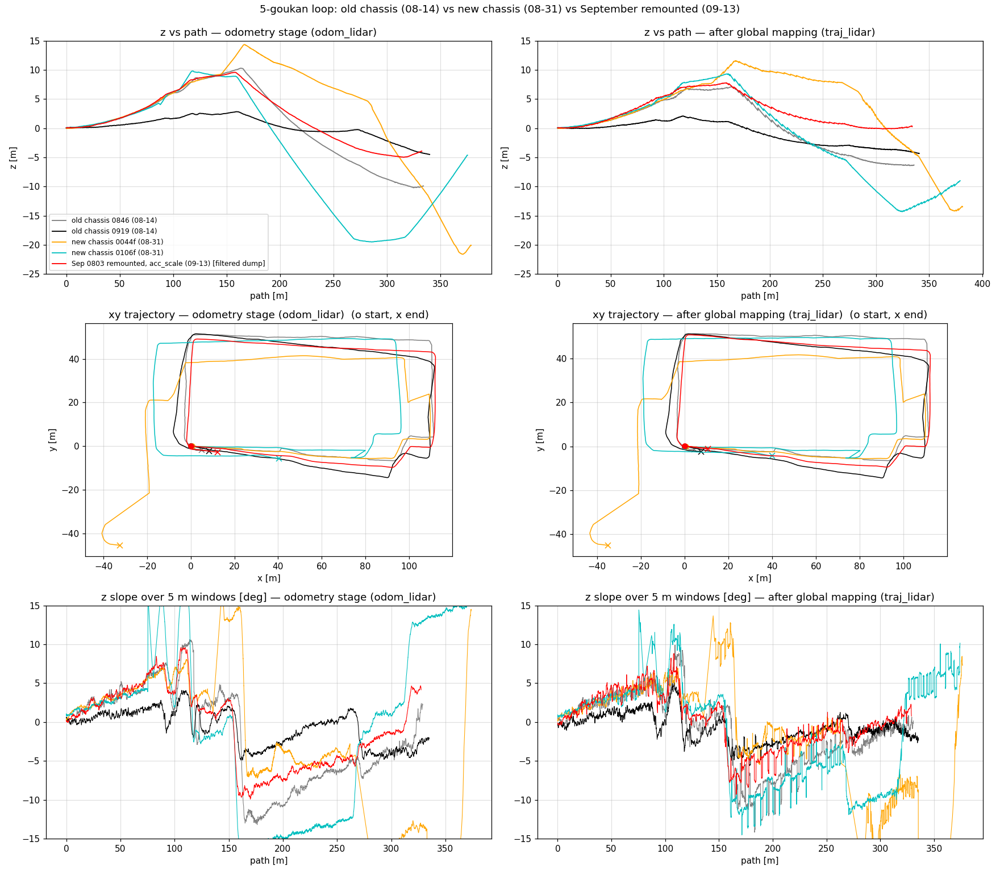
*図 13: 5 号館周回 5 bag の z(s)・xy 軌跡・5 m 勾配 (左 odometry 段、右 global 後)。9 月 bag (赤) は往路の z 上昇 (+9.6 m) が 8/31 (橙・水色) と同じで、復路の戻りと終点 (z_end) だけが旧車体 0919 (黒) の水準に戻っている。xy の周回閉合は 8/31 より良く 0919 と同等。*

読み方: ユーザの体感どおり **戻り (z_end) は 0106f の −9.0 → −1.4 / +0.3 m に改善**し、終点 pitch の破綻 (−11.5°) も消えた (A・rms とも 0106f の半分)。一方 **遠点での z 上昇は z_max +9.6 m、A 5.45° と 8/31 と同じ形で残り、旧車体 0919 (A 2.8) より悪い**。z_end と z_max が別々に動くのは、z_end = 一定沈降 c × 経路長 (§結論 (1))、z_max = A × 遠点までの距離、と成分が違うため。取付直し (+ acc_scale) が効いたのは c 側。

### 11.2 「離れるほど z が上がる」の正体 — 6 つの直接証拠

(図 11 `img/2026-09-10_glim_z_drift_not_vangle/11_world_tilt_compare.png`: 3 bag の z(s)・姿勢誤差・pitch/roll。図 12 `12_runs_compare.png`: 0803 の再実行 8 本の z(s)・姿勢誤差・5 m 勾配)

1. **実地形は平坦**: BNO086 姿勢と 1 s 平均の生加速度の両方で、車体の対重力傾きは全 heading で一定 (差 ≤0.2°)。剛体 4 輪車体なら実斜面では必ず傾くので棄却は堅い (`leg_pitch_gain.py`)。
2. **LiDAR 自身は地面を平らに見ている**: 生点群 (センサ frame、水平 2〜12 m) の地面平面は全 heading で pitch −0.15〜−0.38°、往路 (heading −5°) と復路 (+177°) で反転しない。高さ 0.70〜0.76 m (`raw_ground.py` / `ground_by_leg.py`)。
3. **GLIM の姿勢誤差は小さく、z の動きに足りない**: 地図 z と真上 (BNO086) の角度は初期 0.3° → 走行 100〜200 m で 1.3〜2.2° (剛体的な初期傾きではなく走行中に育つ)。往路 30〜90 m の実勾配 +2.3〜+7.0° に対し、姿勢誤差から予測される勾配は +0.5〜+1.4° (直進ビンで 3〜5 倍。`tilt_bins.py`)。0919・0106f も同様。
4. **IMU をいじっても z は動かない**: R2 (`imu_acc_noise` 0.05 → 0.005、重力拘束 ×10) で姿勢誤差は半減 (0.7〜1.0°) したが A 5.45 → 5.68、z_max +9.6 → +9.8。R1 (acc_scale をこの bag の実測 |g| に合わせて 0.9795) で A 5.54。**R5 (合成 IMU: /imu/data の加速度を BNO086 姿勢由来の純重力 9.80665 に置換、`synth_imu_bag.py`) で A 5.38、z_max +9.6 = 基準と同一**。→ z 並進は「姿勢誤差の結果」でも「加速度駆動」でもない。
5. **地図の地面が「板」になっている**: dump submap 内の地面帯の平面フィット残差 std 0.16〜0.25 m (単フレームは 0.03〜0.04 m)。submap の地面点に GLIM が付けた法線は鉛直 10° 以内 43%、45° 以上 28% (`submap_ground.py`。submap の共分散は `sub_mapping.cpp:374` で前処理段の k 近傍から再計算されるため前処理の近傍幾何を反映 — critic 確認)。
6. **近傍数 k を上げると直る**: 前処理 `k_correspondences` 10 → 30 (R4) / 20 (R8) だけで odom 段 A 5.45 → **2.16 / 2.45°**、z_max +9.6 → **+4.8 / +4.1 m**、rms 5.0 → 2.4 / 2.1、z_end −3.9 → +0.4 / −1.1。GLIM 自身の IMU 検証警告 `IMU prediction is not good` が **74 件 → 0 件** (k=10 の全 run は 74〜108 件)。GLIM 公式 `docs/parameters.md`: 「k_correspondences は疎なスキャンパターンで退化を防ぐため増やす。VLP16 は 20」(現行 10)。

### 11.3 機構 (critic 査読後の表現)

```
初期位置から離れるほど z が上がる (戻ると戻る) = heading 依存傾き A
└── 登録段 (odometry_estimation_cpu, GICP) の z 並進ドリフト                          【本命〜確定寄り】
    ├── 棄却: 実地形 (証拠 1)、LiDAR 幾何の傾き (証拠 2)、姿勢誤差経由 (証拠 3・R2)、IMU 加速度の内容 (R1/R5)、acc_scale (R1)
    │      ⚠️ 注記 (09-21 critic): CPU 版 odometry は照合を LM で単独に解き、結果を isotropic precision 1e3 (σ≈3 cm / 1.8°) の Between/Prior でグラフに注入する (`odometry_estimation_cpu.cpp`)。IMU 因子が照合の z を修正する経路が構造的に細いので、「IMU 非関与」はこのアーキテクチャ内での判定 (GPU 版は VGICP 因子と IMU 因子を同時最適化)
    ├── レバー: 前処理 k_correspondences 10 → 20/30 で odom 段 A −55〜60%。閾値挙動 (k≥20 で飽和、法線率とは比例しない)   【因果実験で確定】
    ├── 機構 (R9 地面除去実験で識別、2026-09-16)
    │   ├── ~~(a) 地面法線の退化が z 拘束を失わせる~~ → R9a: 地面を全除去しても A 6.26 で同形・同符号に滑る = 地面点はもともと z を拘束していない (法線が悪いのは事実だが A の原因ではない)
    │   │      参考: 生フレーム再現 (normal_quality.py) (1.0 m,k10) 鉛直 46% / 45° 超 9%、(0.5,k10) 28%/27%、(0.5,k30) 49%/6%、(1.0,k30) 51%/6%
    │   ├── **(b) 非地面 (植栽・壁・樹木) の共分散が k=10 で退化し、GICP の z 方向の対応付けが系統的に滑る** → R9b: 地面なしで k30 にすると A 1.89、警告 0 = k の効果は全て非地面側で出る   【本命】
    │   │      屋外の側方構造は植栽の乱雑な面が主体 (heading 別点分布: 左側構造点 6000〜8400/frame vs 地面 2200〜3800)。1.0 m 間引き × k10 ではこれらの共分散が信頼できる平面にならない
    │   │      屋内 (9 号館、天井・壁が密) で z ドリフトが消える (§1) のも「構造物の面が良質なら z は拘束される」と整合
    │   └── ~~(c) GICP 収束不足 (max_iterations 8)~~ → R10 (反復 20) で A 5.62 不変、棄却
    ├── なぜ heading で符号が変わるか: 未特定。単一 CCW 周回で heading と場所が完全交絡 (§7.2-7)
    │   ├── 姿勢誤差の方位は地図系で一定 (az_map −155〜−171°)、車体系では脚ごとに反転 → 「記憶」は姿勢状態側 (odometry の iVox は lru 100 ≈ 10 s で忘れる)
    │   ├── 直進内で勾配が成長 (往路 +0.5 → +7.0) / 減衰 (復路 −8.9 → −4.8) する動的成分が heading 成分と同じ桁。k はこのループ利得を 0.4 倍にしただけで発生機構は残る
    │   └── 識別実験: 第 3 直進開始で切った bag (h₀ が 180° 回るか)、CW 周回 bag、往復 bag
    └── なぜ 0919 (旧車体) は A 2.8 と半分か: 法線品質の予測は同じ → 退化は「増幅条件」で、大きさは他の入力誤差 (extrinsic pitch 0.9°・時刻・|g|) にも依存 (§7.2 の主張と整合)
```

### 11.4 run 一覧 (0803 bag、config = 基準 dump の config + 1〜2 キー変更。`姿勢誤差` = 100〜200 m の地図 z vs 真上)

| run | 変更 | odom A | odom z_max | odom z_end | odom rms | 姿勢誤差 | traj A | traj z_end | traj rms | IMU 警告 |
|---|---|---|---|---|---|---|---|---|---|---|
| base | — (k10, ds 1.0, acc 0.9705) | 5.45 | +9.6 | −3.94 | 5.00 | 2.19° | 3.38 / 3.17 | −1.38 / +0.29 | 3.84 / 3.92 | 74 |
| R1 | acc_scale 0.9795 | 5.54 | +9.4 | −4.18 | 5.02 | 2.18° | 3.46 | −1.76 | 3.73 | 74 |
| R2 | imu_acc_noise 0.005 | 5.68 | +9.8 | −4.22 | 5.09 | **0.98°** | 3.51 | −1.69 | 4.18 | 76 |
| R3 | R1 + R2 | 5.45 | +9.4 | −4.34 | 5.01 | 0.98° | 2.52 | −1.58 | 3.11 | — |
| R5 | 合成 IMU (完全重力) | 5.38 | +9.6 | −4.08 | 4.98 | 1.97° | 3.45 | −0.12 | 4.39 | 108 |
| R6 | downsample 1.0 → 0.5 (k10) | **6.46** | +9.7 | −6.28 | 5.75 | 2.37° | 3.56 | −4.16 | 3.72 | 76 |
| R8 | k_correspondences 20 | **2.45** | **+4.1** | −1.13 | **2.11** | 1.13° | 1.13 | +1.82 | 2.31 | **0** |
| R4 | k_correspondences 30 | **2.16** | +4.8 | +0.44 | 2.40 | 1.20° | 1.44 | +2.95 | 3.24 | **0** |
| R7 | k 30 + downsample 0.5 | 2.33 | +4.1 | −0.98 | 2.09 | 1.16° | **0.91** | +1.09 | **1.75** | **0** |
| R10 | k10 + max_iterations 20 | 5.62 | +9.4 | −3.77 | 4.98 | 2.19° | 3.49 | −1.72 | 3.67 | 75 |
| R9a | 地面全除去 (cropbox z<−0.35 m、地面比率 0.9%) + k10 | 6.26 | +10.3 | −6.39 | 5.88 | 2.54° | 5.70 | −5.33 | 5.07 | 77 |
| R9b | 地面全除去 + k30 | **1.89** | **+4.2** | +0.36 | 2.09 | 1.25° | 1.61 | +0.31 | 2.11 | **0** |

注意 (critic): traj 段は同 config 反復で ±1° (A)・±1.5 m (z_end) 動く (base 2 run、R2 vs R3) ので、traj 段の差は現状ノイズと区別しにくい。k≥20 で traj 段の rms は −16〜−54% だが z_end は符号反転して +1〜+3 m (120 m 以降に台地、cos フィット R² 0.3〜0.4 = モデル不適合)。Nav2 用 2D 地図は traj 段から作るので、「−60%」は odometry 段限定の数字。

### 11.5 critic 査読 (2026-09-16) と追加識別実験

**判定**: 「A = 登録段の z 並進、IMU 非関与」→ **本命〜確定寄り** (R2/R3/R5 が姿勢経由・加速度駆動を同時に棄却)。「レバー = k」→ **因果実験で確定**。「機構 = 地面法線の退化」→ **傍証のみ** (k は全点に効く。生フレーム予測と実 submap の法線率が 3 倍不一致、k20→30 で法線は改善し続けるのに A は飽和)。「heading 依存」→ 場所と交絡、かつ直進内の成長/減衰 (動的成分) が同じ桁。
**指標への注意**: 5 m 窓の回帰 gain (2.9 → 0.24) は旋回ビン混在のアーティファクトなので「結合が直った」証拠に使わない (直進内ビンでは R4 でも 3〜5 倍)。

追加識別実験 (critic 推奨、上から順に実施):

| run | 目的 | 結果 |
|---|---|---|
| R10: k10 + `max_iterations` 8 → 20 | 収束不足経路 (c) の切り分け | **A 5.62 / 警告 75 件 = 基準と同一 → (c) 棄却**。反復数ではなく共分散の幾何そのもの |
| R9a / R9b: cropbox で z<−0.35 m (地面) を全除去、k10 / k30 | 地面経由 (a) か非地面経由 (b) か | **地面なしでも A 6.26 (k10) → 1.89 (k30)、警告 77 → 0 = 同比率で効く → 経路は (b) 非地面**。地面を消しても基準 (5.45) と同形・同符号で滑る = 地面点は z を拘束していない (a は「地面法線が悪い」としては真だが A の原因ではない) |
| 第 3 直進 (heading +177°) 開始で切った bag | h₀ が開始姿勢に付随するか場所依存か | 未実施 |
| 基準 config ×2 反復 | traj 段の % を語る前提 | 未実施 (base の 2 run で代用) |
| `static_extrinsic.py` を 0803 静止区間に適用 | 新車体 T_lidar_imu の実測 (種の方位 20° ずれの照合) | 未実施 |
| CW 周回 bag (現地) | heading / 場所の最終識別 | 12 V 系復旧後 |

### 11.6 反映方針

- **live config は未変更**。推奨: `ros2_ws_glim/config/config_preprocess.json` の `k_correspondences` 10 → **20** (GLIM 公式の 16 line 推奨値。0803 で k20 ≈ k30、計算量は k に比例)。0.5 m 間引きは k を上げた上でなら traj 段 rms が最良 (R7) だが、屋外長距離 bag のメモリ ([[glim-offline-oom-16gb]]、E11 で 99.6%) を先に確認すること。
- k を上げても A 1.9〜2.5° は残る。次の一手は 11.5 の未実施実験 (第 3 直進開始 / CW 周回) → heading 依存の符号を決める機構 (姿勢状態に宿る世界固定成分) の特定。植栽側の共分散が本体なので、`enable_outlier_removal` や植栽除去 (高さ帯・強度) も候補。

## 12. 9/18 2 周 bag — 「始点終点は合うのに途中が高く、柱が地面より下に来る」の機構 (2026-09-20、critic 査読 §12.5)

- 発端: ユーザ「glim の dump を見ると、新しいバージョンでは始点と終点の z 誤差は減っているが、途中の経過地点が高くなり、柱の点群が地面の点群より下に来る壁抜けが発生している。原因を考えて」
- 対象: `bags/5goukan/2d3dimu/offline/glim/2026-09-180915_dump` (09-18 収録、5 号館周回 **2 周** 653 m、13507 frame、203 submap)。GLIM image (09-04 build, GLIM 1.2.2) と全 config は 9/13 dump と**完全同一** (k_correspondences=10 のまま) → 「新しいバージョン」の差は bag (2 周・新配線) のみ。同日の別 dump `2026-09-191206_dump` (別経路 890 m) は z が単調に +59.7 m まで上昇し submap 226→227 で −14.7 m/5 s のジャンプ (odometry 破綻) を含む別事象 — 本節は 9/18 を対象とする (ユーザがどちらを見たかは未確認、§12.5)。
- 解析一式: `bags/5goukan/2d3dimu/offline/glim/analysis_0918/` (`newdumps.py` 指標、`ghost.py` 再訪問 Δz・セル別地面プロキシ、`overlap.py` overlap 再計算、`figs_only.py`/`fig_idx.py` 図。numpy は glim_env / rerobot_env 内で実行)。GLIM ソースは glim_env 内 `/root/ros2_ws/src/glim/src/glim/mapping/global_mapping.cpp`。

### 12.1 数値 (odom = odometry 段、traj = global mapping 段 = viewer が表示するもの)

| dump | 段 | 経路 m | z_end | z_max | rms | A [°] | 非近接因子 |
|---|---|---|---|---|---|---|---|
| 9/13 0803 (1 周) | odom / traj | 333 | −3.94 / −1.38 | +9.6 / +7.5 | 5.00 / 3.84 | 5.45 / 3.38 | 0 |
| **9/18 0915 (2 周)** | odom | 653 | −7.00 | **+17.0** | 7.35 | 8.90 | — |
| | traj | 657 | **−0.50** | **+14.8** | 6.65 | 7.03 | **0** (251 因子は全て \|i−j\|≤4) |
| 9/19 1206 (別経路) | odom / traj | 889 | +23.4 / +26.1 | +51.4 / +59.7 | 32 / 34 | — | 0 |

周ごとの z 収支 (9/18): odom 1 周目 0 → +11.3 (遠角 x≈110, y≈36) → −4.3、2 周目 −4.3 → +17.0 → −7.0。traj 1 周目 0 → +11.2 → −1.6、2 周目 −1.6 → +14.8 → −0.5。**振幅 11〜17 m に対し周収支 1〜4 m** — 往路 (yaw 0〜+95°) で上り、復路 (yaw ±180・−90°) で下る heading 依存傾き A (§11) は閉路で相殺するので、z_end が小さいのは A モデルの数学的帰結であって閉合の成果ではない (odom 段でも同じ)。odom −7.0 → traj −0.5 の縮小は 2 周目 y≈46 直線 (submap 153〜168、odom 勾配 −11.7°) に局在した近接因子の再推定 (critic H2)、かつ同 config 反復で traj z_end は ±1.5 m 動く (§11.4) ので **z_end は指標にしない**。

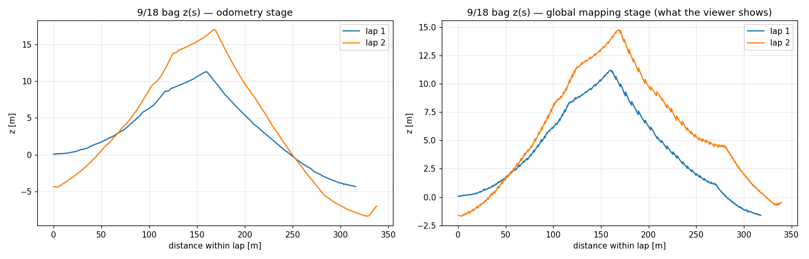
*図 15: 9/18 bag の周内距離 s に対する z。左 odometry 段、右 global mapping 段。2 周目 (橙) は 1 周目 (青) と平行でなく勾配が 1.5 倍 (往路 +6.4° → +10.4°、復路 −8.0° → −11.7°)。*

### 12.2 周回を結ぶ因子は 0 本 (確定)

- `graph.txt` の matching_cost 251 本の index 差: gap1 181 / gap2 49 / gap3 18 / gap4 3、**gap>4 は 0**。`GlobalMapping::save()` は isam2 の全 IntegratedMatchingCostFactor を key 無差別に書くので、周回を結ぶ VGICP 因子があれば必ず載る。between factor と IMU 因子は X(last)↔X(current) にしか張られない (critic 確認)。9/13・9/19 dump も非近接 0。
- 機構: GLIM の loop closure は暗黙 (`create_matching_cost_factors`) — 新 submap を挿入するたび、**現在の推定姿勢**で既存 submap の voxelmap (0.5 m、randomsampling_rate 0.2 の 20% サンプル) との `overlap_auto` を計算し、`min_implicit_loop_overlap` 0.2 以上の対にだけ VGICP 因子を張る。**明示的なループ検出 (場所認識) は無い**ので、推定姿勢がボクセル 1 個分以上ずれた再訪問は「別の場所」扱いになる。
- 再訪問対 (xy<4 m、106 対) の overlap 再計算 (GLIM 同等の 20% サンプル): as-is **0.010〜0.031**。z 差を消しても 0.035〜0.17、z と傾きを消しても 0.07〜0.18 で**どの対も 0.2 に届かない**。参照: 隣接 (odometry で整合済み) でも 0.24〜0.27、gap2 で 0.12〜0.17 (実際 gap2 因子は 202 対中 49 本)。→ implicit loop はこのセンサ (16 ring、疎) と設定では「隣接すら辛うじて」の感度で、z (周間 Δz 中央値 2.6 m・最大 3.8 m) でも xy (4 番目直線で 1.7〜3 m) でも 1 m 級のずれで落ちる。**「z 差が閉合を妨げた」は傍証のみ**で、A を縮めるだけで閉合が復活する見込みは薄い (critic)。

### 12.3 壁抜け (柱が地面より下) の正体 — 同じ構造物が時刻の違う submap によって別の z に描かれる

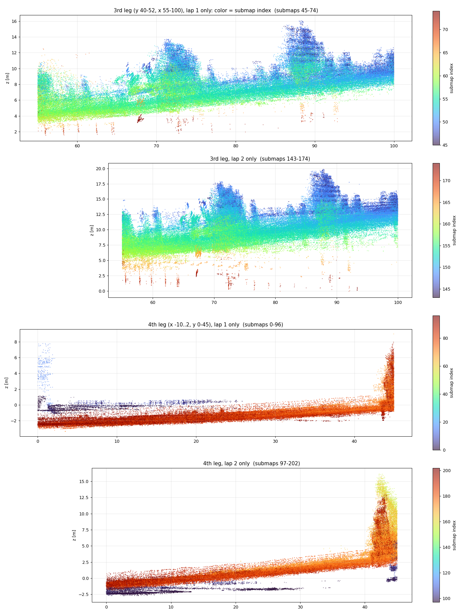
*図 16: 3 番目の直線 (y≈46, x 55→100) と 4 番目の直線 (x≈−4, y 0→45) の側面図を **submap 番号で色分け** (上 2 枚 = 3 番目直線の 1 周目のみ / 2 周目のみ、下 2 枚 = 4 番目直線)。3 番目直線では、遠角から前方 40 m を見た submap (青、45〜50) が樹木・壁を z 8〜16 に、直上を通った submap (緑、53〜58) が地面を z 4〜8 に、復路に入って下りながら振り返った submap (橙〜赤、65〜74) が**柱の根元を z 2〜4 = 地面板の下**に描く。2 周目は同じ形で幅が倍 (z 0〜20)。*

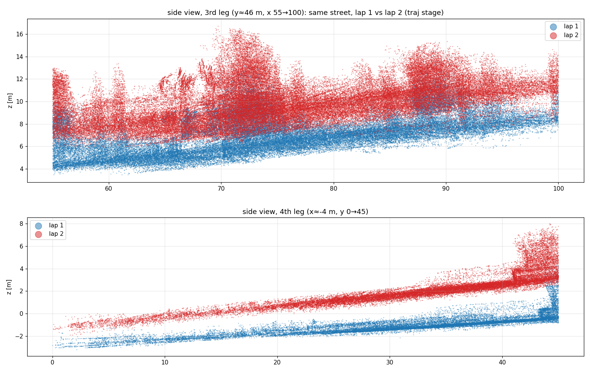
*図 14: 同じ 2 直線を 1 周目 (青) / 2 周目 (赤) で色分け。同じ街路が 2 枚、+2.3〜2.8 m ずれて重なり、両方とも実際は水平な地面が 4〜5° 傾いて描かれている。*

```
柱が地面の点群より下に来る (壁抜け)
├── (i) 同一周内の z にじみ                                             【本命 — 3 番目直線では主成分】
│    = 軌跡 z が 5〜11° の勾配で動く間に、同じ構造物を「前方 30〜40 m から」「直上で」「振り返って」の 3 回描く
│      → 10 m セルの地面プロキシ z5 の同一周内幅: 1 周目 3.2 m (p90 5.2)、2 周目 6.2 m (p90 8.3)
│      → 遠方観測は近傍地面より上 (中央値 +1.5 m、pitch 誤差 2〜4° 相当)、振り返り観測は下 (−0.4〜−2.4 m) = 柱の根元が地面板を貫く
├── (ii) 周間オフセット                                                【本命 — 4 番目直線では主成分】
│    = 2 周目の z(s) が 1 周目と平行でない (A が 1.5 倍) ので同一地点で Δz 中央値 2.6 m・最大 3.8 m。同一周内幅は 0.7〜0.9 m と小さい
├── (iii) 誰も整合させない                                              【確定】
│    = 周回を結ぶ因子 0 本 (§12.2)。global mapping は gap≤4 の近接 VGICP + between + 0.1 s の IMU 因子だけで、(i)(ii) を直す情報を持たない
│      副作用: traj 段で |roll| p90 6.3° (max −7.1°)・|pitch| p90 4.5° と odom 段 (2.2°/2.7°) より姿勢が悪化 = IMU の重力整合が近接 VGICP に負けている (critic H4)
└── 1 周 dump (9/13) でも (i) は同じ機構で存在するはず (z_max +7.5、A 3.4) — 2 周で (ii) が重なり、A の成長で幅が倍になって目立った
```

### 12.4 A が周を跨いで成長する (critic H3、原因未特定)

odom 段 z_max 1 周目 11.3 → 2 周目 17.0、直線勾配 +6.4° → +10.4° / −8.0° → −11.7°。同時に submap の `imu_bias` acc z が **−0.0057 (submap 0) → −0.0332 (100) → −0.0509 m/s² (202) と単調成長** (acc x も 0 → +0.05、gyro は ~1e-4 で安定)。仮説: LiDAR 登録の z 滑り (§11 の A) を IMU 因子が加速度バイアスとして吸収 → 次の予測が滑りを追認 → 勾配が増幅する正帰還。§11.3 の「直進内で勾配が成長する動的成分」「記憶は姿勢状態側」と同じ現象の時間軸拡大。**識別実験: `config_odometry_cpu.json` の `fix_imu_bias: true` だけ変えて 9/18 bag を 1 run** (8〜10 分) — 2 周目 z_max が 1 周目と同じ ≈11 m に揃えば採択、17 m のままなら棄却。

**→ 09-20 実施、棄却 (確定)** (`exp_2026-09-20_noimu/imu_fixbias_0918`、§12.8): fix_imu_bias で odom 段 lap1 z_max 11.2 (基準 11.3)、lap2 16.6 (17.0)、A 8.99 (8.90)、20 m ビン勾配は全ビン ±0.4° 以内。dump の acc bias は全 submap で −0.005 m/s² に固定されている (基準は −0.006 → −0.051 と成長) ので config は効いている。**バイアス成長は結果であって原因ではない**。1.5 倍成長の原因は未特定 — 候補 (critic): (A1) 走行中に育つ odometry 状態の持ち越し (heading 0 直線の勾配が lap1 で +0.85 → +6.28° と育ち、lap2 は +6.27° から再開して +11.2° へ。姿勢誤差とも比 4.1〜4.6 で共成長)、(A2) 2 周目経路の 1〜2 m 横ずれ・地点別点数差 (歩行者・駐車車両?)。速度差は棄却 (周平均 0.486 vs 0.481 m/s)。識別実験: **bag を 2 周目開始 (相対 ≈653 s) で切って基準 config で 1 run** — z_max ≈11 なら A1、≈17 なら A2。

### 12.5 critic 査読 (2026-09-20) — 判定と修正

| 主張 | 自己申告 | critic 判定 | 修正 |
|---|---|---|---|
| 周回を結ぶ因子 0 本 | 確定寄り | **確定** (ソース + graph.txt) | — |
| z_end が小さいのは往復相殺で閉合ではない | 本命 | 相殺 = 本命 (odom 段でも同じ)、縮小は局所再推定 (H2) | 「z_end は指標にしない」を明記 |
| z 差 (2.6〜5.6 m) が overlap を閾値以下にした | 本命 | **傍証のみ** — 20% サンプルで再計算すると z を消しても 0.2 未達、xy 1.7〜3 m でも落ちる | 「z 固有」を撤回、感度不足の設定として記述 |
| 壁抜け = 1 周目/2 周目の重なり | 本命 | **傍証のみ** → 色分け図 (図 16) で同一周内にじみ (i) が 3 番目直線の主成分と判明 | (i)+(ii) の重ね合わせに書き換え |
| 遠方観測 +1.5 m は逆符号なので (i) ではない | — | 不成立 — 遠方から見た地面板も上に置かれ、近傍の柱の根元はその下に沈む | 撤回 |

棄却できなかった代替・見落とし: **どの dump をユーザが見たか未確定** (9/19 dump なら周回重なりは無く (i) + −14.7 m ジャンプが主体)、「1 周 dump では壁抜けが無かった」は未確認 (H1 なら 9/13 でも 3 番目直線に 2〜3 m のにじみがあるはず)、H3 (バイアス正帰還) と H4 (global 段の重力整合崩れ) は未検証。

### 12.6 反映方針・次の一手 (安い順)

1. (数分、GLIM 再実行なし) glim_env の offline viewer で 9/18 dump を読み、"Find overlapping submaps" を min_overlap **0.1** で 1 回 → optimize → **別ディレクトリ**に save。新 graph.txt に非近接因子が現れるか / 4 番目直線の周間オフセット +2.3 m が消えるか / 3 番目直線の同一周内幅 3〜6 m が残るかで (i)(ii) の分解と「閾値を下げれば閉合するか」を同時に判定。
2. (8〜10 分) `fix_imu_bias: true` の 1 run (§12.4)。
3. k=20 run (§11.6 推奨) の graph.txt 非近接因子数で「A 縮小 → 閉合復活」を検証 — critic 予測は「復活しない」。
4. 運用: 2 周 bag から Nav2 用 2D 地図を作るなら当面 **1 周目の submap だけ** (`tools/glim_traj_to_2dmap` で traj の周内範囲を切る) — (ii) を避けられるが (i) は残る。

### 12.7 ユーザの手動ループ閉合 dump (`2026-09-180915_filtered_dump`、2026-09-20、critic 査読済み) — 周間だけ整合し、山と同一周内にじみは不変

viewer の Loop begin/end → Create Factor は `BetweenFactor` を追加する (graph.txt の matching_cost には出ない: 251 本・非近接 0 のまま)。`odom_lidar.txt` は元 dump と同一 (差 1 mm) なので global 段だけの比較で交絡なし。

| 指標 | 元 dump (traj) | 手動閉合後 (traj) |
|---|---|---|
| 再訪問対 (105 対) の \|Δz\| 中央値 / 最大 | 2.59 / 3.77 m | **0.18 / 1.41 m** |
| 4 m セル地面プロキシの周間 \|Δz\| 中央値 | 2.65 m | **0.80 m** |
| z_max 1 周目 / 2 周目 | 11.2 / 14.8 m | 11.6 / **11.7 m** (2 周目が 1 周目に整合) |
| 3 番目直線の勾配 (1 周目 / 2 周目) | +6.5 / +6.6° | +6.1 / +6.8° (不変) |
| 同一周内の遠方観測 (≥20 m) と近傍地面の差 | +1.41 m (前方) / −0.34 m (振り返り) | 同 (不変) |
| xy_end | 6.8 m | 3.4 m |

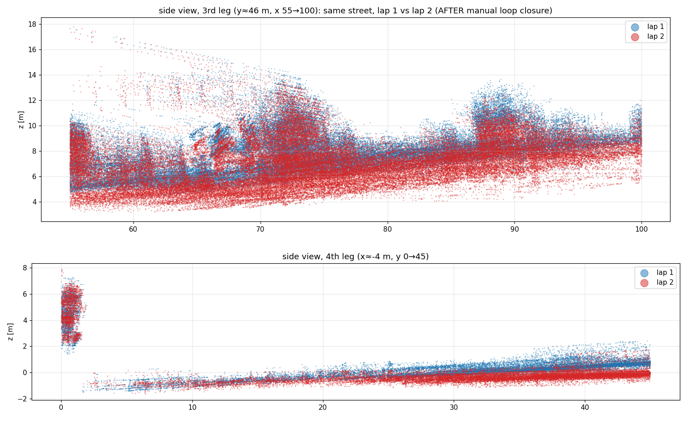
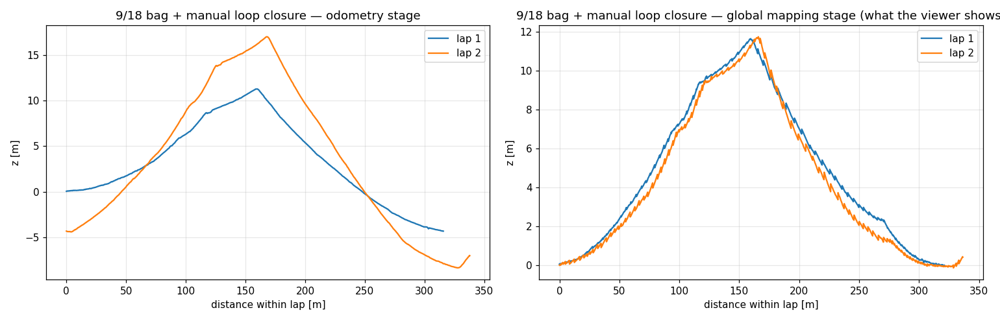
*図 21・22: 手動閉合後。2 周の点群は重なった (図 14 と比較) が、街路は両周とも 4〜6° 傾いたまま、柱の根元の断片も残る。z(s) は 2 周がほぼ一致し、山の高さ 11.7 m は 1 周目の値。*

読み方 (critic B-H2): 閉合は「2 周目を 1 周目に合わせる相対拘束」であって絶対 z を拘束する因子は無い。相対姿勢 (k, k+5) の変化は \|Δz\| 中央値 0.05 m・回転 0.28° で、閉合端近傍 (submap 160〜200) だけ roll −4.4° / pitch −2.1° 動いた。→ **§12.3 の分解 (i)+(ii) の予測どおり、手動閉合は (ii) 周間オフセットの対策にはなるが、(i) 同一周内にじみ = 山 = A 本体には効かない** (判定: 本命、同一 run 比較で交絡なし)。「残った (i) はリング 6〜15 の公称縦角誤差」という代替 (B-H1) は、縦角誤差なら前方視と振り返りが同符号になるはずで、実測の符号反転 (+1.4 / −0.3〜−2.4 m) と矛盾するため棄却。

## 13. 外周道路 bag (`2026-09-191206`) の「直進中に通路 1 本横へ飛ぶ」— R-Fans 回転ディップの底 5 s を IMU 単独で埋めたジャンプ (2026-09-20、critic 査読済み)

- ユーザ報告: 「submap 267〜268 の間、直進していたのに通路が 1 本ずれて存在しない道を進んでいた。全体的に床面が大きく反っていて手動閉合するまでもなくおかしい」。
- **事象**: bag に R-Fans スキャンモータの回転ディップが 2 回 (`docs/issue/2026-09-02_rfans_scan_motor_dropout.md` §2026-09-20。減速 1.7 s → header 欠落 5.13 / 5.26 s → 20 Hz オーバーシュート → 整定 ~7 s)。GLIM frame id 15356→15357 (submap 227 内) と 17971→17972 (**submap 267 内、268 の直前**) がその欠落に対応。IMU・車輪 odom・UTM は無途絶。
- **GLIM の挙動** (`analysis_0918/perim2.py`、critic `c_imu.py`):

| 事象 | 欠落 | 車輪 odom の実移動 | GLIM odometry のジャンプ | IMU 単独積分の予測 (GLIM 直前状態から) |
|---|---|---|---|---|
| 1 (frame 15356, t=1537 s) | 5.13 s | 2.58 m 直進 (0.50 m/s、回転 0) | **32.4 m** (Δx +19.2, Δy +24.8, Δz −8.2)、その後も同方向へ 11 m 進みつつ減速 | 24.5 m (方向一致、残差 8.9 m = GICP が更に足した) |
| 2 (frame 17971, t=1801 s) | 5.26 s | 2.63 m 直進 | **11.5 m** (Δx +10.4, Δy +4.2, Δz −2.5) → 道路が 9 m 先・4 m 横 = 「通路 1 本横」 | (+10.6, +2.4, −1.9) **残差 1.9 m** |

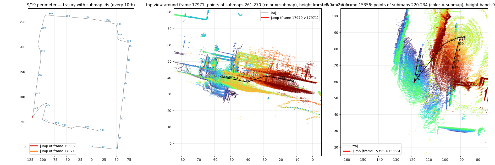
*図 20: 左 = traj xy と submap 番号、赤/橙 = 2 つのジャンプ。中 = frame 17971 周辺の上面図 (submap 261〜270 を色分け): 267 まで直進した軌跡が 268 で +4 m 横へ飛び、道路の点群が 2 本並ぶ。右 = frame 15356 周辺: 32 m 飛んだ先で円環状の点群 (姿勢が壊れた状態で地面リングを貼ったもの)。*

```
通路 1 本横へ飛ぶ (submap 267→268)
├── 引き金 = R-Fans スキャンモータの回転ディップ (底 5.26 s は header 欠落)                【確定】
│    frame 数列 30032 → … → 146064 → 欠落 → 104432 (部分フレーム) → 14816 (20 Hz) → 30k。19212 frame 中 >1 m のステップは 2 事象直後の 6 frame だけ
│    記録遅延 (mcap) なら幅 30032・dt 0.1 s のまま抜けるはずで、点数膨張は説明できない → 棄却
├── 経路 = IMU 単独予測 (odometry_estimation_imu.cpp L258〜302: IMU 2 サンプル以上なら integrate → predict を初期値)  【確定寄り】
│    ├── GICP は初期値から動けない (ivox 局所地図と 11 m 離れて対応点なし)。smoother_lag 5.0 s < 欠落 5.13 s で直前 frame が即 marginalize (L363〜372)
│    ├── 対照: 正常区間のどの 5 s 窓でも IMU 単独は GLIM から 5〜9 m ずれる = 欠落がどこで起きても数 m 飛ぶ
│    └── IMU 状態の質: acc bias x +0.25 m/s² (≈ g·sin 1.5° = 新車体の pitch extrinsic 未補正相当、未確認)、acc_scale 0.9705 は本 bag |g| 9.98 に対し −1.2% 過補正 (0.983 が整合)
├── 事象 1 が更に大きい理由 = 減速期 (底の 1.7 s 前) から pitch −1.5 → −9.6°・roll −5 → −8.3° と姿勢が壊れ、それが予測の初期値になった  【本命、機構未特定】
│    frame 幾何は正常 (有効点 86%、方位 36/36 ビン) なので候補は (a) 点密度 1.2〜2.9 倍で k=10 近傍共分散が変わる (§11 の A 機構) / (b) header stamp が frame 終端で、per-point 時刻との不整合が 0.1 → 0.5 s に伸びる
├── 底直後の部分フレーム (有効点 17%、90° 扇形。ドライバガード閾値 500 点は甘い) が GICP を暴れさせた可能性  【傍証のみ、事象 1 の +9 m と姿勢 20° 級の暴れの候補】
└── 「欠落なしでも同じ横ずれが出る」か: t=1719 s に欠落なしで 3 m 滑る区間あり (悪路、IMU 振動 max 18 m/s²) — 3 m 級で、11.5 / 32 m は 2 事象のみ  【本 bag では否定的】
```

- 「床面が大きく反っている」の内訳: 外周 bag は z_max +59.7 m (traj) で、5 号館の A (heading 依存傾き、§11) に加えて 2 回のジャンプ (Δz −8.2 / −2.5) と減速期の姿勢崩れが重なる。c = +1.5〜1.7° と符号が 5 号館 (−0.7) と逆で、往路も復路も上る → 悪路の振動・バッテリ末尾・別経路の 3 交絡で 5 号館の分解をそのまま当てられない。**手動閉合しなかった判断は妥当** (再訪問対 0/283 で閉合の相手が無い)。
- **critic 判定**: 引き金 = 回転ディップ → 確定 / 経路 = IMU 予測 → 本命〜確定寄り / 減速期の姿勢崩れの機構 → 未特定。副次: 「その後 1 s かけて戻る」という初稿は誤り (同方向へ更に進みながら減速)。GLIM/車輪の経路長比が 12 s 窓で >30% ずれる窓が 160 中 ~25 あり (車輪スリップか GLIM スケールか未判定) — 「欠落を車輪 odom で埋める」対策の前に要確認。
- **次の 1 実験 (オフライン 20 分、GLIM 1 run)**: (a) 事象 2 の劣化 frame (rfans idx 17991〜18010) を全除去した「きれいな 7 s 欠落」、(b) 正常直進区間 (bag 相対 1000〜1005 s) に人工 5 s 欠落、(c) 事象 1 無加工、の 1 本の bag で再実行。(b) で 5〜9 m 飛べば「IMU 状態の質」が主因 → 対策は pitch extrinsic 1.5° / acc_scale 0.983 / bias の較正 か 車輪 odom 因子。(a) が ~11 m のままなら劣化フレームは不要 (ドライバガード強化は効かない)。
- ハード側: 回転ディップは 10 Hz でも起きると確定したので、09-02 issue の一次原因追跡 (コネクタ電圧ロガー) を前倒し。オンライン運用では事象 1 回につき ~15 s の 3D 盲目区間を前提にする。

### 12.8 IMU なし (CT-ICP) で同じ bag を流す — 「IMU が原因の一部か」の識別 (2026-09-20、ユーザ要望、critic 査読済み)

実験一式 `bags/5goukan/2d3dimu/offline/glim/exp_2026-09-20_noimu/` (config・dump・run.log・`cmp_runs.py`・`pre_collapse.py`、chain.log に実行順)。IMU なし構成 = `config_odometry_ct.json` + sub/global `enable_imu: false` + `imu_frame_id: glim_base` (CLAUDE.md の手順)。

| run (9/18 5 号館 2 周) | odom 段 lap1 / lap2 z_max | 経路長 (実 653 m) | 破綻 (\|roll\| or \|pitch\| > 10°) |
|---|---|---|---|
| IMU あり LIO (基準) | +11.3 / +17.0 m | 653 | なし |
| IMU なし CT-ICP 既定 | (比較不能) | 1467 | **t=174 s** (x≈84、最初の直線の終わり、旋回開始前) |
| IMU なし CT-ICP 改良 (ivox 0.5 / min_dist 0.05 / iter 20 / corr 1.0) | (比較不能) | 994 | **t=184〜192 s** (x≈89、旋回開始 t=190 と一致) |
| IMU あり + `fix_imu_bias: true` | +11.2 / +16.6 m | 653 | なし |
| 外周 bag IMU なし CT-ICP 既定 | — | 2104 (実 889) | t=24 s |

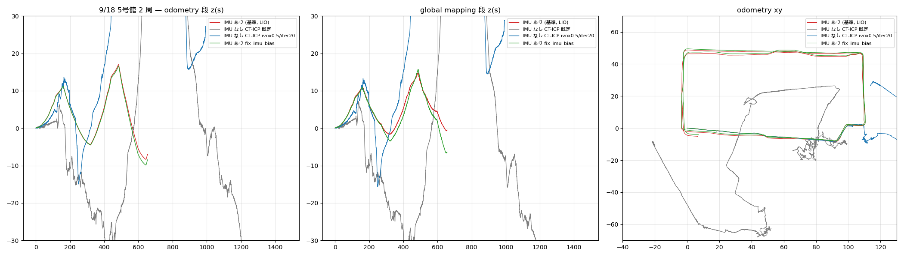
*図 23: 左 odometry 段 z(s)、中 global 段、右 xy。CT-ICP (灰・青) は最初の直線の終わりで反転し以後は無意味。fix_imu_bias (緑) は基準 (赤) と重なる。*

**破綻前の直線 (IMU 版の時刻軸に揃える。CT 系は初期化窓が無く 3.11 s 早く始まるので補正)**

| IMU 版時刻 | IMU あり z | CT-ICP 改良 z | CT-ICP 既定 z |
|---|---|---|---|
| 170 s (s≈83 m) | +4.4 m | +3.6 m | (+1.8、ジッタ std 0.076 m/frame = IMU 版の 24 倍で比較不能) |
| 180 s (s≈88 m) | +5.0 m | +4.2 m | (破綻中) |

改良版は 19 窓中 17 窓で dz>0、xy 差 ≤0.4 m、経路膨張 ~12% → **IMU を外しても同じ直線で同方向・80〜85% の上りが出る**。ただし CT-ICP では上昇が pitch −5〜6° の「世界の傾き」として現れ (勾配 ≈ −pitch で運動学的に整合)、IMU 版の「姿勢 −1〜−2° に対し勾配 6〜7° = 並進滑り」とは見え方が異なる。

```
「IMU は床面の歪み (A) の原因か」
├── z 勾配の源は IMU ではなく LiDAR 登録側                                  【本命 — 主根拠は §11 の R5 (合成純重力 IMU で不変)・R2 (重み ×10 で不変)、今回の CT-ICP 比較は補強の傍証】
│    └── 注意: CT の上りは pitch ゲージのドリフトとして出るので「GICP 共分散の z 滑り」と同一機構だとは識別していない。両 run が共有する入力 (点群・共分散・per-point 時刻) の系統誤差を示唆する
├── 2 周目 1.5 倍成長 = IMU バイアス正帰還 (H3)                                【棄却 (確定) — fix_imu_bias で不変】
│    └── 代替: (A1) odometry 状態の持ち越し (heading 0 勾配が lap1 終値から再開) / (A2) 2 周目経路の横ずれ・環境差。速度差は棄却。識別 = 2 周目開始で切った bag の 1 run
├── IMU が主役の箇所 = 回転ディップ時の 5 s 欠落を IMU 単独予測で埋めるジャンプ (§13)。CT-ICP は同じ欠落で 1.6 / 7.0 m しか飛ばない (等速予測、ただし破綻中の値)
└── IMU なし運用 (CT-ICP) は**現構成では**不可 — 2 設定とも最初の直線 84〜89 m で破綻、外周は 24 s。破綻要因 (蓄積ドリフト / 場所固有 / 進行方向縮退: 既定版は直進で xy が 1.5 倍膨張) は未分離
```

critic の指摘で訂正した点: 初稿の「CT 既定 +5.9 m (t=180)」は時刻軸 3.11 s のずれと破綻ジャンプを含んだ値で不可。「60〜120%」→「改良版で 80〜85%、既定版は比較不能」。IMU なし run は global 段も重力拘束を失うので比較は odom 段限定。fixbias で IMU 検証警告が 74 → 172 件に増えたのは「バイアスに逃がせなくなった不整合が IMU 残差に出た」だけで、z が不変 = LiDAR 項が支配的の側証。

**次の 1 実験 (critic 推奨、~20 分)**: bag を 2 周目開始 (相対 ≈653 s) で切り出し、基準 LIO config と CT-ICP 改良 config で各 1 run。lap2 単独の z_max ≈11 なら A1 (持ち越し状態)、≈17 なら A2 (経路・環境)。CT 改良が再び x≈85〜90 で壊れれば場所固有、開始から ~90 m で壊れれば蓄積ドリフト。

### 12.9 「GPU 版にすれば直るか」— CPU の VGICP を代理に 5 run (2026-09-21、ユーザ質問、critic 査読済み)

GPU 版 (`odometry_estimation_gpu`) の照合は VGICP (ボクセル集約ガウス、多重解像度) なので、CPU odometry の `registration_type: VGICP` を代理として 9/13 1 周 bag で回した (`exp_2026-09-21_vgicp/`、`vgicp_cmp.py`、図 24)。

| run | k | odom z_max | odom A | z(s) の一致 (RMS 差 / 相関、同 k の GICP と) | IMU 警告 |
|---|---|---|---|---|---|
| GICP k10 (現行) | 10 | +9.6 | 5.45 | — | 74 |
| VGICP 0.5 m | 10 | +9.5 | 6.32 | 1.75 m / 0.978 | 80 |
| VGICP 1.0 m | 10 | +8.2 | 5.84 | 1.47 m / 0.990 | 72 |
| GICP k20 (R8) | 20 | +4.1 | 2.45 | — | 0 |
| VGICP 0.5 m | 20 | +4.9 | 3.30 | — | 35 |
| VGICP 1.0 m | 20 | +4.1 | 2.56 | **0.23 m / 0.995** | 0 |
| VGICP 0.25 m 2 段 (GPU 既定に近い) | 20 | +4.7 | 3.86 | (1.0 m k20 より悪化 +1.3°) | 46 |

k を跨ぐと RMS 差 3.4〜4.7 m・相関 0.77〜0.88。→ **odom 段の z(s) の形は k で決まり、照合方式 (GICP の iVox 点 vs VGICP のボクセル)・解像度・地面の有無 (R9a)・間引き (R6) では形が変わらない (確定寄り)**。方式・解像度の寄与は +0.4〜+0.9° で細かいほど悪化 (odom 段は決定論的なので run ノイズではない)。

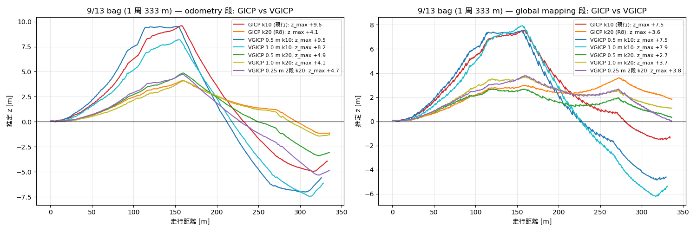

```
GPU 版にすれば直るか
├── 共分散の経路は GPU 版も同じ (ソース確認、critic)                                    【確定】
│    ├── source: preprocess の k 近傍 → odometry 段で再計算、正則化は PLANE 固定 (固有値 1e-3, 1, 1) = k が変えるのは法線の向きだけ
│    ├── target: VGICP のボクセル共分散は「点位置の散布」ではなく「点共分散の平均」(CPU `gaussian_voxelmap_cpu.cpp`、GPU `gaussian_voxelmap_gpu.cu` とも) → これも k 由来
│    └── 因子は Mahalanobis に (voxel cov + R·cov_A·Rᵀ) = 両側を使う (CPU/GPU 同式)
├── → k を上げない限り GPU 版でも同じ坂が出ると予想                                       【本命・未検証】
├── GPU 版固有で A に効きうる経路 (CPU VGICP では代理できていない)
│    ├── H1: VGICP 因子と IMU 因子の同時最適化 (CPU 版は照合結果を precision 1e3 で注入 → IMU に発言権が無い)。z 速度の連続性が効く余地
│    ├── H2: surface validation (視線と法線が 80° 超の対応を捨てる) — §11.3 (b) 植栽・遠方地面の斜め対応に直接効き得る
│    └── H3: 0.25 m 単一フレーム target (1 m 間引きなら ≈1 点/voxel) — CPU VGICP 0.25 m 2 段 k20 で実測 A 3.86 (1.0 m の 2.56 より悪化、IMU 警告 0 → 46) = 細いほど悪化を確認。GPU 版の多重解像度がこれを補うかは未検証
└── ~~A は source 側の点共分散に宿る~~ → 本実験では source/target を分離できていない (両側 k10 のまま) — 撤回
```

critic の判定: 「形は k で決まる」= 確定寄り、「GPU 版でも直らない見込み」= 本命 (H1〜H3 未検証)、「source 側」= 識別されていないので撤回。A の cos フィットは直進区間の検出に依存して ±0.5° 動く (V0.5 k10 では 1 区間が未検出) ので、方式間の比較は z(s) の RMS 差/相関で示す。

**ハード**: この PC (T480s) には NVIDIA GeForce MX150 (2 GB, compute 6.1) があり `/dev/nvidia0` も存在。`nvidia-smi` は「Driver/library version mismatch」(lib 580.178) で不一致 → 再起動かドライバ整合で復旧し得る。現 `rerobot-glim` image に `libodometry_estimation_gpu.so` は無い (koide3 は `glim_ros2:jazzy_cuda12.2` を配布)。

**次の一手**: (1) GPU 版を実際に流す (再起動 → nvidia-smi → cuda image pull + nvidia-container-toolkit → 同 bag を k10 / k20 で各 1 run、sub/global は CPU config のまま)。k10 で A ≈5〜6 なら「GPU でも直らない」が確定、2 台に落ちれば H1/H2/H3 のいずれか (H2 を最初に疑う)。(2) GPU 不可なら、source と target の k を別々に振る patch (`update_target` 挿入前に target の covs だけ再推定、20〜30 行 + 再ビルド) で「どちら側の共分散か」を識別。

### 12.10 live config を k=20 に変更 (ユーザ、2026-09-21) — 2 周 bag の再実行結果: 山は半分、周間オフセットと global 段の上振れが残る

ユーザが `ros2_ws_glim/config/config_preprocess.json` の `k_correspondences` を 10 → **20** に変更し、9/18 2 周 bag を再実行 (`2026-09-180915_k20_dump`、config 差分は k のみ)。ユーザ所感「歪みは小さくなったが完全には治っていない」を数値化 (`analysis_0918/k20_2lap.py`、図 25):

| 段 | 指標 | k=10 | **k=20** |
|---|---|---|---|
| odom | 1 周目 z_max / 周末 z | +11.3 / −4.3 | **+5.9 / +0.6** |
| odom | 2 周目 z_max / 周末 z | +17.0 / −7.0 | **+9.9 / +0.4** |
| odom | A [°] / rms | 8.90 / 7.35 | **4.00 / 4.34** |
| traj (viewer) | 1 周目 z_max / 周末 z | +11.2 / −1.6 | +5.0 / **+2.8** |
| traj | 2 周目 z_max / 周末 z | +14.8 / −0.5 | +8.6 / **+6.3** |
| traj | 同一周内の遠方観測 − 近傍地面 (\|.\| 中央値) | 1.38 m (前方 +1.4 / 振り返り −0.3) | **0.66 m** (前方 +0.62 / 振り返り +0.64、符号反転が消えた) |
| traj | 再訪問対の \|Δz\| 中央値 / 4 m セル周間 \|Δz\| | 2.59 / 2.65 m | 2.70 / **3.63 m** (悪化) |
| graph | 非近接因子 | 0 | 3 (86-91, 87-92, 186-191 = 近接、閉合ではない) |

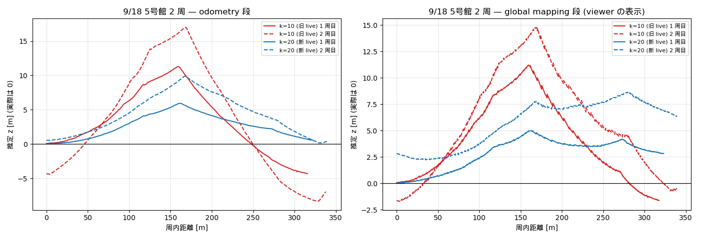

読み方:
1. **odometry 段は予測どおり半減**し、周収支 (周末 z) は −4〜−7 → ±0.6 m でほぼゼロに。同一周内の壁抜け (i) も半減し、「振り返りが下に出る」符号反転が消えた (残りは前方観測 +0.6 m の pitch 誤差型)。
2. **global mapping 段が新たに上振れ**: odom では周末 +0.4 なのに traj は 1 周目 +2.8 → 2 周目 +6.3 m と周ごとに +3 m 積む (traj−odom は s=300 で +2.1、600 で +5.1、662 で +6.0)。k=10 では global 段は逆に z_end を縮めていた (−7.0 → −0.5)。run 間ノイズ ±1.5 m (§11.4) を超える。critic H4 (global 段では IMU の重力拘束が 0.1 s の endpoint 因子だけで、submap 間 VGICP/between に負ける) の現れと整合するが未検証。
3. **周間オフセットは残る** (2. により 3 m 級)。閉合因子は依然ゼロなので、2 周 bag の 2D 地図化は手動閉合 (§12.7) か 1 周目のみが必要。
4. 残る同一周内の山 5.9 m (odom) は §11.3 の「k で縛れない残り半分」で、機構未特定 (A1 状態持ち越し / A2 経路差 / heading 符号の仕組み)。

次の一手 (安い順): (a) global 段の上振れの切り分け — `config_global_mapping_pose_graph.json` (submap 間の再登録なし、pose graph のみ) で同 bag 1 run (~11 分): traj が odom に張り付けば global 段の VGICP 再登録が +3 m/周の犯人。(b) 2 周目開始で切った bag の 1 run (A1/A2、§12.4)。(c) k=20 の live 反映に伴う CLAUDE.md / PROJECT_STATE の「live 未変更・推奨 k=20」記述の更新 — 本節で済。

## 14. 9/22 大学外周 bag (`2026-09-221158`, live k=20) の評価 — 「床が場所ごとに違う高さ・roll 方向にも歪む」の中身 (2026-09-23、critic 査読済み)

ユーザ所感: 「k を 20 にして平面の判定を上げ、R-Fans の目立った点群ロストも無かったように思える。おかげでスタートとゴールの z は大まか合っているが、床面が傾いておりコースの場所により z が異なる。5号館周回と異なり pitch 方向だけでなく roll 方向の歪みも見える」。
dump: `bags/5goukan/2d3dimu/offline/glim/2026-09-221158_k20_dump` (265 submap、940 m、1948 s、config は 09-19 dump と k 以外同一)。解析一式: `analysis_0922/m1〜m6*.py` + `m*.log`。同一 bag の再実行 dump は `exp_2026-09-23_k10_0922/` (k=10 / pose-graph global / global enable_imu=false / acc_scale 0.985 — §14.6)。

### 14.1 数値 (odom = odometry 段、traj = global mapping 段 = viewer)

| 指標 | 09-19 k=10 (別日 同コース) | **09-22 k=20** | 09-22 bag を k=10 で再実行 (同一 bag A/B) |
|---|---|---|---|
| odom: A [°] / h0 / c | 5.72 / +135 / +1.49 (R² 0.48、欠落 2 回で汚い) | **6.77 / +88 / −0.57** (R² 0.84) | **9.85** / +112 / −0.93 (R² 0.65) |
| odom: z_max / z_end / rms [m] | +51.4 / +23.4 / 32.5 | **+25.0 / −5.4 / 12.6** | +46.3 / +9.6 / 27.4 |
| traj: z_max / z_end / rms [m] | +59.7 / +26.1 / 33.5 | **+23.0 / +3.3 / 14.2** | +48.8 / −2.0 / 26.7 |
| traj: roll 定数項 / heading 依存振幅 [°] | −7.4 / 3.5 | **−4.3 / 3.0** | −7.8 / 5.7 |
| R-Fans 5 s 欠落 (回数、GLIM のジャンプ) | 2 回、31 m・11 m | **1 回 (bag 670 s, s=324 m)、xy 7.3 m (走行分 2.6 m を除く誤差 ≈4.7 m)・z −2.6 m** | 同 1 回、17.2 m・−4.8 m |
| xy 経路長 (車輪 odom 967 m) | 889 m | 940 m | 839 m |
| graph: 非隣接 (loop) 因子 | 0 (index 差 ≤4) | **0** (index 差 ≤3) | — |

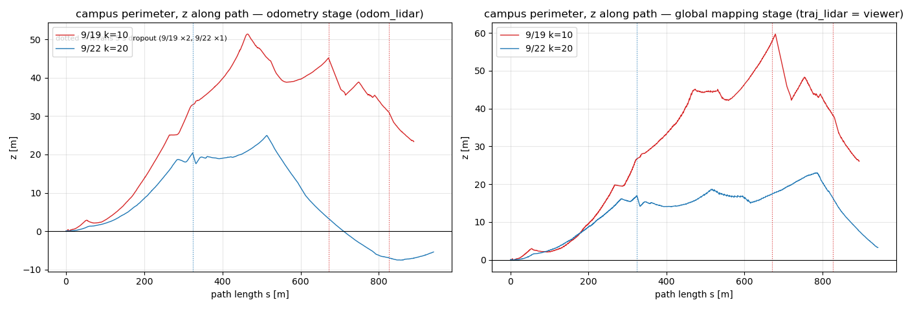
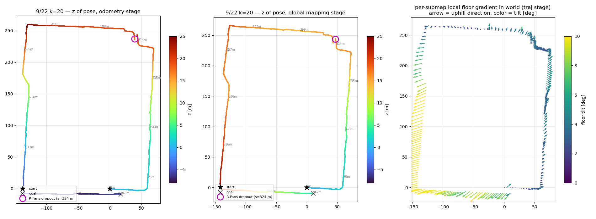

### 14.2 「スタートとゴールの z は合う」「点群ロストは無かった」の検証

- z_end は traj +3.3 m (odom −5.4 m)。ただし §12.2 と同じく**閉合が効いたのではない** (loop 因子 0 本): 往路 (東側直線、heading +87°) で +5°/経路長の上り、復路 (西側直線、heading −97°) で −7° の下りが相殺しただけ。途中の最高点は +23〜25 m (図 26)。図 27 左の床高さマップがユーザの見た「場所ごとに z が違う床」そのもの。
- R-Fans 欠落は **1 回あった** (`analysis_0922/dipscan_1158.txt`: bag 相対 670 s、5.27 s、点数 30k→137k→17k の署名 = 09-02 issue の回転ディップ)。GLIM は 5 s を IMU 単独予測で埋め、xy 7.3 m (うち実走行 2.6 m)・z −2.6 m 動いた。画面上は「消える」ではなく「滑る」ので気付きにくい。1913 s の 0.57 s の穴は全 topic 同時 = NTP ステップ (欠落ではない)。
- 欠落ダメージは欠落直前の odometry 状態の質に依存し、同一 bag で k=10 → 20 で 17 → 7 m に縮んだ。critic 指摘: この bag の静止 |a| = 9.958 m/s² に対し `acc_scale 0.9705` は |a| を 9.664 にしてしまい 0.14 m/s² 不足 → 5.27 s の IMU 単独区間で z −1.4〜−2.0 m を作れる (観測 −2.6 m の半分以上)。§14.6 の acc_scale 0.985 run で確認。

### 14.3 「k=20 は外周でも効いたか」 — 同一 bag A/B で **効いた** (critic が初稿の「効いていない」を棄却)

初稿は別日 bag (09-19) との比較で「A 5.7 → 6.8、縮んでいない」としたが、09-19 は欠落 2 回でフィットが汚く (R² 0.48)、欠落前区間だけの比較は heading が 2 種しかなく c と A が縮退して識別不能だった。同一 bag で k だけ変えた A/B (§14.1 右列): **A 9.85 → 6.77 (−31%)、rms 27.4 → 12.6 m (−54%、5号館の −55% と同率)、z_max 46 → 25 m、欠落ジャンプ 17 → 7 m、xy 経路長 839 → 940 m (k=10 は xy も 11% 縮む)**。k=20 後に残る A ≈ 6.8 は 5号館の残り 4.0 より大きく、環境依存 (植栽・遠距離面) の床が残る。

### 14.4 「roll 方向の歪み」の正体 — global mapping 段が submap を IMU に逆らって傾けている (critic 査読で表現修正)

計測事実:
1. **LiDAR 自身から見た地面は全 submap で平ら**: submap 原点フレーム (odometry 段の姿勢) で地面平面を当てると bank −0.02±0.27°、前後 −0.12±0.31° (265/265 submap、`m3_ground.py`)。点群は submap 姿勢に剛体で付いているので、**最終地図の床の傾き = global mapping が各 submap に与えた回転そのもの**。
2. **odom 段の LiDAR roll は −0.6° (heading 非依存)、traj 段は定数 −4.3° + 3.0°·sin(heading)**、経路 4 分位で −1.8 → −2.8 → −6.4 → −6.0°、西側直線 (s=620〜786 m) で −11° まで成長 (図 28)。BNO086 の実 roll は走行平均 +0.46° (bin 別 +0.1〜+1.1°、西側直線に ~1° の左上がり横断カントが実在) で、traj の −4〜−11° は実在しない。
3. critic の再解釈 (採用): traj 段の車体 up ベクトルを世界系で見ると **s≈530〜940 の submap ブロック全体が同じ世界固定方向 (方位 ≈ +20°、東北東) に 8〜11° 傾いている**。西側直線 (heading −97°) ではそれが roll −10° に、南側直線 (heading −8°) では pitch +9° (機首下げ、traj z が 22 → 3 m に落ちる) に見える。**s=786 の角で roll → pitch に乗り換える不連続はその表れ** (図 28 の 790 m 付近)。加えて全周に「進行方向に対して左下がり」の定数 roll (k=20 −4.3° / k=10 −7.8°) が乗り、床が経路に沿ってねじれた螺旋面になる。traj vs odom の submap 回転角は 6 分位で 1.9→3.1→2.2→3.3→**10.5→9.4°**、隣接差は中央値 0.15° (p90 0.54°、最大 1.42°) = 一点のヒンジではなく分布したねじれ。
4. **IMU 因子は姿勢を重力に留めていない**: global 段の acc bias の水平成分は最大 0.118 m/s² (≈0.7° 相当) なのに姿勢は 10° 傾く。§12.10 の critic H4 (global 段の IMU 拘束は submap 境界の短い preintegration だけで VGICP/between に負ける) と整合。
5. 同一 bag の k=10 run では s≈219 から既に 11〜15° 回転し、方向も走行左側固定 (車体固定 roll 型) — ブロックの場所も型も k で変わるので「西側直線という場所の性質」説は弱い。

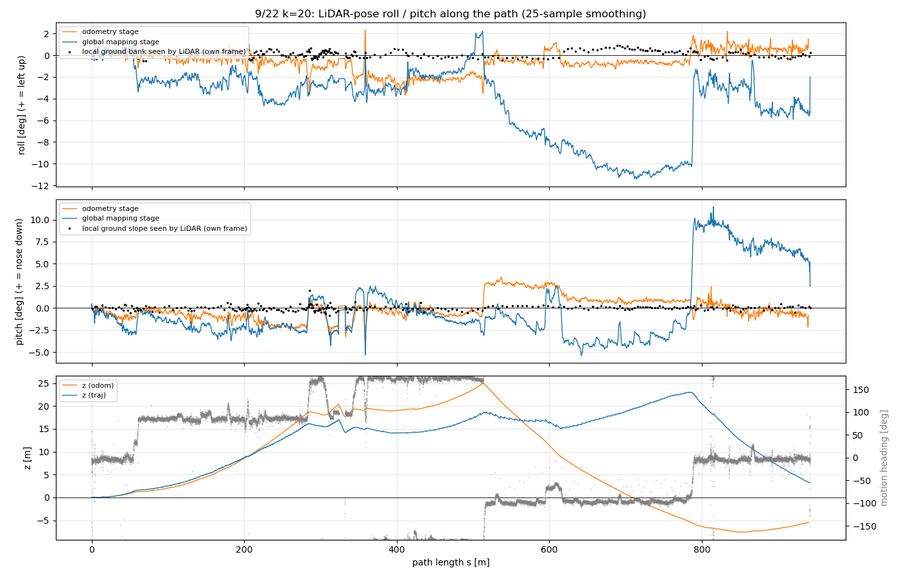
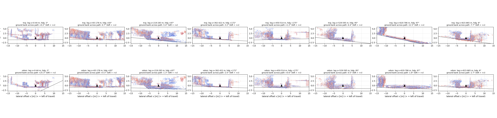

機構は未識別。候補 (critic): (a) global 段 VGICP (voxel 0.5 m、random sampling 0.2) が道幅 6 m では隣接 submap 間の roll に鈍感 (0.1° = 道幅で 1 cm) で、無拘束の roll が odometry の z 滑り A と between factor の矛盾を吸収する向きに系統的に流れる、(b) IMU 境界因子の実効重みが小さすぎる (境界 Δt ≈ 0.1 s で 10° 誤差の残差は数 mm)、(c) `create_between_factors: true` の GICP between が odom 段の姿勢を継承しつつ VGICP 誤差因子と綱引き。→ §14.6 の `enable_imu=false` run で (b) を、pose-graph run で (a)(c) を切り分ける。

### 14.5 副産物: odometry 段の姿勢も IMU に逆らって 1.4° 傾いている (§11.2「姿勢は水平」の精密化)

bag の BNO086 (orientation と 2 s 平均比力の 2 手法、`m4_imu_attitude.py`) で走行中の車体 roll/pitch を進行方向 h に対し a + b·cos h + c·sin h でフィットすると、**剛体的な (heading 1 次調和の) 地面傾斜は 0.23〜0.25°、R² 0.04〜0.09** — 地面は平ら (5号館 bag も 0.27°)。一方 **GLIM odom 段の LiDAR 姿勢は同じフィットで 1.41°、R² 0.62〜0.74、方向 φ=+88° で z 勾配の最大上り方向 h0=+88° と一致**。同一 bag の k=10 では 1.79°/φ=+117° に変わるので地形ではなく推定器由来 (critic 検算: 取付ヨー誤りは位相しか変えず振幅は不変、加速度汚れは 2 手法一致で否定)。つまり odometry 段でも LiDAR 登録が IMU を 1° 級で押し切っており、z の滑り (5〜7°) はその 4 倍。§11.2 の「車体姿勢は水平のまま」は「1° 以内」に読み替える。

### 14.6 切り分け run (同一 bag、config 1 キー差、オフライン各 ~10 分)

| run (`exp_2026-09-23_k10_0922/`) | odom A / z_max / rms | traj A / z_max / z_end / rms | traj roll 定数項 | submap 回転 (traj vs odom、後半 1/3 平均 / 6 分位) | 読み |
|---|---|---|---|---|---|
| k=20 基準 (`2026-09-221158_k20_dump`) | 6.77 / +25.0 / 12.6 | 4.04 / +23.0 / +3.3 / 14.2 | −4.3° | **10.0°** / 1.9 3.1 2.2 3.3 10.5 9.4 | 本節の対象 |
| k=10 (同 bag) | 9.85 / +46.3 / 27.4 | 11.78 / +48.8 / −2.0 / 26.7 | −7.8° | 8.2° / 1.8 5.6 9.1 10.5 8.7 7.8 | k=20 は外周でも効く (§14.3) |
| k=20、global = pose-graph のみ (`config_global_mapping_pose_graph.json`、min_travel_dist 50 で loop 候補なし) | 7.04 / +34.8 / 16.7 | = odom | −0.9° | **0.0°** | traj = odom。**傾きは submap 間再登録 (VGICP + between + IMU 境界因子) の最適化の中で生まれる**。odom 段は同 config でも 25 ↔ 35 m 動く (run 間ノイズ床) |
| k=20、global の `enable_imu` だけ false | 6.57 / +30.7 / 15.1 | 16.71 / **+73.3 / −29.6** / 38.5 | −6.1° (+heading 依存 14°) | **21.4°** / 3.4 7.8 11.3 14.1 21.6 21.2 | **IMU 境界因子は傾きを「作って」いるのではなく「半分に抑えて」いる**。外すと 22° まで倒れる → 傾きの駆動源は VGICP/between 側 (候補 (a)(c))、IMU 因子は弱いブレーキ (候補 (b) は「重み不足」として残る) |
| k=20、`acc_scale` 0.9705 → 0.985 | 6.75 / +32.8 / 16.0 | 5.74 / +36.0 / +8.7 / 21.0 | −5.6° | 12.5° / 1.9 3.7 3.1 4.4 11.8 13.1 | **欠落時の z ジャンプ −2.6 → −1.2 m (odom)、xy は 7.3 → 7.7 m で不変**: critic 予測どおり z 成分の半分以上は |g| 不足だった。A (6.75) と傾き (run ノイズ内) には効かない → acc_scale は「欠落時の z 飛び」対策としてのみ有効。live 反映は静止 |a| の再測定 (この bag 9.958、09-13 の 10.09〜10.13 と違う) を待つ |

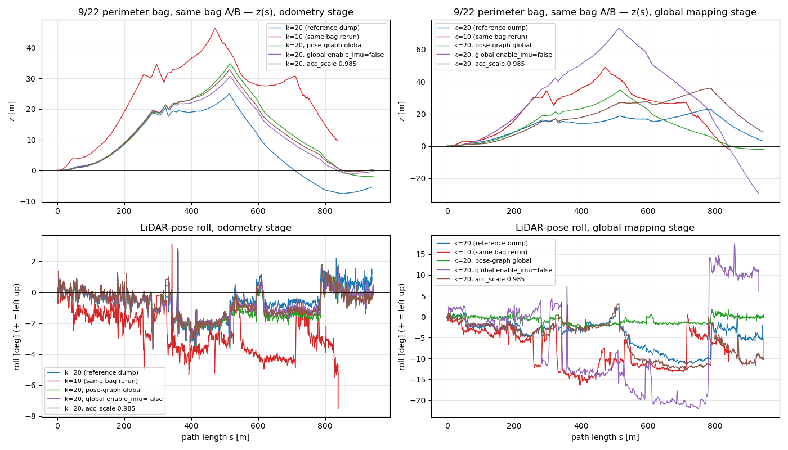

判定 (critic の候補に対して): 傾きは global 段の submap 間再登録が駆動し、IMU 境界因子はそれを 22° → 10° に抑えているだけ。pose-graph のみなら傾きは出ないが A の坂 (odom 段) はそのまま残る。**当面の実用判断**: 外周のような長距離 1 周では、現行 global (再登録あり) より **pose-graph global の方が床の傾きが無い分 2D 地図化に向く可能性** (rms 16.7 vs 14.2 で山は少し高いが、床が横に傾かない)。要 2D 地図比較。機構を詰めるなら次は VGICP の roll 感度 (submap_voxel_resolution 0.5 → 0.25 / randomsampling_rate 0.2 → 0.5) と between factor OFF (`create_between_factors: false`) の各 1 run。

## 15. 生 IMU (BNO086) 自体はドリフトしているか — 走行 bag 4 本の直接計測 (2026-09-24、critic 査読済み)

きっかけ: 外部から「z 歪みは IMU のドリフトではないか」との助言。§11〜§12 の実験は「IMU の内容を変えても A が動かない」を示すが、**生の /imu/data がドリフトしているか自体は測っていなかった** (§4 は |g| と重力方向の始終のみ)。

方法 (`bags/5goukan/2d3dimu/offline/glim/analysis_0918/imu_raw_drift.py`、main コンテナで bag 1 本 1〜2 分): 対象 = 新車体 `2026-09-180915` (5号館 2 周 1356 s)・`2026-09-221158` (外周 1951 s)・`2026-09-130803` (1 周 697 s)、旧車体 `2026-08-14_0919` (1 周 700 s)。どの bag も静止は冒頭・末尾の 3〜10 s だけ (走行中は止まらない) なので、(1) 始終静止窓の gyro bias・|g|・加速度由来姿勢 vs BNO086 融合姿勢、(2) **生ジャイロを単独積分 (先頭静止窓の bias を引く) して BNO086 融合姿勢と比較**、(3) yaw の BNO086 / gyro 積分 / 車輪 odom 3 者比較、を出した。BNO086 firmware は SH2_ROTATION_VECTOR (磁気込み) + GYROSCOPE_CALIBRATED + ACCELEROMETER を 100 Hz で出し、GLIM は orientation を使わず angular_velocity / linear_acceleration だけを使う。

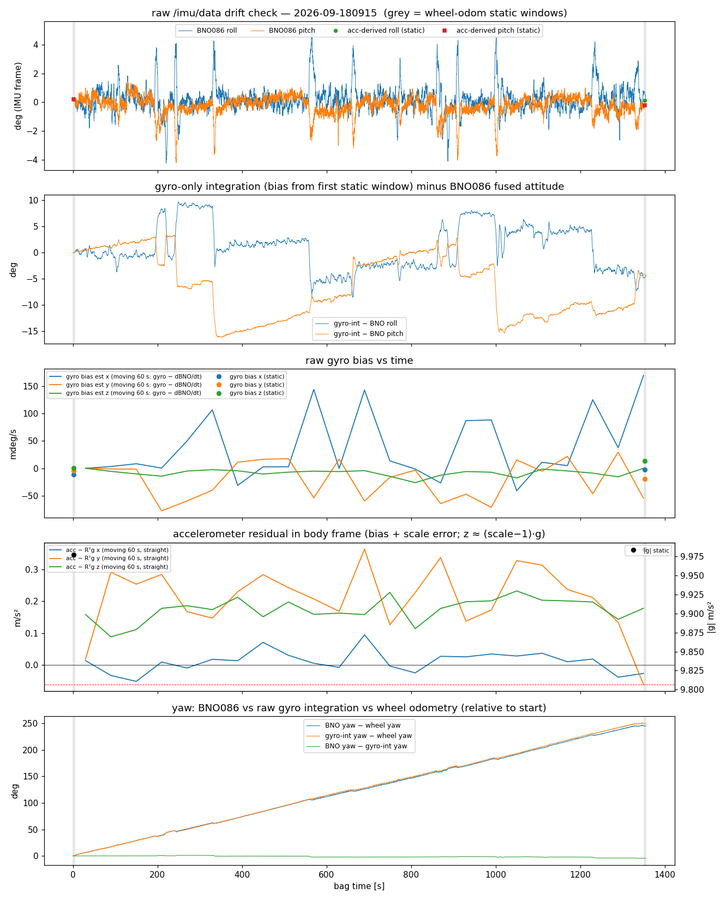
*図 31: 新車体 09-18 2 周。上から BNO086 roll/pitch、生ジャイロ積分 − BNO086 姿勢 (Euler 差)、60 s 窓 bias 推定 (不採用、後述)、加速度残差、yaw 3 者比較。旧車体 = 31b、外周 = 31c。*

### 15.1 計測事実

| 項目 | 新車体 (0918 / 0922 / 0803) | 旧車体 (0919) | 読み |
|---|---|---|---|
| 静止 \|g\| 始→終 | 9.977→9.985 / 9.954→9.970 / 10.021→10.022 | 9.838 | run 内 ≤+0.016。**日ごとに −0.5〜+2% 違う** (§4 の 10.09〜10.13 とも違う) |
| 走行中 z 加速度残差 acc − Rᵀg (直進中央値) | +0.16〜0.18 / +0.14〜0.17 / +0.21 m/s² で run 内一定 | ≈0 | 静止 \|g\| の超過 (+1.7%) と一致 = **スケール誤差、時間ドリフトではない**。0918 だけ y +0.13〜0.36 m/s² (走行中のみ、正体未確認) |
| BNO086 融合姿勢 − 加速度由来姿勢 (静止) | 冒頭 0.00° → 末尾 roll +0.44 / roll −0.48 pitch −0.24 / roll +0.26° | 0.00° (末尾静止なし) | 融合姿勢のずれ ≤0.5°。GLIM は orientation 不使用、EKF は two_d_mode で roll/pitch 不使用 → どちらにも無関係 |
| 静止窓 gyro bias の始→終変化 | (+8, −15, +13) / (−15, −8, +19) / (+24, +7, +22) mdeg/s | 静止 0.00 (calibrated 出力) | bias は run 中に 10〜25 mdeg/s 動く。0922 の z +19 mdeg/s は gyro 積分 yaw − BNO yaw の差 22° の大半を説明 |
| **生ジャイロ積分の傾き誤差 (world 系ノルム)** | 最大 **15.7° (t=351 s)** → 2.8° (1 周完了) → 12.8° → 終 6.4° / 最大 13° / 最大 19° | 最大 **3.6°** | 新車体は旧の 4〜5 倍。周回に同期して増減 |
| yaw (2 周 = 720°) | BNO 715.5 / gyro 積分 719.9 / **車輪 470.7°** | (1 周) 357 / 357 / 287° | gyro z のスケール・積分手法は正しい。車輪 yaw は別問題 (15.4) |

**60 s 窓の bias 推定器 (gyro − dBNO/dt の中央値) は不採用**: 旧車体でも x=200 mdeg/s と出るなど暴れる (旋回中の残差が支配)。信頼できるのは積分比較と静止窓。

### 15.2 誤差の正体 — 旋回同期パルス + 直進中の bias 変動 (critic の再解析で分解)

初稿では「傾き誤差ノルムが周回で上下 = **車体固定の残留 bias ≈45 mdeg/s** を閉じた周回で積分すると相殺する」と解釈したが、critic が旋回 1 回ごとに再初期化して測り直した結果、分解が違った:

1. **旋回 1 回ごとの傾き誤差** (旋回 3 s 前に BNO086 姿勢で再初期化、3 s 後に比較、world 系水平成分): 0918 中央値 **6.27°** (最大 10.0°、|Δψ| 比 **0.104**)、0922 6.90° (比 0.097)、旧 0919 **1.06°** (比 0.013)。
2. 残差レート gyro − dq/dt の 1 s 平均は旋回 8 s 前 ≈0、旋回中〜終了 +2 s で左旋回 x +0.6〜+1.1°/s・y −0.3〜−0.9°/s、**右旋回で符号反転**、終了 +6 s で戻る → **旋回に閉じた、ω_z に比例する誤差**。bias の段差ではない。
3. 直進区間内の増加率 (真の bias 様成分): 0918 14〜26 mdeg/s、0922 8〜37、旧 1〜2。ただし bias0 を先頭 4 s で決めているので、後半の一部は上表の bias 変化そのもの。
4. **どちらが正しいかの仲裁 = 加速度計**: 旋回終了 2〜22 s 後の直進で acc − Rᵀg を取ると、BNO086 姿勢では ≤0.24 m/s²、生ジャイロ積分の姿勢では **0.4〜2.7 m/s² (= 2〜16°)**。→ BNO086 姿勢と加速度計が一致し、**外れているのは生ジャイロ**。「BNO 側がドリフトしていてジャイロは正しい」は棄却。
5. 固定の座標系ずれ (gyro vs RV/accel の Procrustes 回転) は 0918 2.5°、0922 0.81°、旧 0.79° → 10% を作れず、パルスの方向が 0918 (+x) と 0922 (−x) で反転しているので棄却。時刻ずれ・欠落 (dt 最大 13.9 ms、相互相関ラグ −1 サンプル、欠落 0) も棄却。
6. 振動整流説は**不利**: 旋回中の gyro x 標準偏差は旧 7.4〜11.2°/s、新 1.8〜2.4°/s (旧の方が振動が大きいのに誤差は 1/6)。

残る原因候補 (未識別): **H-G1** BNO086 内部の動的 gyro 較正が旋回中に誤推定し calibrated 出力に混入 / **H-G2** モータ電流の磁気外乱 → 磁気込み RV の yaw 補正が bias 推定を汚す (旋回時に電流増) / 取付変更 (b62d73a の WITmotion 比較セットアップで基板が動いた?) による方向反転。`/imu/mag` は現 bag に記録されていない。

### 15.3 「IMU がドリフトしていたら z にどう効くか」 — 判定 (critic 反映)

```
生 IMU の誤差 → GLIM の z への経路
├── ジャイロの旋回同期パルス (新車体 6〜7°/90°)                 【実在。z 並進 A には届いていない = 本命、確定ではない】
│    ├── 原理: CCW 周回では体系で同じ向きに入る → world では heading と共に回る = A 型 (heading 依存) の姿勢誤差を作り得る
│    │    → 初稿の「body 固定 bias は c 型にしか出ない」は定常 bias にしか当てはまらず、この誤差には使えない (critic)
│    ├── 姿勢には届いている可能性が高い: §1「ピッチのジャンプは旋回で起きる」、§7 H3 の Δpitch/Δyaw 符号ロック k≈0.009〜0.027
│    │    (旧車体の生ジャイロ比 0.013 と同桁)、§14.5 の odom 段 1.4° 傾き (φ=+88°=h0) の入力候補
│    ├── z 並進に届かない根拠: R2 (IMU 重み ×10 で姿勢誤差半減しても A 不変)・R5 (加速度置換で A 不変) = 姿勢経由の経路は弱い。
│    │    CPU odometry は LM 結果を precision 1e3 で注入するので 1 スキャン内の予測誤差 (15°/s × 6% × 0.1 s ≈ 0.09°) しか入らない
│    └── ⚠️ ジャイロだけを直して GLIM を回した実験は無い (R2/R5 は加速度、fix_imu_bias は bias、CT-ICP は IMU 全除去) → E1 で確定させる
├── ジャイロ bias 変動 15〜25 mdeg/s (直進中)                   【GLIM の imu_bias_noise 1e-5 では 1°/s 級 5 s パルスは追えないが、定常成分は追える】
├── 加速度スケール +1.5〜2% (run 内一定、日間で変動)              【A に無関係 (R1/R5)。効くのは LiDAR 欠落中の IMU 単独区間のみ (§14.6: 5 s 欠落で ≈1.9 m)】
├── BNO086 融合姿勢のずれ ≤0.5° / 磁気込み yaw −4.5°/2 周        【GLIM 無関係 (orientation 不使用)。EKF には yaw だけ届く (15.4)】
└── 一定沈降 c への寄与                                          【定常 bias 成分は c 型。ただし c の主因は extrinsic pitch 0.9° (§9.3)】
```

結論の書き方: 「生 IMU にドリフトは無い」は**誤り**。正しくは「生ジャイロには旋回同期の誤差 (新車体 Δψ の約 10%、旧車体 1.3%、加速度計仲裁でジャイロ側の誤り) と 15〜25 mdeg/s の bias 変動があるが、それが届くのは姿勢までで、姿勢誤差と A の分離は R2/R5 に依拠している。ジャイロ置換 run (E1) では未確認」。

### 15.4 副産物: 車輪 odom の yaw ドリフト (バグではない、critic が `epos4_odometry.cpp` を確認)

車輪 odom の yaw は 2 周で 470.7° (真値 720°)、外周 1 周で 671.7° (真値 360°) と大きく外れ、低角速度域 (|ω_z|<0.1) で車輪 dyaw の総和が gyro と符号反転・同じ大きさに見えた。critic の判定: **解析・odometry コードのバグではない**。低角速度 10 s ビンで車輪 dyaw を gyro dyaw に回帰すると傾き +1.06〜+1.11・相関 +0.97 (追従している) + **距離比例ドリフト −0.35°/m (0918) / +0.33°/m (0922) / ≈−0.29°/m (旧 0919)**。0.006 rad/m × tread 0.529 m = **左右の実効タイヤ径差 0.3%**、符号は日で変わる (空気圧・荷重・路面カント)。GLIM には無関係。**EKF (`ekf.yaml` は odom0 yaw と imu0 yaw を同時融合) と Nav2 には効く** — 車輪 yaw を EKF から外す (odom0_config の vyaw を false) か、径差を較正する余地。

### 15.5 次の一手

1. **E1 (最優先、オフライン ~15 分、機械不要)**: `synth_imu_bag.py` (R5 用) を拡張し、0918 bag の `angular_velocity` を BNO086 四元数差分の体系角速度 (1 s 以下で平滑) に置換、または |ω_z|>0.15 の区間だけ x,y を置換 (旋回パルスだけ消す) → k=20 基準 config で 1 run。判定: odom 段 A / h0 / rms が run ノイズ床内で不変なら「IMU は A に無関係」を**確定**に上げる。同時に §1 の旋回 Δpitch 符号ロック・§14.5 の 1.4° 調和・`IMU prediction is not good` 件数が消えれば、姿勢側の入力が特定される。A が −20% 以上動けば書き直し。
2. (5 分、bag 1 本) 車体を浮かせて手で 4×90° 左/右 → 生ジャイロ積分 vs RV/accel の比 0.10 が再現するか (H-G1 チップ/キャリブレータ vs H-G2 電流・磁気)。次回走行 bag では `/imu/mag` も録る。`use_game_rotation_vector: true` (磁気なし RV) での 1 周も H-G2 の識別になる。
3. 新車体の acc_scale は日ごとに |g| を測って入れる運用に (0.9705 固定は 09-22 bag には −1.2% 過補正)。
