<!-- claude: 2026-10-02 作成 -->
# /scan・/scan_all の「地面の壁」— 縦角・ドライバ・切り出しの切り分け (8 号館廊下 bag)

**ステータス: 調査中** (切り出し・ドライバの計算式は正常と確認。縦角誤差は実在するが値は幅付き。15〜20 m の壁の主因は未特定 — 静的誤差だけでは説明できず、動的ピッチ / 地形が候補。critic 査読済み。§8: 自律走行 bag の十字路では、ring 7 を −1.3〜−1.6° に補正すると道路を横切る偽の壁が消えることを RViz 風の比較で確認 — §8 は critic 未査読。§9: 公式表では床の点を結んだ線が前後対称の ∪ 字に折れ、override で真っ直ぐに近づく = 公式表の縦角が個体とずれていることを目視で確認。ring 7 はこの廊下では確かめられない)

- 症状: 自律走行中、R-Fans 由来の `/scan`・`/scan_all` に 15〜20 m 先の地面が壁として出て、global planner が迷う (メモ scan-ground-ghost-minus1-ring、bag `2026-09-27_1948_5goukan_auto`)
- 対象 bag: `bags/raw/2026-10-01_1920_rouka` (8 号館廊下。初期位置の前後方向が廊下。0〜28 s 静止 → 30〜215 s その場でゆっくり旋回 → 移動)
- 解析スクリプト: `bags/tools/2026-10-02_rouka_vangle/` / 出力: `bags/exp/2026-10-02_rouka_vangle/`
- ⚠️ この bag の `/scan` は URG (721 本) で、R-Fans の `/scan_all` は記録されていない → 点群から再生成した (§3.1 で実ノードと一致を確認)

## 1. 3 つの計算処理のしくみ

```
R-Fans の 1 点ができて /scan_all に載るまで
│
├─ ① LiDAR (縦角)
│    16 本のレーザ (ring 0〜15) はそれぞれ固定の仰角 α_k で射出され、筐体ごと回転する
│    測るのは「距離 r」と「回転方位 θ」だけ。α_k は測っていない (= 表に頼る)
│
├─ ② ドライバ (surestar_rfans_ros2 / calculation.cpp calcXyz)
│    x = r·cos α·cos(−θ),  y = r·cos α·sin(−θ),  z = r·sin α
│    α は表を引くだけ: vangle_override (params.yaml) があればそれ、無ければ VAngle_V6B_16G
│    → 表の α が個体の真の角度とずれていれば、z が r·sin(ずれ) だけずれる
│
└─ ③ 切り出し (pointcloud_to_laserscan、rfans_scan.launch.py)
     1. TF で rfans → base_link へ変換 (URDF: xyz (0,0,0.79396)、rpy 0)
     2. base_link の高さ帯 0.3〜1.5 m、水平距離 0.5〜30 m の点だけ残す
     3. 方位ビンごとに最も近い点 1 つを採用 (/scan 0.0035 rad、/scan_all 0.00016 rad)
     → 計算は単純。誤差が入るとしたら入力 (② の z、1. の TF 傾き) から
```

なぜ遠くの床が壁になるか: ring 7 (表 −1°) は床に浅い角度で当たる。真の俯角が表より e だけ深いと、床にヒットする距離は d = H / sin(1° + e) で、計算上の高さは z = H·(1 − sin 1° / sin(1° + e)) と床から浮く (H = 0.794 m)。z が 0.3 m を超えれば帯に入る。浅い角度の当たり方では、角度が 0.1° 違うだけでヒット距離が約 1 m 動く。

## 2. 方法

1. 点群 (x, y, z, laserid) をそのまま抜き出す (`extract.py`)。各リングの仰角が表の値と完全に一致することを確認した → bag の点群は vangle_override 適用済み。
2. **yaw は BNO086 のジャイロ積分**を使う (`imuyaw.py`)。車輪 odom はその場旋回で数度ずれ、時刻の違うフレームの壁が重ならない (§7.2 の図 6)。
3. **床か物体かの判定**: 世界方位を固定して、そこへのヒット距離を「車体の向き (センサ方位)」の関数で見る (`grazing*.py`)。
   - 床: センサの傾きの効き方が向きで変わるので、ヒット距離が正弦状に波打つ
   - 物体・壁: 距離は一定
4. **縦角の逆算** (2 通り。結果がずれた — §3.3):
   - 方位ビン法 (`fit2.py`, `fit3.py`): 方位 1° ごとに ring 0〜5 の床点で床の直線を引き、ring 6/7 の床ヒットがその直線上に乗るための α を解く
   - 平面モデル (`grazing2.py`): 「遠くの床もロボット直下と同じ高さの平面」と仮定し、r = H / tan(−α + 傾き(θ)) をデータに重ねる
5. **補正後の /scan_all を再生成** (`render.py`, `render_map.py`): 距離・方位はそのまま、仰角だけ差し替えて再投影 → TF (傾き補正あり/なし) → 帯 → ビン最近点
6. **bag 自身から地図を作って重ねる** (`render_map.py`): 補正後の全点群を世界座標に積算し、10 cm セルで次の 2 層を作る
   - 縦構造: 2 本以上のリングが z 0.1〜2.5 m で当たり、高さの広がりが 0.25 m 以上
   - 床が見えた所: ring 0〜6 の点で |z| < 8 cm
   - 判定対象の ring 7 は地図作りに使わないので、ring 7 単独では縦構造にならない

## 3. 結果

### 3.1 切り出し (③) の計算は正しい
実ノード `pointcloud_to_laserscan` (`/scan_all` と同じパラメータ) に bag の点群を流した出力と、Python 再実装を同じフレームで比べた。103 フレーム・147 万ビン中 **99.95% のビンで 2 mm 以内に一致** (`p2l_check.sh`, `p2l_cmp.py`)。
- 確認できたのは「与えた TF (rpy 0) に対して計算が正しい」ことまで
- 問題は TF の rpy 0 が実際のセンサの傾きと合っていない点 (§3.4)

### 3.2 ドライバ (②) の計算式は正しい
- 仰角はテーブル値そのもの
- ring 0〜5 の床点 5 本が 1 本の直線に乗り (残差 2 cm)、センサ高 H の中央値 0.792 m は TF の 0.794 m と 1% 以内で一致 → 距離系にも矛盾なし
- ずれているのは**表 (= 個体の縦角)** のほう
- この bag では検出できないもの: 仰角が方位で変わる成分 (回転軸の倒れ)、射出点のリングごとのずれ (いずれも TF 傾き + 縦角の補正で実用上は吸収される)

### 3.3 縦角 (①) の誤差は実在する。ただし値は幅付き

| リング | 表 | 方位ビン法 | 平面モデル | 採用した幅 |
|---|---|---|---|---|
| ring 6 | −3.0° | −3.43° (IQR −3.48〜−3.38) | −3.15° | **−3.15〜−3.45°** |
| ring 7 | −1.0° | (−1.5° は壁由来で棄却) | −1.3° | **−1.3〜−1.7°** |

- 2 つの方法は約 0.25° ずれた。原因は床の非平面性と考えられる: 方位ビン法は 3〜8 m の床の直線を 13〜16 m まで外挿している。15 m 先で約 6 cm の床のうねりがあれば、このずれになる。
- **ring 6** は後方の床ヒットで確認できた。距離が車体の向きに応じて 12.5〜17 m と波打ち、床の予測どおりに動く (§7.3 の図 9 上段)。
- **ring 7** は後方 27.5〜28 m の壁に床ヒットが紛れ、値を 1 つに絞れない。19.5〜28 m の帯内の点の多くは、車体の向きによらず距離が一定な世界固定の低い物体 (ring 8 は上を通過するので、高さ 0.45〜1.1 m 程度)。
- ring 6 は帯に入る距離が 9.4 m 以内なので、15〜20 m の壁には関係しない。

### 3.4 センサは床に対して前下がり 0.25〜0.35°
- 方位ビン法で求めた床の傾きを、センサ方位の正弦でフィットした: 振幅 0.35°、方向 −5.5° (ほぼ真正面)
- ただし廊下の床そのものに前後で約 ±0.28° の傾き差があり、同じ大きさ。**取付の傾きか、その地点での車体の載り方かは分けられていない**。
- 傾き補正は前方の点を下げ、後方の点を上げる。そのため後方の開けた廊下では、補正で残る点がむしろ増える (`map_overlay_behind_C.png`)。

### 3.5 補正前後の /scan_all (地図を重ねた図)

地図について: リポジトリにある Nav2 用の地図 (`maps/2d/glim/2026-09-180915_dumpbase` など) は 5 号館まわりの屋外で、8 号館の廊下は入っていない。そこで **この bag 自身の点群 (縦角補正後) から 10 cm セルの地図を作って**重ねた (`render_map2.py`)。
- 濃い灰 = 物体・壁: ring 7 **以外**のリングが高さ 0.3〜2.5 m で当たったセル
- 薄い緑 = 床: ring 0〜6 が高さ ±8 cm に当たったセル
- 白 = 他のリングでは何も見えていない所
- 判定対象の ring 7 は地図に使っていないので、「ring 7 だけが当たった所」は白になる

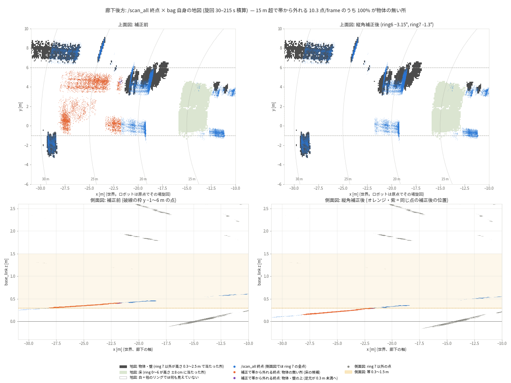
*図 1: 廊下後方 (旋回 30〜215 s 積算)、縦角補正 ring 6 −3.15° / ring 7 −1.3°。上段 = 上面図 (左 補正前、右 補正後)、下段 = 破線の枠 (y −1〜6 m) を横から見た側面図。青 = /scan_all 終点 (側面図では ring 7 の全点)、オレンジ = 補正で帯から外れる終点のうち物体の無い所にあるもの、紫 = 同じく物体・壁の上にあるもの、灰 = ring 7 以外の点。*

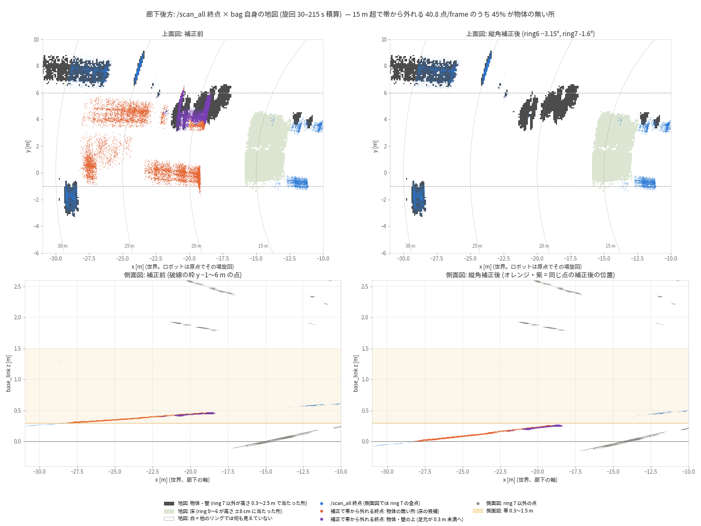
*図 2: 同じ図で ring 7 = −1.6° を仮定した場合。*

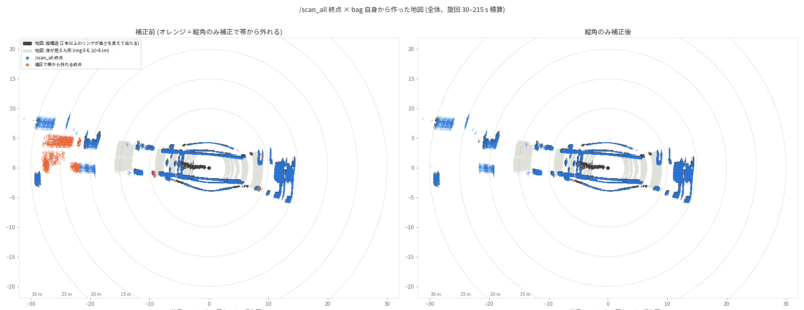
*図 3: 全体 (ring 7 −1.3°、旧版の地図: 黒 = 2 本以上のリングが高さを変えて当たったセル)。*

読み方:
- **上面図**: オレンジの点が地図の濃い灰 (物体) の上にあれば、それは物体の足元が帯の下限 0.3 m をまたいでいるだけ。白の中にあれば、ring 7 以外は何も見ていない場所への終点 (床か、ring 7 の高さにしか無い低い物)。
- **側面図**: 1 本のリングの点は、計算上は z = 0.794 + r·sin α の 1 本の直線 (光線) に並ぶ。補正すると直線の傾きが変わる。床なら補正後に z≈0 に乗るはずで、壁なら縦に積み上がるはず。

読み取れること:
- **補正前の後方 22〜28 m のオレンジの雲は、他のリングでは何も見えていない所にある。** ring 7 −1.3° で帯から外れる 15 m 超の終点 (10.3 点/frame) の **99.6% が物体の無い所**。しかも点は上面図で半径方向に 5 m ほどにじんでいる (= 車体の向きでヒット距離が動く)。壁ではない。
- **ただし側面図では、補正後もこの点は z 0.1〜0.3 m に並び、z≈0 (床) には下りない** (帯の下限 0.3 m を下回るので /scan_all からは消える)。−1.6° だと −28 m で z≈0 に届くが、−20 m ではまだ 0.2 m。すべてを床の高さに落とすには ring 7 = 約 −1.8° が要る。これは平面モデル (−1.3°) とも critic の範囲 (−1.4〜−1.7°) とも合わない。
  - 考えられる解釈: (a) 床のうねりやセンサの傾きが向きで変わる分を補正していないため、床ヒットが光線に沿って散らばっている / (b) 床ではなく、ring 7 の高さ (0.1〜0.3 m) にだけ当たる低い物
  - **「床由来」は確定できていない**。確定させるには開けた平らな床での較正 (§6-2) が要る。
- −1.6° では、右上の物体 (x −21〜−18.5, y 4〜6.5) に当たっていた ring 7 の点 (紫) もまとめて帯から外れる。物体の足元が 0.3 m 未満に下がるためで、地図から消えるわけではない (ring 8 以上が当たっていれば残る)。
- **この廊下で出た遠方の偽の壁 (の候補) は 22〜28 m で、15〜20 m ではない。** 15〜20 m 先の帯内の点は、ほぼすべて世界固定の物体。

旧版の地図重ね図 (縦構造 = 2 本以上のリング、地図の層が薄い) も残しておく:

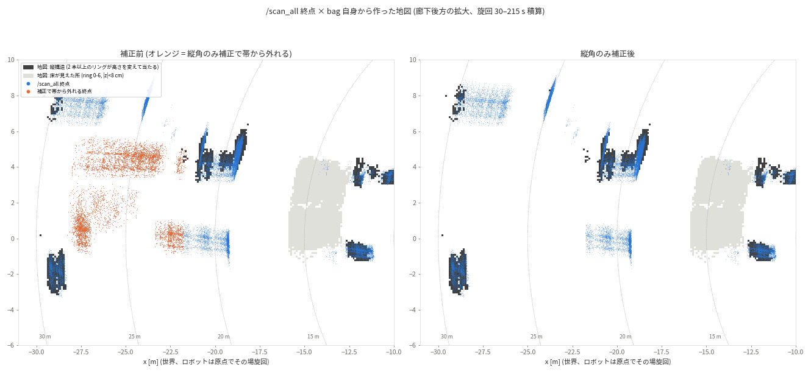
*図 2b: 旧版、ring 7 −1.3°。オレンジのうち旧版の縦構造 ±0.3 m 以内にあるのは 1.7%。*

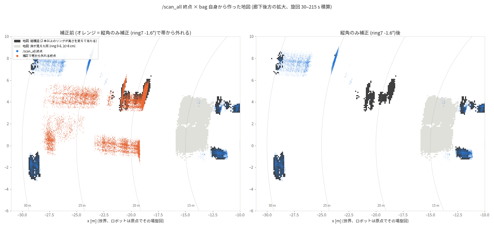
*図 2c: 旧版、ring 7 −1.6°。*

そのほかの図 (1 フレームごとの比較・距離分布・旋回アニメ・判定の根拠) は §7 に説明付きでまとめた。

## 4. 15〜20 m の壁は静的誤差だけでは説明できない (critic 指摘、未検証)

§1 の式で、ring 7 の床が帯 (z ≥ 0.3 m) に入るために必要な俯角の追加 e と、そのときのヒット距離 d:

| 追加の俯角 e | 床ヒット距離 d | 計算上の z |
|---|---|---|
| 0.61° | 28.3 m | 0.30 m (帯の下限) |
| 0.85° (縦角 0.5° + 傾き 0.35°) | 24.6 m | 0.37 m |
| 1.53° | 18 m | 0.48 m |
| 2.03° | 15 m | 0.53 m |

- 今回の静的誤差 (約 0.85°) が作る偽の壁は約 25 m 以遠。これは図 1 の雲 (22〜28 m) と合う。
- 15〜20 m に出すには、さらに 0.5〜1.2° 必要。候補は次の 3 つ:
  - 走行中のピッチの揺れ
  - 上り勾配 (屋外の地形)
  - ring 7 の誤差が見積もりより大きい
- **縦角・TF を静的に補正しても消えるのは約 25 m 以遠の分だけ、と見込む。** 補正を主対策とは書かない。

## 5. 棄却できていない代替仮説

- **H2**: ring 0〜5 (09-02 に別の bag で較正) が一律 ε ずれていて、それが ring 6/7 の推定にそのまま入っている。廊下の床の前後非対称のせいで、ε は ±0.1〜0.2° までしか絞れない。
- **H4**: 前下がり 0.35° は取付の傾きではなく、その地点での車体の載り方、または 3〜8 m 先の床のうねり。10-01 の屋外 1 地点フィット (−1.62° + 前下がり 0.85°) とも組み合わせが合わず、縦角と傾きが互いに入れ替わる関係 (縮退) にある。
- **H5**: 15〜20 m の壁の主因は、動的ピッチか地形 (§4)。
- **H6**: 仰角が方位で変わる (回転軸の倒れ)、または射出点がリングごとにずれている。この bag では分離できない。

## 6. 次の作業

1. **解析だけで済む (推奨、30 分程度)**: 1948 自律走行 bag で、15〜20 m・ring 7・z 0.3〜0.5 m の終点が出た時刻を抜き出し、BNO ジャイロ y の ±1 s ピッチ変化や GLIM 地図のその方向の地面勾配と対応付ける。
   - 同期していれば、対策は帯の下限を距離に応じて上げる / 重力基準のフレームで切り出す、などになる
   - 同期していなければ、ring 7 の誤差が −2° 級である可能性を疑う
2. **実機 bag を 1 本録るなら**: 30 m 以上開けた平らな床 (体育館・駐車場) の **2 地点**で、それぞれその場旋回を 2 回転。
   - ring 7 の床ヒット (25〜40 m) を壁なしで観測できる
   - 2 地点の比較で、取付の傾き (両地点で一致) と床・載り方 (地点で変わる) を分けられる
   - 2 地点で共通に出るオフセットから、ring 0〜5 の ε も同時に絞れる
3. 値が固まったら `params.yaml` の `vangle_override` (ring 6/7) と URDF の rfans_joint の rpy に入れる。rfans の取付プリセット 3 種と GLIM の `T_lidar_imu` もセットで変える (CLAUDE.md の取付プリセット規約)。**今回は変更していない。**

## 7. 図の一覧と読み方

解析の流れの順に並べる。英語タイトルの図は解析途中の診断図 (コンテナに日本語フォントが無かった時期のもの)。

### 7.1 現状把握 — 廊下の形と ring 6/7 がどこに当たっているか

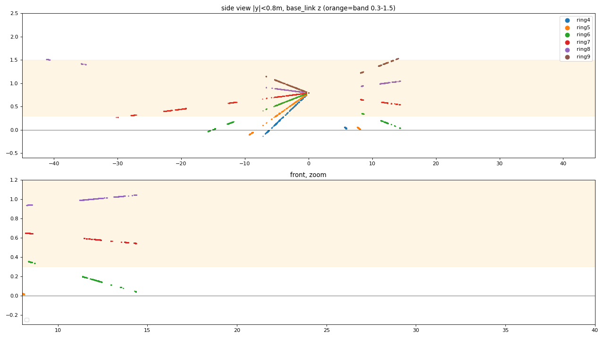
*図 4: 静止 2〜28 s の側面図 (センサ前後方向 = 廊下の軸、|y| < 0.8 m の点、縦軸 = base_link の z、オレンジの帯 = 0.3〜1.5 m)。下段は前方の拡大。*
- 読み方: 1 本のリングの点は、仰角が一定なので z = 0.794 + r·sin α の直線上に並ぶ。床に当たった点は z≈0、壁に当たった点は直線上の 1 か所に固まる。
- 分かること: 後方 15.5 m で ring 6 (緑) が z≈0 に届く (= 床。公称 −3° とほぼ合う)。ring 7 (赤) は後方 19〜30 m に z 0.27〜0.45 の点を持ち、これが帯に入っている。前方は 12〜14.5 m で物体に遮られている。

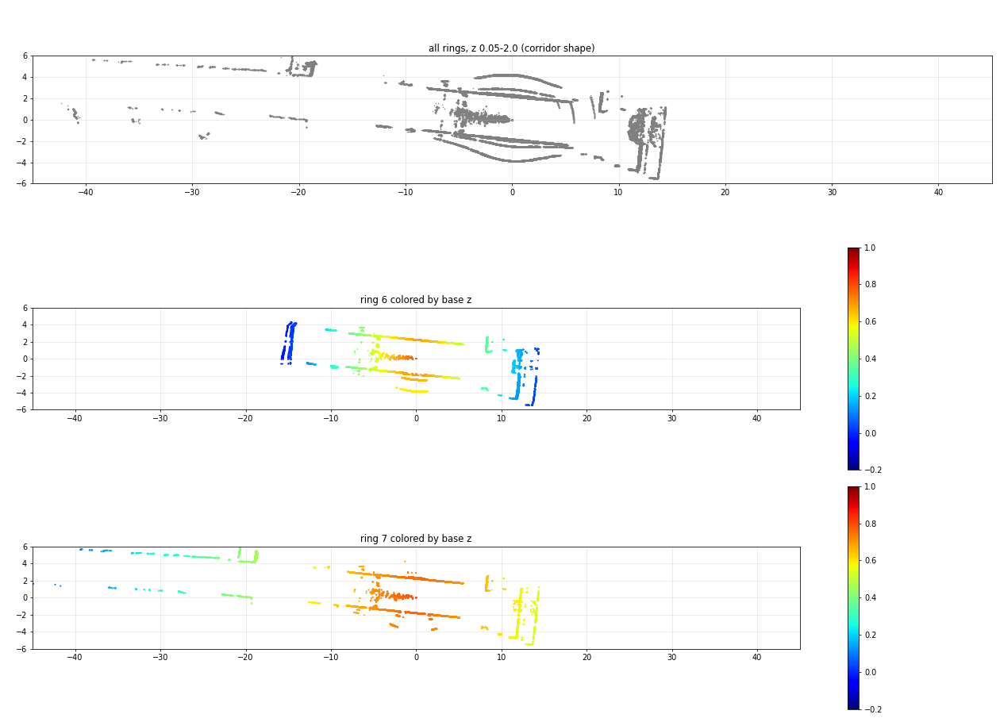
*図 5: 静止 2〜28 s の上面図。上 = 全リング z 0.05〜2.0 m (廊下の形)、中 = ring 6、下 = ring 7 (色 = base_link の z)。*
- 読み方: 壁は xy で直線、床に当たった点はロボットを中心とする円弧 (センサが傾いていれば歪んだ円弧) になる。
- 分かること: ring 7 の後方 20〜40 m の点は廊下の側壁に沿った線で、廊下を横切る円弧ではない (静止中の 1 方向だけでは床か壁か決めにくい → 7.2 の旋回解析へ)。

### 7.2 座標合わせ — yaw は IMU で取る

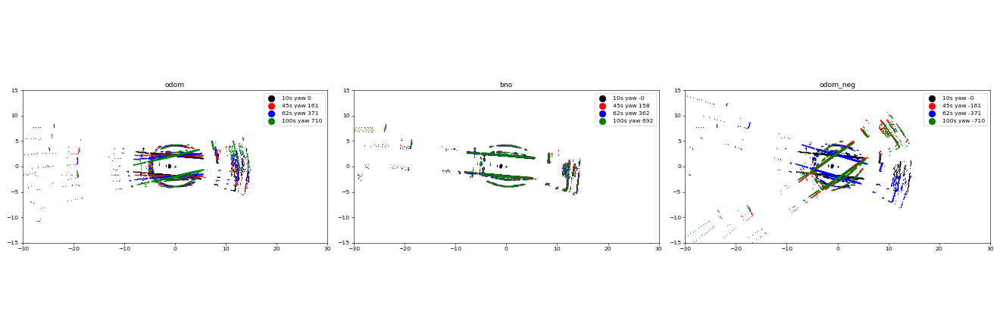
*図 6: 時刻の違う 4 フレーム (色違い) を yaw で世界座標に回して重ねたもの。左 = 車輪 odom、中 = BNO086 ジャイロ積分、右 = odom の符号反転 (確認用)。*
- 読み方: yaw が正しければ、全フレームの壁が 1 本に重なる。
- 分かること: odom は旋回の滑りで数度ずれ、壁が扇状にずれる。BNO 積分ではぴったり重なる → 以後の積算はすべて BNO を使う。

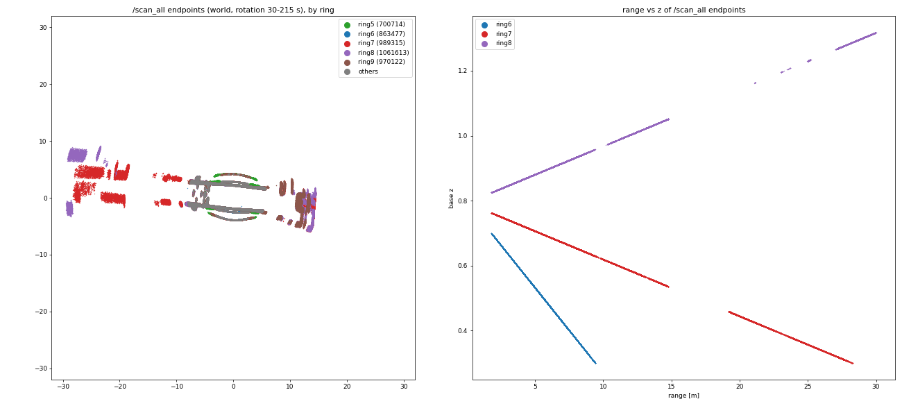
*図 7: 旋回 30〜215 s の補正前 /scan_all 終点を世界座標に積算 (左、リング別の色)、終点の距離と z の関係 (右)。*
- 読み方: 世界に固定された物体は鋭い線や塊になる。床由来の点は、車体の向きで当たる距離が動くので半径方向ににじむ。右図で各リングが 1 本の直線になるのは、z が距離 × sin(表の角度) で決まるから。
- 分かること: 15 m より遠くの帯内終点は ring 7〜9 だけ (ring 8, 9 は上向きなので実在の構造物)。ring 7 は 19〜28 m に分布する。

### 7.3 床か物体かの判定

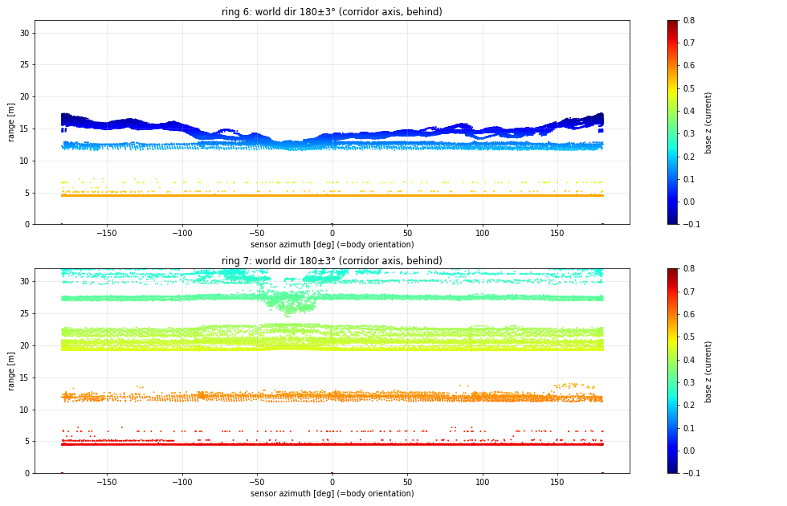
*図 8: 世界方位 180±3° (廊下後方) への ring 6/7 のヒット距離を、センサ方位 (= 車体の向き) の関数で描いたもの (色 = 補正前の z)。*
- 読み方: 床なら向きによって距離が波打ち、物体なら水平線になる。
- 分かること: ring 6 の 12.5〜17 m の帯は波打つので床。12 m の水平線は物体。ring 7 の 19.5〜22.5 m・27 m・30 m はほぼ水平で、物体と読める。

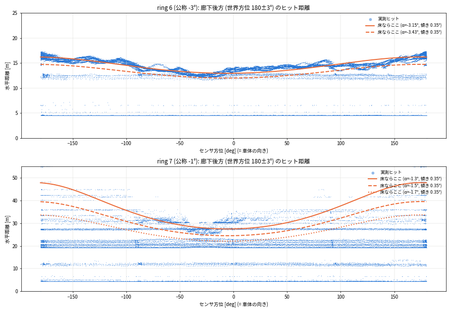
*図 9: 図 8 に「床ならここに来る」予測曲線 (オレンジ、r = H / tan(−α + 傾き 0.35°·cos θ)) を重ねたもの。*
- 読み方: 実測の帯が曲線をなぞれば、その α で床を説明できる。
- 分かること: ring 6 は α = −3.15° (実線) がよくなぞり、−3.43° (破線) は近すぎる (平面モデル)。ring 7 は 25〜35 m に床らしい波があり −1.3° (実線) が近いが、27.5〜28 m の壁と重なっていて分離できない (critic 指摘)。

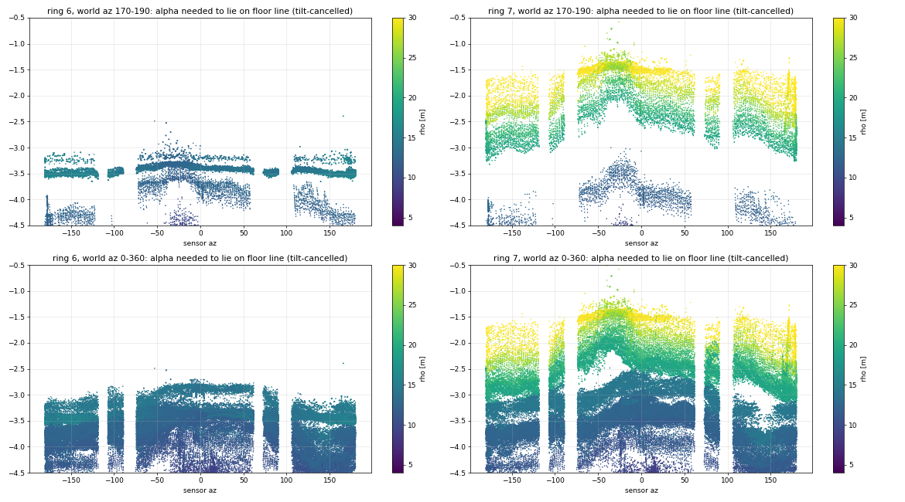
*図 10: 方位ビン法の結果。各点 = 「ring 0〜5 で引いた床直線に乗るために必要な ring 6/7 の仰角 α」、横軸 = センサ方位、色 = 水平距離。上段 = 廊下後方 (世界方位 170〜190°)、下段 = 全方位。*
- 読み方: 床ヒットなら、傾きが打ち消されて α が向きによらず一定の水平帯になる。物体なら、距離が一定でも α が床直線の傾きにつられて動く。
- 分かること: ring 6 後方は −3.4° 付近の水平帯 (床)。ring 7 は水平帯にならず、−1.4〜−3° に散らばる (物体が主)。平面モデル (図 9) とは約 0.25° ずれ、床のうねりの影響と考えられる (§3.3)。

### 7.4 補正前後の比較 (地図なしの版)

この節の補正値: ring 6 = −3.15°、ring 7 = −1.3°、TF 傾き = 前下がり 0.35°。

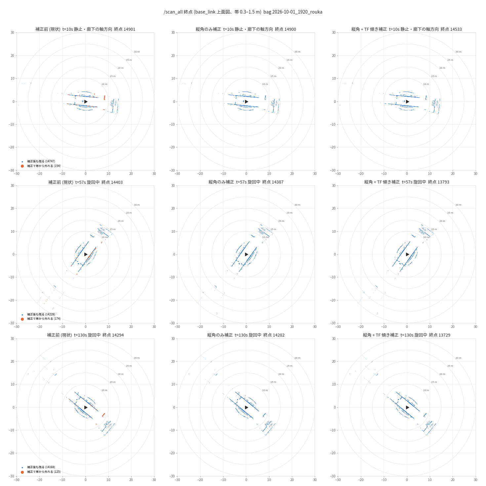
*図 11: 代表 3 フレーム (t = 10 s 静止、57 s・130 s 旋回中) の /scan_all 終点 (base_link 上面図)。列 = 補正前 / 縦角のみ / 縦角 + TF 傾き。左列のオレンジ = 縦角 + 傾き補正で帯から外れる点。*
- 読み方: RViz で 1 フレームを見たときと同じ見え方。
- 分かること: 1 フレームでは変化が小さい (帯から外れるのは 125〜174 点/frame で、大半は 8 m 付近の壁の足元が帯の下限 0.3 m をまたぐもの)。遠方の偽の壁は毎フレーム出るわけではなく、積算すると見える (図 1)。

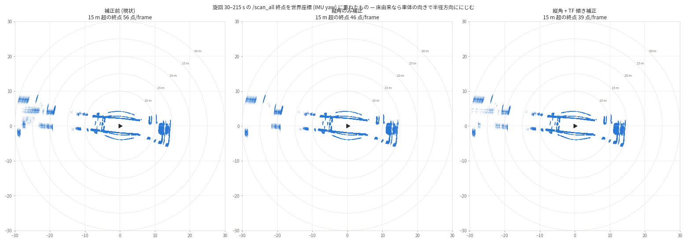
*図 12: 旋回 30〜215 s の終点を世界座標に積算。左から 補正前 / 縦角のみ / 縦角 + TF 傾き。*
- 分かること: 15 m 超の終点は 56 → 46 → 39 点/frame。縦角補正で後方 22〜28 m のにじんだ雲が消える (図 1 と同じものを地図なしで見た版)。

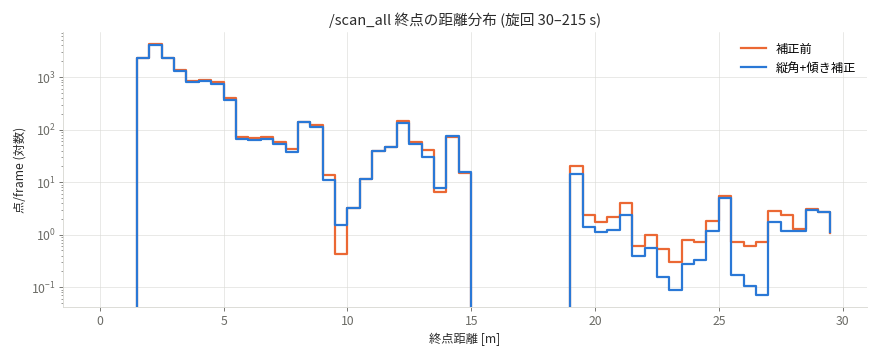
*図 13: /scan_all 終点の距離分布 (旋回 30〜215 s、縦軸は対数)。オレンジ = 補正前、青 = 縦角 + 傾き補正。*
- 分かること: 差が出るのは 20 m 以遠 (特に 22〜27 m) と 9〜10 m (ring 6 の帯の端)。15〜19 m はもともと終点がほぼゼロ (廊下のこの方向に物が無い) で、この bag には 15〜20 m の偽の壁が出ていない。

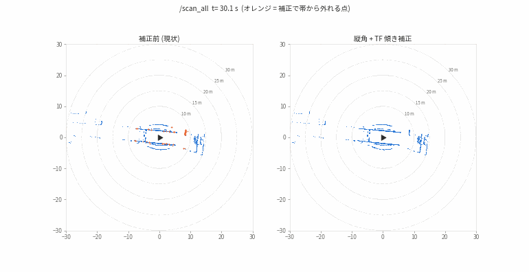
*図 14: 旋回中の /scan_all (base_link)。左 = 補正前 (オレンジ = 補正で帯から外れる点)、右 = 縦角 + 傾き補正。*
- 読み方: 車体が回ると世界は逆向きに回って見える。オレンジの点が、廊下後方の開けた方向を向いたときだけ遠方にちらつくのが、床由来の偽の壁。

### 7.5 補正前後の比較 (地図を重ねた版)

§3.5 の図 1〜3 に加えて:

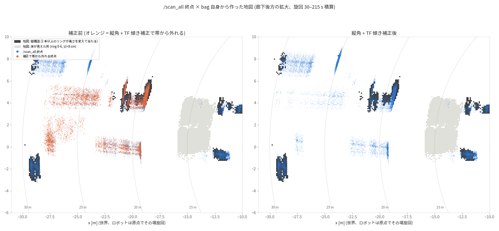
*図 15: 図 1 と同じ廊下後方の拡大を「縦角 + TF 傾き補正」で描いたもの。*
- 分かること: 傾き補正は前方の点を下げ、後方の点を上げる。そのため後方の開けた廊下では、縦角だけを補正した場合 (図 1) より残る点が多い。傾き 0.35° が取付によるものか床によるものかは未確定 (§3.4、H4) なので、この図は参考扱い。

## 8. RViz 風の比較 — 自律走行 bag で Nav2 地図に /scan_all を重ねる

廊下 bag には地図も自己位置も無いので、偽の壁が実際に出た自律走行 bag **`bags/raw/2026-09-27_1948_5goukan_auto`** で、RViz と同じ見え方 (Fixed Frame = map) の比較を作った (`rviz1948.py`, `gone_split.py`、出力 `bags/exp/2026-10-02_rviz_ghost_1948/`)。

- 地図: bag に記録された `/map` (Nav2 が使っていたもの)。黒 = 占有、明灰 = 空き/未知
- 自己位置: TF map→odom (AMCL) × odom→base_link (EKF) を点群の時刻で補間
- /scan_all: bag の点群 (5 frame に 1 つ = 2 Hz) から再生成。センサ高は当時の TF 0.80246 m
- 補正の条件: 補正前 / ring 6 −3.15°・ring 7 −1.3° / ring 6 −3.15°・ring 7 −1.6°。**TF 傾き補正は入れていない** (§3.4 で原因が未確定)
- 代表フレームの選び方: 近距離 (2〜10 m) の /scan_all 終点の 70% 以上が地図の壁から 0.3 m 以内にある (= 自己位置が合っている) 時刻のうち、補正で消える 12〜25 m 終点が多い時刻を、十字路 (1050〜1170 s) とそれ以外から 2 つずつ選んだ

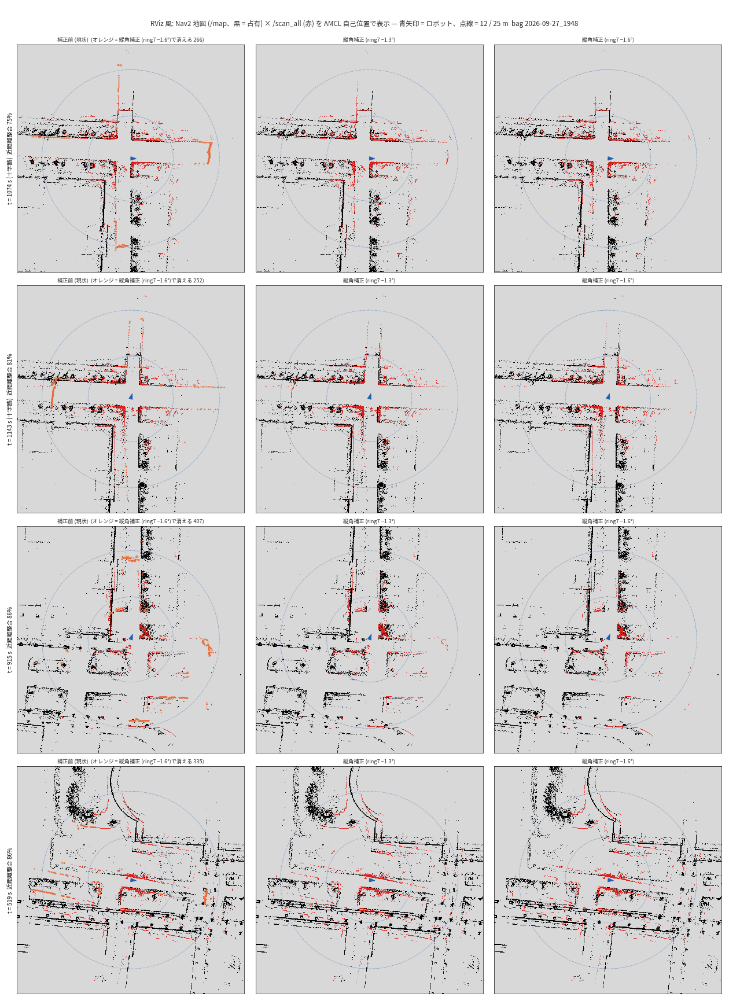
*図 16: 行 = 時刻 (t = 1074 / 1143 s は十字路)、列 = 補正前 / ring 7 −1.3° / ring 7 −1.6°。赤 = /scan_all、オレンジ (補正前の列だけ) = ring 7 −1.6° の補正で帯から外れる点、青矢印 = ロボット、点線の輪 = 12 m / 25 m。*

読み方: 赤やオレンジの点が地図の黒の上にあれば本物の壁を見ている。黒の無い所 (道路の上など) に並んでいれば、地図に無い壁 = Nav2 の costmap には障害物として入る点。

読み取れること:
- **十字路 (t = 1074 / 1143 s)**: 補正前は、進行方向の先 17〜20 m で**道路を横切るオレンジの線**が出ている。地図の黒が無い所なので、これが planner を迷わせる偽の壁にあたる。ring 7 −1.6° では消え、−1.3° でもほとんど消える (1074 s の右端にわずかに残る)。
- 道路の縁に沿って遠方まで伸びるオレンジの点列も、補正で消える。
- t = 915 / 519 s では、オレンジの一部が地図の壁の足元に重なっている。これらは、ring 7 が壁の足元 (補正後 0.3 m 未満) を拾っていた点。
  - 同じ方位で上のリング (ring 8 以上) が壁に当たっていれば、/scan_all にはその点が代わりに残るので、壁そのものが消えるわけではない。ただし壁が低い場合は、遠方で壁の点が減る。

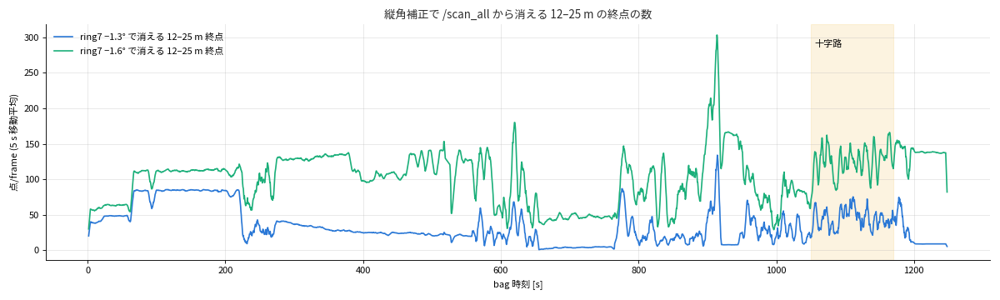
*図 17: 縦角補正で /scan_all から消える 12〜25 m の終点数 (5 s 移動平均)。青 = ring 7 −1.3°、緑 = −1.6°。黄色の帯 = 十字路。*

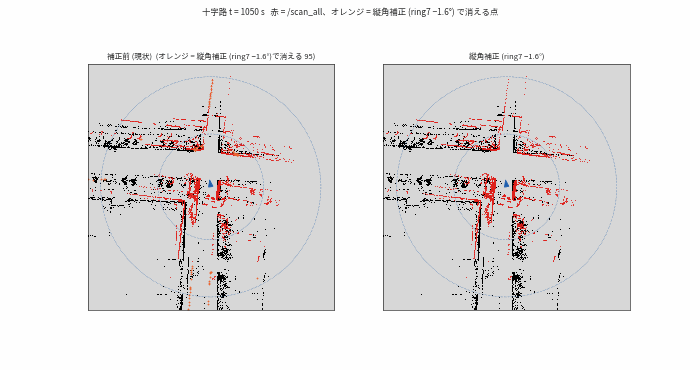
*図 18: 十字路 1050〜1170 s (1 Hz)。左 = 補正前 (オレンジ = ring 7 −1.6° の補正で消える点)、右 = 補正後 (ring 7 −1.6°)。*

数値 (bag 全体、2487 フレーム):

| | ring 7 −1.3° | ring 7 −1.6° |
|---|---|---|
| 補正で消える 12〜25 m 終点 (全体平均) | 34 点/frame | 103 点/frame |
| 同 (十字路) | 45 点/frame | 125 点/frame |
| 消える点のうち、地図の壁から 0.3 m 以内 (全体) | 51% | 40% |
| 同 (十字路) | 23% | 23% |

- 近距離整合 (自己位置の合い具合) の全体平均は 80%。整合 70% 未満のフレームは割合の集計から除いた。
- 参考: 「12〜25 m の終点のうち地図の壁から 0.3 m 以上離れたもの」は補正前で 475 点/frame あり、補正しても 457 (−1.3°) / 411 (−1.6°) までしか減らない。ただしこの数には植栽・車・人・地図の帯 (0.3〜1.5 m) に入らない低い物・自己位置のずれが混ざっていて、偽の壁の量の指標にはならない。そのため本文の比較には使っていない。

読み取れること / 言えないこと:
- **十字路で planner を迷わせていた「道路を横切る線」は、ring 7 を −1.3〜−1.6° にすると消える** (図 16 の 1074 / 1143 s、図 18)。§4 では「静的な誤差だけでは 15〜20 m の壁は説明できない」と見積もったが、実際の bag で偽の壁が補正で消えることは示せた。ただし、どの程度の補正が要るかは時刻や場所で違い得る。屋外の地形 (この十字路の勾配) と走行中のピッチが加わっているので、−1.6° が「真の縦角」とは言えない。
- **代償**: 消える点の 4〜5 割 (十字路では 2 割強) は地図の壁の足元。−1.6° は廊下 bag の見積もり (−1.3〜−1.7°) の中ではやや急な側。
- 次に判断すること: (a) vangle_override の ring 7 を −1.3〜−1.6° にする (縦角の修正として筋が通る)、(b) /scan の高さ帯の下限を距離に応じて上げる (地形・ピッチにも効くが、低い障害物を遠方で見落とす)。どちらにするかは、§6-2 の平らな床での較正値を見てから決めるのが安全。

## 9. 本当に縦角が違うのか — 平面上の実測点を結んだ線が真っ直ぐかで確かめる

考え方: 縦角が正しければ、平らな面に当たった各リングの点は、面の上できれいに並ぶ。縦角がずれていると、そのリングの点だけ高さがずれて、点を結んだ線が折れ曲がる。ただし、**歪みが見えるのは面の向きによる**。

```
縦角 α がずれたとき (表の値 α_t、真の値 α)
├─ 床・天井 (水平面、高さ −H)
│    ヒット距離 r = H / sin α → 計算上の高さ z' = r·sin α_t = H·sin α_t / sin α
│    → リングごとに高さがずれる。距離の順に結ぶと折れ線・段差になる (◎ 検出できる)
├─ 壁 (鉛直面、距離 D)
│    計算上の距離 x' = r·cos α_t·cos θ = D·cos α_t / cos α
│    → 0.5° ずれても 0.2% (2 m で約 5 mm)。壁の線は真っ直ぐなまま (✕ 検出できない)
└─ センサの傾き
     床が「真っ直ぐだが斜めの線」になる。前で上がれば後ろで下がる (反対称) ので、縦角の誤差とは形で見分けられる
```

データと手順 (`straight.py`):
- 対象は静止 2〜28 s のフレーム (センサ座標)。前後左右それぞれ ±2° の扇形を切り出す。
- リングごとの床ヒット (|z| < 0.2 m) の中央値をとる。前方の ring 6 (12 m) は物体なので、前方は 11 m 未満に限った。
- 縦角表を 3 通りで再投影して比べる: 公式表 (VAngle_V6B_16G、−15〜+15° の 2° 刻み) / 現在の vangle_override / 今回推定 (ring 6 −3.15°)。

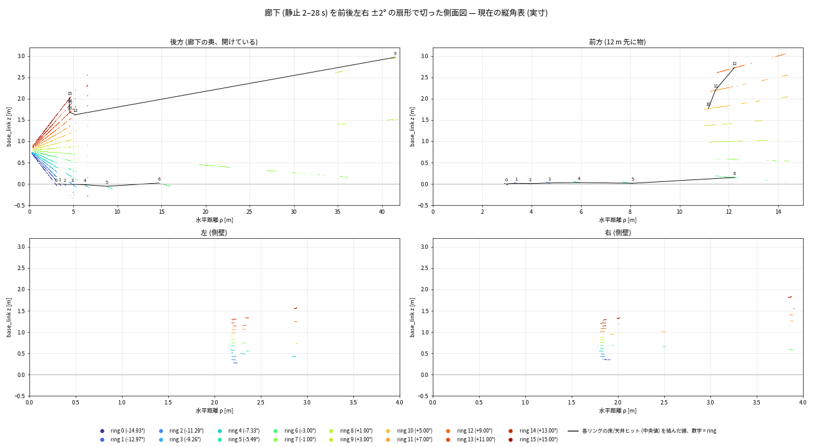
*図 19: 廊下の前後左右 ±2° の扇形を側面 (水平距離 − 高さ) で描いたもの (現在の表、実寸)。色 = リング、黒い線 = 各リングの床/天井ヒットを結んだ線。*
- 読み方: 1 本のリングの点は、センサから斜めに伸びる 1 本の光線上に並ぶ。床に当たったところが z≈0 の点。
- 分かること: 床は後方で ring 0〜6 (3〜15 m)、前方で ring 0〜5 (3〜8 m) に当たる。ring 7 はこの方向では床に届かない (後方は 20 m 先の物体、前方は 12 m 先の物体に当たる) → **ring 7 はこの図では確かめられない**。上向きのリングは天井に当たるが、高さが 1.6〜3.3 m とばらつく (梁・照明・吹き抜け) ので、平らな面として使えない。

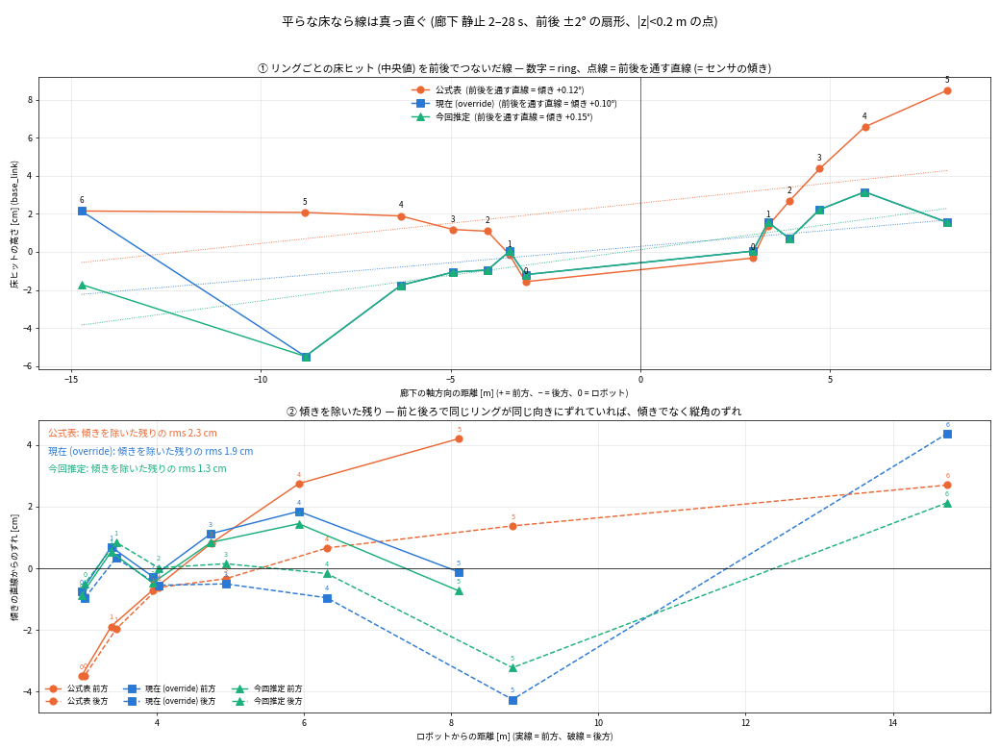
*図 20: ① リングごとの床ヒットの高さを前後でつないだ線 (横軸 + = 前方、− = 後方、縦軸 cm、点線 = 前後を通す直線 = センサの傾き)。② その直線を引いた残りを、ロボットからの距離で前後重ねたもの (実線 = 前方、破線 = 後方)。オレンジ = 公式表、青 = 現在の override、緑 = 今回推定、数字 = ring。*
- 読み方: ② で、前方と後方の同じリングが同じ向きにずれていれば、傾きでは説明できない = 縦角のずれ。
- 分かること:
  - **公式表 (オレンジ) は、前方・後方とも、遠い (浅い) リングほど持ち上がる ∪ 字になる。** 傾きを引いた残りを (前方, 後方) で並べると、ring 0 が −3.5 / −3.5 cm、ring 1 が −1.9 / −2.0、ring 2 が −0.7 / −0.6、ring 4 が +2.8 / +0.7、ring 5 が +4.2 / +1.4。前後で同じ符号にそろう。→ **公式表の縦角は個体とずれている**。浅いリングほど実際は下向き。09-02 の床フィットと同じ傾向。
  - 現在の override (09-02 実測の ring 0〜5) では ∪ 字がほぼ消え、残りの rms は 2.3 → 1.9 cm。今回推定 (ring 6 −3.15°) では 1.3 cm。
  - 残っているずれ (例: ring 5 は前方 −0.1、後方 −4.3 cm) は前後で符号がそろわない。床のうねり (8〜9 m で数 cm) か、傾きが直線で表しきれていない分と考えられ、この方法の分解能は ±2〜3 cm 程度。
  - 前後を通す直線の傾きは 0.10〜0.15°。旋回データから推定した 0.25〜0.35° (§3.4) より小さい。この扇形 (センサ方位 0°/180°) だけで見た値で、床の前後非対称も入るため、傾きの値はまだ決められない。

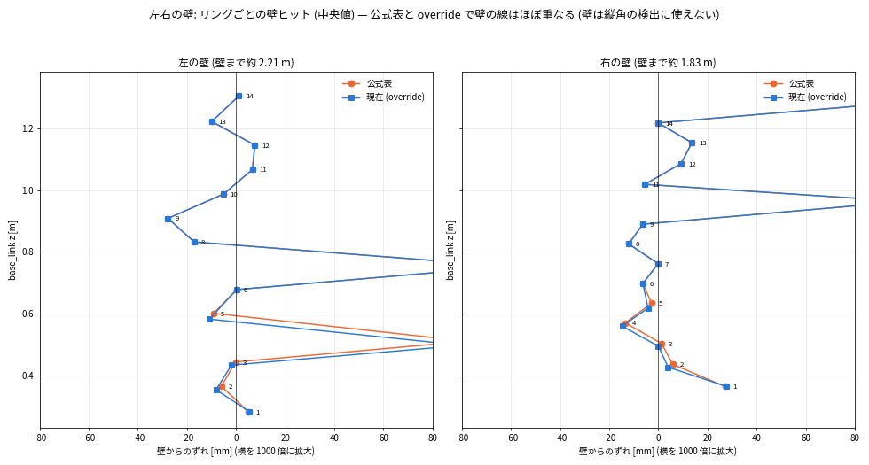
*図 21: 左右の壁に当たった各リングの点 (中央値)。横軸は壁からのずれを mm で拡大したもの。オレンジ = 公式表、青 = 現在の override。*
- 分かること: 壁の点は掲示物や扉の枠で ±20 mm ほどばらつくが、表を変えても線はほぼ重なる (差は数 mm 以内)。理屈どおり、**壁は縦角のずれの検出には使えない**。左右の壁で縦角を確かめる方法はとれず、確かめられるのは床 (と平らな天井) だけ。

この節の結論:
- 縦角が公式表とずれていることは、**床の折れ線として目で見える** (図 20 のオレンジの ∪ 字)。override で真っ直ぐに近づく。ずれの大きさはリングあたり 0.1〜0.5° で、09-02 の値と合う。
- ring 6 は、公称 −3.0° のままだと後方 14.7 m の床が +2.1 cm、−3.15° にすると −1.7 cm。真の値はその間 (約 −3.07°) と読めるが、床のうねりと傾きの不確かさ (数 cm) があるので、−3.0〜−3.15° の範囲までしか絞れない。
- **ring 7 (偽の壁の主役) は、この廊下では床に届かず確かめられない**。ring 7 を確かめるには、30 m 以上平らな床が続く場所が必要 (§6-2)。
- 代わりの説明として、距離のオフセット b でも床は ∪ 字に折れる (z の誤差 = b·sin α)。ただし今回の ∪ 字の大きさ (ring 0〜5 で約 7 cm) を出すには b ≈ 40 cm が必要で、壁までの距離が 40 cm ずれることになる。現実的でないので棄却した。
