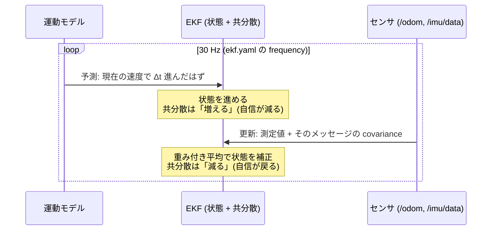

<!-- claude: EKF センサ融合読本 第2章 (2026-08-12) -->

# 第2章 不確かさの言葉 — 共分散と状態ベクトル

第1章の結論は「自信の度合いに応じて重み付き平均する」だった。この章は
その「自信の度合い」を数値でどう表すか (分散・共分散)、EKF が内部で
何を持ち回っているか (状態ベクトル)、そしてどういうサイクルで
混ぜているか (予測・更新) を、行列演算を展開せずに直感で積み上げる。
本書で一番の基礎回で、第3章以降のすべてがこの言葉で書かれている。

## 2.1 分散 — 「どれくらい信じるか」の数値化

センサの測定値は 1 個の数字ではなく、**「たぶんこのあたり」という幅を持った雲**
だと考える。雲の中心が測定値、雲の広がりが不確かさ。この広がりを数値化したのが
**分散 σ²** (標準偏差 σ の 2 乗) である。

```
分散の直感
├── σ² が小さい ... 雲が細く尖っている = この値をほぼ信じてよい
├── σ² が大きい ... 雲が広く潰れている = 参考程度
└── σ² = 0 ........ 幅ゼロ = 「誤差ゼロの完璧な測定」という主張 (⚠️ 後述の罠)
```

雲の形として最も標準的なのが**ガウス分布 (正規分布)** — 中心が最も濃く、
離れるほど薄くなる釣鐘型。「±σ の範囲に約 68%、±2σ に約 95% が収まる」
という性質だけ覚えれば本書には十分である。カルマンフィルタ系は
「すべての不確かさはガウス分布で表せる」という前提の上に建っている。

**重み付き平均との関係**が本題である。同じ量 (例: yaw rate) を
2 つのセンサが報告したとき、融合結果は分散の逆数で重み付けした平均になる:

```
  センサ1: 値 a, 分散 σ₁²        重み ∝ 1/σ₁²
  センサ2: 値 b, 分散 σ₂²        重み ∝ 1/σ₂²
  → 分散が小さい (自信がある) 方に引っ張られた平均になる
  → しかも融合後の分散は両方の分散より小さくなる (情報は足すと増える)
```

例: 車輪 odom が yaw rate = 0.50 rad/s (σ² = 0.03)、IMU が 0.52 rad/s
(σ² = 0.005) と言えば、結果は IMU 寄りの ≈ 0.517 rad/s。
**EKF がやっている「賢いこと」の本体はこれだけ**である。残りは全部、
この重み付き平均を多次元・時系列に拡張するための配管にすぎない。

ここから重要な帰結が 1 つ出る: **σ² = 0 は「完璧な測定」の意味になる**ので、
重みが無限大になり、他のセンサの意見を完全に押し潰す。共分散を埋め忘れて
全ゼロのまま publish するのは「私は絶対に正しい」と叫び続けるのと同じである
([第3章](03_feeding_the_filter.md) のアンチパターン表参照)。

## 2.2 共分散行列 — 分散を多次元に並べた表

ロボットの状態は yaw 1 個ではなく (x, y, yaw, vx, ...) と多次元なので、
分散も 1 個では足りない。**各軸の分散を対角に並べた行列**が共分散行列である。
`nav_msgs/Odometry` の pose には 6 軸 (x, y, z, roll, pitch, yaw) の
6×6 = 36 要素が flat な配列で入る:

```
        x      y      z      roll   pitch  yaw
      ┌──────────────────────────────────────────┐
x     │ σ²x    ·      ·      ·      ·      ·     │ ← [0]
y     │  ·    σ²y     ·      ·      ·      ·     │ ← [7]
z     │  ·     ·     σ²z     ·      ·      ·     │ ← [14]
roll  │  ·     ·      ·     σ²r     ·      ·     │ ← [21]
pitch │  ·     ·      ·      ·     σ²p     ·     │ ← [28]
yaw   │  ·     ·      ·      ·      ·     σ²yaw  │ ← [35]
      └──────────────────────────────────────────┘
        対角 = 各軸単独の分散。flat 配列では index = i*6+i = i*7
        非対角 (·) = 軸間の相関。実務ではほぼ 0 のまま使う
```

非対角要素は「x が大きくずれるとき y も一緒にずれる」という**軸間の相関**を
表すが、自作ドライバで埋めることはまずない (0 = 無相関でよい)。
**読むのも書くのも対角だけ**、と割り切ってよい。reRoBot の実装もそうしている:

```cpp
// ros2_ws_main/src/app/epos4_controller/src/epos4_odometry.cpp:176-180
// claude_ekf: 対角のみ埋める (6x6 row-major の 0,7,14,21,28,35)
for (size_t i = 0; i < 6; ++i) {
  odom.pose.covariance[i * 7] = pose_cov_diag_[i];    // claude_ekf
  odom.twist.covariance[i * 7] = twist_cov_diag_[i];  // claude_ekf
}
```

`i * 7` は「6×6 行列を flat にしたとき対角は 7 個おきに現れる」の定番イディオム。

### 実例: reRoBot の対角値を読む

`ros2_ws_main/src/bringup/rerobot_bringup/config/params.yaml:36-37`:

```yaml
pose_covariance_diagonal:  [0.001, 0.001, 1000000.0, 1000000.0, 1000000.0, 0.03]
twist_covariance_diagonal: [0.001, 0.001, 1000000.0, 1000000.0, 1000000.0, 0.03]
#                            x      y      z          roll       pitch      yaw
```

| 値 | 意味 |
|---|---|
| x, y = 0.001 | σ ≈ 0.03 m。「数 cm の精度で信じてよい」 |
| z, roll, pitch = 1000000.0 | σ = 1000。「2D ロボットに z は観測不能 — **一切信じるな**」の慣用表現 |
| yaw = 0.03 | σ ≈ 0.17 rad ≈ 10°。「x, y より 1 桁半信用しない」— 第1章 §1.1 の「車輪 odom は yaw が弱い」をそのまま数値にしたもの |
| twist の vy = 0.001 | ⚠️ これは測定精度ではなく**拘束**。差動駆動は横に滑らないので「vy = 0 という測定」を強い自信付きで食わせている (詳細は [第4章](04_robot_localization.md) §4.3) |

なお `1000000.0` を `1.0e6` と書かないのは、YAML 1.1 のパーサが指数表記を
文字列扱いすることがあるため (params.yaml:34-35 のコメント。
アンチパターンとして [第3章](03_feeding_the_filter.md) に再掲)。

## 2.3 状態ベクトル — 15 次元は 3 個ずつ区切って読む

EKF が内部に持つ「ロボットの現在の姿」が**状態ベクトル**である。
robot_localization は 15 次元で持つが、覚え方は簡単で、
**3 個ずつ 5 グループに区切る**:

```
robot_localization の 15 次元状態ベクトル
├── [ 0- 2] x,  y,  z ................ 位置
├── [ 3- 5] roll, pitch, yaw ......... 姿勢
├── [ 6- 8] vx, vy, vz ............... 並進速度 (body frame)
├── [ 9-11] vroll, vpitch, vyaw ...... 角速度
└── [12-14] ax, ay, az ............... 並進加速度
```

`ekf.yaml` の `odom0_config` / `imu0_config` に出てくる 15 個の bool は
この順序に対応しており、「そのセンサからどの状態量を採用するか」の
チェックボックスである。3 行 ×5 に改行して書くと目視で読める
(reRoBot の `ekf.yaml:32-36` はまさにそう書いてある。解読は第4章)。

状態ベクトルの各要素にも当然不確かさがあるので、EKF は
**15×15 の共分散行列を状態とセットで持ち回る**。`/odometry/filtered` に
入っている covariance はこの行列の該当部分の抜粋であり、
「EKF が今どれくらい自信を持っているか」がリアルタイムで読める。

## 2.4 予測と更新 — EKF の心臓部

EKF は 2 拍子のループである。**予測 (predict)** で時間を進め、
**更新 (update)** でセンサの意見を混ぜる:



- **予測**: 「さっき 0.5 m/s で進んでいたから、1/30 秒後は 1.7 cm 先のはず」。
  モデルによる外挿なので、やるたびに不確かさは**膨らむ**。
  どれくらい膨らませるかを決めるのが `process_noise_covariance`
  (reRoBot は未調整・既定値。[第5章](05_rerobot_architecture.md) §5.4)。
- **更新**: センサ測定が届いたら、予測値と測定値を §2.1 の重み付き平均で混ぜる。
  重みは「EKF 自身の共分散」対「メッセージに書かれた covariance」。
  混ぜると不確かさは**縮む**。

この 2 拍子の含意は実務上重要である:

1. **センサが止まると共分散は膨らみ続ける**。`sensor_timeout: 0.2`
   (`ekf.yaml:18`) を過ぎた入力は見放され、予測だけで進む。
2. **メッセージの covariance フィールドは飾りではなく、更新の重みそのもの**。
   第3章で「必ず埋めろ」と言う理由がこれである。
3. 予測 30 Hz (`frequency`) とセンサ到着 (odom ~20 Hz / IMU 100 Hz) は
   非同期でよい。時刻順の整列は EKF が queue でやってくれる
   (時刻処理の詳細は [タイムスタンプ読本 第4章 §4.4](../timestamp/04_time_consumers.md))。

## 2.5 「E」の意味 — 非線形の線形化

最後に名前の由来。無印のカルマンフィルタ (KF) は状態の遷移が**線形**
(足し算と定数倍だけ) であることを前提に、§2.1 の重み付き平均が最適である
ことを数学的に保証する。ところがロボットの運動モデルには

```
x += d_s × cos(θ)     ← epos4_odometry.cpp:145 と同じ式が EKF 内部にもある
y += d_s × sin(θ)
```

と **cos / sin (非線形)** が入る。そこで **E**xtended KF は、現在の推定値の
まわりで曲線を接線で近似 (線形化) してから KF の機械を回す。
利用者視点での含意は 1 つだけ —
**推定値が真値から大きく外れると、接線近似も外れて精度が落ちる**。
初期姿勢が大きく間違っている、yaw が鏡像 (事例B) などの状況では、
EKF は「そこそこ正しい推定の微調整」という得意領域の外で動くことになる。

## 2.6 この章のまとめ

```
第2章 まとめ
├── 分散 σ² = 信じなさの数値。融合 = 1/σ² で重み付けした平均
├── σ² = 0 は「完璧な測定」宣言 — 埋め忘れは他センサを押し潰す事故になる
├── 共分散行列は対角だけ読めばよい。flat 配列の対角は i*7
├── 1e6 = 「その軸は観測不能、信じるな」の慣用表現 (YAML では 1000000.0 と書く)
├── 15 次元状態ベクトルは 3 個ずつ 5 グループ (位置/姿勢/速度/角速度/加速度)
├── EKF = 予測 (共分散が膨らむ) と更新 (重み付き平均で縮む) の 2 拍子
└── E = cos/sin の接線近似。推定が大外れすると近似ごと壊れる
```

→ [第3章 融合器に食わせる側](03_feeding_the_filter.md) — この言葉を使って、
`/odom` と `/imu/data` を「EKF が正しく信じられる形」で作る。
