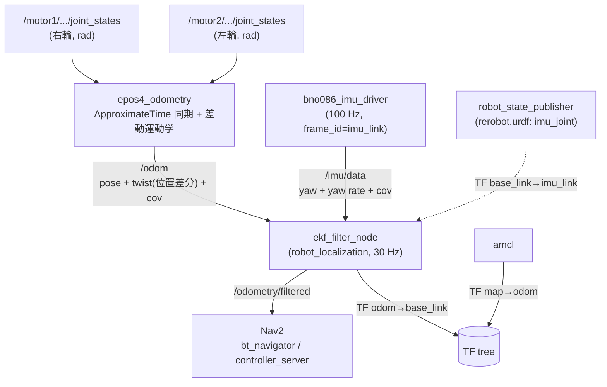

<!-- claude: EKF センサ融合読本 第5章 (2026-08-12) -->

# 第5章 reRoBot の EKF アーキテクチャ — 配管の全体像と現在地

第3章 (入力の作り方) と第4章 (EKF の設定) を、reRoBot の実システムとして
つなぎ合わせる。この章はプロジェクト固有の実務ページで、
「どこを触るとどこに効くか」の地図として使う。

## 5.1 全データフロー



対応する設定の置き場所:

| 配管 | 定義場所 |
|---|---|
| /odom の中身・covariance | `epos4_odometry.cpp` + `params.yaml:36-37` (第3章 §3.2) |
| /imu/data の中身・covariance | `imu_node.py` + `bno086.yaml` (第3章 §3.4) |
| EKF が何を食べるか | `ekf.yaml` (第4章) |
| IMU の取付 (軸変換) | `rerobot.urdf:128-132` (§5.3) |
| Nav2 が何を読むか | `nav2_params.yaml:97, :114` (§5.2) |

## 5.2 launch 配管 — ekf:=true 一発で矛盾なく切り替える

起動列は `scripts/nav2d.sh` → `scripts/bringup2d.sh` → 実体 launch と流れる:

```bash
# scripts/nav2d.sh:10 — Nav2 経路では IMU+EKF が標準
IMU=true EKF=true ./scripts/bringup2d.sh
# scripts/bringup2d.sh:18-24 — env 変数を launch 引数へ変換
exec ros2 launch rerobot_bringup rerobot_bringup.launch.py \
  lidar_2d:=true lidar_3d:=false imu:=${IMU} ekf:=${EKF} ...
```

実体 launch (`ros2_ws_main/src/bringup/rerobot_bringup/launch/rerobot_bringup.launch.py`)
の中で、`ekf:=true` は 2 つのことを同時に行う:

**(1) EKF ノードを条件起動する** (`:109-116`):

```python
ekf_node = Node(package="robot_localization", executable="ekf_node",
    name="ekf_filter_node",                      # ekf.yaml のトップキーと一致必須
    condition=IfCondition(LaunchConfiguration("ekf")),
    parameters=[os.path.join(pkg_share, "config", "ekf.yaml")], ...)
```

**(2) epos4_odometry の publish_tf を自動で false にする** (`:97-104`) —
第4章 §4.6 の「TF 発行者は 1 ノード」を人間の記憶に頼らず機械的に保証する
仕掛けで、3 段のトリックでできている:

```python
odom_publish_tf = ParameterValue(
    PythonExpression(["'", LaunchConfiguration("ekf"), "'.lower() != 'true'"]),
    value_type=bool)
...
parameters=[params_file, {"publish_tf": odom_publish_tf}],
```

1. **launch 引数は常に文字列**。`ekf:=true` は bool ではなく文字列 `"true"` として
   届くので、そのまま bool パラメータには渡せない。
2. **PythonExpression で式として評価**。`'true'.lower() != 'true'` → `False` の
   ように、「ekf が true でないとき publish_tf は true」という否定込みの式を
   文字列連結で組み立て、`ParameterValue(..., value_type=bool)` で bool 化する。
3. **parameters リストは後勝ち**。`[params_file, {"publish_tf": ...}]` の順に
   並べることで、params.yaml の `publish_tf: true` (`params.yaml:29`) を
   launch 側の計算値が上書きする。

Nav2 側の受け口も対になっている (`nav2_params.yaml`):

```yaml
# :97 bt_navigator     — オドメトリ入力トピック (EKF 出力)
odom_topic: /odometry/filtered
# :114 controller_server — 現在速度のフィードバック元。⚠️ 既定 "odom" のままだと
#      EKF 構成で生 /odom を読んでしまうので明示する
odom_topic: /odometry/filtered
```

EKF なし運用へ戻すときはこの 2 箇所を `/odom` に戻す (nav2d.sh:5-7 の注記)。
**片方だけ戻すと、進捗判定と経路追従が別のオドメトリを見る**ちぐはぐな状態に
なるので、必ず 2 箇所セットで。

## 5.3 URDF の IMU 向き — 「基板シルクではなくデータ座標系を表す」

```xml
<!-- rerobot.urdf:128-132 -->
<joint name="imu_joint" type="fixed">
  <parent link="base_link"/>
  <child  link="imu_link"/>
  <origin xyz="0 0 0.64" rpy="0 0 1.5707963267948966"/>  <!-- Rz(+90°) -->
</joint>
```

第3章 §3.4 (3) のとおり、EKF は `/imu/data` (imu_link 座標系) を
この joint の TF で base_link へ変換してから使う。この rpy は
2026-08-11 の実走 bag から**データ照合 3 系統**で確定した値である
(`rerobot.urdf:105-114` のコメント、経緯は [第6章 事例B](06_case_studies.md)):

1. 静止 60 s の加速度 z = +9.815 → 正立 (裏返しなら -9.8)
2. 旋回中の gyro_z ⇔ 車輪 odom yaw rate が同符号率 100%、比の中央値 +1.015
3. 裏返し URDF で EKF を回すと yaw が車輪 odom の鏡像になる

ここで確立された原則が 2 つ:

- **URDF の imu_link は「基板の見た目」ではなく「/imu/data のデータが
  表現されている座標系」を表す**。ドライバが `mount_yaw_deg` で既に補正して
  いる分 (チップ→基板) は URDF に含めてはならない (第3章 §3.4 の 2 段構え)。
- **向きの検証は目視ではなくデータ照合を正とする**。目視判定は 2 転 3 転した。

⚠️ **imu_joint を変更したら `ros2_ws_glim/config/config_sensors.json` の
`T_lidar_imu` も要再計算** (GLIM は同じ IMU を LiDAR 基準の外部パラメータで
持っており、URDF と独立に定義されているため自動では追従しない)。

## 5.4 あるべき姿と現在地のギャップ

2026-08-12 時点の正直な現在地。すべて `docs/claude/PROJECT_STATE.md`
(タイムライン 08-11 (3) / §10) に基づく:

```
現在地とギャップ
├── ✅ 検証済み
│   ├── 静止 305 s: ドリフト 14 mm / -1.1°
│   ├── 直進 10 m 実測: filtered 10.08 m (生 odom 10.19 m) — 誤差 0.8%
│   └── yaw rate の車輪⇔IMU 同符号率 98% (旋回中)
├── ⚠️ 未解決・未調整
│   ├── 360° 旋回の残差: filtered +3.9° vs 生 odom 0.1° — 融合の方が悪い
│   │   └── 磁北基準 yaw の動的外乱疑い ([第6章 事例D](06_case_studies.md))。
│   │       対策候補: imu0 の yaw 融合を切り yaw rate のみにする /
│   │       ドライバを use_game_rotation_vector: true (磁気非依存) に切替
│   ├── process_noise_covariance が既定値のまま (ekf.yaml:51)
│   │   └── 予測の膨らませ方が reRoBot の実車特性に合っている保証はない。
│   │       実走で残差を見ながら振るのが次のチューニング項目
│   └── /odom の covariance 対角も初期値ベタ置き (params.yaml:36-37)
│       └── 静止実測から σ を出し直す余地あり ([第7章](07_verification.md) §7.2)
└── ❌ 未実施
    └── EKF 構成での Nav2 自律走行の実地確認 (nav2_params の切替までは完了)
```

## 5.5 この章のまとめ

```
第5章 まとめ
├── データは joint_states → /odom → EKF ← /imu/data → /odometry/filtered → Nav2 と流れる
├── ekf:=true は「EKF 起動」と「epos4_odometry の TF 停止」を 1 引数で同時に行う
│   └── 文字列引数 → PythonExpression → parameters 後勝ち、の 3 段トリック
├── Nav2 の odom_topic は bt_navigator と controller_server の 2 箇所セットで切り替える
├── URDF の imu_link はデータ座標系を表す。検証は目視でなくデータ照合
└── 未完了: process_noise 調整・旋回残差の解消・Nav2 実走行確認
```

→ [第6章 事例集](06_case_studies.md) — この配管の上で実際に起きた 6 つの事故を解剖する。
