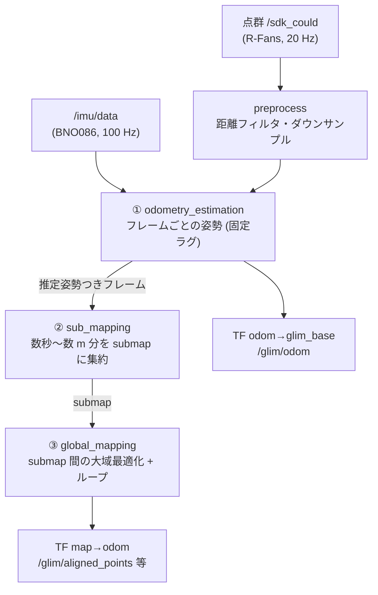

<!-- claude: GLIM 読本 第2章 (2026-08-12) -->

# 第2章 GLIM の構造 — 3 層パイプラインと差し替え可能な部品

GLIM (koide3, AIST) の設計思想は「SLAM を差し替え可能な部品の直列」にすることである。
この章では 3 層パイプラインの各層が何を受け取り何を出すか、そして config.json が
部品の結線表になっている仕組みを見る。

## 2.1 全体像 — 3 層 + 前処理



```
3 層の分業 (それぞれ独立した factor graph を持つ)
├── ① odometry_estimation ....... 「今どこか」。フレーム単位、固定ラグ窓 (5 s) の小さいグラフ
│   ├── IMU プリインテグレーション + スキャンマッチング (第3章)
│   └── リアルタイム必達。ここが壊れると後段は救えない (garbage in)
├── ② sub_mapping ................ 「最近の塊」。連続フレームを keyframe 選抜して submap に焼く
│   ├── 目的: グローバル層に渡す単位を減らす (4,624 フレーム → 4 submap ※08-12 実測)
│   └── submap 内部の整合はここで確定 (以後、中は変形しない)
└── ③ global_mapping ............. 「全体の帳尻」。submap を変数とする大域グラフ
    ├── submap 間のマッチングコストファクタ + IMU ファクタ
    └── 暗黙的ループ閉じ込み: 距離が近い submap 同士を自動で照合 (max_implicit_loop_distance)
```

slam_toolbox との対応で言えば、①がフロントエンド、③がバックエンド、②はスケールを
成立させるための中間層である (2D はスキャンが軽いので不要だった)。
ループ閉じ込みが「submap 単位」で行われる点も重要で、②の品質 (submap 内の歪み) は
③では直せない。

## 2.2 config.json — 部品の結線表

GLIM の全設定は JSON ファイル群で、エントリポイント `config.json` が
「どの層にどの実装 (.so) とどの設定ファイルを使うか」を結線する
(`ros2_ws_glim/config/config.json`):

```
config.json の結線 (reRoBot 現行 = CPU 版 LIO 構成)
├── config_ros ............... config_ros.json ............ ROS I/F (topic/QoS/TF)
├── config_sensors ........... config_sensors.json ......... センサ外部パラメータ (T_lidar_imu 等)
├── config_preprocess ........ config_preprocess.json ...... 前処理
├── config_odometry .......... config_odometry_cpu.json .... ① so_name: libodometry_estimation_cpu.so
├── config_sub_mapping ....... config_sub_mapping_cpu.json . ② so_name: libsub_mapping.so
├── config_global_mapping .... config_global_mapping_cpu.json ③ so_name: libglobal_mapping.so
├── config_viewer ............ config_viewer.json .......... 3D ビューア
└── config_logging ........... config_logging.json ......... ログ出力
```

各層の設定ファイルは冒頭の `so_name` で実装を指名する。**同じ層に複数の実装が用意
されていて、JSON の書き換えだけで方式を切り替えられる**のが GLIM の特徴:

```
層ごとの実装バリエーション (koide3/glim_ros2:jazzy イメージに実在するもの)
├── ① odometry_estimation
│   ├── libodometry_estimation_cpu.so ... LIO (IMU 密結合) ← reRoBot 現行
│   ├── libodometry_estimation_ct.so .... CT-ICP (IMU レス) ← 旧構成・比較実験用
│   └── ❌ libodometry_estimation_gpu.so . config はあるがイメージに .so が無い (CUDA なしビルド)
├── ② sub_mapping
│   ├── libsub_mapping.so ............... 標準 (最適化つき submap 構築)
│   └── libsub_mapping_passthrough.so ... 素通し (submap 最適化なしの軽量版)
└── ③ global_mapping
    ├── libglobal_mapping.so ............ 標準 (マッチングコストで大域最適化)
    └── libglobal_mapping_pose_graph.so . 軽量 (古典的ポーズグラフ+明示的ループ検出)
```

⚠️ GPU 系 config (`config_odometry_gpu.json` 等) はリポジトリに置いてあるが、
**公式 CPU イメージでは使えない**。ただしそれらの JSON のコメントヘッダは全パラメータの
公式解説を含む唯一の場所なので、資料としての価値は高い (第 4 章はそこから訳出している)。

## 2.3 ROS との境界 — glim_ros

GLIM 本体は ROS 非依存のライブラリで、ROS 2 との橋渡しは `glim_ros` パッケージが行う。
実行ファイルは 5 つ:

| 実行ファイル | 役割 |
|---|---|
| `glim_rosnode` | オンライン SLAM ノード (topic 購読) — 実走用 |
| `glim_rosbag` | **bag を直接読んで最速処理** (再生でなくファイル読み) — オフライン評価用 |
| `offline_viewer` | dump した地図の閲覧・再最適化・PLY 書き出し |
| `map_editor` | 地図の手動編集 |
| `validator_node` | センサデータの妥当性検査 |

購読は 3 本 (config_ros.json で結線):

```
入力 topic (reRoBot の値)
├── points_topic: /sdk_could ..... sensor_msgs/PointCloud2 (R-Fans。名前は上流の typo だが仕様)
├── imu_topic:    /imu/data ...... sensor_msgs/Imu (BNO086)
└── image_topic:  /image ......... 未使用 (カメラなし)
```

**車輪オドメトリの topic は購読しない** — 購読リストに /odom が無いことは
事例A の対策を考える上で決定的な制約である (拡張モジュールか C++ API での実装が必要)。

出力側の設計は TF との整合が肝で、第 5 章で reRoBot 固有の工夫 (glim_base) を扱う。
また `glim_rosbag` が「ROS のクロックを介さずファイルを直接読む」ことは、
bag 再生の use_sim_time 問題がそもそも存在しないという利点になる
([タイムスタンプ読本 §4.6](../timestamp/04_time_consumers.md))。

## 2.4 拡張モジュール — extension_modules

`config_ros.json` の `extension_modules` に列挙した .so が実行時に動的ロードされる。
reRoBot の現行 (`config_ros.json:71-76`):

```
extension_modules
├── libmemory_monitor.so ..... メモリ使用量の監視
├── libstandard_viewer.so .... GLIM 純正 3D ビューア (機体追尾カメラ)
├── librviz_viewer.so ........ RViz 向け topic 出力 (/glim/aligned_points 等)
└── (コメントアウト) libimu_validator.so — ❌ このイメージには存在せず、有効化すると読込失敗
```

ビューアさえ拡張モジュールである点に注意 — **ここを空にすると GLIM は完全ヘッドレスで
動く** (offline_viewer のハング回避で実際に使ったテクニック。第 7 章)。
車輪オドメトリ融合を実装するなら、この拡張モジュール機構がフックポイントになる。

## 2.5 実行時に何が起きているか — dump という証拠

GLIM は終了時 (または要求時) に推定結果一式を dump する。08-12 の実走 dump
(`bags/9goukan/3d_imu/2026-08-12_glim_dump/`) の中身がそのまま 3 層構造の証拠になっている:

```
dump の構造
├── 000000/ ... 000003/ ........ submap 4 個 (第②層の出力単位)
├── graph.bin / graph.txt ...... 第③層の factor graph (num_submaps: 4, num_all_frames: 4624)
├── values.bin ................. 最適化後の変数値
├── traj_imu.txt / traj_lidar.txt  最終軌跡 (TUM 形式: t x y z qx qy qz qw)
├── odom_imu.txt / odom_lidar.txt  第①層の生軌跡 (グローバル最適化前)
└── config/ .................... 実効 config のコピー + meta (自動検出された frame 名)
```

`odom_*.txt` (①の出力) と `traj_*.txt` (③の出力) を比べれば「グローバル最適化が
どれだけ直したか」が定量化できる。読み方の実務は第 7 章で。

## 2.6 この章のまとめ

```
第2章 まとめ
├── 3 層 = odometry (今どこ) → sub_mapping (最近の塊) → global_mapping (全体の帳尻)
│   └── 各層が独立の factor graph。submap 内部の歪みは後段では直らない
├── config.json は結線表 — so_name の書き換えで方式ごと差し替え (LIO ⇔ CT-ICP)
│   └── ⚠️ GPU 系はこのイメージに .so が無い。config は解説原典としてのみ有用
├── glim_ros が ROS 境界。購読は points/imu/image の 3 本 — /odom は購読しない
├── ビューアも拡張モジュール — extension_modules を空にすればヘッドレス
└── dump が 3 層の物的証拠 (submap/graph/odom vs traj)
```

→ [第3章 点群レジストレーションの仕組み](03_registration.md)
