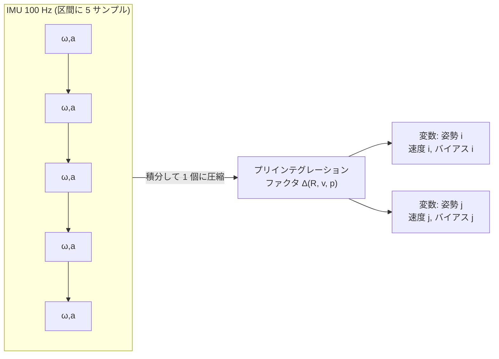

<!-- claude: GLIM 読本 第3章 (2026-08-12) -->

# 第3章 点群レジストレーションの仕組み — GICP・iVox・プリインテグレーション・deskew

パラメータ名に現れる `vgicp_resolution` `ivox_resolution` `imu_acc_noise` `perpoint_time`
が制御している機構を開ける。slam_toolbox の相関マッチャ
([slam_toolbox 読本 第3章](../slam_toolbox/03_scan_matching.md)) と対比しながら読むと
差がはっきりする。

## 3.1 ICP → GICP → VGICP — 点合わせの進化

6 自由度では総当たりができないため、3D は**反復最近傍法 (ICP 系)** を使う。
「対応付け → 誤差最小化 → 再対応付け」を収束まで回す方式で、進化の軸は
「点をどうモデル化するか」である:

```
レジストレーションの進化
├── ICP (point-to-point)
│   ├── 各点の最近傍点との距離を最小化
│   └── 弱点: LiDAR の点は「面のサンプル」なのに点同士を合わせる
│       → 同じ面でもサンプル位置が違えば誤差になる
├── GICP (Generalized ICP) ......... 点の周辺の分布 (共分散) 同士を合わせる
│   ├── 各点の近傍 k 点 (k_correspondences = 10) から局所共分散を推定
│   ├── 面なら「面方向に伸びた分布」になり、面に沿ったずれは許容される
│   │   (distribution-to-distribution)
│   └── GLIM odometry の registration_type: "GICP" ← reRoBot 現行
└── VGICP (Voxelized GICP) ......... GICP のボクセル版 (koide3 の提案手法)
    ├── 対象点群をボクセル (vgicp_resolution = 0.5 m) に区切り、
    │   ボクセル内の点の平均・共分散を代表値として保持
    ├── 最近傍探索が「点→ボクセル参照」になり高速・並列化向き
    └── GLIM の mapping 層の registration_error_factor_type: "VGICP"
```

reRoBot の現行構成では **odometry 層が GICP、sub/global mapping 層が VGICP** である。
odometry はフレーム対モデルの精密照合、mapping は大量の keyframe/submap 照合なので
速度優先 — と層ごとに使い分けている。

初期値依存性は残る: ICP 系は初期値の近くの局所解に落ちる。GLIM の odometry では
IMU プリインテグレーション (3.3) が毎フレームの初期値を供給する — LIO の密結合とは
「マッチングの初期値と拘束の両方に IMU を使う」ことである。

## 3.2 iVox — 地図側の近傍探索を増分更新する

ICP 系の計算時間の大半は「最近傍探索」である。従来は kd-tree を使ったが、地図が伸びる
たびに木を作り直すのはオンライン処理に向かない。GLIM の odometry 層は **iVox**
(incremental voxel map, FAST-LIO2 で提案) を使う:

```
iVox の構造
├── 空間をボクセル (ivox_resolution = 1.0 m) のハッシュ表で管理
│   └── 新しい点は該当ボクセルに追記するだけ (木の再構築なし = 増分的)
├── ボクセル内は点間最小距離 (ivox_min_dist = 0.1 m) で間引き — 密度の上限を保証
└── LRU 削除 (lru_thresh = 100): 最近参照されていないボクセルを捨てる
    └── 地図が「ロボット周辺の使う分だけ」に保たれる (メモリ有界)
```

つまり odometry 層の「地図」は全履歴ではなく、LRU で維持される直近の作業領域である。
全体の地図は sub/global mapping 層が持つ — ここでも第 2 章の 3 層分業が効いている。

## 3.3 IMU プリインテグレーション — 2 姿勢間の「IMU の言い分」を 1 個のファクタに

IMU は 100 Hz で角速度と加速度を出す。フレーム間 (LiDAR 20 Hz なら 50 ms) に 5 サンプル
入るが、これを 1 サンプルずつ factor graph に入れると変数が爆発する。
**プリインテグレーション (preintegration)** は、区間内の IMU 測定を積分して
「時刻 i から j までの姿勢・速度・位置の変化量」という**単一のファクタ**に前計算する
標準テクニックである (Forster et al., GTSAM に実装):



重要な性質:

- ファクタは**バイアスの関数として**保持される。最適化中にバイアス推定が動いても
  再積分せず一次近似で補正できる (これが「プリ」の意味)
- だから GLIM の変数には姿勢だけでなく**速度とIMU バイアス**が含まれる (第 1 章 1.3)。
  `fix_imu_bias: false` はバイアスを推定し続ける設定
- 信頼度は 4 つのノイズパラメータで与える (`config_sensors.json`):

| パラメータ | reRoBot | 意味 |
|---|---|---|
| `imu_acc_noise` | 0.05 | 加速度計の白色雑音 — 大きくすると IMU の並進の言い分を信じなくなる |
| `imu_gyro_noise` | 0.02 | ジャイロの白色雑音 (回転の信頼度) |
| `imu_int_noise` | 0.001 | 積分過程の雑音 |
| `imu_bias_noise` | 1e-5 | バイアスのランダムウォーク速度 — バイアスがどれだけ速く漂うか |

- 積分には**正しい時刻差と正しい外部パラメータ (T_lidar_imu)** が必須。
  時刻が 0.16 s ずれると 100 Hz の 16 サンプル分の運動が別の区間に付け替わる
  (これが事例B で踏んだ地雷 — [タイムスタンプ読本 事例A](../timestamp/06_case_studies.md))

## 3.4 deskew — 動きながら撮ったスキャンの歪み取り

回転式 LiDAR の 1 スキャン (R-Fans: 50 ms) の間、機体は動いている。全点を「同時刻に
撮った」として扱うと、旋回中は点群が扇状に歪む。**deskew (motion compensation)** は
各点をその点の撮影時刻の機体姿勢で座標変換し直す処理である:

```
deskew の材料
├── ① 点ごとの撮影時刻 (per-point time)
│   ├── PointCloud2 のフィールドから読む。GLIM が認識する名前: t / time / time_stamp / timestamp
│   │   └── ⚠️ R-Fans 初期実装の `timeflag` は非認識 → `time` に改名した経緯 (事例B)
│   ├── perpoint_relative_time: true .... header.stamp からの相対時刻として解釈 (reRoBot)
│   ├── perpoint_time_scale: 1.0 ........ 秒への換算係数 (ns 格納なら 1e-9)
│   └── autoconf_perpoint_times: true ... 上記を自動推定するモード
└── ② 区間内の機体運動
    ├── LIO: IMU 積分から得る (精度が高い)
    └── CT-ICP: スキャン開始/終了姿勢を推定して内挿 (IMU レスの代替)
```

時刻まわりの正確な議論 (絶対基準・相対化・検証手順) は
[タイムスタンプ読本 §4.5](../timestamp/04_time_consumers.md) が正。本書では
「deskew は per-point time と T_lidar_imu が正しいときだけ正しく働く」とだけ覚えておく —
どちらが狂っても「旋回するほど壁が二重になる」同型の症状になる。

## 3.5 縮退 — 反復法でも逃げられない

slam_toolbox 読本 第 1 章 1.4 の縮退は、方式が GICP に変わっても消えない。
GICP の目的関数は「面と面を合わせる」なので:

```
環境と拘束 (GICP の場合)
├── 壁 (平面) ....... 壁法線方向は強く拘束。壁に沿った方向は自由 (滑る)
├── 廊下 ............ 両側の壁で左右は拘束されるが、前後は滑る ⚠️
├── 床 ............. z・roll・pitch を拘束 (3D では床が常に見えるのが 2D との違い)
└── 開けた場所 ...... 遠い点ほど疎 + 面が少ない → 全体に弱い
```

LIO では pitch/roll/z は重力+床で守られるため、縮退は**水平面内 (x, y, yaw)** に集中
する。「床は完璧なのに壁が流れる」という事例A の症状は、まさにこの選択的縮退の教科書
的な現れである。対策の一般論は ①特徴の多い経路を選ぶ ②縮退方向を別センサで拘束する
(車輪オドメトリ・GNSS) ③縮退検出して更新を抑制する、の 3 系統 (事例A の対策候補も
この構図に沿っている)。

## 3.6 この章のまとめ

```
第3章 まとめ
├── GICP = 分布同士の照合 (面に強い)。VGICP = そのボクセル高速版 (mapping 層)
├── iVox = 増分ボクセル地図 + LRU。odometry 層の地図は「直近の作業領域」
├── プリインテグレーション = 区間 IMU を 1 ファクタに圧縮。変数に速度・バイアスが増える
│   └── noise 4 兄弟が IMU の言い分の重み。時刻ずれと T_lidar_imu ずれは毒
├── deskew = per-point time × 区間運動で点を撮影時刻の姿勢へ戻す
└── GICP でも縮退は消えない。LIO では水平面内に集中する (床は重力が守る)
```

→ [第4章 パラメータ大全](04_parameters.md)
