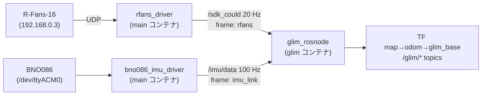

<!-- claude: GLIM 読本 第5章 (2026-08-12) -->

# 第5章 reRoBot での適用 — LIO 構成の設計判断と現在地

一般論を reRoBot の実構成に着地させる。この章はプロジェクト特化で、行番号は
2026-08-12 時点。

## 5.1 センサ構成とデータフロー



- 供給側は `rerobot_bringup.launch.py` の `lidar_3d:=true imu:=true`
  (rfans_driver は `:154-176`、LD_PRELOAD 適用済み。BNO086 は `:178-191`)
- 点群 20 Hz・IMU 100 Hz。08-12 の実測では 235 s の bag で両者欠落なし、
  `ros2 topic delay /sdk_could` ≈ 51 ms
- GLIM は frame 名を自動検出する (`imu_frame_id`/`lidar_frame_id` = ""):
  dump の meta に `imu_frame_id: imu_link` / `lidar_frame_id: rfans` と記録され、
  検出が効いた証拠になっている

## 5.2 コンテナ — ビルドしない、という構成

glim コンテナは他の 3 コンテナと毛色が違う:

```
glim_env の特殊性 (docker-compose.yml:59-80 / docker/Dockerfile_glim)
├── ベース: koide3/glim_ros2:jazzy (公式ビルド済みイメージ。GLIM 1.2.2 + GTSAM 4.3a0)
│   └── GLIM 本体をビルドしない → build/install volume を持たない唯一のコンテナ
├── なぜ別コンテナか: GTSAM 4.3a0 要求が apt の ros-jazzy-gtsam 4.2.0 と衝突
│   └── 「依存の壁」で分割する方針の典型例 (LIO-SAM の GTSAM 事故が教訓)
├── mount: ./ros2_ws_glim/config → /glim_config (JSON のみ。colcon パッケージではない)
│   └── ./maps → /workspace/maps, ./bags → /workspace/bags (オフライン評価用。2026-08-15 に他コンテナと統一)
└── ROS 環境の source は /ros_entrypoint.sh 経由 (overlay の場所に依存しないため)
```

起動は素のコマンドで:

```bash
docker compose --profile glim up -d glim
docker exec -it glim_env /ros_entrypoint.sh \
  ros2 run glim_ros glim_rosnode --ros-args -p config_path:=/glim_config
```

## 5.3 T_lidar_imu — URDF からの算出と検算

LIO の生命線である外部パラメータ (第 3 章 3.3)。reRoBot は実測反映済みの URDF
(`ros2_ws_main/src/bringup/rerobot_bringup/urdf/rerobot.urdf`) から算出した:

```
URDF の実測値 (2026-08-10/11 確定)
├── base_link → rfans:    t = (-0.075, 0, 0.725), rpy = (0, 0, 0)      (rerobot.urdf:99-103)
└── base_link → imu_link: t = (0, 0, 0.64),      rpy = (0, 0, π/2)    (rerobot.urdf:128-132)
    └── 正立・上から見て +90° 回し取付 (実走 bag の 3 証拠で確定 — 静止 accel z=+9.815 /
        gyro_z と車輪 yaw rate が同符号 +1.015 / 裏返し仮定だと EKF yaw が鏡像)
```

求めるのは「IMU frame の点を LiDAR frame へ移す」T_lidar_imu = (T_base_lidar)⁻¹ · T_base_imu:

```
並進: rfans の回転が 0 なので、そのまま差を取れる
  t = t_imu - t_lidar = (0, 0, 0.64) - (-0.075, 0, 0.725) = (0.075, 0, -0.085)
回転: Rz(0)⁻¹ · Rz(π/2) = Rz(90°)
  → 四元数 q(x,y,z,w) = (0, 0, sin45°, cos45°) = (0, 0, 0.70711, 0.70711)
軸対応の確認: imu_X → lidar_Y, imu_Y → -lidar_X, imu_Z → lidar_Z
```

これが `config_sensors.json:58-66` の値と一致する (TUM 形式 `[x y z qx qy qz qw]`)。
⚠️ **URDF の imu_joint / rfans_joint を 1 mm でも動かしたら再計算** — この連動は
CLAUDE.md にも明記されている運用ルールで、忘れると deskew と重力方向が静かに狂う
(症状は「旋回するほど滲む」で時刻ずれと同型 — 第 3 章 3.4)。

## 5.4 glim_base — TF 衝突を避ける 2 つの設計判断

reRoBot には既に車輪オドメトリ (epos4_odometry または EKF) が odom→base_link を
出している。GLIM を素朴に足すと TF が衝突するため、2 つの手を打ってある:

```
TF ツリー (bringup 3D+IMU + GLIM 稼働時)
map ──[GLIM]── odom ──┬──[車輪 odom/EKF]── base_link ── laser / rfans / imu_link (URDF)
                      └──[GLIM]─────────── glim_base
```

1. **`base_frame_id: "glim_base"`** (`config_ros.json:63`) — GLIM の姿勢出力先を
   base_link から分離。odom の直下に base_link と glim_base が**兄弟として並ぶ**ので
   親子衝突なし。おまけに「車輪オドメトリの言う現在地」と「GLIM の言う現在地」を
   RViz で並べて比較できる (事例A の診断でそのまま活きた)
2. **`publish_imu2lidar: false`** (`config_ros.json:68`) — GLIM が善意で出す
   imu_link→rfans TF を止める。robot_state_publisher が既に base_link→rfans を
   出しており、**rfans の親が二重になると TF ツリーが壊れる**ため

この構成は「既存のロボットに GLIM を後付けする」際の一般解として使える:
評価段階では SLAM の TF を本流 (base_link) に繋がず、兄弟 frame で並走させる。

## 5.5 enable_imu の 3 点セット

LIO ⇔ CT-ICP の切替は 1 か所ではない。**3 か所を揃える**必要がある:

```
方式切替で連動する 3 点
├── ① config.json の config_odometry ....... _cpu (LIO) ⇔ _ct (CT-ICP)
├── ② config_sub_mapping_cpu.json の enable_imu ....... true ⇔ false
└── ③ config_global_mapping_cpu.json の enable_imu .... true ⇔ false
```

①だけ替えると「odometry は IMU レスなのに mapping 層が IMU ファクタを要求する」
中途半端な構成になる。実際に動く切替レシピ (08-12 の比較実験で実証済みの差分) は
[第7章 7.4](07_checklist.md)。

## 5.6 ⚠️ 設定コメントの「ねじれ」正誤表

config 内のコメントには古い記述が残っており、そのまま信じると事故る。本書が正:

| 場所 | コメントの記述 | 実際 |
|---|---|---|
| `config.json:10-14` | CT-ICP に戻すには「config_ros.json の imu_frame_id: glim_base / publish_imu2lidar: false を復元」 | **古い**。imu_frame_id に glim_base を入れるのは IMU レス時代のハック。現行の config_ros.json は自動検出 (`""`) のままで CT-ICP も動く (08-12 実験で実証)。publish_imu2lidar: false は現行値そのもの |
| `config_odometry_gpu.json` ほか GPU 系 | (存在すること自体) | **このイメージでは使えない** (.so 不在)。結線したら起動失敗 |
| `config_ros.json` の `ang_scale` | (キーが無い) | 上流には解説コメント付きで存在 (既定 1.0、deg/s 出力 IMU 用)。BNO086 は rad/s なので欠落でも実害なし — だが「意図して 1.0」なのか読めないので、いずれ明示が望ましい |

## 5.7 タイムスタンプとの接続 (要約)

GLIM は deskew と IMU 対応付けのために時刻に最も敏感な消費者である。reRoBot では
LIO 切替の直前に 2 つの時刻バグを静的に発見・修正した (詳細は
[タイムスタンプ読本 事例A・B](../timestamp/06_case_studies.md)、本書では
[第6章 事例B](06_case_studies.md) として要約):

- rfans の header.stamp がスキャン末尾基準 → 全点 0.16 s 未来 (LIO 切替で発火する地雷だった)
- per-point time が GPS 週秒の float32 直入れ → 分解能劣化 + フィールド名 `timeflag` が
  GLIM 非認識 (`t`/`time`/`time_stamp`/`timestamp` のみ認識) → 相対化 + `time` へ改名

残留オフセットの微調整ノブは `imu_time_offset` / `points_time_offset` (第 4 章 4.2)、
検証手順は [タイムスタンプ読本 §7.2](../timestamp/07_checklist.md)。

## 5.8 あるべき姿とのギャップ (現在地)

```
ギャップ一覧 (2026-08-12 時点)
├── ⚠️ 水平ドリフト未解決 ......... 車輪 odom 不使用 × 特徴の乏しさ (事例A)。対策候補 3 系統
├── ⚠️ 車輪オドメトリ融合は未実装 .. glim_ros 標準は /odom を購読しない — 拡張モジュール開発が必要
├── ⚠️ アルゴリズムは未チューニング  変更済みなのは結線と TF のみ (第4章 4.11) — 伸び代でもある
├── ⚠️ ang_scale キー欠落 ......... 実害なしだが意図が読めない状態 (5.6)
└── ✅ 時刻・外部パラメータは検証済  stamp 修正 2 件 + T_lidar_imu 検算 + frame 自動検出確認
```

→ [第6章 事例集](06_case_studies.md)
