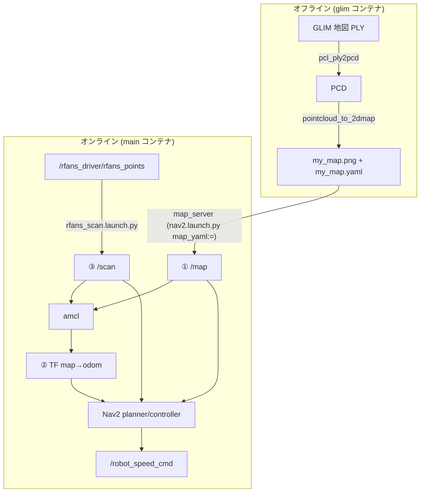

<!-- claude: 3D地図→Nav2 接続読本 第1章 (2026-08-17) -->

# 第1章 Nav2 が要求する 3 つの入力 — なぜ「差し替え」で済むのか

Nav2 は巨大なスタックに見えるが、外から与えるべきものは驚くほど少ない。この章では
「Nav2 が何を知らないか」を先に確定させる。それが分かると、3D 地図対応が
「Nav2 の改造」ではなく「入力の供給者の差し替え」で済む理由が見える。

## 1.1 Nav2 の知らないこと

Nav2 (planner / controller / behavior) は次のことを**一切知らない**:

- 地図がどうやって作られたか (slam_toolbox か GLIM か、2D LiDAR か 3D LiDAR か)
- 自己位置がどうやって推定されたか (AMCL か、別のローカライザか)
- センサが物理的に何か (/scan が本物の 2D LiDAR か、3D 点群から合成した仮想スキャンか)

Nav2 が要求するのは**契約 (インタフェース) を満たす 3 つの入力**だけである:

```
Nav2 の 3 入力
├── ① /map (nav_msgs/OccupancyGrid)
│     「世界のどこが通れるか」。map_server が配信する静的な占有格子。
│     global costmap の static_layer がこれを土台に敷く
├── ② TF map→odom
│     「自分は地図のどこか」。ローカライザ (AMCL 等) が供給する。
│     odom→base_link (EKF/オドメトリ) と連結して map→base_link が完成する
└── ③ 障害物観測 (/scan 等)
      「いま目の前に何があるか」。costmap の obstacle_layer が購読し、
      地図に無い障害物 (人・置かれた荷物) をリアルタイムに焼き込む
```

reRoBot の現行 2D 構成 (slam_toolbox 地図 + UTM-30LX + AMCL) はこの 3 つが揃っている
から動く。①は `nav2.launch.py` の map_server、②は同 launch の amcl、③は urg_node の
/scan (`ros2_ws_main/src/bringup/rerobot_bringup/launch/nav2.launch.py:5-14` の前提コメント
がまさにこの 3 入力の列挙になっている)。

## 1.2 TF ツリーで見る責務分界

②の「map→odom」という一見不自然な設計には理由がある。TF は木構造で、1 つの frame に
親は 1 つしか持てない。そこで責務を鎖状に分割する:

```
map ──(AMCL: 低頻度・ジャンプあり)──▶ odom ──(EKF: 高頻度・連続)──▶ base_link
      「地図に対する大域補正」              「滑らかな短期運動」
```

- odom→base_link は EKF (車輪 + IMU) が 30 Hz で出す。連続で滑らかだが、
  長時間で漂流する ([EKF センサ融合読本](../ekf_fusion/00_index.md) の主題)
- map→odom は AMCL が「漂流の累積分」だけを不定期に補正する。ジャンプしてもよい —
  ジャンプは map 座標系での位置の飛びであって、ロボットの制御 (odom 系で動く
  local costmap / controller) は乱されない

この分業のおかげで、**②の供給者を AMCL から別のローカライザに替えても、
残りの系は何も気づかない**。第 5 章の「本格案」はまさにこの差し替えである。

## 1.3 なぜ Nav2 は 3D 地図を直接食えないか

技術的制約ではなく設計思想の問題である。Nav2 の costmap・planner は
「2D 格子上のコスト」を前提に作られている:

- planner (NavFn / Smac) は 2D 格子上の探索
- costmap は 2D 格子へのコスト焼き込み
- AMCL は 2D 姿勢 (x, y, yaw) の推定器で、観測モデルは LaserScan 専用

つまり 3D 点群地図で Nav2 を使うには、どこかで**3D→2D の翻訳**が要る。翻訳箇所は
2 通りあり、これが最短案と本格案の分かれ目になる:

```
翻訳をどこでやるか
├── 最短案: 入力の手前で全部 2D 化する
│     地図: PLY → 高さスライス → 占有格子 (第3章)
│     観測: 3D 点群 → 高さ帯 → /scan (第4章)
│     自己位置: 既存 AMCL をそのまま使う
│     → Nav2 に入る時点で従来の 2D 構成と区別がつかない。追加ノード 1 個
└── 本格案: 自己位置だけ 3D のまま解く
      地図 (①) と観測 (③) は最短案と同じ 2D 化を使い、
      ② の TF map→odom だけを 3D scan matching ローカライザが供給 (第5章)
      → 縦の構造も照合に使える。ただし新パッケージのビルド・統合が要る
```

## 1.4 reRoBot での配線 (2026-08-17 実装)



重要なのは、この図の右半分 (amcl・Nav2) が**現行 2D 構成と完全に同一**であること。
実装で変わったのは左上の「地図の出どころ」と `/scan` の出どころだけで、
`nav2_params.yaml` は 1 行も変えていない (成立条件は第 4 章 §4.4)。

## 1.5 この章のまとめ

```
第1章 まとめ
├── Nav2 の要求は 3 入力だけ: ① /map ② TF map→odom ③ /scan
├── TF の鎖 (map→odom→base_link) は責務分界 — ②の供給者は差し替え可能
├── 3D 地図対応 = どこかで 3D→2D 翻訳を入れること
└── 最短案は「入力の手前で全部 2D 化」、本格案は「②だけ 3D のまま解く」
```

→ [第2章 占有格子の正体](02_occupancy_grid.md)
