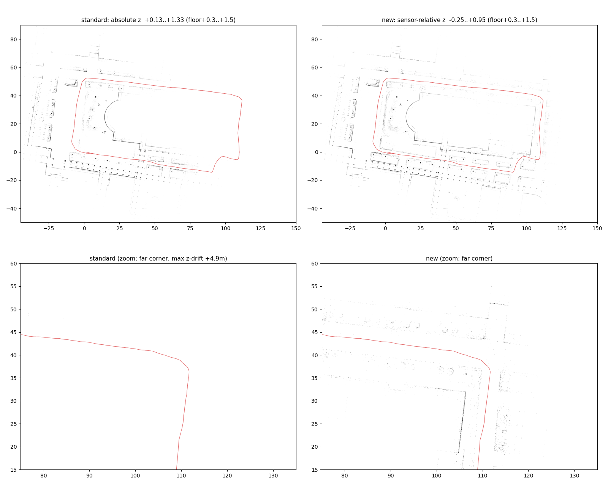
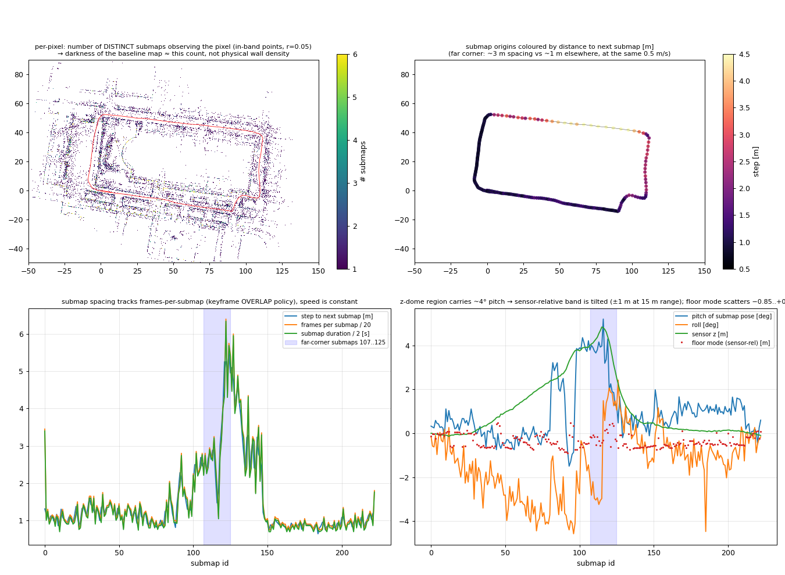
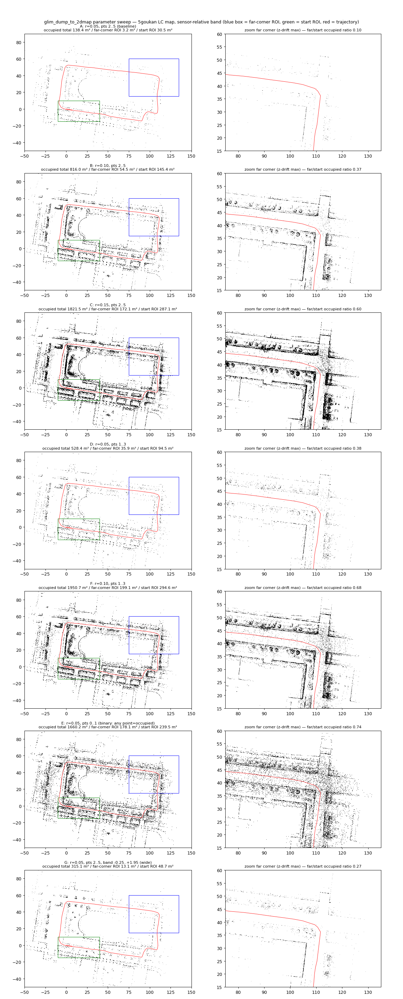

<!-- claude: 3D地図→Nav2 接続読本 第3章 (2026-08-17) -->

# 第3章 3D→2D 地図変換 — 高さで切るという翻訳

3D 点群地図 (数十万点の x, y, z) を第 2 章の占有格子に変換する。本章の主役は
「高さスライス」という考え方と、それを実装した既製ツール pointcloud_to_2dmap の中身。
続いて z ドリフト地図で絶対 z スライスが破れる問題と、その解である自作
glim_dump_to_2dmap (センサ相対スライス、§3.4)、最後に代替経路の得失比較。

## 3.1 なぜ全投影は失敗するか

素朴な発想は「全点を真上から見て、点のあるセルを黒にする」だが、これは必ず失敗する。
3D 地図には床の点が大量に入っており (LiDAR は床を最もよく見る)、**全セルに床点が乗って
地図が真っ黒になる**。天井・木の枝など「ロボットの背より高い構造」も同様に、
通れる場所を占有として塗り潰す。

解決は「ロボットの車体が実際にぶつかる高さ帯だけを見る」こと:

```
高さスライスの考え方 (側面図)

  z ▲
    │  ～～～ 天井・枝 (z > 床+1.5) ........ 捨てる (ぶつからない)
    │ ┌─┐
    │ │壁│ ←─ 床+0.3〜1.5 の帯 ............ これだけ使う = 「壁」
    │ │ │      reRoBot の車体・マストが
    │ └─┘      物理的に占める高さ帯
    │ ═════ 床 (z ≈ 床±0.15) .............. 捨てる (障害物ではない)
    └──────────────────────────▶ x
```

帯の下限 0.3 を床ぎりぎりにしないのは、床点自体の高さばらつき (縦角誤差で
±0.2 m 程度 — [GLIM 読本](../glim/00_index.md) 事例A 周辺) が壁に化けるのを防ぐため。
上限 1.5 は車体高さ + マージン。この「床+0.3〜1.5 m」は 08-13 の GLIM 品質評価
(`docs/issue/2026-08-13_glim_param_tuning.md`) と同じ帯で、実績がある。

## 3.2 pointcloud_to_2dmap の解剖

採用した既製ツール ([koide3/pointcloud_to_2dmap](https://github.com/koide3/pointcloud_to_2dmap)、
GLIM と同作者) は、この高さスライスを 50 行弱で実装している。全ロジックは
`tools/pointcloud_to_2dmap/src/pointcloud_to_2dmap.cpp` の `MapGenerater::generate()`:

```cpp
// 1) 高さ帯フィルタ (min_height/max_height は絶対 z)
if(point.z < min_height || point.z > max_height) continue;
// 2) world (0,0) を画像中心に置いて格子へ投票
int x = point.x * m2pix + map_width / 2;
int y = -point.y * m2pix + map_width / 2;   // ⚠️ ここが map_height でなく map_width
map.at<int>(y, x)++;
// 3) 点数 → グレースケール (min_points_in_pix=2, max_points_in_pix=5 が既定)
map -= min_points_in_pix;
map.convertTo(map, CV_8UC1, -255.0 / (max_points_in_pix - min_points_in_pix), 255);
```

3) の式を第 2 章の 2 段翻訳 (occupied_thresh 0.5 / free_thresh 0.2) に通すと、
**セル内の点数がそのまま {自由, 未知, 占有} に写像される**:

| 帯内の点数 | ピクセル値 | 占有確率 p | map_server の解釈 |
|---|---|---|---|
| 0〜2 | 255 (白) | 0.0 | 自由 |
| 3 | 170 | 0.33 | **未知** (0.2 < p < 0.5) |
| 4 | 85 | 0.67 | 占有 |
| 5 以上 | 0 (黒) | ≥1.0 (飽和) | 占有 |

つまり「4 点以上で壁、3 点は保留、2 点以下はノイズ扱いで自由」。GLIM の submap は
0.3 m 間引き済みで点密度が管理されているので、この閾値がそのまま機能する
(密度が大きく違う地図では `--min/max_points_in_pix` の調整が要る)。

⚠️ 2 つの実装上の注意 (実測で確認済み):

1. **y の中心計算が `map_width` を参照している** (上のコード 2 行目)。`-w` と `-h` に
   別の値を渡すと y 方向の中心がずれる。**必ず -w = -h で使う**
2. **min/max_height は絶対 z** である。「床+0.3〜1.5」を渡すには床の z を知る必要がある
   — それが次節

## 3.3 床はどこにあるか — z の実測

GLIM 地図の z=0 は「床」ではない。z=0 は**マッピング開始時のセンサ (IMU) の位置**で、
重力方向だけが IMU で校正されている。reRoBot の N12 地図 (9 号館, 08-14) では
床は z=+0.636 にあった (事例の詳細は [第6章 事例C](06_case_studies.md))。

床 z は z ヒストグラムの最頻値で実測する — 屋内地図では床が圧倒的な最大平面なので、
5 cm ビンの最頻値がそのまま床になる:

```bash
# N12 実測: z_floor 0.636 / x −17〜40 m / y −33〜11 m (2026-08-17)
docker exec glim_env bash -c "python3 -c \"
import numpy as np
raw = open('<map.ply>','rb').read()
pts = np.frombuffer(raw, dtype=np.float32, offset=raw.index(b'end_header')+11).reshape(-1,3)
h,e = np.histogram(pts[:,2], bins=np.arange(pts[:,2].min(), pts[:,2].max(), 0.05))
print('z_floor %.3f' % (e[h.argmax()]+0.025))\""
```

同時に xy 範囲も出す。地図サイズ `-w -h` は「xy の最大絶対値 × 2 ÷ resolution」以上が
必要 (ツールは world 原点中心の固定枠で、はみ出た点は黙って捨てられる)。

⚠️ **z ドリフトのある地図では床が 1 枚ではない**。現行 GLIM 地図には縦角表の系統誤差
由来の z ドリフト (`docs/issue/2026-08-16_rfans_mount_angle_glim_z_collapse.md`) があり、
flat 取付でも −1.3%/距離で床が滑る。N12 (走行 50 m 級) では帯 1.2 m に対し
ずれ ~0.7 m で実用範囲だったが、数百 m 級の屋外地図では帯から壁が外れる —
5号館 344 m 周回 (ドリフト最大 +4.9 m) で実際に外れた。根本対策は縦角再較正
(保留中) だが、地図変換に限っては次節のセンサ相対スライスで回避できる。

## 3.4 glim_dump_to_2dmap — センサ相対スライスという解 (2026-08-20 追加)

絶対 z 方式が破れるのは「床が z=0 付近に 1 枚だけある」という前提が地図全体で
成り立たないときである。ではスライス帯を場所ごとに床へ追従させればよい — その情報は
どこにあるか。**マージ済み PCD には無い。GLIM の dump には残っている**。

```
情報の残り方の違い
├── マージ済み PCD (offline_viewer が export する map.ply/pcd)
│     点 = (x, y, z) だけ。「どこから撮ったか」は捨てられている
│     → 床追従には局所床推定 (格子ごとの床再検出) を作り込むしかない
└── GLIM dump (dump ディレクトリそのもの)
      submap = 点群 + T_world_origin (そのときのセンサ姿勢)
      → 各点に「観測したセンサの z」が付いている
      → 「点の z − センサ z」で切れば帯がドリフトと一緒に上下する
```

これを実装したのが `tools/glim_dump_to_2dmap/glim_dump_to_2dmap.py` (自作、numpy のみ、
ビルド不要)。スライス判定は 3 行 (`tools/glim_dump_to_2dmap/glim_dump_to_2dmap.py:88`、
行番号は 2026-08-20 時点):

```python
z_ref = T[2, 3] if args.height_mode == "sensor" else 0.0   # submap のセンサ z
rel = w[:, 2] - z_ref                                       # センサ相対高さ
keep = (rel >= args.min_height) & (rel <= args.max_height)
```

座標変換・画素への投票・点数→グレースケール変換 (§3.2 の表) は既製ツールと
同一仕様なので、map_server 側から見た出力の意味は変わらない (画像が png でなく
PGM になるだけ。map_server は両方読める)。

### 使い方

```bash
# 1) 床のセンサ相対 z を実測 (絶対 z の代わりに「センサから見て床は何 m 下か」を測る)
#    reRoBot 5号館 08-14 LC 地図の実測: -0.55 m
docker exec -i glim_env python3 - <<'EOF'
import numpy as np, sys
sys.path.insert(0, '/workspace/tools/glim_dump_to_2dmap')
from glim_dump_to_2dmap import load_submap, list_submaps
base = '/workspace/bags/<dump_dir>'
rels = []
for i in list_submaps(base):
    T, pts = load_submap(base, i)
    w = pts @ T[:3, :3].T + T[:3, 3]     # submap 点群 → 世界座標
    rels.append(w[:, 2] - T[2, 3])       # センサ z との差
rel = np.concatenate(rels)
low = rel[(rel > -2.0) & (rel < 0.5)]    # 床がありうる範囲だけでヒストグラム
h, e = np.histogram(low, bins=np.arange(-2.0, 0.5, 0.02))
print('floor (sensor-rel) = %+.3f' % (e[h.argmax()] + 0.01))
EOF

# 2) 変換 (帯 = 床相対値 + 0.3 〜 +1.5。床 -0.55 なら -0.25〜+0.95)
docker exec glim_env python3 /workspace/tools/glim_dump_to_2dmap/glim_dump_to_2dmap.py \
  /workspace/bags/<dump_dir> /workspace/maps/glim/<name>/nav2 \
  -r 0.05 --map_width 6144 --map_height 6144 \
  --height_mode sensor --min_height -0.25 --max_height 0.95
```

| 引数 | 既定 | 意味 |
|---|---|---|
| `--height_mode` | sensor | sensor = センサ z 相対 / absolute = 既製ツールと同じ絶対 z |
| `--min/max_height` | −0.25 / +0.95 | スライス帯。height_mode の基準に対する値 |
| `--center` | world | world = 原点中心 (既製互換) / auto = bbox 中心 + サイズ自動 |
| `--map_width/height` | 0 (自動) | 0 なら bbox + 2 m マージンに自動フィット。y 中心バグは無い (別値可) |
| `--min/max_points_in_pix` | 2 / 5 | §3.2 の点数閾値と同じ意味 |
| `--export_pcd <path>` | なし | 全点マージの世界座標 PCD も書く (既製ツール入力・3D ローカライザ地図用) |

### 実測比較 — 絶対 z はドリフト部で壁が全滅する

5号館 08-14 手動 LC 地図 (344 m 周回、z ドリフト最大 +4.9 m) で、同一点群・
同一方針の帯 (床+0.3〜1.5) を両方式で切った結果:



```
図の読み方 (4 枚組、軸は world 座標 [m]、赤線 = GLIM の推定軌跡 = センサの通った道)
├── 左列 = 絶対 z (既製 pointcloud_to_2dmap と同じ「世界座標の z で切る」方式)
│     帯 +0.13〜+1.33 は始点付近の床 (最頻値 −0.17) を基準に決めた固定値
├── 右列 = センサ相対 z (glim_dump_to_2dmap --height_mode sensor)
│     帯 −0.25〜+0.95 は「センサから見た床 −0.55」基準。場所ごとに床へ追従する
├── 上段 = 全体図。左右で始点 (0,0) 付近は同じ壁が出るが、
│     右上の最遠部 (x≈110, y≈40) は左では白紙、右では建物・植栽が残る
└── 下段 = その最遠角のズーム。左は赤線しか無い = 帯が「床下 5 m」を切っている。
      右は道の両側に壁と街路樹の列が出ている
```

なぜ左で消えるか: この地図は経路長 160 m の最遠部で z が +4.9 m 浮いている (§3.3)。
固定帯 +0.13〜+1.33 は、そこでは実際の床から見ると 5 m 近く下の空中 (地面より下) を
切っており、壁も植栽も帯に入らない。センサ相対なら「センサの z − 0.55 が床」という関係は
ドリフトしても壊れないので、帯が点群と一緒に浮いて壁を拾い続ける。つまりこの比較は
**「z ドリフトのある地図では、2D 化の基準を世界座標ではなく軌跡 (オドメトリ) に置くべき」**
ことの実証であり、地図そのものの z 誤差を直したわけではない (3D 地図はドーム状のまま)。

数値の裏取り (一次資料は git 管理外の
`bags/5goukan/2d3d_imu/offline/glim/2dmap_compare/` — `absolute/` と `sensor/` に
両方式の map.pgm/png + yaml、上図の元 PNG も同居):

| | 絶対 z (既製) | センサ相対 (本ツール) |
|---|---|---|
| スライス帯 | +0.13〜+1.33 (床最頻値 −0.17 基準) | −0.25〜+0.95 (センサ基準) |
| 始点付近 (ドリフト小) | 壁が出る | 壁が出る |
| 最遠部 (ドリフト +4.9 m) | **建物ごと消失** (帯が床下 5 m を切っている) | 壁・植栽とも残る |
| 占有画素数 | 43,493 | 55,364 (+27%) |

副次的な利点が 1 つ: /scan 側 (`rfans_scan.launch.py`) は元々 base_link 相対の高さ帯
なので、地図側もセンサ相対にすると**第4章 §4.3 の帯整合が「相対 vs 絶対」の変換なしに
そのまま成立**する (絶対 z 方式では床 z の加算という手動の橋渡しが要った)。

⚠️ 制約: 帯の追従は submap 単位 (数 m おき) の階段状。ドリフトが緩やか (5号館で
160 m かけて +5 m) なら段差は数 cm で無視できるが、急峻な z 誤り (ジャンプ) がある
地図では段差が帯幅に対して効いてくる。また「未探索領域 = 自由」の制約 (§3.5 参照) は
既製ツールと共通で、本ツールでも解決していない。

### 変更できるパラメータと効き方 (2026-09-10 整理)

上の引数表を「何が変わるか」の視点で並べ直す。スクリプト自体の既定値 (帯 −0.5〜+0.7、
r=0.05、点数 2/5) は 08-20 の N12 地図向けで、5号館の運用値 (帯 −0.25〜+0.95) とは違う
ことに注意 — 帯は必ず地図ごとに床実測から決める。

```
glim_dump_to_2dmap のノブ (実行時に変えられるもの)
├── 帯の位置  --height_mode sensor|absolute, --min/max_height
│     どの点を残すか。sensor は「センサ z − 床」を基準にした相対値。帯を上下に動かすと
│     残る壁の高さ帯が変わる。広げる = 高い壁・看板・枝も拾う、狭める = 腰高だけ
├── 画素の粗さ  -r (m/px), --map_width/--map_height, --center world|auto
│     1 画素にいくつの点が落ちるかを決める。**点の間隔より細かい画素にすると
│     点数しきい値が成立しない** (次節の機構)。center/size は地図の枠取りのみ
├── 濃度変換  --min_points_in_pix / --max_points_in_pix
│     画素内点数 → 自由 (白) / 未知 (灰) / 占有 (黒)。min 以下は白、max 以上は黒、
│     間は線形。0/1 にすると「1 点でも黒」の二値化 (ノイズも全部残る)
└── 副出力  --export_pcd
      地図には影響しない。マージ PCD (3D 定位地図・既製ツール入力用)
```

コード側にしか無いもの (引数化していない): 帯の参照が「submap 原点 1 点の z」で
あること、点の描き方が「1 点 = 1 画素への投票」であること。次節で見るように、この
2 つが濃さの不均一の直接原因なので、増分候補もここに集中する。

### なぜ右上だけ壁が薄いのか — 濃さは「壁の密度」ではなく「重なった submap 数」

センサ相対で切れば、2 度通った場所以外は一様な濃さになるはず — そう見えるのに、
上図の右上 (最遠角) だけ壁が点線状に薄い。dump を数えて機構を突き止めた
(スクリプトは 2026-09-10 のセッション scratchpad、数値は下図と同じ集計)。



```
濃さが不均一になる 3 段の機構
├── (1) 各 submap の点は GLIM が 0.3 m ボクセルで間引いている
│     config_sub_mapping の submap_downsample_resolution = 0.3。dump の points_compact は
│     この間引き後。1 submap あたり約 3 万点で、壁が近くても遠くても、通過が速くても
│     遅くても**点数はほぼ一定** (右上 2.9 万 vs 始点 3.4 万)
│     → 5 cm 画素には 1 submap から 1 画素あたり高々 1〜2 点しか落ちない
│     → 「min 2 点で白、max 5 点で黒」は **1 画素を何個の submap が見たか** を数えている
├── (2) 右上では submap の間隔が 3 倍に開いている
│     submap 107〜125 (右上): 間隔 中央値 2.88 m・1 submap 56 フレーム・5.5 s
│     始点付近           : 間隔 中央値 1.07 m・1 submap 21 フレーム・2.0 s
│     走行速度はどちらも 0.50 m/s で同じ。GLIM の keyframe 選択 (OVERLAP 方針、
│     max_keyframe_overlap 0.6・max_num_keyframes 15) が、開けた交差点で重なり率が
│     落ちにくいため keyframe を疎に置き、1 submap が 3 倍の距離を覆ったと解釈できる
│     → 3 倍の走行距離のフレームが同じ 3 万点に圧縮される = 走行 1 m あたりの点が 1/3
│     → 右上の壁画素は 82% が「見た submap は 1 個」(始点付近は 62%) → 点数 1 → 白
│     → 黒 (5 点以上) 画素: 右上 431 vs 始点 8,455
├── (3) 右上の submap 姿勢は約 4° ピッチしている (z ドームの斜面)
│     センサ相対は「原点の z」だけを合わせ、**回転誤差は補正しない**。4° 傾いた帯は
│     15 m 先で ±1 m ずれる → 壁が帯から半分外れ、反対側では路面が帯に入る
│     (掃引図 E/F の右上に出る道路上のゴマ状ノイズがこれ)。submap ごとの床最頻値も
│     −0.85〜+0.4 m にばらつく = 「センサから床は −0.55」が右上では成立していない
└── 始点付近が特に濃いのは、ループ閉じで始端と終端の submap が同じ壁を 2 度見ているため
      (これは想定どおりの「2 度通った」ケース)
```

つまり、センサ相対スライスは「どの点を残すか」を正しくしたが、「画素の濃さ」を決める
のは GLIM 側の間引き粒度と submap の置かれ方であって、LiDAR が壁に当てた点の物理密度は
dump の時点で既に失われている。一様な濃さを期待できるのは (a) 画素を間引き粒度に近づける
か、(b) 点数の代わりに観測 submap 数で正規化するか、(c) GLIM の間引きを細かくして
dump し直すか、のいずれかを行った場合だけである。

### パラメータ掃引の実測 (2026-09-10、5号館 08-14 LC 地図)

同じ dump に対し、帯を固定して画素の粗さと点数しきい値を振った。占有面積は画素面積 ×
占有画素数 (占有 = 輝度 < 128)。「遠/始」は右上 ROI (x 75〜135, y 15〜60) と始点 ROI
(x −10〜40, y −15〜10) の占有面積比で、1.0 に近いほど濃さが均一。



| 変種 | r [m/px] | 点数 min/max | 帯 [m] | 占有 合計 [m²] | 右上 ROI [m²] | 始点 ROI [m²] | 遠/始 | 所見 |
|---|---|---|---|---|---|---|---|---|
| A (従来) | 0.05 | 2/5 | −0.25〜+0.95 | 138 | 3.2 | 30.5 | 0.10 | 壁が点線、右上ほぼ消える |
| **B** | **0.10** | **2/5** | 同 | 816 | 54.5 | 145.4 | **0.37** | **壁が線でつながる。右上に建物・街路樹の列が出る。ノイズ少** |
| C | 0.15 | 2/5 | 同 | 1,822 | 172.1 | 287.1 | 0.60 | さらに均一だが壁が太る (15 cm)。計画用なら可 |
| D | 0.05 | 1/3 | 同 | 528 | 35.9 | 94.5 | 0.38 | 2 点以上で占有。細かいが点線感は残る |
| E | 0.05 | 0/1 | 同 | 1,660 | 178.1 | 239.5 | 0.74 | 1 点でも黒 = 二値化。右上の路面にゴマ状ノイズ (機構 (3)) |
| F | 0.10 | 1/3 | 同 | 1,951 | 199.1 | 294.6 | 0.68 | B より均一だが E と同じノイズが乗る |
| G | 0.05 | 2/5 | −0.25〜+1.95 (広) | 315 | 13.1 | 48.7 | 0.27 | 帯を広げても点線は解消しない (高い所の点が足されるだけ) |
| H | 0.05 | 2/5 | +0.05〜+0.65 (狭) | 53 | 0.5 | 12.3 | 0.04 | 右上が完全に消える |
| I | 0.05 | 2/5 | 絶対 z +0.13〜+1.33 | 109 | 0.0 | 21.9 | 0.00 | 既製方式の再現 (§3.4 冒頭の比較) |

読み取り:

- **画素を 0.05 → 0.10 にするだけで右上の占有は 17 倍** (3.2 → 54.5 m²)。しきい値は
  そのまま。0.3 m 間引きの点を受けるには 5 cm は細かすぎ、10 cm でようやく 1 画素に
  2 点以上が入り始める、という機構 (1) の直接の裏付け
- しきい値を下げる系 (D/E/F) は均一さを上げるが、機構 (3) の傾いた帯が拾った路面点も
  黒くする。ノイズを増やさずに均一化できるのは r の側
- 帯の広狭 (G/H) は点線感に効かない。帯は「どの高さの壁を出すか」の設計値として決め、
  濃さの調整には使わない
- **当面の推奨は B (`-r 0.10 --min_points_in_pix 2 --max_points_in_pix 5`)**。
  Nav2 側の costmap 解像度も 0.10 に合わせる (トレッド 0.53 m の車体には十分)。
  地図の枠は `--map_width/height 3072` で 0.05 の 6144 と同じ 307 m 角になる
- ⚠️ B でも右上は始点の 0.37 倍で、均一ではない。残りは機構 (2)(3) = GLIM 側の
  問題なので、地図変換の引数では埋まらない

次の一手 (未実装、効果順の推定):

```
濃さの不均一を根から直す候補
├── ① ツール側: 点数ではなく「観測 submap 数」で占有判定 (--count_mode submaps)
│     機構 (1) を正面から扱う。submap 1 個でも見えた壁は占有、0 なら自由。
│     ノイズ抑制は「同一 submap 内で隣接画素に点があるか」等の別基準が要る
├── ② GLIM 側: submap_downsample_resolution 0.3 → 0.1 で dump し直す
│     点の物理密度が戻り、走行 1 m あたりの点数も自然に均一化する。代償は submap
│     点数 (最悪 27 倍) と global mapping の時間。5号館 bag で再実行して比較する価値あり
├── ③ GLIM 側: keyframe 方針の見直し (OVERLAP → 距離ベース、または overlap 閾値↑)
│     機構 (2) の submap 間隔ばらつきを抑える。地図精度への副作用は要確認
└── ④ 根治: 縦角再較正 (§3.3、保留中) で z ドーム = 姿勢傾きそのものを消す
      機構 (3) は帯の問題ではなく地図の問題。これが片付くまで E/F 系は使わない
```

## 3.5 代替経路 — 既製ツールを使わない 3 つの方法

```
3D→2D 変換の 4 経路
├── 採用: pointcloud_to_2dmap (§3.2)
│     ✅ コードゼロ・GLIM と同作者・点数閾値で未知も出る
│     ⚠️ 未探索領域が「自由」になる / 高さ帯が固定 z
├── 経路A: 既製ノード連結 (コマンドのみ、カスタムコード 0 行)
│     pcl_ply2pcd → ros2 run pcl_ros pcd_to_pointcloud (点群を配信)
│     → octomap_server (z 帯フィルタ + /projected_map)
│     → ros2 run nav2_map_server map_saver_cli
│     ❌ octomap の自由空間判定は「センサ原点からのレイキャスト」前提。
│        完成済みの静止点群には視点情報が無く、自由/未知が崩れる。
│        占有セルは正しく出るので「壁だけ欲しい」なら成立
├── 経路B: bag から 2D SLAM やり直し (コマンドのみ、08-12 に実績 = 第6章 事例A)
│     bag 再生 → pointcloud_to_laserscan → slam_toolbox → map_saver_cli
│     ✅ レイキャストが本物なので自由/未知/占有が全部正しい
│     ❌ GLIM の最適化済み 3D 地図を**使わない**別物。ループ閉合や
│        3D での地図修正の恩恵がゼロ。GLIM 地図と origin も一致しない
└── 経路C: 自作スクリプト → **一部実装済み (2026-08-20)** = §3.4 glim_dump_to_2dmap
      ✅ センサ相対スライスで z ドリフトに追従 (局所床推定より安価に同じ目的を達成 —
         dump にセンサ姿勢が残っているため「推定」ではなく「参照」で済む)
      ⚠️ 未知の区別 (床点の有無で判定) は未実装のまま。実害が出たらここが次
```

判断の軸は「自由/未知の判定品質」と「保守コスト」のトレードオフである。屋内の
閉環境 + keepout 運用なら採用案で足り、z ドリフトが大きい長距離地図で壁が
帯から外れたら §3.4 のセンサ相対スライスに切り替える (5号館で切替済み)。

なお、この 4 経路は世の中の変換手法のごく一部である。地面分離ファースト・
法線ベース・min/max 高低差・自由空間投影など、設計空間の全体は
[第8章 手法カタログ](08_method_catalog.md) §8.2 にまとめた (2026-09-03 調査)。

## 3.6 この章のまとめ

```
第3章 まとめ
├── 全投影は床点で真っ黒になる → 車体がぶつかる帯 (床+0.3〜1.5) だけ切る
├── pointcloud_to_2dmap: 点数→グレー階調→ {≤2 自由 / 3 未知 / ≥4 占有}
├── 使う前に床 z と xy 範囲を実測 (床は z=0 ではない! N12 は +0.636)
├── -w と -h は必ず同値 (y 中心計算の実装バグ)
├── z ドリフト地図は絶対 z 方式が破れる → glim_dump_to_2dmap (dump 直読み +
│   センサ相対スライス) で帯をドリフトに追従させる (5号館 +4.9 m で実証)
└── 代替: octomap 連結 (自由空間が崩れる) / bag 2D SLAM (GLIM を使わない) /
    自作の残り = 未知領域の区別 (未実装)
```

→ [第4章 /scan 化と AMCL](04_scan_and_amcl.md)
