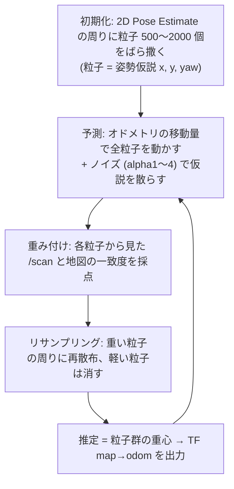

<!-- claude: 3D地図→Nav2 接続読本 第4章 (2026-08-17) -->

# 第4章 /scan 化と AMCL — 仮想 2D LiDAR で自己位置を解く

第 3 章で地図 (入力①) ができた。この章は残り 2 つ — 観測 (③ /scan) と
自己位置 (② TF map→odom) — を扱う。R-Fans の 3D 点群を「仮想 2D LiDAR」に見せかける
pointcloud_to_laserscan の機構と、それを消費する AMCL (粒子フィルタ) の機構、
そして両者と地図をつなぐ整合条件「帯を揃える」の本当の理由を解剖する。

## 4.1 pointcloud_to_laserscan の機構

変換は 3 段のパイプラインである
(実装: `ros2_ws_main/src/bringup/rerobot_bringup/launch/rfans_scan.launch.py`):

```
/rfans_driver/rfans_points (3D 点群, frame=rfans, 10 Hz, 30048 点/回転)
│
├── [1] TF 変換: target_frame (base_link) へ全点を座標変換
│       取付角の吸収はここで起きる。センサが 45° 前傾でも (tilted45 プリセット)、
│       URDF の TF が正しければ点は正しい車体座標に置き直される。
│       だから launch の設定は取付プリセットに依存しない
│
├── [2] 高さ帯フィルタ: base_link 基準で min_height〜max_height の点だけ残す
│       (reRoBot 既定: 0.3〜1.5 m — 地図スライス帯と同値。§4.3 が理由)
│
└── [3] 方位角ビン化: 2π を angle_increment (0.0035 rad ≈ 0.2°) で 1796 ビンに割り、
        ビンごとに最短距離を採用 → LaserScan
        「最短」なのは LaserScan が各方位 1 距離の形式で、
        一番手前の障害物を残すのが安全側だから
```

実測 (08-14 bag 再生, 2026-08-17): 1796 ビン中 1791 が有効距離 (0.50〜25.66 m)、
~10 Hz、frame=base_link。`range_min: 0.5` は車体・マストの映り込み除外、
`angle_increment: 0.0035` は R-Fans-16 の方位分解能 (30048 点/回転 ÷ 16 ビーム
≈ 0.19°/step) に合わせた値である。

⚠️ 本物の 2D LiDAR との違いが 1 つ残る: 仮想スキャンの「1 方位 1 距離」は
**帯内のどの高さの物体か分からない**。足元 0.4 m の台車も頭上 1.4 m の張り出しも
同じ「壁」になる。これは欠点ではなく仕様 — 車体が通れないという判定には十分。

## 4.2 AMCL = 仮説の生存競争

AMCL (Adaptive Monte Carlo Localization) は粒子フィルタによる 2D 自己位置推定器である。
動作は「仮説をばら撒いて、観測に合う仮説だけ生き残らせる」の繰り返し:



reRoBot の設定 (`ros2_ws_main/src/bringup/rerobot_bringup/config/nav2_params.yaml` の
amcl セクション): 粒子 500〜2000、更新は 0.25 m / 0.2 rad 移動ごと、
観測は /scan から 60 本 (max_beams) をサンプリング。

粒子フィルタの強みは**多峰性** — 「候補地点が 2 つある」状態を粒子の 2 クラスタとして
保持でき、走行が進んで観測が割れると自然に片方が死ぬ。EKF ([EKF センサ融合読本](../ekf_fusion/00_index.md))
が単峰のガウス分布しか表せないのと対照的で、大域的な自己位置に粒子が使われる理由である。

## 4.3 likelihood_field — 帯整合が必要な本当の理由

粒子の「採点」の中身が likelihood_field 観測モデルである
(`laser_model_type: likelihood_field`)。地図から前計算した距離場を使う:

```
likelihood_field の採点
1. 地図の占有セルから「最寄りの壁までの距離」場を前計算しておく
2. 粒子 (仮説姿勢) から見た /scan の各ビーム先端を地図座標に置く
3. ビーム先端が壁に近いほど高得点 (ガウス: sigma_hit=0.2 m)
4. 全ビームの積が粒子の重み
```

つまり採点基準は「**/scan の当たり点が、地図の占有セルの近くに落ちるか**」だけである。
ここから 2 つの重要な帰結が出る:

**帰結 1: 地図のスライス帯と /scan の高さ帯は同じでなければならない。**
地図が「床+0.3〜1.5 の構造物」で、/scan が「床+0.0〜2.5 の構造物」なら、
/scan には地図に存在しない壁 (低い縁石、高い張り出し) が映る。その当たり点は
距離場のどこにも近くなく、**正しい位置にいる粒子ほど減点される**。結果、AMCL は
「観測に合う偽の姿勢」へ粒子を寄せ、自己位置がじわじわ滑るか突然飛ぶ。
reRoBot では両方を 0.3〜1.5 に固定し、変えるときは 2 箇所セットと定めた
(第 7 章の連動点検表)。

**帰結 2: AMCL は未知セルをほぼ気にしない。**
採点に使うのは占有セルへの距離だけなので、第 3 章の「未探索領域が自由になる」制約は
AMCL には効かない (効くのは planner)。地図変換の品質評価で「自己位置用としては
壁の正確さが全て」と言えるのはこのため。

## 4.4 nav2_params 無改造の成立条件

今回の実装で `nav2_params.yaml` を 1 行も変えずに済んだのは偶然ではなく、
/scan 側を既存パラメータに合わせ込んだ結果である:

| 整合点 | nav2_params.yaml 側 (既存) | rfans_scan.launch.py 側 (新規) |
|---|---|---|
| トピック名 | amcl `scan_topic: scan` / costmap `topic: /scan` | remap で `/scan` に出す |
| 最大距離 | amcl `laser_max_range: 30.0` | `range_max: 30.0` に一致させた |
| frame | amcl `base_frame_id: base_link` | `target_frame: base_link` |
| QoS | AMCL / costmap は sensor QoS 購読 | p2l は best-effort 配信 → 互換 |

⚠️ ここに罠が 1 つ: pointcloud_to_laserscan の /scan は **best-effort QoS** で出る。
sensor QoS の購読者 (AMCL, costmap) には届くが、既定 (reliable) で購読するツールには
**届かない** — `ros2 topic echo /scan` が無言なら QoS を疑う
(`ros2 topic echo --qos-reliability best_effort /scan`)。urg_node の /scan とは
この点でも挙動が違う。

⚠️ もう 1 つの罠: /scan は urg_node と同名トピックである。**同時起動すると 2 つの
LiDAR の /scan が混ざり、AMCL は高さ帯も原点も違う 2 種の観測を交互に採点して暴れる**。
3D 運用の bringup は必ず `lidar_2d:=false lidar_3d:=true` で起動する。

## 4.5 この章のまとめ

```
第4章 まとめ
├── p2l = TF 変換 → 高さ帯 → 方位ビン最短距離。取付角は URDF が吸収
├── AMCL = 粒子の生存競争。多峰性を扱えるのが EKF との本質差
├── 採点は「/scan の当たり点が地図の占有セルに近いか」だけ
│   → 地図スライス帯 = /scan 帯 が必須 (ずれると正しい粒子が減点される)
├── nav2_params 無改造は range_max=30 / base_link / scan 名を合わせ込んだ結果
└── 罠 2 つ: best-effort QoS (echo に映らない) / urg_node と同名 (同時起動禁止)
```

→ [第5章 3D ローカライザへの道](05_localization_3d.md)
