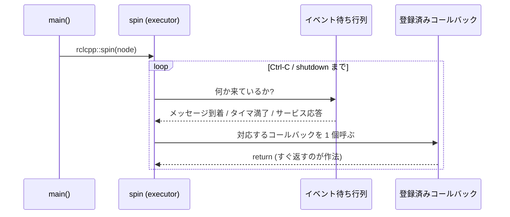

<!-- claude: ROS 2 C++ 構造読本 第5章 (2026-08-12)。spin/executor を Arduino 対比で導入し、
     future デッドロック・std::thread・排他要否 (race condition の語彙化) まで。 -->

# 第5章 spin と並行性 — コールバックは誰が・いつ・どのスレッドで呼ぶのか

前章までで「登録」の記法は全部読めるようになった。この章は登録の反対側 —
登録されたコールバックを実際に呼ぶ機構 (spin / executor) と、そこに自前スレッドが
絡んだときのルールを扱う。**ROS 2 の構造理解の核心はこの章**であり、第6章の
事例A (かつて「動くか動かないかは確率」と呼ばれていた問題) の解剖に直結する。

## 5.1 setup()/loop() ↔ コンストラクタ/spin()

Arduino のスケッチと ROS 2 ノードは、実は同じ 2 部構成をしている:

```
Arduino スケッチ                        ROS 2 ノード
├── setup() ... 起動時に 1 回           ├── コンストラクタ ... 起動時に 1 回 (登録だけ)
└── loop() .... 自分で書く無限ループ    └── rclcpp::spin() ... ライブラリが回す無限ループ
    └── 自分でセンサを読みに行く            └── 来たイベントに応じて登録済みコールバックが呼ばれる
```

決定的な違いは 1 点だけ: `loop()` は**ポーリング** (自分で読みに行く) で、
spin は**イベント駆動** (来たものが配られる)。spin の中身 — executor と呼ばれる —
がやっていることをシーケンスにすると:



ここで 2 つ、あとで効く事実を確定させておく:

- **単一スレッドの executor はコールバックを 1 個ずつしか呼ばない** (並走しない)。
  これが 5.5 の排他判断の前提になる
- **コールバックはすぐ返すのが作法**。1 個が長時間ブロックすると、そのノードの
  他の全コールバック (タイマも含む) が止まる。controller が重い初期化を
  スレッドへ逃がす理由の 1 つがこれである (もう 1 つの理由は 5.3)

## 5.2 publish の裏側 — 関数呼び出しではない

`cmd_publisher_->publish(cmd)` (teleop:129) は、購読者のコールバックをその場で
呼ばない。データは別プロセスへの「配達」に出る:


- `create_subscription<...>(topic, `**`10`**`, ...)` に毎回出てくる 10 は、この
  受信キューの深さ。処理が追いつかなければ古いものから捨てられる
- 送り手と受け手は**互いの生死を知らない**。teleop を kill してもコントローラは
  「最後に受けた指令のまま」平然と動き続ける — だから teleop はデストラクタで
  停止 Twist を送る (第1章 1.4)。プロセスが分かれていても会話できるのは
  DDS が配達しているからで、関数呼び出しはどこにも発生していない
- 「2 つの実行ファイル = 2 つの main() = 2 つの spin」。ノードの世界地図は
  常にこの単位で描く

## 5.3 なぜコンストラクタで future を待てないか

サービスの非同期呼び出しはこう書く:

```cpp
auto future = client->async_send_request(request);   // controller:362
```

`future` は「あとで届く返事の受取口」。ここが肝心 — **返事を受取口に入れる作業を
するのは executor (spin)** である。この分業を知らないと、次の罠が見えない:

```
main() の実行順                          そのとき応答を処理できる者は
─────────────────────────────────────────────────────────────
rclcpp::init()
make_shared<Node>()  ← コンストラクタ実行中
│  async_send_request()  → 送信自体はされる
│  future.wait_for(5s)   → ここで待っても…     誰も spin していない
│  (5 秒後、必ずタイムアウト)                   = future は永遠に ready にならない
▼
rclcpp::spin(node)   ← ここで初めて executor が動き出す
```

コンストラクタは main の `spin` より前に走る (controller:517-524 の並びそのもの)。
したがって **コンストラクタ内で発行した非同期要求の完了は、そのコンストラクタ内では
絶対に確認できない**。これが ROS 2 ノード設計で最も重要な時系列制約であり、
かつて片輪を殺していたレース ([第6章 事例A](06_case_studies.md)) の言語機構側の正体である。

controller には、この制約と解法がコメントとして一次資料のまま残っている
(controller:121-127)。解法は「**spin が始まったあとの世界**で待つ」:

```cpp
init_thread_ = std::thread(&Epos4_Control2_Node::run_init_sequence, this);  // :127
```

コンストラクタはスレッドを起動して即 return → main が spin に到達 → executor が
応答を捌き始める → スレッド内の `call_trigger_sync` (:353-370) では
`future.wait_for(timeout)` が普通に ready になる。役割分担で言えば
**スレッドは待つ係、executor は配達係**。同じ人 (スレッド) が両方をやろうと
した瞬間にデッドロックする、という構図である。

## 5.4 std::thread の 3 点セット

C の pthread_create / pthread_join に対応する標準の道具。覚えるのは 3 点だけで、
controller が全部の実物を持っている:

```
std::thread の作法
├── ① 起動 — コンストラクタに「呼び出せるもの」を渡すと即走り出す
│   ├── メンバ関数ポインタ + this ......... controller:127 (第4章 方式3)
│   └── [this] ラムダ ..................... controller:492 (第4章 方式2)
├── ② 停止依頼 — 外から止める安全な方法は「フラグを立てて自主的に降りてもらう」
│   └── std::atomic<bool> stop_init_
│       ├── 宣言 {false} .................. controller:201
│       ├── 立てる .store(true) ........... controller:139 (デストラクタから)
│       └── 見る .load() .................. controller:426 (ループ継続条件で)
└── ③ 回収 — join() = 終わるまで待って合流
    ├── joinable() で「回収すべき相手がいるか」を確認してから ... controller:140-145, :489-491
    └── join し忘れたまま thread 変数が壊れると std::terminate で即死
        → スレッドを持つクラスはデストラクタを書く義務が生じる (第3章 3.4)
```

`std::atomic<bool>` は「複数スレッドから同時に読み書きしても中途半端な状態が
観測されない」ことを保証した変数。スレッドをまたぐ bool 1 個の合図はこれで足り、
mutex より軽い。

このノードの「実行の流れ」は最大 3 本になる: executor (コールバック一式) +
init_thread_ (起動時 1 回) + reenable_thread_ (脱力復帰のたび)。複数の流れが
あるコードを読むときは、**まず流れを数える**のが次節の入り口である。

## 5.5 排他の要否判定 — race condition の語彙

用語を確定させる。**race condition (競合状態)** とは、複数の実行の流れが同じ
データに触り、**結果が実行タイミングに依存してしまう**状態のこと。症状の言葉で
言えば「動いたり動かなかったりする」「再現したりしなかったりする」。バグが確率的
なのではない — **タイミングという入力が毎回違う**だけで、機構は決定的である。
実物の解剖は [第6章 事例A](06_case_studies.md) で行う。

排他 (mutex 等) が要るかどうかの判定は、この 1 問に帰着する:

```
この変数に排他は要るか?
└── その変数に触る「実行の流れ」は何本か?
    ├── executor (コールバック) だけ = 1 本
    │   └── 排他不要。単一スレッド executor はコールバックを 1 個ずつしか呼ばない (5.1)
    │       ... controller の free_mode_ / m*_value_ / m*_cmd_ (:203-208, :218-220)
    └── コールバック + 自前スレッド = 2 本以上
        ├── 合図のフラグ 1 個 → std::atomic ........ stop_init_ (controller:201)
        └── 複数の値をまとめて整合させたい → std::mutex + lock_guard (第3章 3.5)
            ... teleop の距離 6 変数 (dist_mutex_ :261-267)
```

面白いのは、reRoBot に**排他をめぐる 2 つの流儀が同居している**ことである:

- controller は「読み書きとも executor スレッド上なので plain bool で十分」と
  **理由をコメントに書いて**排他を省いている (:203-204, :218-220)
- teleop は同じ単一 executor 構成なのに mutex を置いている (:261) — こちらは
  「コールバックが並走しない、という保証をコードの遠い場所 (main が単一スレッド
  executor を使っていること) に依存させない」防御である

どちらも成立するが、前者は将来 executor を MultiThreadedExecutor に変えた瞬間に
前提が崩れる。重要なのは流儀の優劣ではなく、**「なぜ排他がある / ない」を
自分の言葉で言えること**。省くなら controller のように理由をコメントで残すのが
見本である。

## 5.6 reRoBot 3 ノード構造マップ

本章の道具で 3 ノードの並行構造を一覧すると、それぞれが教科書の 3 パターンに
そのまま対応していることがわかる:

| ノード | 実行の流れ | 流れをまたぐデータ | 排他手段 |
|---|---|---|---|
| epos4_controller | executor + init_thread_ + reenable_thread_ | stop_init_ (合図のみ) | std::atomic |
| epos4_odometry | executor のみ | なし | 不要 (何も書かないのが正解) |
| epos4_teleop | executor のみ | dist_* 6 変数 (防御的に共有扱い) | std::mutex |

## 5.7 この章のまとめ

```
spin と並行性 まとめ
├── コンストラクタ = setup (登録) / spin = 自分で書かない loop (イベント駆動)
│   └── 単一スレッド executor はコールバックを 1 個ずつ呼ぶ・すぐ返すのが作法
├── publish は関数呼び出しではなく DDS 経由の配達
│   ├── 「10」= 受信キューの深さ。溢れたら古い方から捨てる
│   └── 送り手と受け手は互いの生死を知らない
├── コンストラクタ内では非同期要求の完了を確認できない (spin 前だから)
│   └── 解法 = ワーカースレッドで待つ。スレッドは待つ係 / executor は配達係
├── std::thread は 起動 → atomic フラグで停止依頼 → join で回収 の 3 点セット
├── race condition = 複数の流れ × 同じデータ × タイミング依存
│   └── 「動くかどうかは確率」はこれの症状名。機構は決定的
└── 排他の要否 = 「その変数に触る流れは何本か」の 1 問
    └── 1 本なら不要 / 合図 1 個なら atomic / まとまりなら mutex
```

これで 5 つの機構 — クラス・名前・所有・束縛・実行 — が揃った。次章では、
これらが「壊れたとき実際にどう見えたか」を、本プロジェクトで起きた 4 つの事故で
解剖する。

→ [第6章 事例集](06_case_studies.md)
