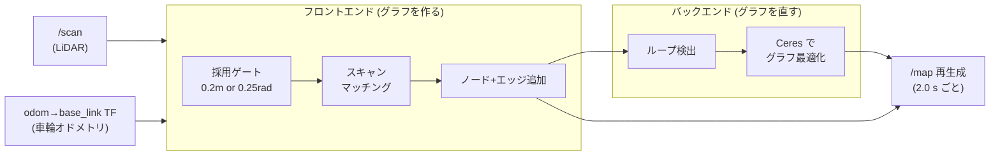

<!-- claude: slam_toolbox 読本 第1章 (2026-08-12) -->

# 第1章 2D SLAM の基礎 — 地図と自己位置の鶏と卵をどう解くか

slam_toolbox のパラメータの大半は「グラフベース SLAM」という解法の各部品を制御している。
この章では部品の名前が指しているもの — ポーズグラフ・占有格子・スキャンマッチング・
オドメトリ prior — を先に固める。以後の章はすべてこの語彙の上に積む。

## 1.1 SLAM が解いている問題

自己位置推定 (localization) は「地図があれば」解ける。地図作成 (mapping) は「自己位置が
わかれば」解ける。SLAM (Simultaneous Localization and Mapping) は両方とも無い状態から
両方を同時に推定する問題で、片方の誤差がもう片方に流れ込む構造を持つ:

```
SLAM の誤差の循環
├── 自己位置がずれる
│   └── ずれた位置にスキャンを貼る → 地図が歪む
└── 地図が歪む
    └── 歪んだ地図に対して照合する → 自己位置がさらにずれる
```

この循環を断ち切る道具が 2 つある。

1. **スキャンマッチング** — 直前までの地図 (または直近スキャン群) に今のスキャンを照合し、
   オドメトリの誤差をその場で補正する。ただし「直前まで」との相対補正なので、
   誤差は減っても**蓄積は止まらない** (ドリフト)
2. **ループ閉じ込み (loop closure)** — 一度通った場所に戻ってきたことを検出し、
   「ここは昔のあそこと同じ場所だ」という拘束で蓄積誤差を一括精算する

slam_toolbox はこの 2 つを両方持つ。第 3 章で仕組みを、第 4 章でそれぞれの制御パラメータを扱う。

## 1.2 二層構造 — ポーズグラフが本体、占有格子は副産物

初見で誤解しやすいのは「slam_toolbox は占有格子地図を作るツール」という理解である。
内部の本体は**ポーズグラフ**で、RViz で見る `/map` (占有格子) はそこから随時レンダリング
される**副産物**にすぎない:

```
slam_toolbox の内部データ (二層)
├── ポーズグラフ (本体) ......... 最適化の対象。serialize_map で保存されるのはこちら
│   ├── ノード = スキャンを撮った瞬間のロボット姿勢 (x, y, θ) + そのスキャン本体
│   │   └── 追加は距離/旋回ゲート制 (0.2 m または 0.25 rad 進むごと ※reRoBot 現行値)
│   └── エッジ = ノード間の相対姿勢の拘束
│       ├── 逐次エッジ ..... オドメトリ + スキャンマッチングで作る (隣接ノード間)
│       └── ループエッジ ... ループ閉じ込みで作る (遠く離れたノード間)
└── 占有格子 /map (副産物) ....... ナビゲーション・可視化用のレンダリング結果
    ├── 全ノードの姿勢に沿ってスキャンを再描画 (レイキャスト) して生成
    └── 再生成は時間ベース (map_update_interval 秒ごと。距離ではない)
```

この二層を分かっていると、以下の挙動が全部説明できる:

- **ループを閉じた瞬間に地図全体がグニャッと動く** — ポーズグラフの全ノード姿勢が
  最適化で動き、次の再レンダリングで占有格子が描き直されるから
- **map の更新が距離でなく時間周期** — ノード追加 (距離ベース) と占有格子の再生成
  (時間ベース `map_update_interval`) は別物だから
  (reRoBot でも混同があった: `docs/issue/2026-07-07_monthly_2026_6_todo_triage.md` T3)
- **保存形式が 2 つある** — `.pgm/.yaml` (占有格子のスナップショット、続きから作図は不可) と
  `.posegraph` (ポーズグラフ本体、続きから作図・localization モードで再利用可)。第 7 章参照

## 1.3 フロントエンドとバックエンド

グラフ SLAM の実装は慣例的に 2 つの部品に分かれる。slam_toolbox も同じ:



- **フロントエンド**: スキャンを取捨選択し、マッチングして、グラフにノードとエッジを足す。
  リアルタイム性が要る。誤差は残るが速い
- **バックエンド**: グラフ全体を見てループを検出し、非線形最小二乗 (Ceres) で全ノード姿勢を
  最適化する。重いが精度を回復する

パラメータもこの分業に沿って分類できる (第 4 章の表はこの分類で並べてある)。
「地図がずれる」と感じたとき、フロントエンドの問題 (マッチング失敗・入力品質) なのか
バックエンドの問題 (ループが閉じない) なのかを最初に切り分けるのが定石である
(第 6 章 事例B)。

## 1.4 odom prior — 車輪オドメトリが効く理由

slam_toolbox はオドメトリ (odom→base_link TF) を**探索の初期値 (prior)** として使う。
スキャンマッチングは「オドメトリが言う位置」の周辺だけを探索し、そこから大きく外れる解には
ペナルティを課す (`distance_variance_penalty` / `angle_variance_penalty`、第 3・4 章)。

なぜ prior がそこまで重要か。スキャンマッチングには**縮退 (degeneracy)** という構造的な
弱点があるからだ:

```
環境ごとのスキャンマッチングの拘束
├── 特徴の多い部屋 (角・家具) ..... 並進 x, y と回転 θ の 3 自由度すべて拘束できる ✅
├── 一様な廊下 .................... 壁に垂直な方向と θ は拘束できるが、
│   └── 廊下に沿った前進方向はスキャンがほぼ変化しない → 拘束できない ⚠️
└── 何もない広場 .................. ほぼ全自由度が拘束できない ❌
```

廊下でスキャンだけを信じると「前進しているのにスキャンが変わらないから止まっていると判断する」
誤マッチングが起きる。ここで車輪オドメトリが「実際に 1.2 m 進んだ」という独立情報で
前進方向をアンカーする — これが prior の仕事である。

この機構は reRoBot で実証済みである。3D SLAM (GLIM) が同じ廊下環境で水平方向に流れたとき、
同じデータの水平リングを slam_toolbox に入れると綺麗な地図が出た。差は「車輪オドメトリ prior の
有無」だった (`docs/issue/2026-08-12_glim_horizontal_drift.md`、第 6 章 事例C で解剖する)。

逆に言うと、**prior の品質が SLAM の品質の下限を決める**。reRoBot の「絶妙にずれる」問題の
容疑者リストの筆頭が SLAM パラメータではなくオドメトリ (tread_width の精度) なのはこのためだ
(第 6 章 事例B)。

## 1.5 占有格子の作り方 — レイキャストと 3 値

副産物とはいえ Nav2 が消費するのは占有格子なので、生成規則も押さえておく。
各セルは「スキャンの光線 (ray) が何回通過し、何回そこで反射したか」の統計で決まる:

```
セルの 3 値分類
├── free (白) ........ 光線が min_pass_through 回以上「通過」した
├── occupied (黒) .... 通過に対する反射の比が occupancy_threshold を超えた
└── unknown (灰) ..... 観測が足りない
```

- 解像度は `resolution` (reRoBot: 0.05 m/セル)。細かくするほど綺麗だが、
  再生成コストとメモリは面積に反比例して増える
- `min_laser_range` / `max_laser_range` はこのレンダリングに使う距離帯 (reRoBot は
  UTM-30LX に合わせ max 30 m)。**マッチングに使う距離とは別のパラメータ**である点に注意
- 遠い誤反射 (ガラス・雨) が黒点として残るのはこの統計が汚染されるため

## 1.6 この章のまとめ

```
第1章 まとめ
├── SLAM = 自己位置と地図の誤差循環を、マッチング (逐次補正) + ループ閉じ (一括精算) で断つ
├── 本体はポーズグラフ、/map は時間周期で再レンダリングされる副産物
│   └── ノード追加は距離/旋回ゲート、/map 再生成は map_update_interval — 別物
├── フロントエンド (グラフを作る) / バックエンド (グラフを直す) の分業で考える
├── 車輪オドメトリは探索の prior — 廊下の縮退で前進方向をアンカーする唯一の情報源
│   └── prior の品質 (オドメトリ精度) が SLAM 品質の下限を決める
└── 占有格子はレイキャスト統計 (pass_through / occupancy_threshold) で 3 値化される
```

→ [第2章 slam_toolbox の構造](02_architecture.md)
