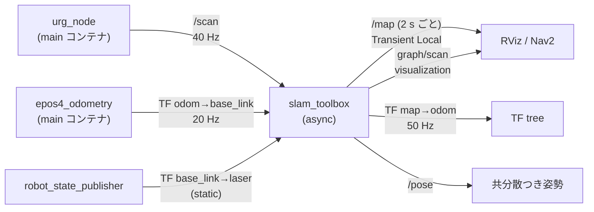
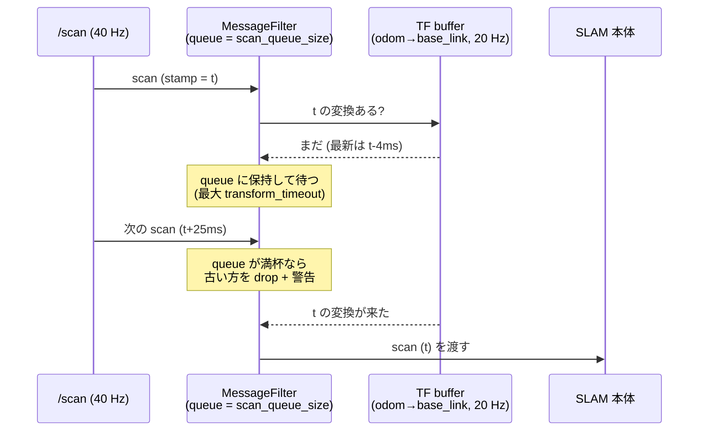

<!-- claude: slam_toolbox 読本 第2章 (2026-08-12) -->

# 第2章 slam_toolbox の構造 — 何が入っていて、どこに繋がるか

第 1 章の抽象的な部品 (ポーズグラフ・マッチング・最適化) が、slam_toolbox という
具体的なパッケージのどこに実装され、ROS 2 の世界とどう繋がっているかを見る。

## 2.1 系譜 — Karto の心臓を今も使っている

```
slam_toolbox の系譜
├── Open Karto (2010 頃, SRI International) ... 相関スキャンマッチャ + ポーズグラフ SLAM
│   └── ROS 1 の slam_karto として長く使われた
└── slam_toolbox (Steve Macenski, ~2018-) ..... Karto の SLAM 核を fork して近代化
    ├── ソルバを Ceres に置換 (プラグイン化: solver_plugin)
    ├── ポーズグラフの保存/再開 (serialize/deserialize)
    ├── localization モード・lifelong モードを追加
    └── ROS 2 対応・lifecycle node 化
```

この系譜は実利的な意味を持つ。第 4 章のパラメータのうち
`minimum_travel_distance` や `correlation_search_space_*` などマッチング系の名前は
**Karto 時代の Mapper のパラメータそのまま**であり、上流ドキュメントが素っ気ない項目は
Karto の文献・コードまで遡ると意味が分かることが多い。

## 2.2 5 つの実行ファイル

apt 版 slam_toolbox 2.8.5 (reRoBot の slamtoolbox コンテナに導入済み、
`docker/Dockerfile_slamtoolbox:9`) には実行ファイルが 6 つ入っている:

| 実行ファイル | 役割 | reRoBot |
|---|---|---|
| `async_slam_toolbox_node` | オンライン SLAM。処理が追いつかなければ**スキャンを捨てて最新に追従** | ✅ 使用中 |
| `sync_slam_toolbox_node` | オンライン SLAM。スキャンを**キューに溜めて全部処理** (遅延しても地図品質優先) | — |
| `localization_slam_toolbox_node` | 保存済みポーズグラフ上での自己位置推定 (AMCL 代替)。地図は伸ばさない | — (AMCL 使用) |
| `lifelong_slam_toolbox_node` | 実験的: 地図を運用しながら継続更新 (ノード刈り込みつき) | — |
| `map_and_localization_slam_toolbox_node` | mapping/localization をサービスで切替 | — |
| `merge_maps_kinematic` | 複数地図の合成ツール | — |

async / sync の違いは「処理落ちしたときどちらを犠牲にするか」である:

```
処理が追いつかないとき
├── async: 古いスキャンを捨てる → 地図の抜けが出るが、常に現在位置に追従 (走行併用向き)
└── sync:  全部処理する → 地図は密だが、リアルタイムから遅れていく (bag 再生・オフライン向き)
```

reRoBot は teleop で走りながら地図を作るので async が正しい選択。
なお第 6 章 事例A の「queue full でスキャンが捨てられる」は async の設計的な間引きとは
**別物** (TF 待ちによる入口での取りこぼし) である点を先に断っておく。

## 2.3 ノード I/O — 何を消費し、何を出すか



**入力は 2 系統だけ**であることが重要:

1. `/scan` (`sensor_msgs/LaserScan`) — マッチングの材料
2. **TF** `odom→base_link` と `base_link→<laserのframe_id>` — prior と、スキャンを
   ロボット座標に直すための取付位置。`/odom` トピックは購読しない (TF が正)

**出力の代表は TF `map→odom`** である。slam_toolbox は base_link の絶対姿勢を直接出す
代わりに「オドメトリ座標系が世界からどれだけずれたか」を出す。これは REP-105 の分業で、
odom→base_link (連続・ドリフトあり) は オドメトリが、map→odom (不連続・補正) は SLAM が
出すことで、両者を足すと map→base_link (補正済み絶対姿勢) になる:

```
TF ツリー (SLAM 稼働時)
map ──[slam_toolbox が 50 Hz]── odom ──[epos4_odometry が 20 Hz]── base_link ── laser
      補正量 (ループ閉じで跳ぶ)        連続・滑らか (ドリフトする)      (URDF 固定)
```

サービス (2.8.5 バイナリから確認できる主なもの):

| サービス | 用途 |
|---|---|
| `/slam_toolbox/save_map` | 占有格子を .pgm/.yaml で保存 |
| `/slam_toolbox/serialize_map` | ポーズグラフを .posegraph で保存 |
| `/slam_toolbox/deserialize_map` | ポーズグラフの読込 (続きから作図・localization) |
| `/slam_toolbox/pause_new_measurements` | ノード追加の一時停止 |
| `/slam_toolbox/manual_loop_closure` | 手動ループ閉じ (interactive mode) |
| `/slam_toolbox/clear_changes` / `reset` | 手動編集の破棄 / 全リセット |

## 2.4 MessageFilter — scan と TF の待ち合わせ

slam_toolbox は `/scan` を受け取ってすぐ処理**できない**。スキャンの stamp 時刻における
odom→base_link TF が buffer に届いているとは限らないからだ。この待ち合わせを行うのが
`tf2_ros::MessageFilter` で、**scan の入口に立つ門番**として動く:



キュー長はパラメータ `scan_queue_size` (既定 **1**)。scan レートが TF レートより速い構成
(reRoBot: 40 Hz vs 20 Hz) では、既定 1 だと待っている間に次の scan が来て**ほぼ全滅**する。
これが第 6 章 事例A の機構である (時刻視点の詳細は
[タイムスタンプ読本 第6章 事例D](../timestamp/06_case_studies.md) が正)。

## 2.5 lifecycle node — 起動しただけでは動かない

slam_toolbox (Jazzy 版) は **managed lifecycle node** である。通常のノードと違い、
プロセス起動 = 稼働開始ではなく、明示的な状態遷移を経て初めて仕事を始める:

```
lifecycle の主要状態と遷移
unconfigured ──configure()──> inactive ──activate()──> active
     ▲                            │  ▲                    │
     └────────cleanup()───────────┘  └────deactivate()────┘

├── unconfigured ... プロセスは居るが何もしていない (起動直後)
├── inactive ....... configure 完了。パラメータ読込・購読準備済みだが処理はしない
└── active ......... 購読・publish・TF 配信がすべて動く「稼働中」
```

なぜこんな仕組みがあるか: 複数ノードの起動順序を制御するためである。
「全ノードを configure して準備が整ったのを確認してから、一斉に activate する」という
二段階起動ができる (Nav2 の lifecycle_manager がまさにこれをやる)。

実務上の帰結:

- `ros2 launch` でプロセスが立っても、**activate されるまで /map は永遠に出ない**。
  「エラーも出ないのに何も起きない」ときは真っ先に
  `ros2 lifecycle get /slam_toolbox` で状態を見る (第 7 章 逆引き表)
- 誰が遷移を発火するかは 3 流儀ある:

```
遷移の発火方法
├── ① autostart パラメータ ......... ノード自身が configure→activate (Jazzy 配布版では不発 ⚠️)
│   └── reRoBot で true にしたが効かず — docs/issue/...todo_triage.md T7 (未解決)
├── ② launch から EmitEvent ........ launch が遷移イベントを送る (公式 launch と reRoBot の現行)
│   └── 第 5 章で slam.launch.py を逐行解剖
└── ③ nav2_lifecycle_manager ....... 専用ノードが管理 (Nav2 流)
    └── ⚠️ slam_toolbox は bond 非対応 → bond_timeout: 0.0 必須 (忘れると activate 後に kill される)
```

## 2.6 QoS — /map が「後から来た人」にも見える理由

slam_toolbox の出力 `/map` は **Transient Local** durability で publish される。
これは「最後の 1 枚を publisher が保持し、後から購読を始めた相手にも即配る」設定で、
2 秒に 1 回しか出ない地図を RViz がいつ起動しても受け取れるのはこのためである。
購読側も Transient Local で合わせる必要がある (Volatile で購読すると次の publish まで
何も来ない)。reRoBot の `slam.rviz` は Map ディスプレイだけ Transient Local、
`/scan` は Best Effort (取りこぼし許容・最新優先) と、トピックの性質ごとに QoS を
使い分けている (`ros2_ws_slamtoolbox/src/rerobot_slamtoolbox/rviz/slam.rviz:118-162`)。

```
QoS の使い分け (slam.rviz の実例)
├── /map ... Reliable + Transient Local + depth 1 ... 「最新 1 枚が確実に届けばよい」
└── /scan .. Best Effort + Volatile + depth 5 ....... 「40 Hz 流し。落ちても次が来る」
```

## 2.7 この章のまとめ

```
第2章 まとめ
├── マッチング核は Karto 由来 — パラメータ名も Karto 時代のまま
├── reRoBot は async 版 = 処理落ち時はスキャンを捨てて現在に追従する設計
├── 入力は /scan + TF の 2 系統だけ。/odom トピックは読まない
├── 出力の本体は TF map→odom (REP-105 の分業。odom→base_link には触らない)
├── scan の入口には MessageFilter — queue 長 (scan_queue_size) が既定 1 という地雷
├── lifecycle node — activate されるまで何もしない。発火は 3 流儀 (reRoBot は EmitEvent)
└── /map は Transient Local — 後着の購読者にも最新 1 枚が届く
```

→ [第3章 スキャンマッチングの仕組み](03_scan_matching.md)
