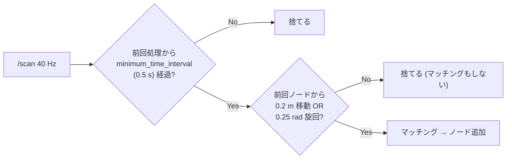
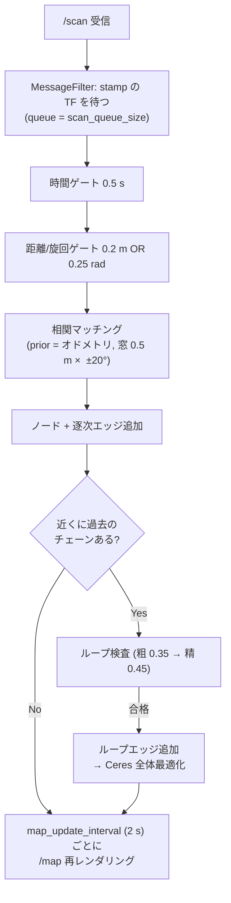

<!-- claude: slam_toolbox 読本 第3章 (2026-08-12) -->

# 第3章 スキャンマッチングの仕組み — パラメータが操作している機構

第 4 章のパラメータ表の 7 割はこの章の機構の制御である。相関スキャンマッチャ・
採用ゲート・ループ閉じ込み・Ceres の 4 部品を順に開ける。

## 3.1 相関スキャンマッチャ — 賢くないが壊れない総当たり

スキャンマッチングには大きく 2 流派ある:

```
スキャンマッチングの流派
├── 反復最近傍系 (ICP / NDT / GICP...) ..... 点対応を作り勾配で降りる。高精度だが
│   └── 初期値が悪いと局所解に落ちる        (3D SLAM = GLIM 読本の世界はこちら)
└── 相関系 (correlative) ................... 候補姿勢を格子状に全部試して一番良いのを取る
    └── 遅いが、探索窓の中に真値があれば必ず見つける ← slam_toolbox (Karto) はこちら
```

Karto の相関マッチャがやることは素朴である:

1. 直近のスキャン群 (`scan_buffer_size` 枚) から**参照地図** (小さな占有格子) を作る。
   このとき各占有セルの周囲に `correlation_search_space_smear_deviation` 幅のガウスぼかしを
   かける — 応答関数を滑らかにして、格子の離散化で真値を取り逃さないため
2. オドメトリ prior を中心に、探索窓
   (`correlation_search_space_dimension` = 0.5 m 四方、`_resolution` = 0.01 m 刻み) と
   角度 (粗探索 ±`coarse_search_angle_offset` = ±20° を `coarse_angle_resolution` = 2° 刻み)
   の**全組み合わせ**について、スキャンを置いてみて参照地図との一致度 (response, 0〜1) を計算
3. 最良候補の周りを細かい角度刻み (`fine_search_angle_offset` = 0.2°) で再探索
4. 最良 response の姿勢を採用し、response と探索分布から共分散も出す

```
探索の規模感 (上流デフォルト値で)
├── 並進: (0.5 / 0.01)² = 2,500 通り
├── 粗角度: 40° / 2° = 20 通り  → 粗探索 50,000 姿勢
└── これを毎ノード追加 (reRoBot: 0.2 m ごと) に回す
    └── 探索窓 dimension を安易に広げると計算量が面積で効く ⚠️
```

### prior からの逸脱ペナルティ

一致度がタイなら「オドメトリに近い解」を勝たせたい。そこで response には
prior からのずれに応じた減点が掛かる:

- `distance_variance_penalty` (0.5) / `angle_variance_penalty` (1.0) — ずれの分散想定。
  **小さいほどオドメトリを強く信じる** (ずれに厳しい減点)
- `minimum_distance_penalty` (0.5) / `minimum_angle_penalty` (0.9) — 減点の下限。
  探索窓の端でも response が 0 にはならないようにする
- `use_response_expansion` (true) — 全候補が低 response のとき角度探索窓を自動拡大する救済

第 1 章 1.4 の「廊下の縮退」はここで効く: 廊下ではどの前進位置でも response がほぼ同じに
なり、ペナルティ項だけが差を作る。つまり**縮退環境では解はほぼ prior で決まる**。
prior (車輪オドメトリ) が正確なら正しく、狂っていればそのまま地図に写る。

## 3.2 採用ゲート — 全部のスキャンを使わない

40 Hz の全スキャンをノードにすると、グラフが秒間 40 ノードで肥大しループ検出も最適化も
死ぬ。そこで入口に 2 段のゲートがある:



- 時間ゲート `minimum_time_interval` (0.5 s) と距離/旋回ゲート
  `minimum_travel_distance` (0.2 m) **OR** `minimum_travel_heading` (0.25 rad ≈ 14°) の直列
- reRoBot の値では: 0.4 m/s 以上で走ると 0.2 m より 0.5 s の時間ゲートが先に律速する
  (`slam_toolbox.yaml:54-56` のコメントに記録)。ゲート 2 つの直列は「どちらか一方だけ
  緩めても効かない」ことを意味する
- 判定に使う移動量はオドメトリ由来。`use_scan_barycenter` (true) はノード位置の代表点を
  ロボット原点でなくスキャン点群の重心にする Karto 由来のオプション

ゲートを緩める (値を小さくする) とノードが密になり地図は細かく更新されるが、
グラフ肥大 + 計算増と引き換えになる。reRoBot は 2026-08-01 に 0.5→0.2 m / 0.5→0.25 rad へ
緩めた (git 82edfef) — 低速走行で地図の更新が体感遅かったため。

## 3.3 ループ閉じ込み — 誤検出は 1 回で地図が壊れる

ループ閉じ込みは「効果最大・リスク最大」の機構である。正しく閉じれば蓄積誤差が一括精算
されるが、**偽ループを 1 本入れると最適化がグラフ全体を偽拘束に合わせて捻じ曲げる**。
だから slam_toolbox の検査は多段で、パラメータも「疑い深さ」の調整である:

```
ループ閉じ込みの検査パイプライン
├── ① 候補集め: 現在位置から loop_search_maximum_distance (3.0 m) 以内の過去ノード
│   └── ⚠️ この距離は「オドメトリ推定上の」近さ。ドリフトが 3 m を超えた周回は
│       そもそも候補に挙がらない → 大きい建物では要拡大 (第 4 章)
├── ② チェーン検査: 候補が loop_match_minimum_chain_size (10) 個以上連なった
│   「ひとかたまりの過去の道」であること — 孤立ノードとの偶然一致を弾く
├── ③ 粗マッチング: ループ用の広い探索窓 (loop_search_space_dimension = 8.0 m) で照合
│   ├── response ≥ loop_match_minimum_response_coarse (0.35)
│   └── かつ 解の分散 ≤ loop_match_maximum_variance_coarse (3.0) — 「自信のある解」だけ通す
├── ④ 精マッチング: 通常の細かい窓で再照合
│   └── response ≥ loop_match_minimum_response_fine (0.45)
└── ⑤ 合格 → ループエッジをグラフに追加 → Ceres で全体最適化
```

チューニングの方向はトレードオフが明確で:

```
閾値を下げる (緩くする) → ループがよく閉じる が 偽ループのリスク増
閾値を上げる (厳しくする) → 安全       が ループが閉じず ドリフトが残る
```

reRoBot はこのセクションを**全て上流デフォルトのまま**にしている。これは怠慢ではなく
方針で、「オドメトリと FOV の問題を直す前にループ閉じ込みを触ると原因を隠す」という
切り分け順序による (`docs/issue/2026-07-07_monthly_2026_6_todo_triage.md` T11、第 6 章 事例B)。

## 3.4 Ceres — バックエンドの最小二乗

エッジ (拘束) が増えるたび、バックエンドは「全エッジの食い違いが最小になるノード姿勢の組」
を解き直す。数式にすると、各エッジ ij が主張する相対姿勢 z_ij と、現在のノード姿勢から
計算される相対姿勢の残差の二乗和を最小化する非線形最小二乗である。slam_toolbox はこれを
Google の **Ceres Solver** に投げる (`solver_plugin: CeresSolver`)。

Ceres 系パラメータは「どの解法で解くか」の選択で、地図の見た目より**計算速度と安定性**に
効く:

| パラメータ | reRoBot / 上流 | 意味 |
|---|---|---|
| `ceres_linear_solver` | `SPARSE_NORMAL_CHOLESKY` | 内側の線形化方程式の解法。ポーズグラフは疎なのでスパース Cholesky が定石 |
| `ceres_preconditioner` | `SCHUR_JACOBI` | 反復解法用の前処理。上の直接法では実質未使用 |
| `ceres_trust_strategy` | `LEVENBERG_MARQUARDT` | 信頼領域の更新戦略 (LM が無難。代替 DOGLEG) |
| `ceres_dogleg_type` | `TRADITIONAL_DOGLEG` | DOGLEG 選択時のみ有効 |
| `ceres_loss_function` | `None` | 外れ値抑制のロバスト損失。`HuberLoss` にすると偽ループ 1 本の被害が減るが、正しいループの効きも鈍る |

実務では**触る必要がほぼ無い**グループである (第 4 章では「触らない棚」に分類)。
唯一検討価値があるのは偽ループに悩まされたときの `HuberLoss` だが、reRoBot ではその症状は
未観測。

## 3.5 全体を貫く 1 本の流れ

第 2〜3 章の部品を 1 スキャンの旅として並べると:



「地図がおかしい」ときは、この流れの**どこで死んでいるか**を上から順に当てる — それが
第 7 章の逆引き表の構造である。

## 3.6 この章のまとめ

```
第3章 まとめ
├── マッチングは相関系 = prior 中心の窓内総当たり。窓内に真値があれば外さない
│   └── 縮退環境では response が差を作れず、解は実質 prior (オドメトリ) で決まる
├── 採用ゲートは 時間 → 距離/旋回 の直列 2 段。速く走ると時間ゲートが律速
├── ループ閉じ込みは 距離 → チェーン → 粗 → 精 の多段検査。閾値 = 疑い深さ
│   └── 偽ループ 1 本で全体が壊れるため、既定は保守的
├── Ceres はエッジの食い違いの最小二乗。solver 系パラメータは通常触らない
└── 症状の切り分けは「1 スキャンの旅」のどこで死んだかを上から当てる
```

→ [第4章 パラメータ大全](04_parameters.md)
