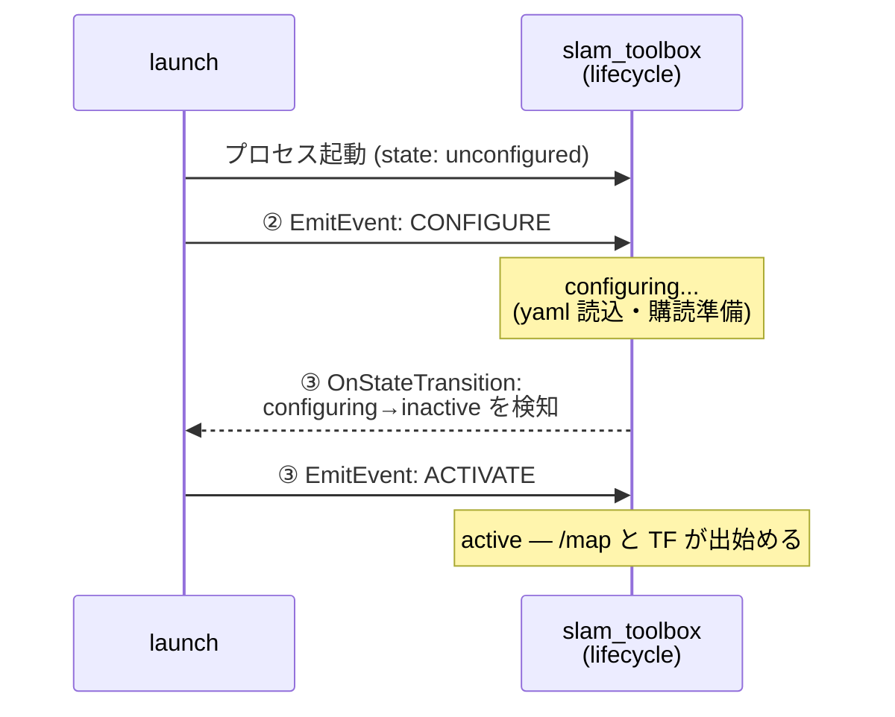

<!-- claude: slam_toolbox 読本 第5章 (2026-08-12) -->

# 第5章 reRoBot での適用 — あるべき姿と現在地

一般論 (第 1〜4 章) を reRoBot の実構成に着地させる。この章だけはプロジェクト特化で、
引用する行番号は 2026-08-12 時点。

## 5.1 どこで動いているか — コンテナ分割と DDS 疎通

slam_toolbox は main コンテナではなく専用の `slamtoolbox_env` コンテナで動く
(`docker-compose.yml:36-57`)。分割基準は機能ではなく**依存の壁** — apt で衝突しないものは
main に同居 (Nav2 は main 統合)、という方針の下で slam_toolbox は分離側に置かれた
(2026-07-26 再編)。導入は apt バイナリ `ros-jazzy-slam-toolbox` **2.8.5**
(`docker/Dockerfile_slamtoolbox:9`) で、ソースビルドはしない。

```
プロセス配置 (SLAM 実行時)
├── main コンテナ (rerobot_env)
│   ├── urg_node ................. /scan 40 Hz (frame_id: laser)
│   ├── epos4_odometry ........... TF odom→base_link 20 Hz + /odom
│   ├── robot_state_publisher .... TF base_link→laser (/tf_static)
│   └── (CANopen デバイス層)
└── slamtoolbox コンテナ (slamtoolbox_env)
    ├── async_slam_toolbox_node .. /map + TF map→odom
    └── rviz2 .................... slam.rviz
```

コンテナ間は DDS で疎通する。条件は 3 点セット `network_mode: host` + `ipc: host` +
`ROS_DOMAIN_ID=150` (`docker-compose.yml:39-40,49`)。特に `ipc: host` は FastDDS の
共有メモリ転送に必須で、**欠けると「topic list には見えるのに echo できない」**という
典型症状になる (`docker-compose.yml:1-9` の設計メモ)。

パッケージ `rerobot_slamtoolbox` はコード無しの資産パッケージ (launch/config/rviz のみ、
`ros2_ws_slamtoolbox/src/rerobot_slamtoolbox/`)。`--symlink-install` でビルドされるため
**yaml の編集は再ビルド不要**で、slam_toolbox の再起動だけで反映される。

## 5.2 slam.launch.py の解剖 — lifecycle 発火チェーン

`ros2_ws_slamtoolbox/src/rerobot_slamtoolbox/launch/slam.launch.py` (80 行) は
第 2 章 2.5 の「流儀②: launch から EmitEvent」の実装である。要素は 4 つ:

```
slam.launch.py の構成 (LaunchDescription の 4 要素)
├── ① slam_toolbox_node (:29-36) ..... LifecycleNode として宣言 (通常の Node ではない)
│   └── package=slam_toolbox, executable=async_slam_toolbox_node,
│       parameters=[config/slam_toolbox.yaml]
├── ② configure_event (:40-45) ....... 起動直後に無条件で CONFIGURE 遷移イベントを発射
│   └── EmitEvent(ChangeState(matches_action(①), TRANSITION_CONFIGURE))
├── ③ activate_event (:49-63) ........ 「configuring → inactive 完了」を見届けてから
│   └── RegisterEventHandler(OnStateTransition(...))   ACTIVATE を発射
└── ④ rviz_node (:67-73) ............. rviz2 -d slam.rviz (公式 launch に無い独自追加)
```

②③をシーケンスで描くと:



肝は③が**イベントハンドラ**であること。CONFIGURE と ACTIVATE を 2 連発で送ると
configure が終わる前に activate が届いて失敗し得るため、「configure 完了の通知を見てから
activate を送る」という因果を launch 記述で表現している。これは slam_toolbox 公式
`online_async_launch.py` と同じパターンの移植で、公式との差分は:

| 項目 | 公式 | reRoBot 版 |
|---|---|---|
| `autostart` 引数 | あり (遷移を条件付き発火) | なし (無条件発火) |
| `use_sim_time` | launch 引数で注入 (既定 true) | **注入しない** — bag 再生時は `use_sim_time` を手動指定する必要 (第 7 章) |
| params ファイル | 引数で差し替え可 | 固定パス |
| RViz | なし | あり (slam.rviz) |

そもそもこのチェーンが必要なのは、yaml の `autostart: true` (`slam_toolbox.yaml:25`) が
Jazzy 配布版で機能しなかったため (原因未特定 — 事例D)。yaml の値は「将来直ったときの保険」
として残置されている。

## 5.3 起動フロー — 素のコマンドで

`scripts/slam2d.sh` が自動化している内容を、素のコマンドに展開すると:

```bash
# 1. main 側: bringup (CANopen → 5 s → controller/odometry + urg_node + robot_state_publisher)
docker exec -d rerobot_env bash -c \
  'source /opt/ros/jazzy/setup.bash && source /workspace/install/setup.bash && \
   ros2 launch rerobot_bringup rerobot_bringup_2d.launch.py'

# 2. slamtoolbox コンテナを確保 (profile 指定が必要)
docker compose --profile slamtoolbox up -d slamtoolbox

# 3. slam_toolbox + RViz (フォアグラウンド。Ctrl-C で終了)
docker exec -it slamtoolbox_env bash -c \
  'source /opt/ros/jazzy/setup.bash && source /workspace/install/setup.bash && \
   ros2 launch rerobot_slamtoolbox slam.launch.py'
```

順序に意味がある: slam_toolbox は起動時に TF (odom→base_link, base_link→laser) を
待ち合わせるので、**bringup が先**。逆順でも MessageFilter が transform_timeout の範囲で
吸収するが、起動直後の drop 警告が増える。

## 5.4 ⚠️ SLAM と Nav2 で odom→base_link の出し手が違う

2026-08-11 の EKF 導入以降、reRoBot には odom→base_link TF の出し手が 2 通りある:

```
odom→base_link の出し手 (排他)
├── SLAM 時 (slam2d.sh) ........ epos4_odometry (車輪オドメトリ直)
│   └── bringup2d.sh を IMU/EKF なしで呼ぶため
└── Nav2 時 (nav2d.sh) ......... robot_localization の EKF (/odometry/filtered)
    └── IMU=true EKF=true 前置で bringup するため
```

つまり**地図を作るときの odom 品質と、その地図で走るときの odom 品質が違う**。
現状の帰結は「SLAM 中は IMU の恩恵 (yaw 精度) を受けていない」であり、事例B の
「絶妙にずれる」の切り分けでは この非対称も頭に入れておく必要がある。
SLAM 側でも EKF を使いたければ `IMU=true EKF=true ./scripts/bringup2d.sh` 相当で
bringup してから slam.launch.py を上げれば TF の出し手が EKF に替わる
(EKF 側の詳細は [EKF 読本](../ekf_fusion/00_index.md))。

## 5.5 /scan の供給側 — FOV ±90° 制限が掛かったまま

urg_node は `rerobot_bringup.launch.py:133-149` で起動され、
`angle_min: -1.5708 / angle_max: 1.5708` (±90°) が指定されている。UTM-30LX の実力は
270° なので**半分近くを捨てている**。理由のコメントは無く、意図不明のまま残っている
(`docs/issue/2026-07-07_repository_audit.md` Issue 11)。

これは SLAM 品質に直結する: 第 3 章 3.1 の相関マッチングは視野が広いほど拘束が増える。
特に廊下・交差点で「横と後ろの壁」が見えないのは縮退耐性を直接削る。
事例B の容疑者リスト 2 番手であり、**ループ閉じ込みのチューニングより先に直すべき項目**。

## 5.6 地図の保存先と消費側

```
地図のライフサイクル
├── 生成: slam_toolbox → /map (占有格子) + 内部ポーズグラフ
├── 保存: maps/ ディレクトリ (ホスト) = /workspace/maps (コンテナ mount, docker-compose.yml:52)
│   ├── .pgm/.yaml ....... nav2 が消費するスナップショット (map_saver_cli — 手順は第 7 章)
│   │   └── 実例: maps/slam_toolbox/2026_8_11__18-20.{pgm,yaml}
│   └── .posegraph ....... 続きから作図 / localization モード用 (serialize_map — 未運用)
└── 消費: nav2.launch.py (main コンテナ) の map_server
    ├── map_dir 規約: <map_dir>/nav2/my_map.yaml + <map_dir>/keep_out/keep_out.yaml
    ├── または map_yaml:= で .yaml 直接指定 (nav2d.sh が使う形)
    └── ⚠️ map_dir 既定値が日付固定 (Issue 19) — 指定忘れは古い地図で走る
```

mount を忘れるとコンテナ内に保存されて「ホストから見えない & コンテナ再作成で消える」
— これは実際に踏んでから mount が追加された経緯がある (`docs/monthly/2026_6`)。

## 5.7 RViz — slam.rviz の設計

`rviz/slam.rviz` は SLAM 専用ビュー (Fixed Frame: `map`)。Nav2 用の nav2.rviz と分割
されているのは、共通 rviz 1 枚で両用したとき設定が使い分けられなかった経緯による。
表示は Grid / TF / RobotModel / Odometry / Map / LaserScan の 6 種で、
QoS の使い分け (Map = Transient Local, LaserScan = Best Effort) は第 2 章 2.6 の通り。
RViz のトピック欄を空にすると `Error subscribing: Empty topic name` が出る既知の癖もある
(`docs/issue/2026-07-07_monthly_2026_6_todo_triage.md` T6)。

## 5.8 あるべき姿とのギャップ (現在地)

```
ギャップ一覧 (2026-08-12 時点)
├── ⚠️ LiDAR FOV ±90° 制限 ........... 意図不明のまま。±135° 化が優先度🟡 (Issue 11 / 事例B)
├── ⚠️ autostart 不発の原因未特定 ..... EmitEvent チェーンで回避中 (T7 / 事例D)
│   └── lifecycle_manager 方式への整理も TODO (T4。bond_timeout: 0.0 の罠に注意)
├── ⚠️ SLAM 時は EKF なし ............. 地図作成と走行で odom 品質が非対称 (5.4)
├── ⚠️ urg_node に respawn なし ....... USB 断で /scan が静かに止まる (audit / UTM 不安定 issue)
└── ⚠️ .posegraph 運用なし ............ 地図の「続きから作図」「localization モード」は未活用
```

→ [第6章 事例集](06_case_studies.md)
