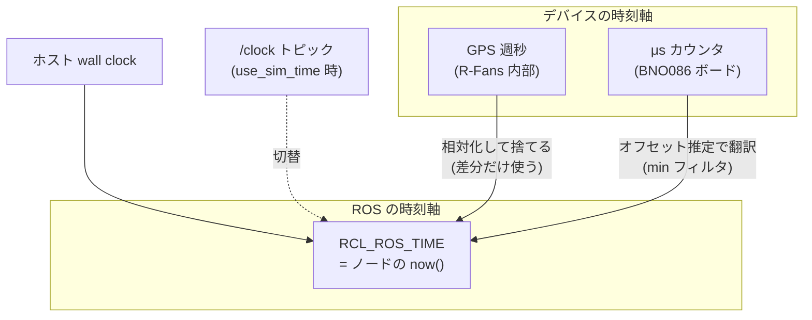

<!-- claude: タイムスタンプ読本 第1章 (2026-08-11) -->

# 第1章 時刻の基礎 — 「いつ」をどう数値にするか

タイムスタンプの実体は**数値が 2 つ入った構造体**にすぎない。しかしその数値が
「どの時計で測ったか」「起点はどこか」を意識しないと、後の章で扱う事故がすべて
理解できない。この章では時刻の器と、それを扱う型・演算を固める。

## 1.1 エポックと sec/nanosec

コンピュータの時刻表現の多くは **UNIX エポック** (1970-01-01 00:00:00 UTC) からの
経過時間である。ROS 2 のタイムスタンプもこれに倣い、経過時間を
「秒 + 秒未満のナノ秒」の 2 整数で持つ:

```
builtin_interfaces/msg/Time        ← メッセージに埋め込まれる「器」
├── int32  sec       例: 1786776000   (エポックからの秒)
└── uint32 nanosec   例: 123456789    (0〜999,999,999)
```

```
builtin_interfaces/msg/Duration    ← 時刻ではなく「時間の長さ」
├── int32  sec
└── uint32 nanosec
```

2 整数に分かれているのは**精度のため**である。仮に 1 個の `float64` (倍精度) に
「エポックからの秒」を入れると、2026 年時点の値 (~1.8 × 10⁹ 秒) では仮数部の
精度が μs 程度まで落ちる。`float32` (単精度) ならもっと悲惨で、**分解能が
約 2 分**になる — これは実際に reRoBot で事故になった
([第6章 事例B](06_case_studies.md#事例b))。整数 2 本ならナノ秒精度が常に保たれる。

> **要点**: 「大きな絶対時刻」を浮動小数点に入れてはいけない。入れるなら
> 「小さな相対時刻」(差分) にしてから。この原則は後の per-point time 設計
> ([第2章](02_header_and_messages.md) 2.3 節) に直結する。

## 1.2 クロックの種類 — 同じ「今」でも時計が違う

「現在時刻」を尋ねる相手 (クロック) には複数の種類があり、**別のクロックで測った
時刻同士は直接比較できない** (起点も進み方も違うから)。

```
時計 (クロック) の分類
├── ホスト PC の時計
│   ├── wall clock (システム時計)       ← 実世界の時刻。NTP 同期で「跳ぶ」ことがある
│   └── steady clock (単調時計)          ← 起動からの経過。絶対に巻き戻らない。タイムアウト計測用
├── ROS 2 のクロック (rclcpp::Clock)     ← どれを使うかを clock_type で選ぶ抽象層
│   ├── RCL_SYSTEM_TIME                  ← wall clock そのまま
│   ├── RCL_STEADY_TIME                  ← steady clock そのまま
│   └── RCL_ROS_TIME                     ← ノードの標準。通常は wall clock と同じだが…
│       └── use_sim_time:=true のとき    ← /clock トピックの値に切り替わる (bag 再生・シミュレータ)
└── デバイスの時計 (センサ内部)
    ├── GPS 時刻 (例: R-Fans の週秒)     ← GPS 週の頭からの秒。ROS 時刻と起点が違う
    └── MCU のフリーランカウンタ          ← 例: BNO086 ボードの 32bit μs カウンタ (~71 分で一周)
        (電源投入からの経過。実世界と無関係)
```

ロボットで問題になるのは、**センサデータが生まれる瞬間を知っているのはデバイスの
時計だけ**なのに、ROS の世界で通用するのは ROS 時刻軸だけ、という食い違いである。
デバイス時刻を ROS 時刻へ「翻訳」する方法は
[第3章](03_stamping_patterns.md) テンプレ3 で扱う。



## 1.3 コード上の型 — rclcpp::Time と rclcpp::Duration

メッセージに入る `builtin_interfaces/Time` は「ただのデータ」で、演算機能を持たない。
計算はラッパ型 `rclcpp::Time` / `rclcpp::Duration` で行う (Python は
`rclpy.time.Time` / `rclpy.duration.Duration`)。

### 現在時刻の取得

```cpp
// C++ — Node のメンバ関数 now() が「ノードのクロックで測った今」を返す
rclcpp::Time t = this->now();               // 型は rclcpp::Time (RCL_ROS_TIME)
msg.header.stamp = t;                        // rclcpp::Time → builtin_interfaces/Time へ暗黙変換
```

```python
# Python — get_clock() 経由。メッセージに入れるときは to_msg() で明示変換
t = self.get_clock().now()                   # rclpy.time.Time
msg.header.stamp = t.to_msg()                # builtin_interfaces/Time
```

reRoBot の実例: `rfans_driver.cpp` の `this->now()`、
`imu_node.py:274` の `self.get_clock().now()`。

### 演算規則 — 「時刻」と「長さ」を型で区別する

| 演算 | 結果の型 | 意味 |
|---|---|---|
| `Time − Time` | `Duration` | 2 時刻の間隔。例: `dt = (stamp - last_stamp_).seconds()` |
| `Time − Duration` | `Time` | 巻き戻し。例: `stamp = now() - Duration::from_seconds(span)` |
| `Time + Duration` | `Time` | 先送り |
| `Duration ± Duration` | `Duration` | 長さ同士の加減 |
| `Time + Time` | **コンパイルエラー** | 時刻同士の加算は無意味 (エポック 2 個分になる) |
| 異なる clock_type の `Time` 同士の比較・減算 | **実行時例外** | 別の時計で測った時刻は比較不能 (1.2 節) |

この型設計のおかげで「時刻と長さの取り違え」はコンパイル時か実行時に検出される。
逆に言えば、`float` や `int` に時刻を落としてしまうとこの保護が消える —
生の数値で時刻を持ち回るのは最小限にする。

### 生成・変換の定型

```cpp
rclcpp::Duration d1 = rclcpp::Duration::from_seconds(0.16);   // 秒 (double) から
rclcpp::Duration d2 = rclcpp::Duration(0, 50 * 1000 * 1000);  // (sec, nanosec) から = 50 ms
rclcpp::Time     t1 = rclcpp::Time(msg.header.stamp);          // msg → Time (演算可能に)
double sec  = t1.seconds();                                    // 秒 (double) へ — 精度低下に注意 (1.1 節)
int64_t ns  = t1.nanoseconds();                                // ナノ秒整数へ — 精度そのまま
```

reRoBot の実例:
- `epos4_odometry.cpp:77-78` — `setMaxIntervalDuration(rclcpp::Duration(0, 50 * 1000 * 1000))` (50 ms)
- `epos4_odometry.cpp:114` — `rclcpp::Time stamp = left_msg->header.stamp;` (msg → Time 変換)
- `rfans_driver.cpp` (fansxyz_clound) — `stamp - rclcpp::Duration::from_seconds(span)` (Time − Duration)

## 1.4 この章のまとめ

```
時刻の基礎 まとめ
├── 器は sec + nanosec の 2 整数 — 浮動小数点に絶対時刻を入れない
├── 時計は複数ある — wall / steady / ROS time / sim time / デバイス時計
│   └── 別の時計の時刻は比較できない。ROS 世界の共通軸は「ROS 時刻」
├── 計算は rclcpp::Time / Duration で — 型が時刻と長さを区別してくれる
└── now() は「この行が実行された瞬間」— それがデータ取得の瞬間とは限らない (→ 第3章)
```

次章では、この「器」がメッセージのどこに埋め込まれ、どんな**意味論** (何の時刻を
入れるべきか) が約束されているかを見る。

→ [第2章 Header とメッセージ構造](02_header_and_messages.md)
