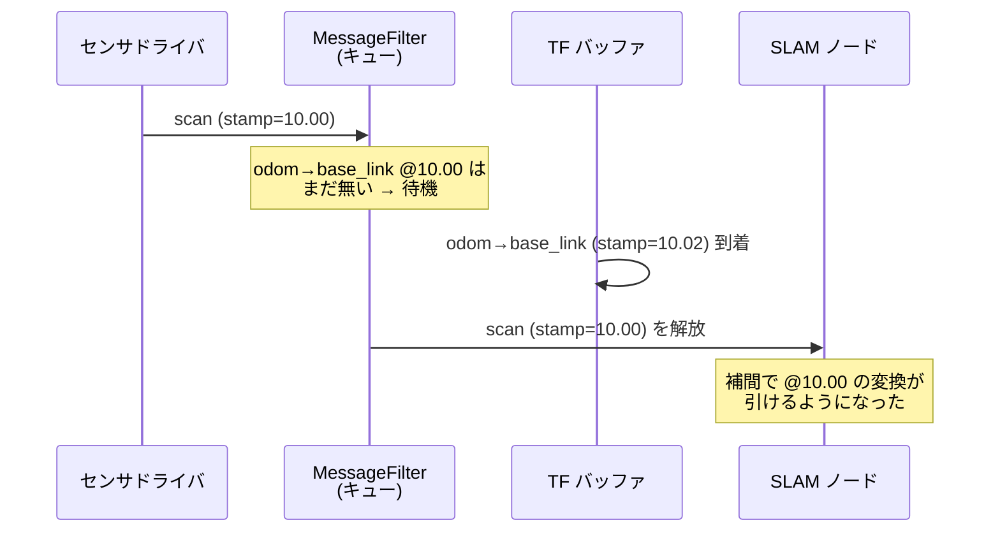

<!-- claude: タイムスタンプ読本 第4章 (2026-08-11) -->

# 第4章 スタンプを読む側の仕組み — 誰が時刻を信じているか

スタンプを正しく打つ意味は、**それを信じて動く消費者**を知って初めて腹落ちする。
この章では reRoBot のスタックで stamp を読んでいる 5 つの仕組みを見る。

```
stamp の消費者たち
├── TF2 ..................... 「時刻 t の座標変換」を補間で答える時系列データベース
├── tf2_ros::MessageFilter ... 「変換が引けるようになるまでメッセージを待たせる」門番
├── message_filters .......... 複数トピックを stamp で突き合わせるペアリング装置
├── robot_localization EKF ... stamp 順にセンサを処理する状態推定器
└── GLIM ..................... stamp + per-point time で点の絶対時刻を復元する SLAM
```

## 4.1 TF2 — 座標変換は時刻付きで問い合わせる

TF は「stamp 付き変換 (TransformStamped) の時系列」をバッファ (既定 10 秒分) に
溜めておき、問い合わせに対して**前後の変換から補間**して答える:

```cpp
// 「時刻 t における odom → base_link は?」
geometry_msgs::msg::TransformStamped tr =
    tf_buffer_->lookupTransform("odom", "base_link", t, timeout);
```

```
TF バッファの中身 (odom → base_link)
  stamp: 10.00 s  x=1.00
  stamp: 10.05 s  x=1.02
  stamp: 10.10 s  x=1.04   ← 問い合わせ t=10.07 s → 10.05 と 10.10 の間を線形補間して x≈1.028
```

時刻がらみの失敗は 2 種類しかない:

| 失敗 | 意味 | よくある原因 |
|---|---|---|
| **extrapolation into the future** | 問い合わせ時刻がバッファの最新より未来 | センサ stamp が TF より進んでいる (別時刻軸・stamp が未来にずれている) |
| **extrapolation into the past** | 問い合わせ時刻がバッファの最古より過去 | 起動直後 / stamp=0 (1970 年!) / バッファ保持時間より古いデータ |

**stamp のずれは、ここで初めて「座標のずれ」に化ける**。ロボットが 1 m/s で走って
いるとき、stamp が 0.1 s 未来にずれた scan を TF で world に貼ると、地図上で 10 cm
ずれた場所に貼られる。第6章の事例はほぼすべて、この経路で顕在化した。

## 4.2 tf2_ros::MessageFilter — 「変換が引けるまで待つ」門番

センサデータを受けてすぐ TF を引くと、TF がまだ届いていなくて失敗することがある
(センサと TF は別トピックで、到着順は保証されない)。`tf2_ros::MessageFilter` は
「このメッセージの stamp で目的の変換が引けるようになるまで」メッセージをキューに
待たせてからコールバックに渡す。slam_toolbox や AMCL が内部で使っている。



キューには上限があり、あふれると古いメッセージが**黙って捨てられる**。
[第6章 事例D](06_case_studies.md#事例d) (scan queue full) は、この待ち行列が
odometry の供給不足で詰まった事故である。ここでも鍵は stamp — MessageFilter は
「scan の stamp に対応する TF が来たか」だけを見ている。

## 4.3 message_filters — 複数トピックを stamp でペアリング

2 つのトピックを「同じ瞬間のデータ同士」で突き合わせたいとき使うのが
`message_filters::Synchronizer`。ポリシーが 2 種類ある:

- **ExactTime**: stamp が完全一致したものだけペアにする (同一デバイス由来向け)
- **ApproximateTime**: stamp が近いもの同士を貪欲にペアにする (別センサ向け)

reRoBot の実例 — `epos4_odometry.cpp:63-82` は左右モータの joint_states を
ApproximateTime でペアにする:

```cpp
using SyncPolicy = message_filters::sync_policies::ApproximateTime<
  JointStateMsg, JointStateMsg>;

m1_sub_.subscribe(this, "/motor1/cia402_device_1/joint_states");
m2_sub_.subscribe(this, "/motor2/cia402_device_2/joint_states");
sync_ = std::make_shared<Synchronizer>(SyncPolicy(10), m2_sub_, m1_sub_);
sync_->setMaxIntervalDuration(rclcpp::Duration(0, 50 * 1000 * 1000));  // 50 ms 超は組まない
sync_->registerCallback(...);   // ペア成立で onJointStates(left, right) が呼ばれる
```

```
ApproximateTime のイメージ (数直線は stamp)
motor1:  ──●────────●────────●──────   10.00      10.05      10.10
motor2:  ────●────────●────────●────     10.01       10.06      10.11
             └ペア┘     └ペア┘            (10.00,10.01) (10.05,10.06) …
```

**この仕組みは stamp が本物であることに全面依存する**。reRoBot では上流の
joint_states の stamp が常に 0 のため、時刻照合が機能せず「到着順にペアを組む」
動作に退化している — 詳細は [第6章 事例C](06_case_studies.md#事例c)。
(この同期系の実装解説は `docs/claude/knowledge/2026-08-11_ekf_odometry_code_walkthrough.md`
にもある。あちらは EKF 融合全体、本書は時刻の観点。)

## 4.4 robot_localization EKF — stamp 順の状態推定

`ekf_filter_node` (config: `rerobot_bringup/config/ekf.yaml`) は各センサを
**stamp 順に**処理して状態を更新する。時刻に関わる設定は:

```yaml
frequency: 30.0        # 推定結果の出力周期 [Hz]
sensor_timeout: 0.2    # この秒数センサが来なければ「欠測」として予測だけ進める
odom0_queue_size: 10   # 1 周期の間に溜まった分をまとめて処理するキュー
imu0_queue_size: 20    # IMU 100 Hz × 30 Hz 処理 → 1 周期あたり ~3-4 個 + 余裕
```

EKF は「観測が stamp 時点の状態への観測である」として更新するので、stamp が実際
より未来にずれたセンサは「未来の観測」として扱われ、推定にラグや振動を注入する。
また `/odom` の twist が常に 0 だったバグ (08-11 修正) の間、EKF は「速度 0 の観測」
を信じ続けて位置が (0,0) に張り付いた — **融合器は入力の値も stamp も疑わない**。
入り口 (ドライバ) の品質がすべて、というのが本書を貫く教訓である。

## 4.5 GLIM — stamp + per-point time で点の絶対時刻を復元

GLIM (LIO 構成) は 2 つの時刻情報を消費する:

```
GLIM の時刻消費
├── /imu/data の stamp .......... プリインテグレーション (フレーム間の運動拘束) の積分区間
└── /sdk_could の stamp + time[i] . 各点の絶対時刻 = stamp + time[i] → deskew で自己運動を補正
```

設定 (`ros2_ws_glim/config/`) との対応:

| 設定 | 意味 |
|---|---|
| `config_sensors.json` `perpoint_relative_time: true` | per-point time を「stamp 基準の相対秒」と解釈 |
| `config_sensors.json` `perpoint_time_scale: 1.0` | per-point time の単位は秒 (1e-9 ならナノ秒) |
| `config_ros.json` `imu_time_offset` | IMU stamp への固定オフセット補正 [s] — 残留ずれの微調整に使う |
| `config_ros.json` `points_time_offset` | 点群 stamp への固定オフセット補正 [s] |

deskew は「点 i の時刻における IMU 姿勢」で点を補正するため、stamp のずれは
**そのまま間違った IMU 区間との対応づけ**になる (事例A)。IMU 100 Hz に対して
0.16 s のずれは 16 サンプル分 — 旋回中なら 10° 超の歪みを毎スキャン注入する。

## 4.6 use_sim_time と bag 再生 — 「今」を差し替える

bag を再生して GLIM や EKF を評価するとき、ノードの「今」を録画時の時刻に合わせる
必要がある。仕組みは第1章 1.2 節の RCL_ROS_TIME の切替そのもの:

```bash
ros2 bag play mybag --clock          # bag が /clock に録画時刻を publish
ros2 run ... --ros-args -p use_sim_time:=true   # ノードの now() が /clock 追従になる
```

これを忘れると、ノードの `now()` は現実の時刻 (2026 年の今)、メッセージの stamp は
録画時 (過去) となり、「センサが何秒前のデータか」の計算が全部壊れる。TF は
extrapolation エラーを吐き、`sensor_timeout` は常時発火する。**bag 評価で時刻が
絡むノードには必ず `use_sim_time:=true`** — glim_rosbag のようにファイルを直接
読むツールは ROS のクロックを介さないのでこの問題自体がない。

→ [第5章 reRoBot の時刻アーキテクチャ](05_rerobot_architecture.md)
