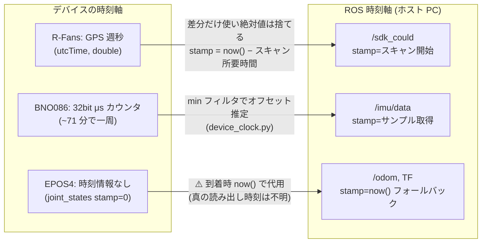

<!-- claude: タイムスタンプ読本 第5章 (2026-08-11) -->

# 第5章 reRoBot の時刻アーキテクチャ — あるべき姿と現在地

## 5.1 設計原則 4 か条

reRoBot (自律移動: 車輪 odom + IMU + 2D/3D LiDAR + EKF + Nav2/GLIM) の時刻設計は、
次の 4 か条に集約される。ここまでの章の結論の言い換えでもある:

```
時刻設計 4 か条
├── 1. 単一時刻軸 ..... 全トピックの stamp は「ホスト PC の ROS 時刻」に統一する。
│                        デバイス時刻はドライバ内で翻訳し、外に漏らさない (第1章 1.2)
├── 2. 取得時刻主義 ... stamp はデータが生まれた瞬間。処理・publish の瞬間ではない (第2章 2.1)
├── 3. 基準の一致 ..... 時間幅のあるデータは「stamp = 相対時刻の基準点」を厳守 (第2章 2.3)
└── 4. 時刻を発明しない . 再発行では元 stamp を継承。now() での上書きは最後の手段 (第3章 3.4)
```

## 5.2 3 つの時刻軸と ROS 時刻軸への写像

reRoBot には性質の違う時計が 3 つ載っており、それぞれ別の方法で ROS 時刻軸へ
写像される (原則 1 の実装)。



三者三様である理由:

- **R-Fans (GPS 週秒)**: 週秒と ROS 時刻の対応を取る手段がホスト側にない (PPS 同期
  なし)。そこで絶対値は捨て、**点同士の差分** (per-point 相対時刻とスキャン所要時間)
  だけをもらう。基準点はホストの `now()` から巻き戻して作る (テンプレ2)。
- **BNO086 (μs カウンタ)**: サンプルごとにカウンタ値が付いてくるので、オフセット
  推定で軸ごと翻訳できる (テンプレ3)。3 つの中で最も高品質な stamp。
- **EPOS4 (時刻なし)**: ドライバ (ros2_canopen) が stamp を付けてくれない。取得
  時刻は原理的に復元不能で、到着時刻 `now()` での代用が現状の上限 (事例C)。

## 5.3 データフローと stamp の旅

bringup 2D+IMU+EKF 構成 (nav2d.sh 相当) での stamp の流れ:

```
stamp の系譜 (誰が打ち、誰が継承し、誰が消費するか)
├── /imu/data (100 Hz) ─── BNO086 ドライバがテンプレ3 で打つ
│   ├──→ EKF (imu0): yaw / yaw rate の観測として stamp 順処理
│   └──→ GLIM (LIO): プリインテグレーション区間の材料
├── /scan (40 Hz) ───────── urg_node が打つ (スキャン開始時刻)
│   └──→ slam_toolbox / AMCL: MessageFilter が stamp で TF を待ち合わせ
├── /sdk_could (~6 Hz) ──── rfans_driver がテンプレ2 で打つ (+ per-point time)
│   └──→ GLIM: stamp + time[i] で点の絶対時刻を復元 → deskew
├── /motor{1,2}/…/joint_states (20 Hz) ─── ⚠️ ros2_canopen が stamp=0 のまま publish
│   └──→ epos4_odometry: ApproximateTime ペアリング (退化中) → stamp==0 なら now() に置換
│         ├──→ /odom ────────── EKF (odom0): vx, vyaw の観測
│         ├──→ TF odom→base_link (EKF 無効時のみ。有効時は EKF が出す)
│         └──→ /joint_states ── robot_state_publisher: ホイール TF に転記
└── /odometry/filtered (30 Hz) ─── EKF が打つ (融合結果の有効時刻)
    └──→ Nav2 (bt_navigator / controller_server の odom_topic)
```

各トピックの品質評価 (2026-08-11 時点):

| トピック | 時刻軸 | stamp の質 | 備考 |
|---|---|---|---|
| `/imu/data` | ROS (翻訳済) | ◎ 取得時刻、ジッタ小 | テンプレ3 |
| `/scan` | ROS | ○ 実績ある外部実装 | urg_node |
| `/sdk_could` | ROS | ○ スキャン開始に補正済 | 残差 = UDP+処理遅延 (ms 級) |
| `/motor…/joint_states` | — | ❌ 常に 0 | 上流 (apt 配布物) の欠陥 |
| `/odom`, `/joint_states`, TF | ROS | △ 到着時刻で代用 | stamp=0 フォールバック |
| `/odometry/filtered` | ROS | ○ | 入力の質に依存 |

## 5.4 あるべき姿と現在地のギャップ

原則 4 か条に照らすと、残るギャップは実質 1 つ — **EPOS4 系統の stamp=0** である。

```
ギャップ分析
├── 原則1 (単一時刻軸) .... ✅ 達成 (GPS 週秒は相対化、BNO086 は翻訳済み)
├── 原則2 (取得時刻主義) .. △ /sdk_could・/imu/data は達成。
│                            joint_states 系統のみ「到着時刻」止まり (上流依存)
├── 原則3 (基準の一致) .... ✅ 達成 (事例A の修正で stamp=スキャン開始に統一)
└── 原則4 (継承) .......... ✅ 達成 (epos4_odometry は 3 出力へ同一 stamp を継承)
```

joint_states 問題の影響範囲は限定的である: PDO 周期 50 ms・CAN 転送は ms 級なので
「到着時刻 ≈ 読み出し時刻 + 数 ms」であり、EKF の観測としては許容範囲。実害が出る
のは**左右ペアリングの位相ずれ** (事例C の偽ヨー、最大 ~0.5°/更新の過渡ノイズ) で、
これは stamp があっても ApproximateTime の粒度では消えない。恒久対策の選択肢
(到着順を仕様として受け入れて堅牢化する / 上流 ros2_canopen を改修して真の stamp を
入れる) は `docs/issue/2026-08-01_odometry_stop_wobble_zero_stamp_pairing.md` 参照。

## 5.5 GLIM (3D+IMU) 構成での時刻整合チェックポイント

これから行う GLIM 実データ検証で確認すべき時刻項目 (手順の詳細は
[第7章](07_checklist.md)):

1. `/sdk_could` と `/imu/data` の stamp が**同じ ROS 時刻軸で近い値**か
   (差が数 ms 以内。数十 ms あるなら `imu_time_offset` / `points_time_offset` で補正)
2. rfans の起動ログ `per-point time span of first scan: X s` が `1/rps` 程度か
   (0.000 なら utcTime が入っておらず deskew 不能)
3. bag 再生評価時は `use_sim_time` の扱いに注意 (第4章 4.6 節。glim_rosbag なら不要)

## 5.6 R-Fans ドライバの残存懸念 — 症状が出たら見る場所 (2026-08-12 点検)

先輩実装 (haruyama8940/rfans_driver_ros2) との比較点検で洗い出した、現在の
R-Fans ドライバに残る時刻まわりの懸念。**どれも「今壊れている」ものではない** —
事例A・B の修正後もなお残る構造的な限界と、異常時に静かに劣化する箇所のリスト
である。行番号は 2026-08-12 時点の `StarROS2/src/rfans_driver.cpp`。

```
残存懸念 (優先度順)
├── 1. stamp の絶対基準が「受信時刻」 ..... 構造的な限界 (テンプレ2 の宿命)
├── 2. 「1 回転 = 1 メッセージ」の保証なし .. 現状は結果的に成立しているだけ
├── 3. GPS 週秒ロールオーバー ............. 週 1 回・1 スキャンだけ壊れる
└── 4. 健全性ログが初回スキャンのみ ........ 走行中の時刻死を検知できない
```

**1. stamp の絶対基準が受信時刻** (`rfans_driver.cpp:274`)
事例A の修正 (テンプレ2) は「now() − スキャン所要時間」でスキャン先頭へ巻き
戻すが、起点の now() は**受信 + デコード完了の時刻**である。UDP バッファリング
と SDK 処理の遅延 (ms 級) がそのまま stamp の残差になる。遅延が一定なら GLIM の
`points_time_offset` で吸収できる (7.2 節) が、CPU 負荷で**変動**すると deskew
の質が下がる。症状は「速く走るほど 3D 地図がブレる」。
この懸念の完全な解剖 (誤差がどこで生まれ、何が健全で、どう直すか) は
[第8章](08_rfans_rewind_anatomy.md)。

**2. 「1 回転 = 1 メッセージ」の保証がない** (`rfans_driver.cpp:431` → `:509`)
publish 単位は SDK の `getPackets()` が返したバッチそのままで、360° で切る
ロジックはドライバに存在しない。実測 (~6 Hz、~13,000 点) では回転単位に見える
が、それは結果であって保証ではない。`ros2 topic hz /sdk_could` のレートが rps
と一致するか、スキャンごとの点数のばらつきで確認できる。

**3. GPS 週秒ロールオーバー** (`calout_fansxyz()` の相対化、事例B 参照)
デバイス時刻 utcTime は週秒 (最大 604,800 s) なので、週境界を跨いだスキャン
では「スキャン先頭との差分」が負になる。span ガード (`0 < span < 1`) が stamp
巻き戻しを止める防御はあるが、per-point time 自体は異常値のまま GLIM へ渡る。
週 1 回・そのスキャン 1 フレーム限りの現象。

**4. 健全性の自己診断が初回スキャンのみ** (`rfans_driver.cpp:287-295`)
「per-point time span」のログ (7.2 節の手順 4 が見るもの) は最初の 1 スキャン
しか出ない。走行中に utcTime が死んで time が全 0 になっても、点群は出続けた
まま deskew だけが**無言で**無効化する — 事例E の教訓「無言の延命が一番高く
つく」と同型の構図。長時間走行の bag は 7.2 節の手順で time フィールドを事後
確認すること。

なお同じ点検で、時刻とは無関係の運用上の引っかかりも 1 件見つかっている:
ライブ受信ループが `rclcpp::ok()` を見ずに `reader.eof()` だけ監視している
(`rfans_driver.cpp:428`) ため、LiDAR がパケットを止めると受信ブロックで
SIGINT (stop.sh) への反応が鈍る。本書の範囲外だが、現場で「止まらない」と
感じたときのために記録しておく。

症状からの引き方は [第7章](07_checklist.md) 7.4 節の逆引き表に統合済み。

→ [第6章 事故事例集](06_case_studies.md)
