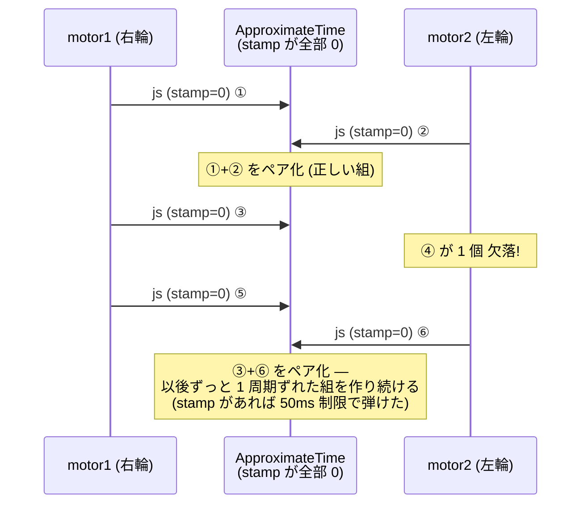

<!-- claude: タイムスタンプ読本 第6章 (2026-08-11) -->

# 第6章 事故事例集 — reRoBot で実際に起きた時刻バグ

理論は第1〜4章で終わっている。この章は「原則を破るとどう壊れるか」の実録である。
5 件とも reRoBot で実際に発生 (または実測で確認) されたもので、各事例を
**症状 → 機構 → 修正 → 教訓** の順で解剖する。

| 事例 | 一言でいうと | 破った原則 | 状態 |
|---|---|---|---|
| [A](#事例a) | 点群 stamp がスキャン末尾を指していた | 基準の一致 (原則3) | ✅ 修正済 (2026-08-11) |
| [B](#事例b) | 絶対時刻を float32 に入れて精度が溶けた | 器の選択 (第1章 1.1) | ✅ 修正済 (2026-08-01) |
| [C](#事例c) | stamp=0 で時刻同期が到着順に退化 | 取得時刻主義 (原則2) | ⚠️ 潜在欠陥として残存 |
| [D](#事例d) | scan が queue full で黙って捨てられた | (時刻依存の待ち行列) | ✅ 解決済 (2026-05-26) |
| [E](#事例e) | stamp==0→now() フォールバックの功罪 | — (延命装置の副作用) | 設計判断の記録 |

## 事例A

**rfans の点群スタンプがスキャン末尾を指していた — deskew が 1 周期ずれる**

- 一次資料: `docs/claude/PROJECT_STATE.md` タイムライン 08-11 (5)
- 対象コード: `ros2_ws_main/src/drivers/StarROS2/src/rfans_driver.cpp` (`fansxyz_clound()`)

### 症状

実害が出る前に静的解析で発見 (GLIM 3D+IMU 検証の直前)。放置していた場合の症状は
「静止中はきれいにマッピングできるのに、動く (特に旋回する) と点群が歪む・地図が
崩れる」になったはずである。

### 機構

R-Fans ドライバのライブ経路は「1 スキャン分の UDP パケットを受け切ってから、
まとめて座標計算して publish」という構造。そのため stamp を打つ行が実行されるのは
必然的に**スキャン末尾**だった:

```cpp
outCloud_sdk.header.stamp = this->now();   // ← now() はここでは T_end
```

一方、各点の per-point `time` は**スキャン先頭基準**の相対秒。GLIM は
`stamp + time[i]` で点の絶対時刻を復元するので、全点が 1 スキャン所要時間
(rps=10 の実測で ~0.16 s) だけ未来にずれる:

```
実時間 →
T_start                              T_end
  │←──── 1 スキャン ~0.16 s ────→│
  ●───●───●───●───●───●───●───●──┤ ← パケット到着
                                     ↑ ここで now() が実行される

GLIM が信じる点 i の時刻:  T_end   + time[i]   ← 0.16 s 未来
実際の取得時刻:            T_start + time[i]
```

IMU (100 Hz) との対応づけが 16 サンプル分ずれるため、deskew は「もう旋回し終わった
後の IMU」で「旋回中の点群」を補正することになる。90°/s の旋回では毎スキャン ~14°
の歪みを注入する計算になる。IMU を使わない CT-ICP 構成では IMU との対応づけ自体が
存在しないため、この欠陥は**無害なまま潜伏していた** — LIO 構成への切替が地雷を
踏む条件だった。

### 修正 (テンプレ2: 巻き戻し)

「now() ≈ T_end」と「最終点の相対時刻 = スキャン所要時間」を組み合わせ、
`stamp = now() − span ≈ T_start` に補正した ([第3章](03_stamping_patterns.md) 3.2 節に
コード全文)。残る誤差は UDP 転送 + 処理の遅延 (ms 級) で、GLIM の
`imu_time_offset` で微調整できる大きさに収まった。

### 教訓

- **「now() はどの瞬間か」をコードの構造 (いつその行が実行されるか) から言語化する**。
  publish 直前の now() は、バッファリングがある限り取得時刻ではない。
- 時間幅のあるデータでは stamp 単体でなく **stamp と相対時刻の「基準点の一致」** を
  検収項目にする ([第7章](07_checklist.md) チェックリスト化済み)。
- 「今は使われていない時刻情報」も規約どおりに作っておく。消費者 (今回は GLIM LIO)
  が後から現れたとき、潜伏していた欠陥が突然発火する。

## 事例B

**GPS 週秒を float32 の per-point フィールドに直入れ — 精度が 2 分に溶けた**

- 一次資料: `rfans_driver.cpp:199-207` のコメント、PROJECT_STATE 08-01 前後の記録
- 対象コード: 同上 `calout_fansxyz()`

### 症状

per-point タイムスタンプとして各点に埋めた値が、**全点でほぼ同じ値**になり
deskew の材料にならない。

### 機構

R-Fans が各点に付けてくる時刻は GPS 週秒 (週の頭からの経過秒、最大 604,800)。
これを点構造体の float32 フィールドにそのまま入れていた。float32 の仮数部は 24 bit
しかなく、6 × 10⁵ 秒台の値では**分解能が ~0.06 s** まで落ちる (第1章 1.1 節の
「絶対時刻を浮動小数点に入れるな」の実物)。スキャン内の点の時刻差は最大 0.16 s
なので、量子化で 2〜3 段に潰れ、点ごとの時刻としては使い物にならない。

### 修正 (相対化)

スキャン先頭点との**差分を double で計算してから** float32 に落とす形に変更:

```cpp
const double t_abs = config_.use_gps ? INPUT.m_dGPSTime : INPUT.lasShot.utcTime;
if (out_count_ == 0) {
  scan_start_time_ = t_abs;                 // スキャン先頭の絶対時刻 (double で保持)
}
const float t_rel = static_cast<float>(t_abs - scan_start_time_);   // 0〜0.16 s → float32 で ~10 ns 分解能
```

あわせてフィールド名を GLIM が per-point 時刻と認識する `time` に改名した
(`rfans_driver.cpp:573-575`)。

### 教訓

- **大きい絶対値は整数 2 本 (Header) に、小さい相対値は float32 に** — 役割分担が
  精度を守る ([第2章](02_header_and_messages.md) 2.3 節)。
- 浮動小数点の精度劣化は**値の大きさに比例して静かに進む**。コンパイラも実行時も
  警告しない。時刻・座標など「大きなオフセット + 小さな差分」構造を持つ量は常に疑う。
- なお事例A はこの修正の**続き**である。相対化で「時刻の器」は直ったが、「基準点
  (stamp) との整合」がまだずれていた。1 つの修正が完了に見えても、系全体の整合を
  確認するまでは終わっていない。

## 事例C

**joint_states の stamp が常に 0 — ApproximateTime が到着順ペアリングに退化**

- 一次資料: `docs/issue/2026-08-01_odometry_stop_wobble_zero_stamp_pairing.md`
- 対象コード: `epos4_odometry.cpp:63-117` (同期系)、上流は ros2_canopen (apt 配布物)

### 症状

(調査のきっかけは「停止時に scan が左右に揺れる」だったが、真因はゲームパッドの
電池切れと判明。その過程で実測された**事実**として) 両モータの joint_states 40 msg
すべてで `header.stamp` が `sec=0, nanosec=0` だった。

### 機構

`epos4_odometry` は左右モータの joint_states を ApproximateTime で「同じ瞬間の
ペア」に組む設計 ([第4章](04_time_consumers.md) 4.3 節)。だが stamp が全メッセージ
同値 (0) なので時刻照合は機能せず、**実質「到着順に組む」動作に退化**している。
`setMaxIntervalDuration(50ms)` も差が常に 0 なので何も弾かない。



退化して何が困るか: 左右の実サンプリング位相は起動ごとのくじ引きで決まり、さらに
片側のメッセージが 1 個落ちると**以後恒久的に 1 周期 (50 ms) ずれたペア**を作り
続ける。左右で Δt ずれた区間の移動量から差動 2 輪の式でヨーを計算すると、速度変化
中だけ偽の旋回 `d_theta ≈ (加減速度 × Δt × 周期) / tread` (条件次第で ~0.5°/更新)
が出る。等速中はゼロなので気づきにくい。

### 状態と対策の選択肢

**未修正 (潜在欠陥として記録済み)**。上流が apt 配布物のためすぐ手を入れられない。
選択肢は issue doc に整理されている:

1. 到着順ペアリングを仕様として受け入れ、欠落検出 + 再同期を自前実装する
2. ros2_canopen を fork して読み出し時刻を stamp に入れる (原則2 の正攻法)
3. 現状維持 (実害は過渡時の ~0.5° ノイズ。EKF 導入で IMU が旋回を上書きするため
   実効的な影響はさらに縮小した)

### 教訓

- **時刻同期の仕組みは stamp が本物であることに全面依存する**。同期器を導入したら、
  入力の stamp が実在するかを最初に実測する (`ros2 topic echo --field header.stamp`)。
- stamp=0 は「エラー」ではなく**静かな退化**として現れる。ApproximateTime は文句を
  言わずに動き続ける — 動いていることと正しいことは別。
- 監視すべきは入り口。この事例が [第7章](07_checklist.md) の「新センサ・新ドライバ
  導入時は stamp を必ず echo で確認」の由来である。

## 事例D

**slam_toolbox の scan queue full — 時刻待ちの行列が詰まる**

- 一次資料: `docs/report/2026-05-26_slam_toolbox_scan_queue_full.md`
- SLAM 側の視点 (採用ゲート・地図更新パイプライン) からの解剖:
  [slam_toolbox 読本 事例A](../slam_toolbox/06_case_studies.md)

### 症状

slam_toolbox が `Message Filter dropping message: ... queue is full` を連発し、
地図が更新されない。

### 機構

slam_toolbox は scan を直接処理せず、`tf2_ros::MessageFilter`
([第4章](04_time_consumers.md) 4.2 節) が「scan の stamp に対応する odom→base_link
変換が TF バッファに来るまで」待たせる。odometry の供給が遅い/途切れると、待ち行列
が上限に達し、**最も古い scan から黙って捨てられる**。エラーではなく警告 1 行なので、
「SLAM が動いているのに地図が育たない」という症状に見える。

当時の解決は scan_queue_size の調整と odometry 供給の安定化 (詳細は report 参照)。

### 教訓

- 「時刻 t のデータを処理するには、時刻 t の変換が必要」という**時刻依存の待ち合わせ**
  が ROS のあちこちに隠れている。詰まりの単位は「メッセージ数」でも、詰まる原因は
  「時刻の供給不足」。
- queue full 警告を見たら、キューを増やす前に「**何の時刻を待って詰まったのか**」を
  特定する。キュー拡大は詰まりの先送りにしかならないことが多い。

## 事例E

**stamp==0 フォールバックの功罪 — 延命装置は問題も隠す**

- 対象コード: `epos4_odometry.cpp:114-117`

### 何をしているか

```cpp
rclcpp::Time stamp = left_msg->header.stamp;
if (stamp.nanoseconds() == 0) {
  stamp = this->now();          // 上流が stamp を付けてくれないときの保険
}
```

### 功: これが無いと何が起きたか

stamp=0 のまま /odom と TF に転記すると、TF バッファには「1970 年の変換」が積まれる。
消費者 (slam_toolbox・Nav2・RViz) の lookupTransform は現在時刻付近を問い合わせる
ので、**extrapolation エラーで座標変換が全滅**する。フォールバックのおかげで
TF は流れ続け、システムは動作を保った (事例C の症状が「過渡時の姿勢ノイズだけ」で
済んだ直接の理由)。

### 罪: 何を隠したか

フォールバックが働いている間、下流からは stamp=0 問題が**完全に不可視**になる。
実際、上流の stamp=0 は 2026-08-01 の調査まで誰も気づかなかった。また `now()` は
「到着時刻」であって「エンコーダ読み出し時刻」ではないので、CAN 転送 + 処理の遅延
(ms 級) が姿勢の有効時刻に恒常的に混入している (第5章 5.4 節のギャップ)。

### 教訓 — フォールバックを書くときの作法

- フォールバックは**入れてよい**。ただし発動したら**気づける**ようにする
  (初回発動時に WARN を 1 回出す、診断トピックに載せる、など)。無言の延命が
  一番高くつく。
- フォールバック値の意味 (`now()` = 到着時刻 ≠ 取得時刻) をコメントに書き、
  「これは近似である」ことを未来の読者に残す。

## 章のまとめ — 5 事例を貫く一本の線

```
事故の共通構造
├── stamp はただの代入 — 規約 (取得時刻・基準一致・実在) を型は強制しない (A, B, C)
├── 消費者は stamp を疑わない — 同期器も TF も EKF も入力を信じて静かに壊れる (C, D)
├── 潜伏期間がある — 消費者が現れる/条件が変わるまで無害に見える (A, C)
└── 延命装置は診断を遅らせる — フォールバックには可観測性をセットで (E)
```

→ [第7章 チェックリストとデバッグ](07_checklist.md)
