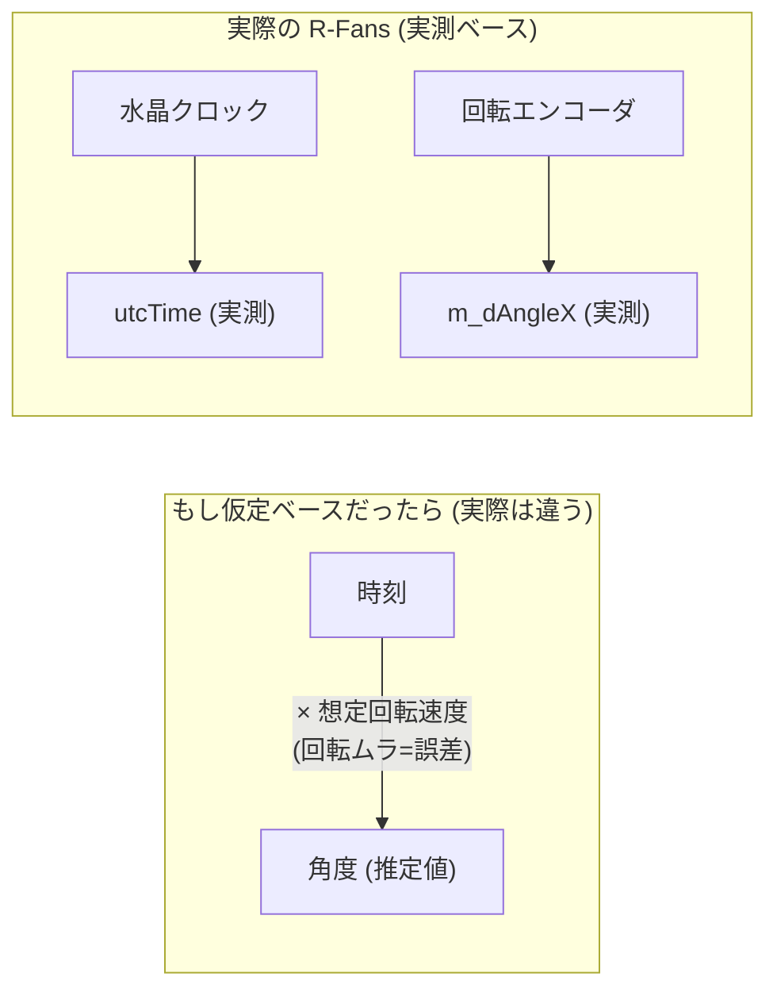
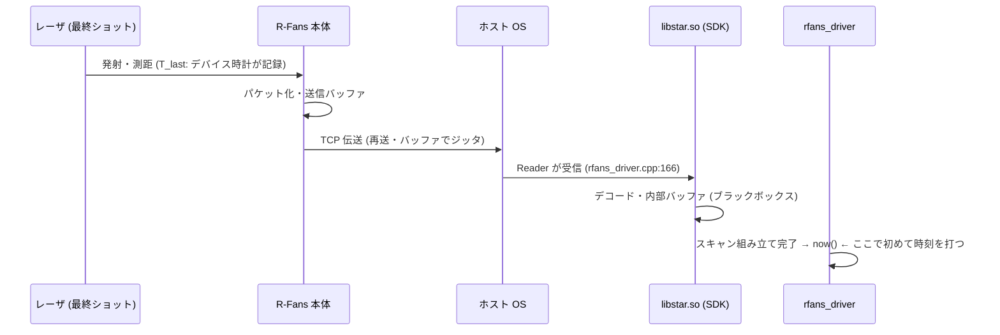

<!-- claude: タイムスタンプ読本 第8章 (2026-08-13)。IMU×R-Fans の時間対応付けに関する
     質疑 (誤差はどこで生まれる? ハードかソフトか? SDK がブラックボックスでなければ
     消せる?) を解剖章として書籍化。行番号は 2026-08-13 時点。-->

# 第8章 巻き戻し誤差の解剖 — R-Fans の stamp はどこで・どれだけ狂うか

[第3章](03_stamping_patterns.md) のテンプレ2、[第5章](05_rerobot_architecture.md)
5.6 節の残存懸念 1 で「stamp の絶対基準が受信時刻」と書いた。この章はそれを
1 段深く解剖する。出発点は次の 3 つの問いである:

```
この章の問い
├── Q1. IMU (100 Hz) と R-Fans (~6 Hz) は届くタイミングが揃わないのに、
│       GLIM はどう対応付けている? その誤差は無視できる? ......... → 8.1
├── Q2. 巻き戻し誤差はどこで生まれる?
│       (a) モータ回転が一定でなく「時間↔角度」が緩いハードの問題? .. → 8.2
│       (b) SDK が吐いた瞬間の now() から逆算する高レベルソフトの問題? → 8.3
└── Q3. SDK (libstar.so) がブラックボックスでなければ、
        もっと正確に時刻を取り出せる? .............................. → 8.4
```

答えを先に一覧すると:

| 問い | 答え | 節 |
|---|---|---|
| Q1 対応付け誤差 | 最近傍マッチングではなく積分+補間。誤差は mm 級で**無視できる** | 8.1 |
| Q2 発生箇所 | **(b) 高レベル側**。ただし犯人は逆算の計算ではなく「アンカーの now()」1 点 | 8.3 |
| Q3 ブラックボックス | ソースが見えても**精度の上限は変わらない**。壁はコードでなく時計の独立性 | 8.4 |

## 8.1 Q1: GLIM の対応付けは「最近傍」ではない

まず前提を正す。GLIM は「スキャンに一番近い時刻の IMU サンプルを 1 個選んで
対応させる」のでは**ない**。スキャン間の IMU を全部使う。

```
ROS 時刻軸 ─────────────────────────────────────────────────────▶

IMU 100 Hz   ●   ●   ●   ●   ●   ●   ●   ●   ●   ●   ●   ●   ●
(10 ms 間隔)  \________________ ________________/
                               V
R-Fans ~6 Hz  ┃←──────── スキャン k (~167 ms) ────────→┃
              │                                        │
              │  区間内の IMU ~16 サンプルを「全部」積分 │
              │  (プリインテグレーション。第4章)         │
              └ 両端だけ IMU サンプル間 10 ms を補間 ────┘
```

つまり「対応付けの粗さ」が入り込む余地は**両端の補間 10 ms** だけである。
仮に補間せず最近傍で丸めたとしても (ずれ最大 5 ms)、影響は:

```
最悪ケースの見積もり (最近傍丸め・ずれ 5 ms)
├── 姿勢: 旋回 1 rad/s (本機ではかなり速い) × 5 ms = 5 mrad ≈ 0.29°
│   └── 3 m 先の壁で点が ~1.5 cm ずれる = R-Fans 測距ノイズ (2〜3 cm) と同等以下
├── 並進: 1 m/s × 5 ms = 5 mm
└── 実際は線形補間するので誤差は二次 (角加速度 × Δt²) — 上記より 1〜2 桁小さい
    しかもスキャンごとにランダム → 最適化で平均化され、地図に蓄積しない
```

さらに点単位でも丸めは起きていない: R-Fans の各点には per-point 相対時刻
(`time` フィールド、[第2章](02_header_and_messages.md) 2.3 節) が付いており、
GLIM は `stamp + time[i]` で**点ごとの絶対時刻**を復元して deskew する
([第4章](04_time_consumers.md))。

**Q1 の答え: 対応付け方式そのものの誤差は mm 級で無視できる。**
効きうるのは方式ではなく「両者の stamp が同じ時刻軸に正しく乗っているか」
(= 系統オフセット) であり、それが Q2 の巻き戻し誤差につながる。

## 8.2 Q2 前半: ハード側 (回転ムラ) は無罪 — 時間と角度は両方実測

「モータの回転が一定速度とは限らないから、時間と回転角の関係が緩いのでは」
という仮説は、データ構造を見ると成立しない。デバイスが吐く 1 ショット
(`SHOTS_CALCOUT_S`) には、時刻と角度が**両方とも実測値**として入っている:

```
1 ショットのデータ (rfans_driver.cpp が SDK から受け取る単位)
├── utcTime ......... このショットが発射された瞬間の「デバイス時計」の時刻
│                     (GPS 週秒, double)          → :203 で t_abs として取得
├── m_dAngleX ....... 発射瞬間の「エンコーダ実測」方位角 → :233 で hangle に転記
└── m_pulse[4] ...... 距離・強度 (最大 4 エコー)
```

重要なのは、**「時間から角度を推定する」「角度から時間を推定する」計算が
どこにも存在しない**こと。もし角度が `経過時間 × 想定回転速度` で作られて
いたら回転ムラがそのまま角度誤差になるが、実際は両方が独立に測られた
ペアで届く:



レーザの発射タイミング自体もモータではなく水晶クロック駆動なので、回転が
揺らいでも「発射時刻の記録」は揺らがない。回転ムラの影響は「点の角度間隔が
不均一になる」だけで、各点の (時刻, 角度, 距離) の組は正しいまま — deskew や
SLAM にとって痛くも痒くもない。

唯一「回転一定」を仮定している箇所は `col` の計算 (`:237`) だが、これは点群を
格子状に並べるための**列番号** (整理用インデックス) であり、時刻にも座標にも
使われない。

**Q2 前半の答え: スキャン内部の時間構造 (点同士の相対時刻・角度) はデバイス
実測で健全。ハードと低レベルソフトは無罪。**

## 8.3 Q2 後半: 誤差の発生点は「アンカーの 1 行」

では巻き戻し誤差はどこにあるか。`rfans_driver.cpp:274-281` の stamp 生成を
式に書くと:

```cpp
rclcpp::Time stamp = this->now();                       // :274 ← 犯人はここ
const double span = temple_1_[out_count_-1].timeflag;   // :276 スキャン所要時間
stamp = stamp - rclcpp::Duration::from_seconds(span);   // :278 巻き戻し
```

```
stamp = now() − span
         │       └── スキャン先頭〜末尾の所要時間。utcTime の差分から計算
         │           = デバイス時計由来なので正確。ここに誤差はない
         └── 「最後の点がドライバに届き、1 スキャン分揃った瞬間」のホスト時刻
             ⚠️ 巻き戻しが本当に欲しいのは「最後のレーザが発射された瞬間」
```

「逆算 (span を引く計算)」は正確で、狂っているのは**逆算の起点 (アンカー)**
である。最後のレーザ発射から now() までには、次のパイプラインが挟まる:



この区間の合計遅延を L と置くと:

```
時系列で見た巻き戻しの実際

デバイス時計軸:  T_first ────────────────── T_last
                    │← span (正確に測れている) →│
                                              │
ホスト時計軸:                                  └──[遅延 L]──▶ now()
                                                              │
                          stamp = now() − span = 真の T_first + L
                                                              │
              ┌───────────────────────────────────────────────┘
              ├── L の定常成分 → stamp が常に L だけ「遅い」バイアス
              └── L の変動成分 → スキャンごとのジッタ (CPU 負荷で変動)
```

**Q2 後半の答え: 誤差は高レベル側、それも「now() をアンカーに使う」設計
1 点に集中している。** span の逆算・per-point 時刻・角度はすべて健全。
第5章 5.6 節の残存懸念 1 はこの構造を指していた。

### 8.3.1 数値で 1 回転を追う

抽象的な式を実数で確かめる (1 回転 160 ms、伝送+SDK 遅延 L = 10 ms とする)。
注意: 各点の相対時刻は「360°側から過去へ逆算」しているのではなく、
「先頭点との差分」として**前向きに実測**でついている。逆算 (巻き戻し) が
登場するのは stamp 1 個を決めるときだけである。

```
【デバイス時計軸】発射の瞬間に記録される実測値
  点1 (0°)    utcTime = 1000.000 → per-point time 0.000
  点2 (90°)   utcTime = 1000.040 → per-point time 0.040
  点3 (180°)  utcTime = 1000.080 → per-point time 0.080
  点n (360°)  utcTime = 1000.160 → per-point time 0.160 ← この値が span

【ホスト時計軸】ドライバが見える世界
  真の先頭発射の瞬間 ......... 500.000 (ホストはこれを直接知れない)
  真の最終発射の瞬間 ......... 500.160
  点n が届き終わる ........... 500.170 ← now() はこれ (遅延 L = 10 ms)

  stamp = 500.170 − 0.160 = 500.010
          (打ちたかった値は 500.000。誤差 = ちょうど L)

【GLIM 側の復元】 点 i の絶対時刻 = stamp + per-point time[i]
  例: 点2 = 500.010 + 0.040 = 500.050 (真値 500.040 + L)
      → 全点が一律 L だけ遅れる。点同士の間隔は完全に正しい
```

この「全点一律のずれ」という性質が 8.1 節の結論とつながる — スキャン内部の
形は保たれるので deskew は壊れず、IMU との突き合わせだけが L だけずれる。
なお 1 回転 = 数百の方位角列 × 16 レーザ (時分割発射、ショット間隔 ~13 µs) で
構成されるが、各ショットが自分の utcTime を持つため発射順は per-point time が
正確に記録している。「16 本が同時か順番か」の差は 1 列あたり ~0.2 ms
(1 m/s 走行で 0.2 mm) であり、ms 級のアンカー誤差 L の前では問題にならない。

## 8.4 Q3: ブラックボックスの罪と無罪

「SDK の中身が見えないから正確な時刻が取れないのでは」という仮説は、
半分だけ正しい。何が隠れていて何が素通しかを分けると:

```
libstar.so (バイナリ SDK) の罪と無罪
├── 隠れているもの (罪)
│   └── デコード・内部バッファの遅延 = L の一部の「内訳」
│       → L が何 ms か実測も分解もできない
├── 素通しのもの (無罪)
│   ├── utcTime ..... デバイス時計の発射時刻が点ごとにそのまま出てくる
│   └── m_dAngleX ... エンコーダ実測角も点ごとにそのまま出てくる
└── 判定: デバイスが持つ「最良の時刻情報」は既にブラックボックスを
    通り抜けて手元にある。中身が見えて増える情報は「L の内訳」だけ
```

そして「L の内訳を知ること」に実は価値がない。理由は 2 つ:

**理由 1: L はまとめて推定できる。** アンカーを now() でなく utcTime に切り
替える (テンプレ2 → テンプレ3、[第3章](03_stamping_patterns.md) 3.3 節) なら、
「now() − utcTime」の差を複数スキャンで追って最小値フィルタで定常オフセット
を推定する。途中の経路が何段あろうと、ブラックボックスだろうと、**合計 L の
統計的性質だけ分かれば足りる**。この手法は本機の BNO086 ドライバが既に実装
している (`device_clock.py` — 第5章 5.2 節で「3 つの中で最も高品質な stamp」
と評価したもの)。つまり社内に参照実装がある。

**理由 2: ソースが全部見えても越えられない壁が残る。** 仮に SDK がフルソースで、
カーネルの受信タイムスタンプ (SO_TIMESTAMP) でパケット到着を μs 精度で捕まえ
られたとしても、それは「ホストに届いた時刻」であって「レーザが発射された時刻」
ではない。デバイス内部の処理遅延 + 伝送遅延の**定常最小分**は、デバイスの時計と
ホストの時計が独立に進んでいる限り、原理的に分離できない:

```
時刻精度の壁の正体 (コードの可視性とは別の軸)
├── ジッタ (L の変動分) ........ ソフトで消せる (テンプレ3 のオフセット推定)
├── 定常バイアス (L の最小分) ... ソフトでは消せない。
│                                 2 つの時計が独立に進んでいる限り推定不能
└── これを消す唯一の方法 = 時計そのものを同期する (PPS/GPS でデバイス時計を
    実時刻に固定 + ホストも同じ時刻源へ)。つまり最後の壁はソフトでなく物理
```

**Q3 の答え: ソースが見えても到達できる精度の上限は変わらない。**
ブラックボックスが奪っているのは「ジッタ数 ms の内訳の知識」だけで、それは
ラッパー側 (自分たちのコード) のオフセット推定で回収できる。

## 8.5 誤差バジェット — 何が大きくて何が小さいか

ここまでの誤差源を、GLIM の 3D 地図品質への寄与順に並べる
(9 号館 bag での実測に基づく。一次資料:
`docs/issue/2026-08-12_glim_horizontal_drift.md`):

```
GLIM 地図誤差の序列 (大きい順)
├── ① 廊下の縮退 × GLIM が車輪 odom を使わないこと ....... 数 10 cm〜m 級
│   └── 8/12 調査で特定した主犯。時刻とは無関係
├── ② R-Fans の測距ノイズ ................................ 2〜3 cm
├── ③ 巻き戻し誤差 (この章の主題: アンカー L) ............ 潜在的に cm 級
│   ├── 定常分: 旋回 1 rad/s × L=20 ms なら向き 1.1° → 3 m 先で ~6 cm
│   │   (ただし 8/12 のオフセット掃引で「主要因ではない」ことを確認済み)
│   └── 変動分: CPU 負荷依存のジッタ。症状は「速く走るほど地図がブレる」
└── ④ IMU との対応付け (補間) 誤差 (8.1 節) .............. mm 級。無視してよい
```

質問の出発点だった④は最下位、この章で解剖した③も現状の地図品質のボトル
ネックではない。**時刻改善は「①を解決した後に残差を詰める」段階の課題**という
位置づけになる。

## 8.6 対策の階段 — フォークは不要

改善するとしたらどう登るか。前提として、`StarROS2` は既に自分たちのリポジトリ
(`YamamotoSoya/StarROS2`) が submodule として入っており、**新たにフォークする
作業は存在しない** — submodule 内にコミットして親リポジトリで gitlink を更新
するだけ (bus.yml の変更と同じ運用)。

```
精度改善の階段 (下ほど高精度・高コスト)
├── 現状: テンプレ2 (now() − span)
│   └── 誤差 = L の定常分 + ジッタ (ms 級)
├── ① テンプレ3 化: utcTime 軸 → ROS 軸のオフセット推定 【ソフトのみ】
│   ├── 変更: rfans_driver.cpp のアンカー生成を差し替え (数十行)
│   ├── 参照実装: BNO086 の device_clock.py (最小値フィルタ) がそのまま手本
│   ├── 効果: ジッタ消滅。残るのは L の定常最小分のみ
│   └── 注意: GPS 週秒のロールオーバー処理が必要 (第5章 5.6 節 懸念 3)
└── ② ハード同期: GPS/PPS でデバイス時計を実時刻に固定 【機材】
    ├── ドライバ側は use_gps 分岐 (m_dGPSTime, :203) が既に受け皿
    ├── ホストも同じ時刻源へ (chrony 等)
    └── 効果: 定常バイアスも消え、時刻誤差は μs 級へ
```

ただし 8.5 節の通り、①をやっても地図品質の改善は cm 未満と見積もられる。
着手判断は「GLIM の縮退対策 (車輪 odom 融合 or 環境選定) が済んだ後」が妥当。

## 8.7 この章の教訓

```
教訓
├── 1. 「対応付けの粗さ」と「時刻軸のずれ」は別の誤差 —
│      前者は積分+補間で mm 級、後者 (系統オフセット) だけが効きうる
├── 2. 誤差を層に分けてから犯人を探す —
│      スキャン内部 (実測・健全) / アンカー (now()・ここが犯人) を混ぜない
├── 3. コードの可視性と時刻の精度は別問題 —
│      精度の上限を決めるのは「時計の同期構造」という物理。
│      ブラックボックスはオフセット推定で迂回できる
└── 4. 誤差改善は必ずバジェットの序列と突き合わせる —
       mm 級の④を磨いても m 級の①は 1 mm も良くならない
```

→ [目次に戻る](00_index.md)
