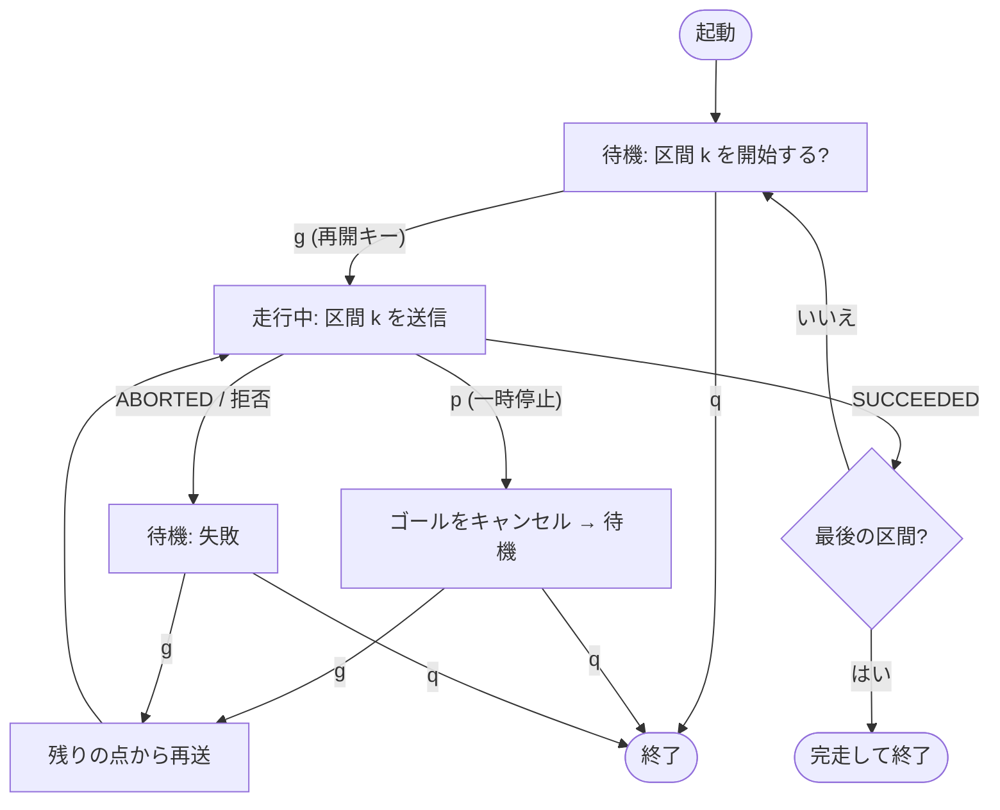

<!-- claude: waypoint 走行の仕様書 (2026-10-04)。停止点つき waypoint 走行 (waypoint_runner.py) の実装と同時に
     ユーザ依頼で作成。reRoBot 特化・1 ファイル構成。当日の手順は docs/manual/12_challenge_day.md §7.1、
     机上での waypoint 作成手順は docs/manual/10_nav2.md が正。本書は「なぜそう動くか」の仕様側。 -->

# waypoint 走行 仕様書 — 打つ・止まる・再開する

reRoBot の waypoint 走行は、**机上で打った点列 (YAML)** を **Nav2 の NavigateThroughPoses** に流して走る。
2026-10-04 に「指定した点で止まり、キーを押すまで待つ」停止点機能を足した。本書はその全体の仕様を
1 冊にまとめたもの — YAML の各キーを誰が読むか、Nav2 の中で点がどう消化されるか、
止まっている間に何がロボットを止めているか、まで下ろして書く。

⚠️ **実機・本物の Nav2 での停止点走行は未検証** (2026-10-04 時点。ダミー action サーバでの疑似端末試験のみ)。

## 目次

```
waypoint 走行 仕様書
├── 1. 全体像 ................. 部品の樹形図と 2 つの走らせ方
├── 2. waypoint YAML 仕様 ...... キー一覧と「誰が読むか」
├── 3. waypoint_editor ......... 操作・色判定・停止点の付け方
├── 4. Nav2 側の動き ........... 既定 BT の中で点がどう消化されるか
├── 5. waypoint_runner ......... 区間分割・状態遷移・キー・再開ロジック
├── 6. 止まっている間の安全 ..... 何がロボットを止めているのか
├── 7. 制約と未検証事項
├── 8. 症状からの逆引き
└── 9. コード位置と一次資料
```

急ぐなら: 当日の手順は [第12章 §7.1](../../manual/12_challenge_day.md)、トラブル時は本書 §8 から。

凡例: `path/to/file.py:123` は行番号 2026-10-04 時点。

---

## 1. 全体像

```
waypoint 走行の部品
├─ 作る (屋内・机上)
│   └─ tools/waypoint_editor/waypoint_editor.py   地図をクリック → YAML
│        └─ p キーで停止点 (stop: true)
├─ 置く
│   └─ maps/2d/glim/<map>/waypoints/<course>.yaml  (地図と同じ map 座標)
└─ 走る (2 通り)
    ├─ (A) RViz Nav2 パネル「Load WPs」→「Start Nav Through Poses」
    │       全点を 1 本のゴールで送る。stop は読まない = 停止点も素通り
    └─ (B) rerobot_bringup/scripts/waypoint_runner.py   ← 停止点を使うならこちら
            停止点でコースを区間に切り、区間ごとに 1 本ずつ送る。
            区間の間でキー待ち
```

(A) と (B) は**同じ YAML** を読み、**同じ Nav2 アクション** (`/navigate_through_poses`) を呼ぶ。
違いは「1 本で送るか、停止点で切って何本かに分けて送るか」だけ。Nav2 側の設定
(`nav2_params.yaml`) は一切変えていない。

### なぜ Nav2 の FollowWaypoints を使わないのか

Nav2 には各点で止まる `FollowWaypoints` (nav2_waypoint_follower) もあるが、

- **全点で**止まる (止める点を選べない)。点ごとの処理は TaskExecutor プラグイン (C++) で書く必要がある
- 標準プラグインは「n 秒待つ」「写真を撮る」「入力トピックを待つ」程度で、端末のキー入力は扱えない
- そもそも `nav2.launch.py` に waypoint_follower を入れていない (パネルの「Start Waypoint Following」は失敗する)

一方、NavigateThroughPoses は「最後の点で止まり、途中の点は通過する」。だから**停止点を
区間の最後の点にして区間ごとに送れば**、停止点だけで止まる走行が作れる。待つ処理は Nav2 の外
(runner の Python) に置けるので、C++ プラグインは要らない。

---

## 2. waypoint YAML 仕様

```yaml
# claude: waypoint_editor.py が生成 — map: /workspace/maps/2d/glim/<map>/nav2/my_map.yaml
waypoints:
  waypoint0:
    pose: [x, y, 0.0]                 # map 座標 [m]
    orientation: [w, 0.0, 0.0, z]     # ⚠️ w が先頭 (四元数、yaw のみ)
  waypoint1:
    pose: [...]
    orientation: [...]
    yaw_manual: true                  # 任意: 向きを手動指定した点
    stop: true                        # 任意: 停止点
```

| キー | 型 | 読む側 | 意味 |
|---|---|---|---|
| `waypoints` の子の順番 | — | 全員 | **記述順 = 走行順**。名前 (`waypoint0`…) の数字では並べ替えない (PyYAML / yaml-cpp とも記述順を保つ) |
| `pose` | `[x, y, z]` | panel / runner / editor | map フレームの位置。z は無視 |
| `orientation` | `[w, x, y, z]` | panel / runner / editor | 到着時の向き。**w が先頭** (RViz パネルの `convert_to_msg` がこの順で読む。ROS の msg 順 x,y,z,w とは逆) |
| `yaw_manual` | bool | editor のみ | true = 手動で向きを決めた点。再編集で自動計算に上書きされないための印 |
| `stop` | bool | **runner のみ** | true = この点で止まりキー待ち。panel と editor の描画以外は無視 |

- frame は書かない。panel も runner も `"map"` 固定。
- panel は `pose` / `orientation` 以外のキーを無視するので、`stop` 付きの YAML でも (A) で読み込める
  (その場合は止まらない)。
- **最後の点は `stop` が無くても止まる** (コースの終点だから)。最後の点に `stop: true` を付けても同じ動きになる。
- waypoint は**作成時の地図の map 座標**に紐づく。地図を作り直したら打ち直す。

---

## 3. waypoint_editor

詳細な使い方は [第10章](../../manual/10_nav2.md) と `tools/README.md`。ここでは停止点まわりの仕様だけ書く。

| 操作 | 動作 |
|---|---|
| 左クリック | 末尾に追加 |
| 点を左ドラッグ | 移動 |
| Shift + 左クリック | 最寄りの区間に挿入 |
| 右クリック | 削除 |
| Ctrl + 点を左ドラッグ | 向きを手動指定 (`yaw_manual`) |
| 点の上で `a` | 向きを自動に戻す |
| **点の上で `p`** | **停止点の ON/OFF** (赤い四角の枠で表示) |
| `u` / `s` / `r` / `o` / `h` / `q` | 元に戻す / 保存 / 順序反転 / 通過半径表示 / 説明 / 終了 |

- 停止点は挿入・削除・元に戻す・順序反転でも点と一緒に動く (`self.stops` を `pts` と同期)。
- matplotlib の既定では `p` はパン操作に割り当てられている。エディタではその割り当てを外してある
  (`tools/waypoint_editor/waypoint_editor.py:216`)。パンはツールバーの十字ボタンを使う。
- `--check` の表に `■停止` 列が出る。末尾の行は `停止点 N 点`。
- 点の色 (緑 = 空き / 橙 = 未観測 / 赤 = 壁・keepout) は停止点でも同じ意味。**停止点を赤い場所に置くと
  その区間の経路が引けない** (§4)。

### 停止点の向き

エディタは各点の向きを既定で「**次の点の方向**」にする。停止点は区間の最後の点になるので、
Nav2 はこの向きまで旋回してから止まる (§4)。つまり既定のままなら、**止まったときには
もう次の区間の方を向いている** — 再開した直後に大きく旋回しなくて済む。信号の方を向かせたい
などの理由があれば、Ctrl + ドラッグで手動指定する。

---

## 4. Nav2 側の動き — 既定 BT の中で点がどう消化されるか

`bt_navigator` は NavigateThroughPoses を受けると既定の BT
(`navigate_through_poses_w_replanning_and_recovery.xml`、本機は差し替えていない) を回す。
runner が送るのは区間 1 本分の点列で、各区間がこの BT を 1 回ずつ通る。

```
NavigateThroughPoses 1 本 (= runner の 1 区間)
└─ RecoveryNode (retries=6) ─────────── 失敗したら復帰行動して最大 6 回やり直し → だめなら ABORTED
    ├─ PipelineSequence
    │   ├─ RateController hz=0.333 ────── 3 秒に 1 回だけ下を実行
    │   │   ├─ RemovePassedGoals radius=0.7   ロボットから 0.7 m 以内の先頭の点を消す
    │   │   │                                 (ただし最後の 1 点は消さない)
    │   │   └─ ComputePathThroughPoses        残った点を全部通る経路を NavFn で引く
    │   └─ FollowPath (RPP)                   経路を追従。最後の点で goal checker が判定
    └─ 復帰行動 (RoundRobin)
        costmap クリア → Spin 1.57 rad → Wait 5 s → BackUp 0.30 m
```

### 区間の最後の点 (= 停止点) で起きること

| 段階 | 何が起きるか | 設定 (`nav2_params.yaml`) |
|---|---|---|
| 接近 | RPP が最後の点に向かって減速 | `desired_linear_vel: 0.4` |
| 位置到達 | 最後の点から 0.25 m 以内に入る | `xy_goal_tolerance: 0.25` |
| 向き合わせ | その場で旋回し、YAML の向きから 0.25 rad (≈14°) 以内へ | `yaw_goal_tolerance: 0.25`、`stateful: true` (一度位置に入ったら位置判定を固定して旋回に専念) |
| 完了 | BT が SUCCEEDED を返し、controller_server が速度 0 を 1 回出す | — |

途中の点 (停止点ではない点) の向きはどこにも使われない。NavFn は位置だけで経路を引き、
RemovePassedGoals は距離だけで点を消すからである。

### `number_of_poses_remaining`

フィードバックの `number_of_poses_remaining` は、RemovePassedGoals で消された後に**残っている点の数**。
runner は一時停止・失敗のときにこの値を使って「どこから再開するか」を決める (§5.4)。
RemovePassedGoals は 3 秒に 1 回しか動かないので、この値も最大 3 秒遅れる。

---

## 5. waypoint_runner

`ros2_ws_main/src/bringup/rerobot_bringup/scripts/waypoint_runner.py` (rclpy、1 ファイル 231 行)。

### 5.1 引数

```
ros2 run rerobot_bringup waypoint_runner.py <course.yaml> [--resume-key g] [--start N]
```

| 引数 | 既定 | 意味 |
|---|---|---|
| `course.yaml` | (必須) | §2 の YAML |
| `--resume-key` | `g` | 発進・再開のキー (1 文字)。`q` と `p` は別の役割に使っているので指定不可 |
| `--start N` | 0 | waypointN (記述順の index) から始める。途中で runner を落として起動し直すとき用 |

- **標準入力が端末でないと起動しない** (`docker exec` に `-it` が必要)。キーを 1 文字ずつ読むため、
  端末を cbreak モード (Enter を待たずに 1 文字ずつ渡し、Ctrl-C は効いたままのモード) にする。
  終了時には必ず元のモードに戻す (`Keyboard.__exit__`)。
- 起動時にコースの点数・総延長・停止点の一覧を表示する。

### 5.2 区間分割

`split_segments()` (`waypoint_runner.py:52`) は、`--start` の点から最後の点までを停止点と最後の点で区切る。

```
例: 6 点、停止点 = waypoint2, waypoint4

index   0    1    2■   3    4■   5
        └─ 区間1 ──┘   └ 区間2 ┘  └ 区間3
送る点  [0, 1, 2]      [3, 4]     [5]
```

- 停止点はその区間の**最後の点**になる → Nav2 はそこで止まる (§4)。
- 次の区間は停止点の**次の点**から始まる。停止点そのものは次の区間に含めない (もうそこにいるため)。
- 先頭の区間には waypoint0 も含める。ロボットが waypoint0 の近くにいれば、RemovePassedGoals が最初の判定で消す
  (RViz パネルと同じ挙動)。

### 5.3 状態遷移とキー



| 状態 | 表示 | 受け付けるキー |
|---|---|---|
| 待機 (開始前・停止点到着後) | `■ 区間 k/n: … を開始する?` | 再開キー = 発進、`q` = 終了 |
| 走行中 | `▶ 走行中 A → B  [p] 一時停止` | `p` = 一時停止。他のキーは無視 |
| 一時停止・失敗の後 | `■ 一時停止中 / 失敗 — 再開すると X から続ける` | 再開キー = 残りの点から再送、`q` = 終了 |
| どこでも | — | Ctrl-C = 走行中ゴールをキャンセルして終了 |

- **最初の区間もキー待ちから始まる**。起動しただけでは走り出さない (AMCL の位置合わせを確認してから発進する余裕を作るため)。
- 待機中も `spin_once` を回し続けるので、DDS の接続は切れない。

### 5.4 一時停止・失敗からの再開 — 「残りの点」の決め方

一時停止 (`p`) や Nav2 の失敗 (ABORTED) のあと、runner は区間を**最初からではなく残りの点から**送り直す。

```
left = idx[len(idx) - max(1, remaining):]       # waypoint_runner.py:150
```

- `remaining` = 最後に受け取ったフィードバックの `number_of_poses_remaining` (§4)。
- `max(1, …)` で、**区間の最後の点 (停止点) は必ず残す**。停止点を飛ばして次の区間へ進んでしまうことはない。
- フィードバックを 1 回も受け取らないうちに止めた場合は `remaining` = 区間の点数のままなので、区間を最初から送り直す。
- RemovePassedGoals の判定は 3 秒に 1 回なので、`remaining` は最大 3 秒古い。その間に通過した点が
  残りに入ることがあるが、再送後の最初の判定 (ロボットから 0.7 m 以内なら消える) で消えるか、
  消えなければ**その点まで戻ろうとする**。通過直後に止めた場合はこれに注意する。

### 5.5 Ctrl-C の扱い

rclpy の既定の SIGINT ハンドラは、Ctrl-C を受けると即座に context を shutdown する。そうなると
キャンセル要求を送る手段がなくなり、**Nav2 はゴールを抱えたまま走り続ける**。そこで runner は

1. `rclpy.init(..., signal_handler_options=SignalHandlerOptions.NO)` で既定ハンドラを外す (`waypoint_runner.py:217`)
2. Ctrl-C を Python の `KeyboardInterrupt` として受ける
3. 走行中のゴールがあれば `cancel_goal_async` を送り、最大 2 秒応答を待つ (`cancel_active()`、`waypoint_runner.py:161`)
4. 応答が無ければ `✘ キャンセル応答なし — RViz で停止を確認` と表示する

ただし、**runner のプロセスが Ctrl-C 以外で死んだとき** (端末ごと閉じた、`docker exec` が切れた等) は
キャンセルは送られない。その場合、Nav2 は送られた区間を最後まで走る (§6)。

### 5.6 送信するゴール

- `PoseStamped` の `frame_id = "map"`、`stamp` = 送信時刻、位置 = `pose[0:2]`、向き = `orientation` (z, w のみ)
- `behavior_tree` は空 = bt_navigator の既定 BT (§4)
- アクション名 `navigate_through_poses` (名前空間なし)。起動時にサーバが出るまで 1 秒おきに待つ

---

## 6. 止まっている間の安全 — 何がロボットを止めているのか

停止点で待っている間、ロボットを止めているものは次の連鎖である。

```
停止点でロボットが止まっている理由
├─ Nav2: ゴールが SUCCEEDED で終わった
│   └─ controller_server が速度 0 を 1 回 publish (/cmd_vel → /robot_speed_cmd にリマップ済み)
├─ epos4_controller: 最後に受け取った Twist (= 0) を保持して 100 Hz で TPDO に出し続ける
└─ (保険) epos4_controller のウォッチドッグ
    /robot_speed_cmd が 0.5 s 途絶 + 目標が非ゼロ → 0 へランプ (2026-09-19 実装)
```

- つまり停止中は「**誰も速度指令を出していない**」状態で、ブレーキを掛けているわけではない。
  坂道で止めた場合の保持は EPOS4 の速度制御 (目標 0 rpm を保つ) 任せ。
- **runner は非常停止ではない**。停止中に別のノード (joy teleop、RViz の Nav2 Goal 等) が
  `/robot_speed_cmd` を出せば、ロボットはそれに従って動く。
- 走行中の `p` もゴールのキャンセルなので、止まるまでに controller の減速と通信の遅れが乗る。
  人や物にぶつかりそうなときは物理の非常停止スイッチを使う。

---

## 7. 制約と未検証事項

| # | 内容 | 影響 | 状態 |
|---|---|---|---|
| 1 | 実機・本物の Nav2 で停止点走行をしていない | 区間の切り替わりや再開の挙動は机上の推定 | **未検証** (2026-10-04) |
| 2 | RemovePassedGoals は 3 秒に 1 回 (§4) | 速く走ると判定の瞬間に円の外にいて、点が消えずに引き返す恐れ。再開時の「残りの点」も最大 3 秒古い | 既定 BT 由来・実走未確認 |
| 3 | 区間内の 1 点でも到達不能なら区間全体が ABORTED | 復帰行動 6 回分の時間がかかってから失敗する。runner は待機に入るので、`g` で再送はできるが点を飛ばす機能は無い | 仕様 |
| 4 | 点を飛ばす・戻る操作は無い | 飛ばしたいときは runner を `q` で止め、`--start N` で起動し直す | 仕様 |
| 5 | 停止点の向きまでその場旋回する | 狭い場所で停止点を打つと旋回で周りに当たり得る | 仕様 (§3 の向き) |
| 6 | RViz パネルの Start は `stop` を読まない | 停止点も素通り | 仕様 (§1) |
| 7 | 再開はこの端末のキーだけ | ゲームパッドや別の PC からは再開できない | 拡張候補 (トピック `/waypoint_resume` を足せば joy から押せる) |
| 8 | runner が Ctrl-C 以外で死ぬとキャンセルが送られない | Nav2 は区間の最後まで走る | 仕様 (§5.5) |

---

## 8. 症状からの逆引き

| 症状 | 見るところ | 原因と対処 |
|---|---|---|
| `キー入力に端末が必要` で即終了 | 起動コマンド | `docker exec` に `-it` が無い |
| `navigate_through_poses サーバ待ち…` が続く | `ros2 action list` | nav2.launch.py が起動していない / lifecycle が active になっていない / `ROS_DOMAIN_ID` 不一致 |
| `✘ ゴールが拒否された` | bt_navigator のログ | bt_navigator が active でない。nav2.launch.py の起動ログを確認 |
| 停止点で止まらない | 走らせ方 | RViz パネルの Start で走らせている (§1)。YAML に `stop: true` があるか `--check` で確認 |
| 停止点の手前でなかなか止まらずその場で回り続ける | 向き | 向き合わせの許容は 0.25 rad。AMCL の向きが揺れていると収まらない。`/amcl_pose` の揺れを確認 |
| 区間がすぐ失敗する | runner の `error_code` 表示、RViz の global plan | 区間内に壁・keepout の上の点がある (エディタで赤)。`--check` を確認 |
| 再開したら少し戻ろうとした | 通過直後に `p` を押していないか | §5.4 の「残りの点が最大 3 秒古い」。いったん `p` → 再開で消えなければ、`q` して `--start` で次の点から |
| Ctrl-C 後もロボットが動いている | runner の最終行 | `キャンセル応答なし` なら、RViz の Nav2 パネルの Cancel か非常停止 |
| 起動したら端末の表示がおかしい (エコーされない) | — | runner が異常終了して cbreak が戻らなかった。`reset` か `stty sane` |

---

## 9. コード位置と一次資料

| 場所 | 中身 |
|---|---|
| `ros2_ws_main/src/bringup/rerobot_bringup/scripts/waypoint_runner.py:41` | `load_course` — YAML 読み込み (`stop` の解釈) |
| 同 `:52` | `split_segments` — 区間分割 |
| 同 `:62` | `Keyboard` — cbreak と非ブロッキングの 1 文字読み |
| 同 `:126` | `run_segment` — 1 区間の送信、`p` での一時停止、残りの点の計算 |
| 同 `:169` | `run` — 区間ループと待機 |
| 同 `:215` | SIGINT ハンドラを外す理由 |
| `tools/waypoint_editor/waypoint_editor.py:131` / `:147` | YAML の読み書き (`stop` / `yaw_manual`) |
| 同 `:392` | `p` キーで停止点トグル |
| `ros2_ws_main/src/bringup/rerobot_bringup/config/nav2_params.yaml:129` | goal checker (0.25 m / 0.25 rad / stateful) |
| `/opt/ros/jazzy/share/nav2_bt_navigator/behavior_trees/navigate_through_poses_w_replanning_and_recovery.xml` | 既定 BT (rerobot_env 内) |

- 当日の手順: [第12章 つくチャレ当日 §7.1](../../manual/12_challenge_day.md)
- waypoint の作り方・NavigateThroughPoses の注意 (2026-10-02): [第10章 Nav2](../../manual/10_nav2.md)
- `tools/README.md` の waypoint_editor 節
- `docs/claude/PROJECT_STATE.md` タイムライン 10-04
- ウォッチドッグ: `docs/features/2026-09-19_epos4_controller_watchdog_fault_monitor.md`
